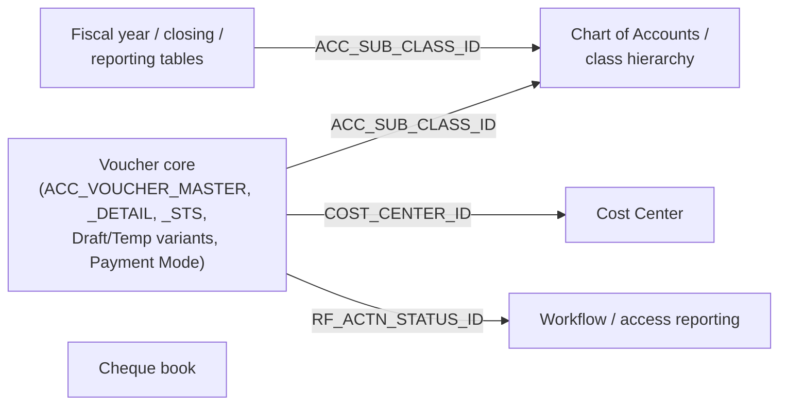
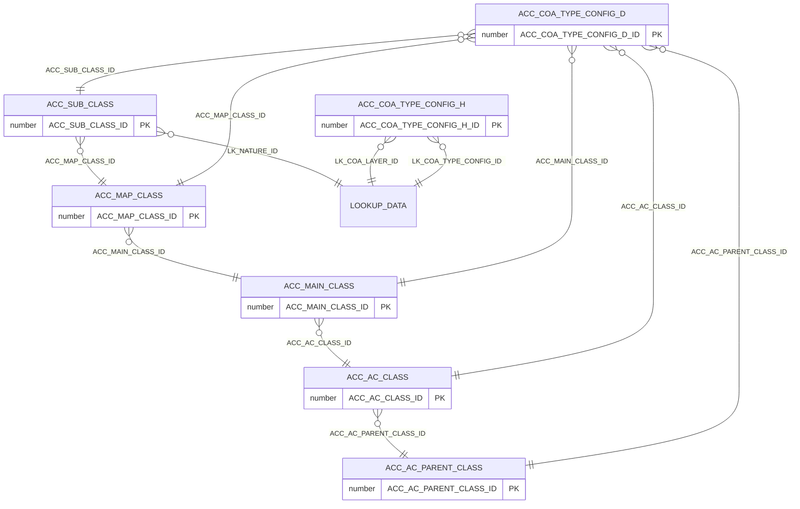
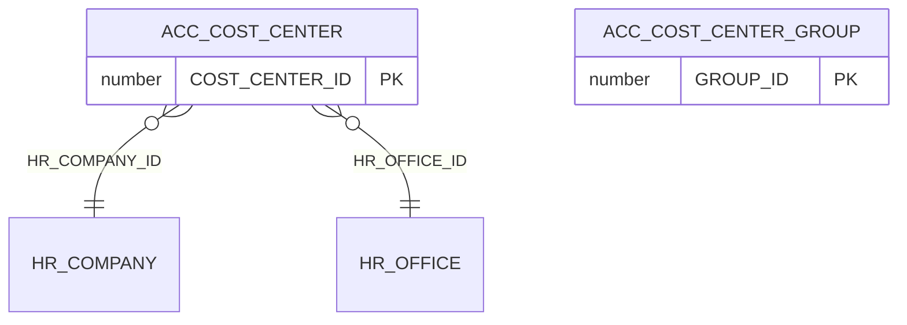
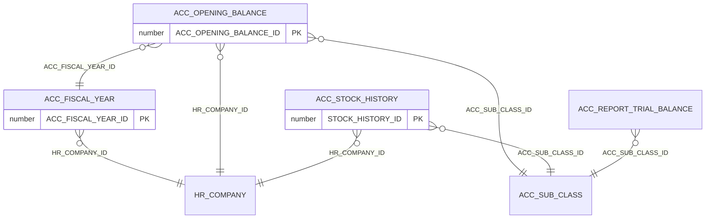
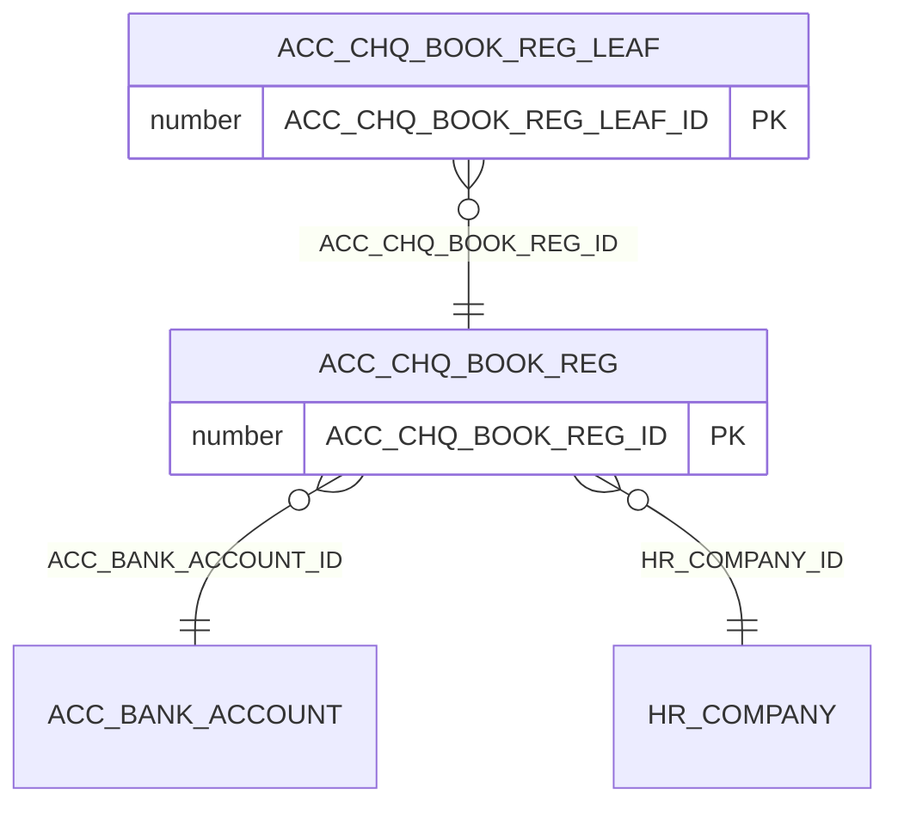
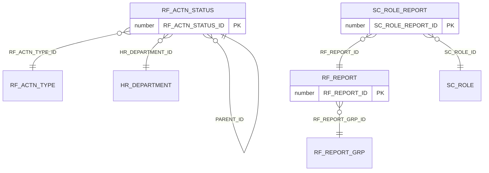

# Accounting module — Entity Relationship Diagram

Generated from real foreign-key constraints in the dev Oracle DB (`mtexdev`, host
`118.67.213.142`, schema `MTEX`), read-only, on 2026-09-14 — not hand-drawn, not inferred from
naming. No DDL exists in either repo, so this DB is the only ground truth for keys/relationships;
see each table's `## Keys & Indexes` section under [schema/](.) for the full per-table detail
these diagrams are generated from.

Audit-trail foreign keys (`CREATED_BY`, `LAST_UPDATED_BY`, `LAST_UPDATE_LOGIN`, `ACTION_BY` — all
pointing at `SC_USER`) are omitted from every diagram below to keep them readable; they still
appear in each table's own `## Keys & Indexes` section.

Split into 6 diagrams by business area instead of one combined graph — the combined version had
58 relationship lines across 22+ entities and was unreadable once auto-laid-out. Tables outside
`docs/accounting/schema/` (`HR_COMPANY`, `HR_OFFICE`, `HR_DEPARTMENT`, `SC_USER`, `SC_ROLE`,
`LOOKUP_DATA`, `RF_ACTN_TYPE`, `RF_REPORT_GRP`, `ACC_BANK_ACCOUNT`, `ACC_GL_LINK_COA_H`) are shown
as relationship targets but have no attribute box — they belong to other modules and aren't
documented here. A table can appear in more than one diagram if it participates in more than one
area (e.g. `ACC_SUB_CLASS` shows up in both the COA hierarchy and the fiscal-year group).

## How the areas connect

## Voucher core

```mermaid
erDiagram
    ACC_VOUCHER_MASTER {
        number VOUCHER_MASTER_ID PK
    }
    ACC_VOUCHER_DETAIL {
        number VOUCHER_DETAIL_ID PK
    }
    ACC_VOUCHER_STS {
        number ACC_VOUCHER_STS_ID PK
    }
    ACC_VOUCHER_TYPE {
        number VOUCHERTYPEID PK
    }
    ACC_PAYMENT_MODE {
        number PAYMENT_MODE_ID PK
    }
    ACC_VOUCHER_MASTER }o--|| HR_COMPANY : "HR_COMPANY_ID"
    ACC_VOUCHER_MASTER }o--|| HR_OFFICE : "HR_OFFICE_ID"
    ACC_VOUCHER_MASTER }o--|| ACC_PAYMENT_MODE : "PAYMENT_MODE_ID"
    ACC_VOUCHER_MASTER }o--|| ACC_VOUCHER_TYPE : "VOUCHER_TYPE_ID"
    ACC_VOUCHER_MASTER }o--|| LOOKUP_DATA : "LK_TRX_SRC_ID"
    ACC_VOUCHER_MASTER }o--|| RF_ACTN_STATUS : "RF_ACTN_STATUS_ID"
    ACC_VOUCHER_MASTER }o--|| ACC_GL_LINK_COA_H : "ACC_GL_LINK_COA_H_ID"
    ACC_VOUCHER_MASTER }o--|| LOOKUP_DATA : "LK_VOUCHER_SRC_TYPE_ID"
    ACC_VOUCHER_DETAIL }o--|| ACC_SUB_CLASS : "ACC_SUB_CLASS_ID"
    ACC_VOUCHER_DETAIL }o--|| ACC_VOUCHER_DETAIL : "PARENT_ID"
    ACC_VOUCHER_DETAIL }o--|| LOOKUP_DATA : "LK_VOUCHER_FOR_TYPE_ID"
    ACC_VOUCHER_DETAIL }o--|| ACC_COST_CENTER : "COST_CENTER_ID"
    ACC_VOUCHER_DETAIL }o--|| ACC_VOUCHER_MASTER : "VOUCHER_MASTER_ID"
    ACC_DRAFT_VOUCHER }o--|| HR_COMPANY : "HR_COMPANY_ID"
    ACC_DRAFT_VOUCHER }o--|| HR_OFFICE : "HR_OFFICE_ID"
    ACC_DRAFT_VOUCHER }o--|| ACC_GL_LINK_COA_H : "ACC_GL_LINK_COA_H_ID"
    ACC_DRAFT_VOUCHER }o--|| LOOKUP_DATA : "LK_TRX_SRC_ID"
    ACC_DRAFT_VOUCHER }o--|| RF_ACTN_STATUS : "RF_ACTN_STATUS_ID"
    ACC_DRAFT_VOUCHER_DETAIL }o--|| ACC_SUB_CLASS : "ACC_SUB_CLASS_ID"
    ACC_DRAFT_VOUCHER_DETAIL }o--|| LOOKUP_DATA : "LK_VOUCHER_FOR_TYPE_ID"
    ACC_TEMP_DRAFT_VOUCHER }o--|| ACC_SUB_CLASS : "ACC_SUB_CLASS_ID"
    ACC_TEMP_VOUCHER_DETAIL }o--|| ACC_SUB_CLASS : "ACC_SUB_CLASS_ID"
    ACC_TEMP_VOUCHER_DETAIL }o--|| SC_USER : "USER_ID"
    ACC_VOUCHER_STS }o--|| RF_ACTN_STATUS : "RF_ACTN_STATUS_ID"
    ACC_MAP_PAY_MODE }o--|| ACC_PAYMENT_MODE : "PAYMENT_MODE_ID"
    ACC_MAP_PAY_MODE }o--|| ACC_VOUCHER_TYPE : "VOUCHERT_TYPE_ID"
```

`ACC_VOUCHER_DETAIL.PARENT_ID` is self-referencing (a detail row can point to a parent detail row
in the same table) — not called out in the original prose docs. `ACC_MAP_PAY_MODE.VOUCHERT_TYPE_ID`
is a real, DB-confirmed FK to `ACC_VOUCHER_TYPE` despite the typo'd column name.

## Chart of Accounts / class hierarchy

A strict 4-level chain: `ACC_AC_PARENT_CLASS → ACC_AC_CLASS → ACC_MAIN_CLASS → ACC_MAP_CLASS →
ACC_SUB_CLASS`. `ACC_COA_TYPE_CONFIG_D` is a config row that can point into any of the 5 levels.

## Cost center

No DB-level FK from `ACC_COST_CENTER` to `ACC_COST_CENTER_GROUP` was found, despite the docs'
prose describing a group relationship — worth a spot-check (see `schema/ACC_COST_CENTER.md`'s
`## Keys & Indexes` section for the raw query result this is based on).

## Fiscal year / closing / reporting tables

## Cheque book

`ACC_CHQ_BOOK_REG`/`_LEAF` exist only at the Oracle layer (see `features/cheque-book-registers.md`,
`status: not-implemented`) — real tables and real FKs, just no app code wired to them yet.

## Workflow / access reporting

`RF_ACTN_STATUS.PARENT_ID` is self-referencing (the checker/maker workflow status chain).

## Tables with no FK at all

Confirmed by querying `ALL_CONSTRAINTS`, not assumed from naming: `ACC_COMPL_LEDGER_PCT_RULE`,
`ACC_PAYMENT_MODE`, `ACC_VOUCHER_TYPE`, `ACC_MAP_CLASS`'s upstream `ACC_AC_PARENT_CLASS` node.
These are pure lookup/root tables or referenced-only — nothing to diagram outward from them.
