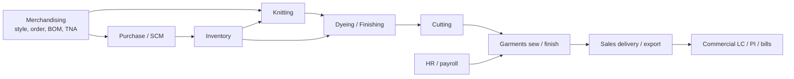

# 01 — Product overview

**Product:** MultitechERP (also branded MultiTEX in session/cache names)  
**Domain:** integrated garment manufacturing ERP (Bangladesh knit/woven mill pattern)  
**Solution:** `src/ERPSolution.sln`  
**Web host:** `src/ERPSolution/` (ASP.NET MVC 5 + Web API 2, .NET Framework 4.8)  
**Database:** Oracle, schema **MTEX**, business logic in PL/SQL packages

## What it does

The system follows a typical apparel value chain plus shared services:

Shared platforms: **Security** (users, menus, roles), **Admin** (org master, lookups), **Planning / IE**, **Dyeing lab**, **RND**, **reports** (RDLC + Crystal).

## Runtime shape

| Layer | Project | Role |
|---|---|---|
| UI | `ERPSolution` | MVC Areas (Razor pages), AngularJS 1.3 clients, Web API, RDLC/Crystal reports, SignalR, email, file storage |
| Application | `ERP.BLL` | One service class per entity/use-case; owns package names, `pOption`, DataRow mapping |
| DTO | `ERP.Model` | `{TABLE}Model` POCOs; property names ≈ Oracle columns |
| Data | `ERP.DAL` | `OraDatabase` ADO.NET wrapper; filters; constants |

There is **no repository layer** and **no EF `DbContext` in source**. Entity Framework packages are referenced in DAL but unused.

## Typical user journey

1. Open `/Security/ScUser/SignIn`
2. CAPTCHA + SHA256(password + LOGIN_ID) → `pkg_security.sc_user_select`
3. Session keys (`multiScUserId`, company, department, role, OAuth token)
4. Home dashboard (`HomeController`)
5. Menu URL from `SC_MENU` (permission check in `BaseController.IsMenuPermission`)
6. MVC Area action returns a Razor shell + AngularJS app
7. Browser calls `api/{module}/...` JSON endpoints
8. Autofac-injected BLL calls `OraDatabase.ExecuteStoredProcedure`
9. Oracle package returns a ref cursor and/or `pMsg` output

Worked traces: [features/security-signin.md](features/security-signin.md), [features/merchandising-buyer.md](features/merchandising-buyer.md).

## Size (approximate, from source tree)

| Asset | Count |
|---|---|
| MVC Areas | 19 |
| Web API controllers (Areas) | ~313 |
| BLL service files | ~1700 `.cs` (including interfaces) |
| Model files | ~1100 `.cs` |
| Oracle packages | 261 |
| Oracle standalone procedures | 85 |
| Oracle functions | 45 |
| AngularJS client files | ~1100 `.js` |

Largest Areas: Knitting, HR, Dyeing, Merchandising.

## Config (names only)

Do not copy secrets from `Web.config` into docs.

| Key | Purpose |
|---|---|
| `ConnectionString` | Primary Oracle (schema user `mtex`) |
| `ConnectionStringDr` | Second Oracle connection used by `ExecuteStoredProcedureDr` |
| `DEFAULT_SCHEMA` | Prefix applied to every package call (typically `MTEX`) |
| `StorageProvider` | `Local` or `S3` for document files |

## Independently verified (2026-09-03)

Spot-checked against actual source, not just re-read from this doc: 19 Areas (`ls Areas`), 261
packages / 85 procedures / 45 functions (`ls oracle/{packages,procedures,functions}`), 1734 BLL
`.cs` files, 1130 Model `.cs` files, Autofac DI wiring in `IocConfig.cs`, and the `OraDatabase`
call convention in `OraDatabase.cs` — all confirmed accurate.

One detail worth flagging: `OraDatabase` physically lives in `src/ERP.DAL/OraDatabase.cs` but is
declared `namespace ERP.Model`, not `ERP.DAL` — remember this when grepping by namespace instead
of by file path.

## Related docs

- Architecture: [02-architecture.md](02-architecture.md)
- Request flow: [03-request-lifecycle.md](03-request-lifecycle.md)
- Modules: [06-modules.md](06-modules.md)
