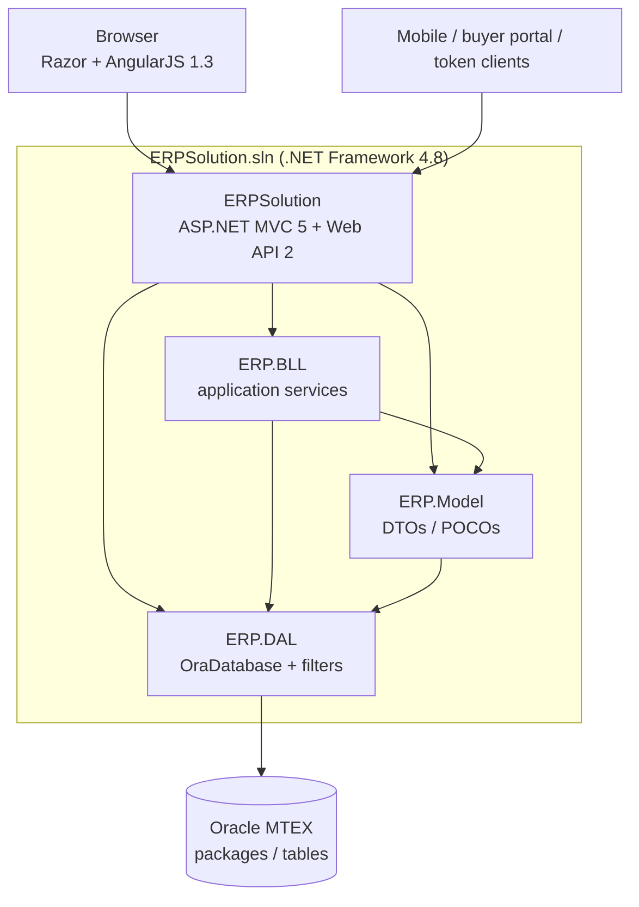
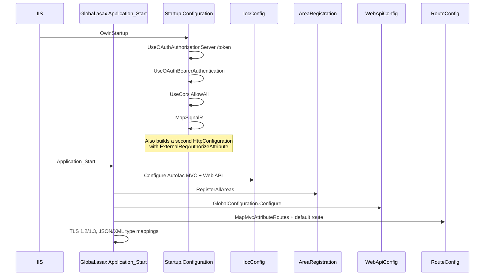

# 02 — Architecture

## Project graph



Intended story: UI → BLL → DAL. Actual story:

- `OraDatabase` is compiled in **ERP.DAL** but lives in namespace `ERP.Model`.
- **ERP.Model references ERP.DAL**.
- BLL services inject `OraDatabase` and call packages directly.
- Some Security models still use **Active Record** (`new OraDatabase()` inside `Save()`).

So DAL is a helper library, not a repository boundary.

## Solution layout

```
src/
  ERPSolution.sln
  ERPSolution/                 # web application
    App_Start/                 # IocConfig, routes, Web API, filters, bundles
    Areas/{Module}/            # MVC + Api + Views + Client JS + Reports
    Controllers/               # Home, mail jobs, a few root APIs
    Infrastructure/            # DI helpers, S3/local storage, email
    Hubs/DashBoardHub.cs       # SignalR
    oracle/packages|procedures|functions
    Web.config
  ERP.BLL/{Module}/            # IXxxService + XxxService
  ERP.Model/{Module}/          # XxxModel
  ERP.DAL/
    OraDatabase.cs
    Filters/
    Utilities/
```

## Web application internals

| Folder | Responsibility |
|---|---|
| `Areas/{Module}/Controllers` | MVC page shells (return `View()`). Route: `{Area}/{controller}/{action}` |
| `Areas/{Module}/Api` | JSON Web API. Attribute routes, usually `[RoutePrefix("api/...")]` |
| `Areas/{Module}/Views` | Razor + module layout |
| `Areas/{Module}/Client/app` | AngularJS 1.3 controllers/services |
| `Areas/{Module}/Reports` | RDLC / Crystal / DataSet XSD |
| `Controllers/` (root) | `HomeController`, `BaseController`, dozens of *MailService controllers, a few APIs (`UserApi`, `LeaveApi`, `InquiryApi`, `BuyerPortal`, `ExternalApi`) |
| `App_Start/IocConfig.cs` | Autofac: every `IXxxService` → `XxxService`, `InstancePerRequest` |
| `Infrastructure/DocumentStorage` | Strategy: Local vs S3 from `StorageProvider` |
| `Infrastructure/EMailProviders` | `IERPEmailProvider` |
| `Hubs/DashBoardHub.cs` | SignalR hub name `dashboard` |

## Bootstrap sequence



`Application_PostAuthorizeRequest` forces **session state on Web API** so API actions can read `Session["multiScUserId"]`.

**OWIN vs live Web API:** `Startup` builds a *second* `HttpConfiguration` (CORS + `ExternalReqAuthorizeAttribute`) and calls `WebApiConfig.Register(config)`, but it does **not** call `app.UseWebApi(config)`. Live Web API is the System.Web `GlobalConfiguration` from `Application_Start`. Startup filters on that unused config do **not** run. OWIN still owns `/token`, bearer middleware, CORS, and SignalR.

## Two HTTP stacks

| Stack | Route | Returns | Typical caller |
|---|---|---|---|
| MVC | `{area}/{controller}/{action}/{id}` | HTML (Razor) | Browser navigation, menus |
| Web API | `api/{prefix}/...` (attribute) or `api/{controller}/{id}` | JSON | Angular `$http`, mobile, OAuth clients |

MVC default (non-area): `{controller}/{action}/{id}` → `Home/Index`.

Area example (`SecurityAreaRegistration`): `Security/{controller}/{action}/{id}`.

## Cross-cutting

| Concern | Implementation |
|---|---|
| DI | Autofac (`IocConfig.cs`) |
| Cache | `IWebCacheProvider` / `HttpContext.Cache`, keys in `CASHE_CONSTANTS` |
| Auth (browser) | Session after `ScUser/SignIn`; MVC `[SignInCheck]` is per-controller, not global |
| Auth (API token) | OWIN `/token` + bearer; Angular gets token from `_Layout`; `[Authorize]` is selective |
| Auth (external header) | `[ExternalReqAuthorize]` on `api/ext` only (see [08-security-and-auth.md](08-security-and-auth.md)) |
| Menu permission | `BaseController.IsMenuPermission` → `ScMenuModel.checkMenuPermission` |
| Realtime | SignalR `DashBoardHub` |
| Files | `IFileStorageService` Local or S3 |
| Jobs | Hangfire referenced; FluentScheduler class exists; **scheduler is not started in `Startup`** |
| Reports | Microsoft ReportViewer RDLC + Crystal Reports |

## Layering rule of thumb (when you open a file)

| You opened | Next hop |
|---|---|
| `Areas/X/Views/...cshtml` | Matching `Controllers` action, then `Client/app/*.js` |
| `Areas/X/Api/*Controller.cs` | Injected `IXxxService` in BLL |
| `ERP.BLL/.../XxxService.cs` | `string sp = "pkg_...."` and `pOption` |
| `ERP.Model/...Model.cs` | Oracle table of the same name (minus `Model`) |
| `oracle/packages/PKG_*.sql` | Procedures `{table}_{insert\|update\|select}` |

## Known architectural quirks

1. Dual HTTP config: `Startup`’s `HttpConfiguration` is unused (`UseWebApi` never called). Live API is `GlobalConfiguration`. Do not add filters only on the OWIN config and expect them to apply.
2. Model → DAL reference inverts clean n-tier.
3. `pOption` is the real API inside each package procedure (switchboard).
4. No Unit of Work: one connection per stored-proc call.
5. Accounting packages exist without an MVC Area.
