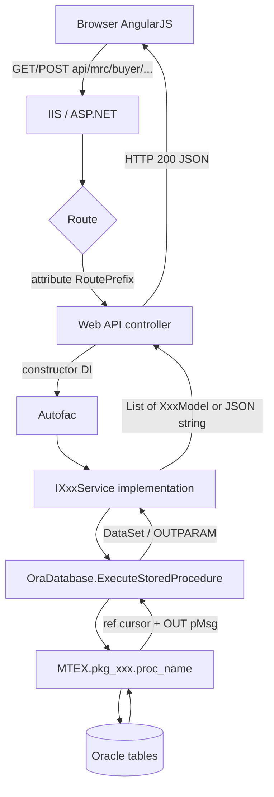
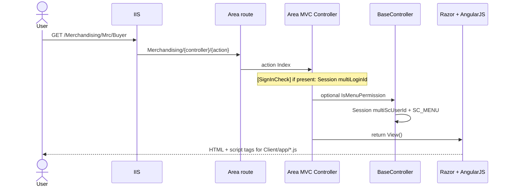
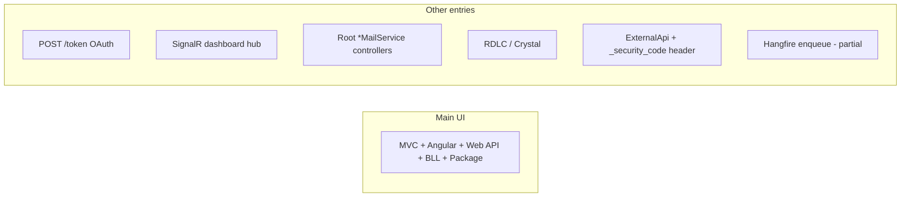

# 03 — Request lifecycle

This is the execution path you should draw on a whiteboard. Almost every business screen follows it.

## End-to-end (JSON API after login)



## 1. Where it starts

| Entry | URL pattern | First C# type |
|---|---|---|
| Sign-in page | `/Security/ScUser/SignIn` | `ScUserController` (MVC) |
| Home | `/` or `/Home/Index` | `HomeController` |
| Module page | `/{Area}/{Controller}/{Action}` | Area MVC controller |
| JSON API | `/api/{prefix}/{resource}/...` | `Areas/*/Api/*Controller` (Area is a folder, not a URL prefix) |
| OAuth token | `POST /token` | `SimpleAuthorizationServerProvider` |
| SignalR | `/signalr` | `DashBoardHub` |
| Report | Area Reports + ReportViewer | RDLC/Crystal |

Default MVC route is in `App_Start/RouteConfig.cs`: `{controller}/{action}/{id}` → `Home/Index`.  
Areas register `{Area}/{controller}/{action}/{id}`.  
Web API uses `config.MapHttpAttributeRoutes()` plus fallback `api/{controller}/{id}`.

Area `Api/` folders do **not** prefix URLs. `[RoutePrefix("api/mrc")]` is the public path. Live Web API is `GlobalConfiguration` from `Application_Start`. The `HttpConfiguration` built in `Startup` is not hosted (`UseWebApi` is never called).

## 2. MVC page request (HTML shell)



The MVC action usually does **not** load the business grid. It returns a shell. Angular then calls Web API.

## 3. Web API request (the real work)

Example: list buyers.

| Step | Code | What happens |
|---|---|---|
| 1 | Angular `$http.get('/api/mrc/buyer/BuyerByUserList')` | Browser |
| 2 | `[RoutePrefix("api/mrc")]` + `[Route("buyer/BuyerByUserList")]` | `BuyerApiController` |
| 3 | Constructor `IMC_BUYERService` | Autofac `InstancePerRequest` |
| 4 | `_mcBuyerService.BuyerByUserList()` | BLL |
| 5 | `db.ExecuteStoredProcedure(..., "pkg_merchandising.mc_buyer_select")` | DAL |
| 6 | Full name `MTEX.pkg_merchandising.mc_buyer_select` | `DEFAULT_SCHEMA` + name |
| 7 | `OracleCommandBuilder.DeriveParameters` then bind `pOption`, IDs | ADO.NET |
| 8 | Package opens a `SYS_REFCURSOR` / sets `pMsg` | PL/SQL |
| 9 | Adapter fills `DataSet`; OUT params copied to table `OUTPARAM` | DAL |
| 10 | `foreach (DataRow dr)` maps columns → `MC_BUYERModel` | BLL |
| 11 | `return Ok(obList)` | JSON |

Full write-up: [features/merchandising-buyer.md](features/merchandising-buyer.md).

## 4. `OraDatabase` contract

File: `src/ERP.DAL/OraDatabase.cs` (namespace `ERP.Model`).

```
ExecuteStoredProcedure(List<CommandParameter>, spName)
  → schema.spName
  → ConnectionString
  → CommandType.StoredProcedure
  → DeriveParameters
  → Fill DataSet
  → append OUTPARAM table
  → ProcedureLogger.WriteLog (optional)
```

Sister method `ExecuteStoredProcedureDr` uses `ConnectionStringDr`.

BLL almost always sends:

- `p{COLUMN}` inputs matching table columns
- `pOption` number (behavior switch)
- `pMsg` output (status text, often packed as JSON later)

## 5. `pOption` convention (de facto)

These numbers are used widely; confirm in the specific package body before relying on them.

| `pOption` | Typical meaning |
|---|---|
| `1000` | Insert |
| `2000` | Update |
| `3000` | Select list / all |
| `3001+` | Select by id or a named variant |

One procedure (`mc_buyer_select`) can implement many queries via different `pOption` values.

## 6. Session on API

`Global.asax` `Application_PostAuthorizeRequest` sets session required. Many APIs read:

- `Session["multiScUserId"]`
- company / department / employee keys set at login

So “stateless Web API” is not the real model for the main UI.

After login, `_Layout.cshtml` injects `Session["access_token"]` into Angular as `access_token`. Data services send `Authorization: Bearer …`. Only some API controllers actually have `[Authorize]`; others rely on the session cookie.

## 7. Error path

Controllers typically:

```csharp
try { return Ok(service.Method()); }
catch (Exception e) { return Content(HttpStatusCode.InternalServerError, e.Message); }
```

Oracle errors are wrapped in `ApplicationException("Oracle Error (n): ...")` inside `OraDatabase`.

MVC global filter is only `HandleErrorAttribute`.

## 8. Side channels (not the main CRUD path)



Mail “controllers” under `ERPSolution/Controllers/` are scheduled/manual notification jobs, not user pages.

## 9. How to trace an unknown screen (checklist)

1. Note the browser URL → Area + MVC controller/action.
2. Open the Razor view; find Angular module and `$http` / `$resource` URLs.
3. Grep that URL fragment under `Areas/{Module}/Api`.
4. Open the API action; write down injected `IXxxService` methods.
5. Open the BLL method; copy `sp` and `pOption`.
6. Open `oracle/packages/PKG_*.sql` for that procedure.
7. List `p{COLUMN}` and `DataRow["COLUMN"]` — those are table columns.
8. Record FKs (`*_ID` properties) on the model.
9. Fill [features/_template.md](features/_template.md).
