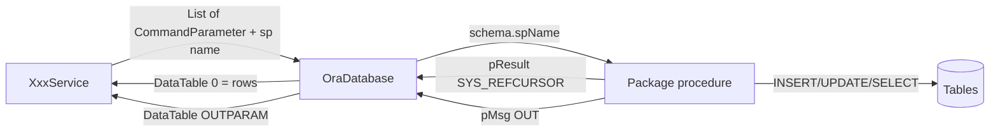

# 07 — Data access and Oracle

## Rule

C# does not query tables with SQL for normal CRUD. It calls **Oracle packages**. Tables live in schema **MTEX**. The repo has package/procedure/function source, **not** table DDL.

## Call stack



## `OraDatabase`

Path: `src/ERP.DAL/OraDatabase.cs`  
Namespace: `ERP.Model` (historical)

| Method | Connection | Use |
|---|---|---|
| `ExecuteStoredProcedure` | `ConnectionString` | Default |
| `ExecuteStoredProcedureDr` | `ConnectionStringDr` | Read-side / second DB |
| `ExecuteSQLStatement` | primary | Ad-hoc SQL (rare) |

Behavior:

1. Prefix `AppSettings DEFAULT_SCHEMA` + `.` + `spName`.
2. `BindByName = true`, `CommandType.StoredProcedure`.
3. `OracleCommandBuilder.DeriveParameters` — package signature is the contract.
4. Assign only parameters present on the command.
5. `OracleDataAdapter.Fill(DataSet)`.
6. Copy Output / InputOutput parameters into a table named `OUTPARAM` (`KEY`, `VALUE`).
7. Optional `ProcedureLogger.WriteLog`.

If a C# parameter name does not exist on the procedure, it throws.

## Parameter naming

| C# | Oracle |
|---|---|
| `pMC_BUYER_ID` | procedure argument `pMC_BUYER_ID` |
| `pOption` | behavior switch |
| `pMsg` | `OUT varchar2` status |
| `pResult` | `OUT SYS_REFCURSOR` (derived; filled as table 0) |

## Package layout in repo

```
src/ERPSolution/oracle/
  packages/      261 files   API of the database
  procedures/     85 files   batch / process jobs
  functions/      45 files   helpers + ALT_SCRIPT_* team patches
  types/           1 file
  db_compile.bat
  package_deploy.bat
```

Procedure names inside packages:

```
{table}_insert
{table}_update
{table}_select
```

Example: `pkg_merchandising.mc_buyer_insert` / `_update` / `_select`.

Standalone procedures (payroll process, stock populate) live under `oracle/procedures/` and are not the CRUD façade.

## Mapping C# ↔ Oracle

| C# | Oracle |
|---|---|
| `MC_BUYERModel` | table `MC_BUYER` (convention) |
| Property `BUYER_NAME_EN` | column `BUYER_NAME_EN` |
| `MC_BUYER_ID` | PK |
| `HR_COUNTRY_ID` | FK to `HR_COUNTRY` |
| `items` list | child table / UI tree; not always a column |
| `COUNTRY_NAME_EN` on buyer model | join column on SELECT, not on `MC_BUYER` |

There are **no** `[Table]` / `[Column]` attributes.

## Header / detail / view

| Suffix | Meaning |
|---|---|
| `_H` | Header |
| `_D`, `_D1`, `_D2` | Detail lines |
| `_V` / `*VModel` | Often a DB view or join projection |
| `TMP_` | Temporary / staging |

## What is missing for a full data dictionary

From this repo you **cannot** list every column, nullable flag, or FK constraint. You can infer:

- Columns that BLL maps from `DataRow["X"]`
- Parameters `pX` on insert/update
- Properties on `*Model`

To finish schema docs, dump from live MTEX:

```sql
SELECT table_name, column_name, data_type, data_length, nullable
FROM   all_tab_columns
WHERE  owner = 'MTEX'
ORDER  BY table_name, column_id;

SELECT constraint_name, constraint_type, table_name, r_constraint_name
FROM   all_constraints
WHERE  owner = 'MTEX';
```

Then one file per table under `docs/schema/`.

## Sample package surface

`PKG_MERCHANDISING` (`oracle/packages/PKG_MERCHANDISING.sql`) exposes procedures such as:

- `mc_byr_acc_grp_insert` / `mc_byr_acc_grp_select`
- `mc_buyer_*` (called from `MC_BUYERService`)
- plus many style/order helpers

Always open the **package spec + body** when documenting a feature: `pOption` branches live in the body.

## Logging

`DAL.ProcedureLogger.WriteLog(spName, commandParameters)` runs after execute. Treat as operational, not a business audit table (confirm implementation before relying on it).
