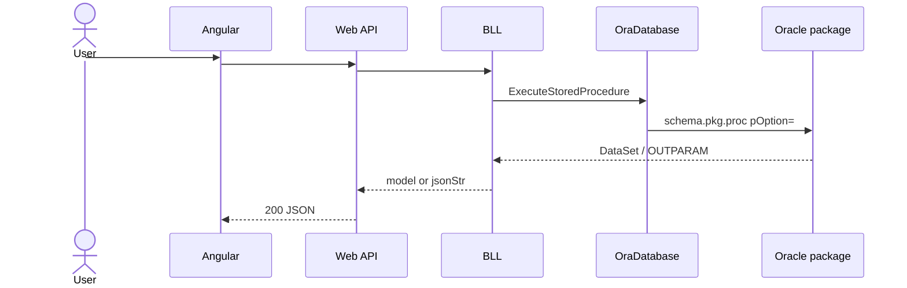

# Feature: {short name}

```yaml
---
id: feat:{module}-{slug}
module:
http:
mvc:
api:
service:
procedure:
pOption:
tables: []
models: []
session: []
upstream: []
downstream: []
status: draft   # draft | inferred | verified
---
```

## Purpose

One paragraph: what the user does.

## Entry

| Kind | Value |
|---|---|
| Menu / MVC URL | |
| Razor view | |
| Angular file | |
| API | `METHOD path` |

## Execution



## C# map

| Layer | Type | Path |
|---|---|---|
| API | | `src/ERPSolution/Areas/...` |
| Service | | `src/ERP.BLL/...` |
| Model | | `src/ERP.Model/...` |

## Oracle

| Item | Value |
|---|---|
| Package | `PKG_` |
| Procedure | |
| `pOption` | |
| Main table | |
| Child tables | |

## Request / response

**In:** parameters or body fields  
**Out:** JSON shape (list vs `{success, jsonStr}`)

## Tables / columns touched

Link `docs/schema/{TABLE}.md`. List FKs.

## Permissions / session

Which `Session` keys; menu check yes/no.

## Dependencies (other features)

Upstream / downstream screens.

## Gaps

What was inferred vs verified against package body / live DB.
