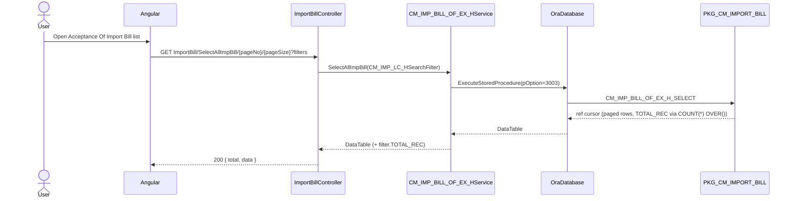
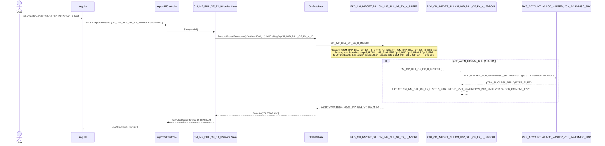

# Feature: Acceptance Of Import Bill

```yaml
---
id: feat:cm-acpt-of-import-bill
module: commercial
http: GET /api/cmr/ImportBill/SelectAllImpBill/{pageNo}/{pageSize}
mvc: CmrController.AcptOfImportBillList
api: [GET api/cmr/ImportBill/SelectAllImpBill/{pageNo}/{pageSize} -> ImportBillController.SelectAllImpBill, GET api/cmr/ImportBill/GetAcptOfImportBillInfo -> ImportBillController.GetAcptOfImportBillInfo, POST api/cmr/ImportBill/Save -> ImportBillController.Save, POST api/cmr/ImportBill/UpdateExtMaturityDate -> ImportBillController.UpdateExtMaturityDate, POST api/cmr/ImportBill/SaveIFDBCGL -> ImportBillController.SaveIFDBCGL, POST api/cmr/ImportBill/SavePaymentGL -> ImportBillController.SavePaymentGL, POST api/cmr/ImportBill/DeleteBoE -> ImportBillController.DeleteBoE, POST api/cmr/ImportBill/SendB2BPaymentApvReqMail/{pCM_IMP_BILL_OF_EX_H_ID}/{pRF_ACTN_STATUS_ID} -> ImportBillController.SendB2BPaymentApvReqMail]
service: ICM_IMP_BILL_OF_EX_HService / CM_IMP_BILL_OF_EX_HService
procedure: PKG_CM_IMPORT_BILL.CM_IMP_BILL_OF_EX_H_INSERT | CM_IMP_BILL_OF_EX_H_SELECT | CM_IMP_BILL_OF_EX_H_DELETE | CM_IMP_BILL_OF_EX_H_IFDBCGL | CM_IMP_BILL_OF_EX_H_PAYMENTGL | CM_IMP_BILL_OF_EX_H_EXT_MAT_DT_UPDATE
pOption: "H_INSERT: 1000 insert/update header (branches internally on pIS_IFDBC/pIS_PAYMENT/pIS_PAD/pIS_UPASS/pIS_EDF flags to decide which column subset to write), auto-fires H_IFDBCGL when pRF_ACTN_STATUS_ID IN (443,444). H_SELECT: 3000 list-by-id/simple filter, 3001 full single-record info (joined), 3002 paged dropdown-style list joined to Export LC mapping, 3003 paged Acceptance-Of-Import-Bill list grid (used by SelectAllImpBill). H_DELETE: 4000 hard delete."
tables: [CM_IMP_BILL_OF_EX_H, CM_IMP_BILL_OF_EX_H_STS]
models: [CM_IMP_BILL_OF_EX_HModel]
session: [multiScUserId]
upstream: [commercial-imp-lc]
downstream: []
status: inferred
---
```

Every fact below is **source-inferred** from the C# controller/service/model code and the
`PKG_CM_IMPORT_BILL` package body — there is no live database connection for this task, so
nothing here is "DB-verified."

## Purpose

The import-side counterpart to the Export "Bill Of Exchange" screen. When a factory's foreign
supplier draws a Bill Of Exchange against the factory's own Import LC (`CM_IMP_LC_H`), the
factory's bank presents it and the factory formally "accepts" it (`ACC_ACPT_BY`/`ACC_ACPT_DT`),
converting it into an accepted **IFDBC** (Inland Foreign/Documentary Bill for Collection —
the local acceptance instrument, `IFDBC_NO`/`IFDBC_MATURTY_DT`). From there the same header row
tracks the whole downstream payment lifecycle for that acceptance: a **PMT** (direct payment)
path, a **PAD** (Payment Against Documents / force loan) path, an **EDF** (Export Development
Fund-style foreign-currency loan) path, and a **UPASS** (usance-pass / deferred acceptance) path
— which one applies is recorded in `BTB_PAYMENT_TYPE`. The Commercial ▸ Import ▸ Acceptance Of
Import Bill screen (sidebar id `acpt-of-import-bill`) lets the import-documentation user create
the acceptance, record/extend the maturity date, and — once approved through the workflow
(`RF_ACTN_STATUS_ID` 443/444) — post accounting journal vouchers for the IFDBC acceptance itself
and, separately, for its eventual cash payment.

## Entry

| Kind | Value |
|---|---|
| Menu / sidebar id | `acpt-of-import-bill` (Commercial ▸ Import ▸ Acceptance Of Import Bill) |
| Razor view / Angular | Commercial area shell (shared `ImportBillController`; Angular controller/state files not traced in this pass — controller-and-below trace only) |
| API (list) | `GET api/cmr/ImportBill/SelectAllImpBill/{pageNo}/{pageSize}?pCM_IMP_LC_H_ID=&pBILL_OF_EX_NO=&pIMP_LC_NO=&pIFDBC_NO=&pFRM_ACC_ACPT_DT=&pTO_ACC_ACPT_DT=&pFRM_IFDBC_MATURTY_DT=&pTO_IFDBC_MATURTY_DT=&pFRM_IFDBC_PAID_DT=&pTO_IFDBC_PAID_DT=&pIS_IFDBC_PAID=&pIS_GL_FOR_ACCEPTED=&pIS_GL_FOR_PAYMENT=&pIS_PAD_FINALIZED=&pIS_ACCOUNTING_DONE=&pPAYMENT_TYPE=&pRF_BANK_ID=` |
| API (info) | `GET api/cmr/ImportBill/GetAcptOfImportBillInfo?pCM_IMP_BILL_OF_EX_H_ID=&pCM_IMP_LC_H_ID=&pIMP_LC_NO=` |
| API (save) | `POST api/cmr/ImportBill/Save` |
| API (extend maturity) | `POST api/cmr/ImportBill/UpdateExtMaturityDate` |
| API (post IFDBC/acceptance GL) | `POST api/cmr/ImportBill/SaveIFDBCGL` |
| API (post payment GL) | `POST api/cmr/ImportBill/SavePaymentGL` |
| API (delete) | `POST api/cmr/ImportBill/DeleteBoE` |
| API (approval email) | `POST api/cmr/ImportBill/SendB2BPaymentApvReqMail/{pCM_IMP_BILL_OF_EX_H_ID}/{pRF_ACTN_STATUS_ID}` |

Controller `ImportBillController` (`src/ERPSolution/Areas/Commercial/Api/ImportBillController.cs`)
is dedicated to this one screen (unlike the Export side's shared `ExportBillController`) — every
action in the file belongs to Acceptance Of Import Bill.

## Execution

### List



### Save (create / update, one flag-path at a time)



### Explicit GL posting (SaveIFDBCGL / SavePaymentGL)

```mermaid
sequenceDiagram
  actor User
  participant UI as Angular
  participant API as ImportBillController
  participant Svc as CM_IMP_BILL_OF_EX_HService
  participant DB as OraDatabase
  participant PKG as PKG_CM_IMPORT_BILL
  participant ACC as PKG_ACCOUNTING.ACC_MASTER_VCH_SAVE4MISC_SRC

  User->>UI: Click "Post Acceptance GL" or "Post Payment GL"
  UI->>API: POST ImportBill/SaveIFDBCGL or SavePaymentGL (CM_IMP_BILL_OF_EX_HModel)
  API->>Svc: SaveIFDBCGL(model) / SavePaymentGL(model)
  Svc->>DB: ExecuteStoredProcedure(pOption=1000)
  alt SaveIFDBCGL
    DB->>PKG: CM_IMP_BILL_OF_EX_H_IFDBCGL
    Note over PKG: Builds Bills-Payable DR line (+ optional force-loan/delay-payment interest DR,<br/>currency loss/gain DR, margin CR, bank-charge DR/CD-account CR) from<br/>ACC_GL_LINK_COA_H/D rows keyed to SC_MENU_ID=472. Voucher Type 9.
  else SavePaymentGL
    DB->>PKG: CM_IMP_BILL_OF_EX_H_PAYMENTGL
    Note over PKG: Debits one or more ACC_GL_LINK_COA_D "payment" lines, credits the<br/>supplier-linked COA_D row (ACC_SUB_CLASS via PMT_BILL_CRD_TO_ID). Voucher Type 5 "Journal Voucher".
  end
  PKG->>ACC: ACC_MASTER_VCH_SAVE4MISC_SRC(...)
  ACC-->>PKG: pTRN_SUCCESS_RTN / pPOST_ID_RTN
  PKG->>PKG: UPDATE CM_IMP_BILL_OF_EX_H (IFDBCGL: IS_FINALIZED/IS_PMT_FINALIZED/IS_PAD_FINALIZED; PAYMENTGL: IS_PMT_FINALIZED='Y')
  PKG-->>DB: OUTPARAM (pMsg, opCM_IMP_BILL_OF_EX_H_ID)
  DB-->>Svc: DataSet["OUTPARAM"]
  Svc-->>API: jsonStr
  API-->>UI: 200 { success, jsonStr }
```

## C# map

| Layer | Type | Path |
|---|---|---|
| API | `ImportBillController` | `src/ERPSolution/Areas/Commercial/Api/ImportBillController.cs` |
| Service | `CM_IMP_BILL_OF_EX_HService` | `src/ERP.BLL/Commercials/CM_IMP_BILL_OF_EX_HService.cs` |
| Model | `CM_IMP_BILL_OF_EX_HModel` | `src/ERP.Model/Commercial/CM_IMP_BILL_OF_EX_HModel.cs` |
| Package | `PKG_CM_IMPORT_BILL` | `src/ERPSolution/oracle/packages/PKG_CM_IMPORT_BILL.sql` |

### Controller actions

| Action | Route | Calls |
|---|---|---|
| `GetAcptOfImportBillInfo` | `GET ImportBill/GetAcptOfImportBillInfo` | `SelectByImportLC` → `CM_IMP_BILL_OF_EX_H_SELECT` (pOption 3001) |
| `Save` | `POST ImportBill/Save` | `Save` → `CM_IMP_BILL_OF_EX_H_INSERT` (pOption 1000) |
| `UpdateExtMaturityDate` | `POST ImportBill/UpdateExtMaturityDate` | `UpdateExtMaturityDate` → `CM_IMP_BILL_OF_EX_H_EXT_MAT_DT_UPDATE` |
| `SaveIFDBCGL` | `POST ImportBill/SaveIFDBCGL` | `SaveIFDBCGL` → `CM_IMP_BILL_OF_EX_H_IFDBCGL` (pOption 1000) |
| `SavePaymentGL` | `POST ImportBill/SavePaymentGL` | `SavePaymentGL` → `CM_IMP_BILL_OF_EX_H_PAYMENTGL` (pOption 1000) |
| `DeleteBoE` | `POST ImportBill/DeleteBoE` | `DeleteBoE` → `CM_IMP_BILL_OF_EX_H_DELETE` (pOption 4000) |
| `SelectAllImpBill` | `GET ImportBill/SelectAllImpBill/{pageNo}/{pageSize}` | `SelectAllImpBill(CM_IMP_LC_HSearchFilter)` → `CM_IMP_BILL_OF_EX_H_SELECT` (pOption 3003) |
| `SendB2BPaymentApvReqMail` | `POST ImportBill/SendB2BPaymentApvReqMail/{id}/{actId}` | `Select(id, actId)` (pOption 3000) then `IERPEmailProvider.SendB2BPaymentApvReqMail` per user in `ASSIGNED_TO_LST` |

The service also exposes `Update()` (pOption 2000, procedure `SP_CM_IMP_BILL_OF_EX_H` — a
different, non-`PKG_CM_IMPORT_BILL` name), `Delete()` (calls `CM_IMP_BILL_OF_EX_H_DELETE` with
the full parameter list instead of the minimal one `DeleteBoE` uses), and `SelectAll()` (pOption
3000, no filter) — none of these three are called from any action in `ImportBillController.cs`;
see Known Issues.

## Oracle

| Item | Value |
|---|---|
| Package | `PKG_CM_IMPORT_BILL` |
| Insert/Update | `CM_IMP_BILL_OF_EX_H_INSERT` — new row: full `INSERT` into `CM_IMP_BILL_OF_EX_H` (`BILL_OF_EX_NO` auto-generated via `CM_IMP_BILL_OF_EX_CODE_AUTO_GE`) plus a `CM_IMP_BILL_OF_EX_H_STS` history row; existing row: five mutually exclusive `UPDATE` branches gated by `pIS_IFDBC`/`pIS_PAYMENT`/`pIS_PAD`/`pIS_UPASS`/`pIS_EDF` (only one column subset is written per call — acceptance fields, PMT fields, PAD fields, UPASS fields, or EDF fields respectively), each also logging/repeating a status-history row. Validates `IFDBC_NO` uniqueness across other LCs and that `SUM(IFDBC_AMT)` for the LC does not exceed `CM_IMP_LC_H.LC_TOT_VAL` (+ tolerance `PCT_TOLR_AMT`). When `pRF_ACTN_STATUS_ID IN (443,444)` it internally calls `CM_IMP_BILL_OF_EX_H_IFDBCGL` to post the acceptance GL voucher. |
| Acceptance/IFDBC GL posting | `CM_IMP_BILL_OF_EX_H_IFDBCGL` — reads `ACC_GL_LINK_COA_H` for `SC_MENU_ID=472` (raises "Chart of Account Configuration Not Found" if missing), builds a draft voucher XML (Bills-Payable DR, optional force-loan/delay-payment interest DR, currency loss/gain DR, margin CR, and — if `BANK_CHARGE>0` — bank-charge DR / CD-account CR), then calls `PKG_ACCOUNTING.ACC_MASTER_VCH_SAVE4MISC_SRC` with `VOUCHER_TYPE_ID=9` ("LC Payment Voucher"), `V_GL_SOURCE_LINK` built from `PKG_MYVAR.V_ACCEPTNC_OF_IMP_BILL_IFDBC`, `V_LK_TRX_SRC_ID=PKG_MYVAR.LK_ACCEPTNC_OF_IMP_BILL_IFDBC`, `V_VCH_SRC='ILA'`. On success sets `CM_IMP_BILL_OF_EX_H.IS_FINALIZED`/`IS_PMT_FINALIZED`/`IS_PAD_FINALIZED` based on `BTB_PAYMENT_TYPE`. |
| Payment GL posting | `CM_IMP_BILL_OF_EX_H_PAYMENTGL` — reads the same `ACC_GL_LINK_COA_H` (`SC_MENU_ID=472`), loops `ACC_GL_LINK_COA_D` rows of `TRX_TYPE=PKG_MYVAR.VCR_TRX_TYPE_PAYMENT` to build DR/CR lines for `IFDBC_PAID_AMT`, then a single credit line against the supplier's `ACC_SUB_CLASS` (via `PMT_BILL_CRD_TO_ID`), and posts via `ACC_MASTER_VCH_SAVE4MISC_SRC` with `VOUCHER_TYPE_ID=5` ("Journal Voucher"), `V_GL_SOURCE_LINK` from `PKG_MYVAR.V_ACCEPTNC_OF_IMP_BILL_PMNT`. On success sets `IS_PMT_FINALIZED='Y'`. |
| Extend maturity | `CM_IMP_BILL_OF_EX_H_EXT_MAT_DT_UPDATE` — single-column `UPDATE ... SET EXT_IFDBC_MATURTY_DT=...` |
| Select | `CM_IMP_BILL_OF_EX_H_SELECT` — `pOption=3000` (simple filter by ID, joined to bank names + `CM_IMP_LC_H`/`RF_LC_TYPE`/`RF_PAYM_TERM`), `pOption=3001` (full single-record info: `SELECT DISTINCT B.*` plus mapped Export-LC list via `CM_IMP_EXP_LC_MAP`, supplier/company/currency joins, created/updated-by user names, PMT/EDF adjustment-voucher lookups), `pOption=3002` (paged, joined to `CM_IMP_LC_H.EXP_LC_NO_LST`, appears to be a dropdown/report variant), `pOption=3003` (paged Acceptance-Of-Import-Bill grid — the one `SelectAllImpBill` uses, with the full filter set: LC id, bill/IFDBC number, acceptance/maturity/paid date ranges, `IS_PMT_FINALIZED`, `IS_PAD_FINALIZED`, `IS_ACCOUNTING_DONE`, `BTB_PAYMENT_TYPE`, negotiating-bank id). |
| Delete | `CM_IMP_BILL_OF_EX_H_DELETE` — `pOption=4000` only: hard-deletes `CM_IMP_BILL_OF_EX_H_STS` then `CM_IMP_BILL_OF_EX_H` rows for the id, no dependency check. |
| Main table | `CM_IMP_BILL_OF_EX_H` |
| Child table | `CM_IMP_BILL_OF_EX_H_STS` (action/workflow status history) |

## Request / response

**In (list):** `pageNo`, `pageSize`, plus `CM_IMP_LC_HSearchFilter` fields — `pCM_IMP_LC_H_ID`,
`pBILL_OF_EX_NO`, `pIMP_LC_NO`, `pIFDBC_NO`, `pFRM_ACC_ACPT_DT`/`pTO_ACC_ACPT_DT`,
`pFRM_IFDBC_MATURTY_DT`/`pTO_IFDBC_MATURTY_DT`, `pFRM_IFDBC_PAID_DT`/`pTO_IFDBC_PAID_DT`,
`pIS_IFDBC_PAID`, `pIS_GL_FOR_ACCEPTED`, `pIS_GL_FOR_PAYMENT`, `pIS_PAD_FINALIZED`,
`pIS_ACCOUNTING_DONE`, `pPAYMENT_TYPE`, `pRF_BANK_ID`. (`pIS_GL_FOR_ACCEPTED`/`pIS_GL_FOR_PAYMENT`
are accepted by the controller and set on the filter object but never forwarded to the stored
procedure call — see Known Issues.)
**Out (list):** `{ total, data }` — `data` is the raw `DataTable` serialized to JSON; `total` is
`filter.TOTAL_REC` from the procedure's `COUNT(*) OVER()` column.
**In (save/GL/delete):** `CM_IMP_BILL_OF_EX_HModel` body — header fields plus the path-selector
flags `IS_IFDBC`/`IS_PAYMENT`/`IS_PAD`/`IS_UPASS`/`IS_EDF` (and, within the EDF path,
`IS_PAD_FOR_EDF`/`IS_PAD_CLOSE_BY_EDF`) that tell `CM_IMP_BILL_OF_EX_H_INSERT` which column subset
to update.
**Out (save/GL/delete):** `{ success, jsonStr }` — `jsonStr` is hand-assembled from the
procedure's `OUTPARAM` rows (`pMsg`, `opCM_IMP_BILL_OF_EX_H_ID`), not a typed model.

## Tables / columns touched

Reconstructed from the fullest `INSERT`/`UPDATE`/`SELECT` in `PKG_CM_IMPORT_BILL.sql` (no DDL in
repo — column list is source-inferred, not DB-verified).

**`CM_IMP_BILL_OF_EX_H`** (header, full detail): `CM_IMP_BILL_OF_EX_H_ID` (PK), `CM_IMP_LC_H_ID`
(FK), `CONSIGN_NO`, `CONSIGN_DT`, `BILL_OF_EX_NO` (auto-generated), `BILL_OF_EX_AMT`,
`RF_CURRENCY_ID`, `COMM_INV_NO`, `COMM_INV_DT`, `ACC_ACPT_BY`, `ACC_ACPT_DT`, `IFDBC_NO`,
`IFDBC_OPN_DT`, `IFDBC_MATURTY_DT`, `EXT_IFDBC_MATURTY_DT`, `IFDBC_AMT`, `EXCHNG_RATE`,
`LOC_CURRENCY_ID`, `IFDBC_UPD_BY`, `IFDBC_UPD_DT`, `IS_PMT_FINALIZED`, `IS_FINALIZED`,
`IS_PAD_FINALIZED`, `IS_EDF_FINALIZED`, `IS_UPASS_FINALIZED`, `IS_IFDBC_FINALIZED`,
`IS_ACCOUNTING_DONE`, `IS_BILL_PAID`, `IS_PENDING`, `BILL_VOU_DOC_PATH`, `RF_ACTN_STATUS_ID`,
`REMARKS`, `CREATION_DATE`, `CREATED_BY`, `LAST_UPDATE_DATE`, `LAST_UPDATED_BY`, `B2B_QTY`,
`NGT_BKBR_ID` (negotiating bank branch), `LLN_BKBR_ID` (linking bank branch),
`PMT_BILL_CRD_TO_ID`/`PMT_BILL_ADJ_BY_ID` (payment credit/adjust account references),
`EDF_BILL_ADJ_BY_ID`, `FRGN_CUR_LG`, `BANK_CHARGE`, `IFDBC_PAID_DT`, `IFDBC_PAID_AMT`,
`PAYMENT_NOTE`, `BTB_PAYMENT_TYPE` (`PMT`/`PAD`/`EDF`/`UPASS`/`N/A`), `PAD_LOAN_DT`, `PAD_OPEN_DT`,
`PAD_AMT`, `PAD_RF_CURRENCY_ID`, `PAD_TGT_DT`, `PAD_LOC_EXG`, `PAD_INT_AMT`, `PAD_REMARKS`,
`EDF_STEP`, `EDF_AMT`, `EDF_OPEN_DT`, `EDF_RF_CURRENCY_ID`, `EDF_TGT_DT`, `EDF_LOC_EXG`,
`EDF_INT_AMT`, `EDF_REMARKS`, `INT_AMT`, `UPASS_TGT_DT`, `UPASS_OPEN_DT`.

**`CM_IMP_BILL_OF_EX_H_STS`** (workflow status history, summarized): `CM_IMP_BILL_OF_EX_H_STS_ID`
(PK), `CM_IMP_BILL_OF_EX_H_ID` (FK), `RF_ACTN_STATUS_ID`, `ACTION_DATE`, `ACTION_BY`, `IS_VISIBLE`,
`REMARKS`, `CREATION_DATE`, `CREATED_BY`, `LAST_UPDATE_DATE`, `LAST_UPDATED_BY` — one row per
distinct status the acceptance passes through; repeat saves at the same status update the
existing row's `REMARKS='Repeat'` instead of duplicating it.

FK confirmed by real `JOIN`/`WHERE` evidence:
- `CM_IMP_BILL_OF_EX_H.CM_IMP_LC_H_ID → CM_IMP_LC_H.CM_IMP_LC_H_ID` — every `SELECT` variant
  (`3000`/`3001`/`3002`/`3003`) inner-joins `CM_IMP_LC_H`, and `CM_IMP_BILL_OF_EX_H_INSERT`
  validates the new/updated `IFDBC_AMT` against `CM_IMP_LC_H.LC_TOT_VAL` for the same
  `CM_IMP_LC_H_ID`. This is the Import LC the acceptance is drawn against (see
  `docs/features/commercial-imp-lc.md` if the sibling doc is finished).
- `CM_IMP_BILL_OF_EX_H_STS.CM_IMP_BILL_OF_EX_H_ID → CM_IMP_BILL_OF_EX_H.CM_IMP_BILL_OF_EX_H_ID`
  (status history, 1:many).

## Permissions / session

- `CREATED_BY`/`LAST_UPDATED_BY` on `Save`, `SaveIFDBCGL`, and `SavePaymentGL` all come from
  `HttpContext.Current.Session["multiScUserId"]` inside the service (not from the posted model)
  — same `multiScUserId` session key used app-wide.
- No `[Authorize]` attribute is present on `ImportBillController` — session/menu gating, if any,
  happens elsewhere (not visible in this file).
- GL posting (`CM_IMP_BILL_OF_EX_H_IFDBCGL`/`_PAYMENTGL`) requires a Chart-of-Account link row in
  `ACC_GL_LINK_COA_H` for `SC_MENU_ID=472` (hardcoded literal in the package, not a passed
  parameter) — this ties GL posting specifically to menu id 472, presumably this screen's own
  `SC_MENU_ID`.
- `SendB2BPaymentApvReqMail` reads the acceptance's `ASSIGNED_TO_LST` (a comma-separated user id
  list from `RF_ACTN_STATUS.ASSIGNED_TO_LST` for the current `RF_ACTN_STATUS_ID`) and emails each
  assigned approver — an approval-notification step in the workflow, not a permission check.

## Dependencies (other features)

- **Upstream:** the Import LC screen (`CM_IMP_LC_H`, `docs/features/commercial-imp-lc.md` if the
  sibling agent has finished it) supplies the LC an acceptance is drawn against; `LC_TOT_VAL` and
  `PCT_TOLR_AMT` on that LC cap the total `IFDBC_AMT` this screen can accept.
- **Downstream:** none found in this controller — payment/PAD/EDF/UPASS progression all happens
  on the same `CM_IMP_BILL_OF_EX_H` row via `Save`'s flag-gated update branches, not via a
  separate child-screen table the way Export's Bank Bill Collection/Realization key off a
  finalized Bill Of Exchange.
- **Pattern comparison:** structurally this mirrors Export's Bill Of Exchange +
  finalize-posts-GL-voucher shape (`docs/features/commercial-bill-of-exchange.md`) and Bank Bill
  Collection's finalize-posts-GL-voucher shape (`docs/features/commercial-bank-bill-coll.md`) —
  both call the same `PKG_ACCOUNTING.ACC_MASTER_VCH_SAVE4MISC_SRC` API — but this screen posts
  **two separate** vouchers at two separate lifecycle points (acceptance/IFDBC via
  `_IFDBCGL`, then eventual cash payment via `_PAYMENTGL`), rather than one finalize step.

## Gaps

- Angular/Razor view files for this screen were not located in this pass (out of scope —
  controller-and-below trace only, per task instructions).
- `commercial-imp-lc.md` did not exist yet at the time of this trace, so the Import LC FK above is
  confirmed only from this side (JOIN/WHERE evidence in `PKG_CM_IMPORT_BILL.sql`), not
  cross-checked against that sibling doc.
- The five `BTB_PAYMENT_TYPE` paths (PMT/PAD/EDF/UPASS/N-A) each gate a different column subset in
  `CM_IMP_BILL_OF_EX_H_INSERT`, and the EDF path further branches on `IS_PAD_FOR_EDF` vs
  `IS_PAD_CLOSE_BY_EDF` — the full business meaning of each path (what "PAD", "EDF", "UPASS" mean
  in the factory's banking terms) is inferred from column/flag names only, not from any comment
  or business-rules doc in the repo.
- `RF_ACTN_STATUS_ID` 443/444 are inferred to be "accounting verify"-type workflow steps (a
  commented-out `SELECT` alias in `CM_IMP_BILL_OF_EX_H_SELECT` pOption=3001 labels status 443 as
  `ACTN_STATUS_ACC_VERIFY`) that automatically trigger `CM_IMP_BILL_OF_EX_H_IFDBCGL`. What exactly
  distinguishes 443 from 444 is not visible in the code reached by this trace.
- `SP_CM_IMP_BILL_OF_EX_H` (used by `CM_IMP_BILL_OF_EX_HService.Update()`, pOption 2000) is a
  procedure name that does not follow the `PKG_CM_IMPORT_BILL.*` naming convention used
  everywhere else in this feature, and its body was not located under
  `src/ERPSolution/oracle/packages/` in this pass — not traced further since `Update()` is unused
  by the controller anyway.
- No DDL/constraints exist in the repo; all column and FK facts above are inferred from the
  fullest matching `INSERT`/`SELECT`/`UPDATE`/`JOIN`, not DB-verified.

## Known Issues

- **Dead filter parameters silently dropped**: `SelectAllImpBill` (controller) and
  `CM_IMP_LC_HSearchFilter` accept `pIS_GL_FOR_ACCEPTED` and `pIS_GL_FOR_PAYMENT` from the client,
  but `CM_IMP_BILL_OF_EX_HService.SelectAllImpBill` never includes them in the
  `ExecuteStoredProcedure` parameter list it builds — they never reach `CM_IMP_BILL_OF_EX_H_SELECT`
  at all (matching commented-out `--AND (pIS_GL_FOR_ACCEPTED IS NULL OR ...)` lines in the
  procedure body). A user filtering by either of these two checkboxes gets an unfiltered result
  with no error.
- **Wrong bank-branch column in list grid**: in `CM_IMP_BILL_OF_EX_H_SELECT` pOption=3003 (the
  procedure `SelectAllImpBill` actually calls), the "linking bank" join is written as
  `LEFT JOIN RF_BANK_BRANCH LLNBKBR ON LLNBKBR.RF_BANK_BRANCH_ID=IBoE.NGT_BKBR_ID` — it joins on
  `NGT_BKBR_ID` (negotiating bank branch) instead of `LLN_BKBR_ID` (linking bank branch). The grid
  column `LIN_BANK_BRANCH`/`LIN_BANK` therefore always shows the *negotiating* bank's branch/name,
  never the actual linking bank, whenever the two differ.
- **Hard delete, no dependency guard**: `CM_IMP_BILL_OF_EX_H_DELETE` (pOption=4000) unconditionally
  deletes `CM_IMP_BILL_OF_EX_H_STS` then `CM_IMP_BILL_OF_EX_H` rows for the given id, with no check
  for whether a GL voucher has already been posted against it (`IS_FINALIZED`/`IS_PMT_FINALIZED`
  are not consulted).
- **Dead/orphaned service methods**: `CM_IMP_BILL_OF_EX_HService.Update()` (procedure
  `SP_CM_IMP_BILL_OF_EX_H`, pOption 2000), `.Delete()` (calls `CM_IMP_BILL_OF_EX_H_DELETE` with a
  large parameter list the procedure body ignores outside pOption=4000's two-line delete), and
  `.SelectAll()` (pOption 3000, no filter) are all defined on the service/interface but never
  called from `ImportBillController` — dead code from this controller's perspective.
- **Duplicate GL-posting entry points**: the same `CM_IMP_BILL_OF_EX_H_IFDBCGL` procedure can fire
  two ways — automatically from inside `CM_IMP_BILL_OF_EX_H_INSERT` when
  `pRF_ACTN_STATUS_ID IN (443,444)`, or explicitly via the separate `SaveIFDBCGL` action/endpoint.
  Nothing in the traced code prevents both paths from being invoked for the same row (there is no
  "already posted" guard before calling `ACC_MASTER_VCH_SAVE4MISC_SRC` in either procedure body),
  though `ACC_MASTER_VCH_SAVE4MISC_SRC`'s own behavior on a duplicate `pOption`/voucher call was
  not traced (out of scope — lives in `PKG_ACCOUNTING`).

## Unused Columns

Not independently verified in this pass — would require checking every `SELECT` projection
against every Angular grid/form field, which is out of scope for a controller-and-below trace.
One likely candidate surfaced incidentally: `CM_IMP_BILL_OF_EX_HModel.CHARGES_CREDIT_TO_ID` and
`PMT_BILL_CRD_TO_ID` are both accepted on the model, but `CM_IMP_BILL_OF_EX_H_INSERT`'s PMT-path
`UPDATE` has `PMT_BILL_CRD_TO_ID=pPMT_BILL_CRD_TO_ID` and `CHARGES_CREDIT_TO_ID=pCHARGES_CREDIT_TO_ID`
commented out (`--`) in the procedure body — so these two model fields are currently write-inert
on save, though `PMT_BILL_CRD_TO_ID` is still read back and joined against `ACC_SUB_CLASS` in
`CM_IMP_BILL_OF_EX_H_PAYMENTGL`, implying it's populated some other way (or is stale from a prior
code version). Not claimed as fully unused — just flagged as inconsistent between insert and use.
