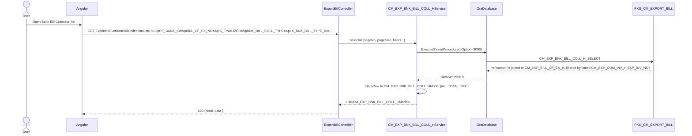
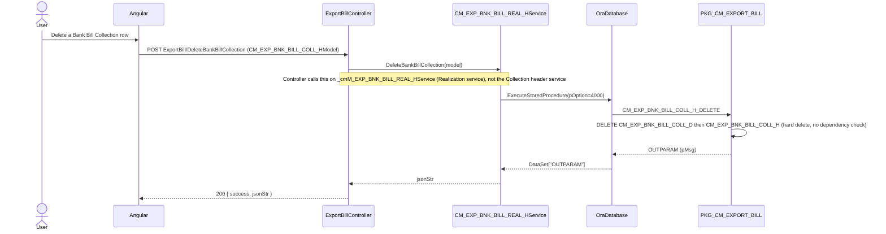

# Feature: Bank Bill Collection

```yaml
---
id: feat:cm-bank-bill-coll
module: commercial
http: GET /api/cmr/ExportBill/GetBankBillCollectionList/{pageNo}/{pageSize}
mvc: CmrController.BankBillCollList
api: [GET api/cmr/ExportBill/GetBankBillCollectionList/{pageNo}/{pageSize} -> ExportBillController.GetBankBillCollectionList, POST api/cmr/ExportBill/SaveBankBillCollection -> ExportBillController.SaveBankBillCollection, GET api/cmr/ExportBill/GetBankBillCollectionInfo -> ExportBillController.GetBankBillCollectionInfo, GET api/cmr/ExportBill/GetBankBillCollectionDetail -> ExportBillController.GetBankBillCollectionDetail, POST api/cmr/ExportBill/DeleteBankBillCollection -> ExportBillController.DeleteBankBillCollection]
service: ICM_EXP_BNK_BILL_COLL_HService / CM_EXP_BNK_BILL_COLL_HService, ICM_EXP_BNK_BILL_COLL_DService / CM_EXP_BNK_BILL_COLL_DService
procedure: PKG_CM_EXPORT_BILL.CM_EXP_BNK_BILL_COLL_H_INSERT | CM_EXP_BNK_BILL_COLL_H_SELECT | CM_EXP_BNK_BILL_COLL_H_DELETE | CM_EXP_BNK_BILL_COLL_D_SELECT
pOption: 1000 insert, 2000 update (H_INSERT proc handles both), 3000 list, 3001 info/single, 4000 delete (separate H_DELETE proc)
tables: [CM_EXP_BNK_BILL_COLL_H, CM_EXP_BNK_BILL_COLL_D]
models: [CM_EXP_BNK_BILL_COLL_HModel, CM_EXP_BNK_BILL_COLL_DModel]
session: [multiScUserId]
upstream: [feat:cm-bill-of-exchange]
downstream: [commercial bank bill realization (not yet documented as its own menu)]
status: inferred
---
```

## Purpose

Records that an export bill (a Bill Of Exchange already raised against a shipment/LC) has been submitted to and collected through a bank — "Early" (`E`) or "Final" (`F`) collection type — capturing the collected amount, foreign/local currency breakdown, forwarding/bank charges (FBC), penalty, and a distribution of the amount across ledger accounts (`CM_EXP_BILL_DIST_ACC`). Finalizing a collection (`IS_FINALIZED='Y'`) posts an accounting voucher and marks the underlying export invoice(s) as collected.

## Entry

| Kind | Value |
|---|---|
| Menu | Commercial &gt; Export &gt; Transactions &gt; Bank Bill Collection (sidebar id `bank-bill-coll`) |
| Razor view / Angular | Commercial area shell (shared `ExportBillController`, not traced in this pass — out of scope, see Gaps) |
| API | `GET api/cmr/ExportBill/GetBankBillCollectionList/{pageNo}/{pageSize}` |
| API | `POST api/cmr/ExportBill/SaveBankBillCollection` |
| API | `GET api/cmr/ExportBill/GetBankBillCollectionInfo?pCM_EXP_BNK_BILL_COLL_H_ID=` |
| API | `GET api/cmr/ExportBill/GetBankBillCollectionDetail?pCM_EXP_BNK_BILL_COLL_H_ID=&pRF_BANK_ID=&pCOLLECTION_TYPE=&pOption=` |
| API | `GET api/cmr/ExportBill/GetAccDistributionsForAdvBillCollection?pCM_EXP_BILL_OF_EX_H_ID=&pRF_BANK_ID=&pHR_COMPANY_ID=` |
| API | `POST api/cmr/ExportBill/DeleteBankBillCollection` |

Controller `ExportBillController` (`src/ERPSolution/Areas/Commercial/Api/ExportBillController.cs`) is shared with the sibling "Commercial Invoice" and "Bill Of Exchange" menus (documented separately); only the Bank Bill Collection actions are covered here.

## Execution (list)



## Execution (save)

```mermaid
sequenceDiagram
  actor User
  participant UI as Angular
  participant API as ExportBillController
  participant Svc as CM_EXP_BNK_BILL_COLL_HService
  participant DB as OraDatabase
  participant PKG as PKG_CM_EXPORT_BILL
  participant ACC as PKG_ACCOUNTING

  User->>UI: Fill collection form, submit
  UI->>API: POST ExportBill/SaveBankBillCollection (CM_EXP_BNK_BILL_COLL_HModel, incl. XML_BILL_D detail rows)
  API->>Svc: Save(model)
  Svc->>DB: ExecuteStoredProcedure(pOption=1000, XML_BILL_D, pMsg OUT, opCM_EXP_BNK_BILL_COLL_H_ID OUT)
  DB->>PKG: CM_EXP_BNK_BILL_COLL_H_INSERT
  PKG->>PKG: Insert/update CM_EXP_BNK_BILL_COLL_H; upsert CM_EXP_BNK_BILL_COLL_D from XML_BILL_D
  PKG->>PKG: Mark linked CM_EXP_COM_INV_H.IS_BILL_COLLECTED='Y'
  alt IS_FINALIZED = 'Y'
    PKG->>ACC: ACC_MASTER_VCH_SAVE4MISC_SRC (draft voucher XML built from CM_EXP_BILL_DIST_ACC rows)
    ACC-->>PKG: pTRN_SUCCESS_RTN / pPOST_ID_RTN
    PKG->>PKG: FN_UPDATE_NGTED_USD_SUNDRY_IN (type 'E') or _OUT + FN_UPDATE_ACTION_STATUS_OF_BR_OR_REALIZATION (type 'F')
  end
  PKG-->>DB: OUTPARAM (pMsg, opCM_EXP_BNK_BILL_COLL_H_ID)
  DB-->>Svc: DataSet["OUTPARAM"]
  Svc-->>API: hand-built JSON string from OUTPARAM rows
  API-->>UI: 200 { success, jsonStr }
```

Update reuses the same `CM_EXP_BNK_BILL_COLL_H_INSERT` procedure (branches on `pCM_EXP_BNK_BILL_COLL_H_ID > 0`), called from the C# side via the **same** `Save()` method with `pOption` fixed at `1000` for both insert and update in the current code (see Known Issues — the C# `Update()` method that sets `pOption=2000` exists but the controller's `SaveBankBillCollection` action never calls it).

## Execution (delete)



## C# map

| Layer | Type | Path |
|---|---|---|
| API | `ExportBillController` | `src/ERPSolution/Areas/Commercial/Api/ExportBillController.cs` |
| Service (header) | `CM_EXP_BNK_BILL_COLL_HService` | `src/ERP.BLL/Commercials/CM_EXP_BNK_BILL_COLL_HService.cs` |
| Service (detail) | `CM_EXP_BNK_BILL_COLL_DService` | `src/ERP.BLL/Commercials/CM_EXP_BNK_BILL_COLL_DService.cs` |
| Model (header) | `CM_EXP_BNK_BILL_COLL_HModel` | `src/ERP.Model/Commercial/CM_EXP_BNK_BILL_COLL_HModel.cs` |
| Model (detail) | `CM_EXP_BNK_BILL_COLL_DModel` | `src/ERP.Model/Commercial/CM_EXP_BNK_BILL_COLL_DModel.cs` |
| Related service (Realization, downstream) | `ICM_EXP_BNK_BILL_REAL_HService` / `CM_EXP_BNK_BILL_REAL_HService` | `src/ERP.BLL/Commercials/CM_EXP_BNK_BILL_REAL_HService.cs` |
| Package | `PKG_CM_EXPORT_BILL` | `src/ERPSolution/oracle/packages/PKG_CM_EXPORT_BILL.sql` |

## Oracle

| Item | Value |
|---|---|
| Package | `PKG_CM_EXPORT_BILL` |
| Insert/Update | `CM_EXP_BNK_BILL_COLL_H_INSERT` — one procedure for both, branches on `pCM_EXP_BNK_BILL_COLL_H_ID <= 0` vs `> 0`; also upserts `CM_EXP_BNK_BILL_COLL_D` rows parsed from `pXML_BILL_D` (an XML blob of detail rows) |
| Delete | `CM_EXP_BNK_BILL_COLL_H_DELETE` (`pOption=4000`) — a distinct procedure from insert/update, hard-deletes `CM_EXP_BNK_BILL_COLL_D` then `CM_EXP_BNK_BILL_COLL_H` for the given ID |
| Select (header) | `CM_EXP_BNK_BILL_COLL_H_SELECT` — `pOption=3000` paged list (joins `CM_EXP_BILL_OF_EX_H`, `HR_COMPANY`, `RF_BANK`, and a correlated `LISTAGG` of linked `CM_EXP_COM_INV_H.EXP_INV_NO`), `pOption=3001` single record by ID |
| Select (detail) | `CM_EXP_BNK_BILL_COLL_D_SELECT` — `pOption=3000` raw table dump (dead code path, unused by controller), `3001` distribution accounts for "Early"/type `B` collection (`CM_EXP_BILL_DIST_ACC`), `3002` distribution accounts for "Final" collection (`CM_EXP_BILL_DIST_ACC_FNL`), `3003` advance-bill-collection distribution accounts joined to `CM_EXP_BOE_ADV_BILL_COLL` |
| Main table | `CM_EXP_BNK_BILL_COLL_H` |
| Child table | `CM_EXP_BNK_BILL_COLL_D` |
| Accounting integration | On finalize (`pIS_FINALIZED='Y'`), calls `PKG_ACCOUNTING.ACC_MASTER_VCH_SAVE4MISC_SRC` with `V_ACC_GL_LINK_COA_H_ID=2` ("Bank Bill Collection"), `V_GL_SOURCE_LINK` built from `PKG_MYVAR.V_EXP_BANK_BILL_COLLECTION`, `V_LK_TRX_SRC_ID=PKG_MYVAR.LK_EXP_BANK_BILL_COLLECTION` |

## Request / response

**In (list):** `pRF_BANK_ID`, `pEXP_BILL_COLL_REF_NO`, `pBILL_OF_EX_NO`, `pBNK_BILL_REF_NO`, `pEXP_BILL_COLL_DT`, `pFROM_DT`, `pTO_DT`, `pIS_FINALIZED`, `pEXP_INV_NO`, `pBNK_BILL_COLL_TYPE` (`E`/`F`/`A`=all), `pLK_BNK_BILL_TYPE_ID`, `pHR_COMPANY_ID`, `pageNo`, `pageSize`.
**In (save):** `CM_EXP_BNK_BILL_COLL_HModel` body — header fields plus `XML_BILL_D` (client-built XML of `CM_EXP_BNK_BILL_COLL_D` rows: `CM_EXP_BNK_BILL_COLL_D_ID`, `CM_EXP_BILL_DIST_ACC_ID`, `DIST_AMT_USD`, `DIST_AMT_LOCAL`, `IS_DR_CR`, `IS_CM_MG`, `SHORT_NOTE`).
**Out:** List reads return `{ total, data }`; writes return `{ success, jsonStr }` where `jsonStr` is hand-assembled from the procedure's `OUTPARAM` rows (`pMsg`, `opCM_EXP_BNK_BILL_COLL_H_ID`).

## Tables / columns touched

Reconstructed from the fullest `INSERT`/`SELECT` in `PKG_CM_EXPORT_BILL.sql` (no DDL in repo — column list is source-inferred, not DB-verified).

`CM_EXP_BNK_BILL_COLL_H`: `CM_EXP_BNK_BILL_COLL_H_ID` (PK), `CM_EXP_BILL_OF_EX_H_ID` (FK), `EXP_BILL_COLL_REF_NO`, `EXP_BILL_COLL_DT`, `LNK_INV_NO_LST`, `EXP_CURRENCY_ID`, `LOC_CURRENCY_ID`, `CR_TOT_INV_AMT`, `CR_TOT_INV_AMT_LOCAL`, `TOT_INV_AMT`, `TOT_INV_AMT_LOCAL`, `TOT_COLL_AMT`, `TOT_FBC_AMT`, `TOT_PENALTY_AMT`, `PENALTY_NOTE`, `CM_EXCHNG_RATE`, `MG_EXCHNG_RATE`, `DEFA_VOUCHER_TYPE_ID`, `RF_BANK_ID`, `IS_FINALIZED`, `RF_ACTN_STATUS_ID`, `BNK_BILL_COLL_TYPE`, `REMARKS`, `HR_COMPANY_ID`, `CREATION_DATE`, `CREATED_BY`, `LAST_UPDATE_DATE`, `LAST_UPDATED_BY`.

`CM_EXP_BNK_BILL_COLL_D`: `CM_EXP_BNK_BILL_COLL_D_ID` (PK), `CM_EXP_BNK_BILL_COLL_H_ID` (FK), `CM_EXP_BILL_DIST_ACC_ID` (FK, used when `BNK_BILL_COLL_TYPE='E'`), `CM_EXP_BILL_DIST_ACC_FNL_ID` (FK, used when `BNK_BILL_COLL_TYPE='F'`), `DIST_AMT_USD`, `DIST_AMT_LOCAL`, `IS_DR_CR`, `IS_CM_MG`, `SHORT_NOTE`, `CREATION_DATE`, `CREATED_BY`, `LAST_UPDATE_DATE`, `LAST_UPDATED_BY`.

FK confirmed by real `JOIN`/`WHERE` evidence: `CM_EXP_BNK_BILL_COLL_H.CM_EXP_BILL_OF_EX_H_ID = CM_EXP_BILL_OF_EX_H.CM_EXP_BILL_OF_EX_H_ID` (join in `CM_EXP_BNK_BILL_COLL_H_SELECT`, both `pOption=3000` and `3001` branches). The header's linked export invoice(s) come transitively via `CM_EXP_BILL_OF_EX_D.CM_EXP_BILL_OF_EX_H_ID → CM_EXP_COM_INV_H.CM_EXP_COM_INV_H_ID` (used both to filter the list by `pEXP_INV_NO` and, on save, to set `CM_EXP_COM_INV_H.IS_BILL_COLLECTED='Y'`).

## Permissions / session

`CREATED_BY`/`LAST_UPDATED_BY` on `Save()` are taken from `HttpContext.Current.Session["multiScUserId"]`. No explicit menu/permission check seen in the controller (`[Authorize]` is commented out on `ExportBillController`).

## Dependencies (other features)

- **Upstream:** the Bill Of Exchange screen (`CM_EXP_BILL_OF_EX_H`, documented in `docs/features/commercial-bill-of-exchange.md` if finished) — a Bank Bill Collection always references one existing Bill Of Exchange header.
- **Downstream / related:** `ICM_EXP_BNK_BILL_REAL_HService`/`ICM_EXP_BNK_BILL_REAL_DService` ("Bank Bill Realization", tables `CM_EXP_BNK_BILL_REAL_H`/`_D`) is a separate later step in the same controller. Source evidence: `CM_EXP_BNK_BILL_REAL_H_INSERT` takes a `pCM_EXP_BNK_BILL_COLL_H_ID` parameter (suggesting it is meant to reference the collection), but the insert's actual `INSERT INTO CM_EXP_BNK_BILL_REAL_H (...)` column list does **not** include `CM_EXP_BNK_BILL_COLL_H_ID` — the realization row is only actually linked to `CM_EXP_BILL_OF_EX_H_ID`, the same Bill Of Exchange header the collection points to, not to the collection row itself. Realization is conceptually "the bank has now cleared/realized funds against the export bill", a later state than "the collection was submitted to the bank" — but the two are siblings under the same Bill Of Exchange, not a strict header→child chain in the schema. Not one of our 8 documented menus; noted here, not documented in depth.
- **Shared controller:** `ExportBillController` also serves the "Commercial Invoice" and "Bill Of Exchange" menus (each documented separately by a different pass); this doc covers only the Bank Bill Collection actions.

## Gaps

- Angular/Razor view files for this screen were not located in this pass (out of scope — controller-and-below trace only, per task instructions).
- `CM_EXP_BNK_BILL_COLL_HService.Update()` and `.Delete()` (in `CM_EXP_BNK_BILL_COLL_HService.cs`) are **not called by the controller** — `SaveBankBillCollection` always calls `Save()` (pOption 1000) for both insert and update, and `DeleteBankBillCollection` calls the Realization service's method instead. These two methods appear to be dead/unused code; `Update()`'s `pOption=2000` branch in `CM_EXP_BNK_BILL_COLL_H_INSERT` does exist in the Oracle procedure body, so it's reachable in principle, just not from this controller today.
- `CM_EXP_BNK_BILL_COLL_D_SELECT`'s `pOption=3000` branch (`SELECT * FROM CM_EXP_BNK_BILL_COLL_D`, no filter) is likewise not called by any controller action found in this pass.
- No DDL/constraints exist in the repo; all column and FK facts above are inferred from the fullest matching `INSERT`/`SELECT`/`JOIN`, not DB-verified. Marked `status: inferred`.
- `CM_EXP_BNK_BILL_REAL_H_INSERT`'s unused `pCM_EXP_BNK_BILL_COLL_H_ID` parameter belongs to the Realization feature, not this one — flagged here only because it was found while confirming the Collection→Realization relationship.

## Known Issues

- **Cross-service delete**: `DeleteBankBillCollection` is defined on `ICM_EXP_BNK_BILL_REAL_HService`/`CM_EXP_BNK_BILL_REAL_HService` (the *Realization* service), not on the Collection header service, even though it deletes a `CM_EXP_BNK_BILL_COLL_HModel` row. The controller's injected field for this call is even named `_cmM_EXP_BNK_BILL_REAL_HService` (note the extra `M`) — a naming/placement mistake that puts an unrelated feature's delete logic on the wrong service class.
- **Hard delete, no dependency guard**: `CM_EXP_BNK_BILL_COLL_H_DELETE` unconditionally deletes `CM_EXP_BNK_BILL_COLL_D` then `CM_EXP_BNK_BILL_COLL_H` rows with no check for an existing downstream Bank Bill Realization referencing the same Bill Of Exchange, and does not reset `CM_EXP_COM_INV_H.IS_BILL_COLLECTED` back to `'N'` on the invoices that were marked collected by the original save.
- **Dead/duplicate C# methods**: `CM_EXP_BNK_BILL_COLL_HService.Update()` and `.Delete()` both reuse `PKG_CM_EXPORT_BILL.CM_EXP_BNK_BILL_COLL_H_INSERT` (the insert/update procedure) with `pOption=2000`/`4000` respectively — `Delete()` in particular passes `pOption=4000` to a procedure whose actual delete logic lives in the differently-named `CM_EXP_BNK_BILL_COLL_H_DELETE` procedure, so calling `CM_EXP_BNK_BILL_COLL_HService.Delete()` today would silently do nothing (the procedure only branches on `pOption` values it doesn't recognize as insert/update, and 4000 isn't handled at all in `CM_EXP_BNK_BILL_COLL_H_INSERT`'s body). Not currently reachable from the controller, but a landmine if someone wires it up later.
- **Update always looks like insert-or-update in one path**: The controller only ever calls `Save()` for both create and edit; there is no distinct "update" HTTP action, so the update-only `CM_EXP_BNK_BILL_COLL_HService.Update()` C# method is effectively orphaned.

## Unused Columns

Not independently verified in this pass — would require checking every SELECT projection against every Angular grid/form column, which is out of scope for a controller-and-below trace. No unused column was *found*, but absence of evidence isn't confirmation here; not claimed either way.
