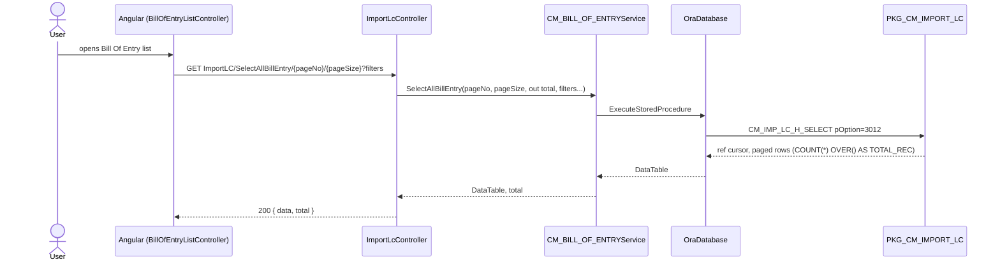
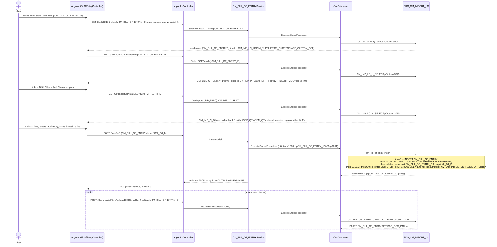

# Feature: Bill Of Entry

```yaml
---
id: feat:commercial-bill-of-entry
module: commercial
http: POST /api/cmr/ImportLC/SaveBoE
mvc: CmrController.BillOfEntry
api: [POST api/cmr/ImportLC/SaveBoE -> ImportLcController.SaveBoE, GET api/cmr/ImportLC/GetBillOfEntryInfo -> ImportLcController.GetBillOfEntryInfo, GET api/cmr/ImportLC/GetBillOfEntryDetailsInfo -> ImportLcController.GetBillOfEntryDetailsInfo, GET api/cmr/ImportLC/SelectAllBillEntry/{pageNo}/{pageSize} -> ImportLcController.SelectAllBillEntry, GET api/cmr/ImportLC/GetImportLcPiByBBLC -> ImportLcController.GetImportLcPiByBBLC, GET api/cmr/ImportLC/GetImportLcPIItem -> ImportLcController.GetImportLcPIItem]
service: ICM_BILL_OF_ENTRYService / CM_BILL_OF_ENTRYService
procedure: PKG_CM_IMPORT_LC.cm_bill_of_entry_insert | cm_bill_of_entry_select | cm_bill_of_entry_delete | CM_BILL_OF_ENTRY_UPDT_DOC_PATH | CM_IMP_LC_H_SELECT
pOption: 1000 insert, 2000 update (cm_bill_of_entry_insert — both values are ignored by the procedure body, which branches only on `nvl(pCM_BILL_OF_ENTRY_ID,0)`, not pOption), 3000/3001/3002 (cm_bill_of_entry_select), 4000 delete (cm_bill_of_entry_delete), 3010/3011/3012/3013 (CM_IMP_LC_H_SELECT, BoE-specific branches)
tables: [CM_BILL_OF_ENTRY, CM_BILL_OF_ENTRY_D]
models: [CM_BILL_OF_ENTRYModel]
session: [multiScUserId]
upstream: [CM_IMP_LC_H (Import LC / B2B LC header), CM_IMP_PI_H / CM_IMP_PI_D (Import PI), CM_UD_D / CM_UD_H (Utilization Declaration)]
downstream: [CM_UD_H.BILL_OF_ENTRY rollup column]
status: inferred
---
```

## Purpose

Import ▸ Bill of Entry (sidebar id `bill-of-entry`, Angular states `BillOfEntryList` /
`BillOfEntry`) is the customs-clearance-side counterpart to the Export module's Bill of Export: a
user picks an already-issued Back-to-Back/Import LC (`CM_IMP_LC_H`), pulls the Import PI line
items available under that LC (`CM_IMP_PI_D`, filtered to remaining un-received quantity), enters
how much of each line actually arrived and cleared customs (`RCV_QTY`, unit price), and saves one
Bill of Entry header (BoE number/date, customs office, currency + exchange rate, total amount,
optional attached document) plus its detail rows. Saving rolls the summed received quantity up
into the Utilization Declaration header (`CM_UD_H.BILL_OF_ENTRY`) for the UD tied to that LC — and,
per the traced procedure body, **requires that a UD already exists** for the picked LC or the
entire save is rejected (see Known Issues).

The API controller (`ImportLcController`) is **shared** with the sibling "Import LC" menu
(`CM_IMP_LC_HService`/`CM_IMP_LC_HModel`, documented separately); only the four Bill-of-Entry
actions (`SaveBoE`, `GetBillOfEntryInfo`, `GetBillOfEntryDetailsInfo`, `SelectAllBillEntry`) and
their two supporting reads (`GetImportLcPiByBBLC`, `GetImportLcPIItem`) are covered here.

## Entry

| Kind | Value |
|---|---|
| Menu / sidebar | Commercial ▸ Import ▸ Bill of Entry (sidebar id `bill-of-entry`, taken from the task description, not independently grepped from a menu/sidebar config table) |
| MVC shell | `CmrController.BillOfEntry()` (`IsMenuPermission()` gated), `src/ERPSolution/Areas/Commercial/Controllers/CmrController.cs:243` |
| Angular states | `BillOfEntryList` (`/BillOfEntryList`), `BillOfEntry` (`/BillOfEntry?pCM_BILL_OF_ENTRY_ID`) — `src/ERPSolution/Areas/Commercial/Client/app/config.cmrRoute.js:430-467` (an older commented-out `BillOfEntry` state block also remains at lines 416-428) |
| Razor views | `BillOfEntry.cshtml`, `_BillOfEntryList.cshtml`, `_BillOfEntry.cshtml` (`src/ERPSolution/Areas/Commercial/Views/Cmr/`) |
| Angular controllers | `BillOfEntryListController.js`, `BillOfEntryController.js` (`src/ERPSolution/Areas/Commercial/Client/app/controllers/`) |
| API — list | `GET /api/cmr/ImportLC/SelectAllBillEntry/{pageNo}/{pageSize}?pCM_IMP_LC_H_ID=&pSC_USER_ID=&pBOE_NO=&pFROM_DT=&pTO_DT=` |
| API — form load (header) | `GET /api/cmr/ImportLC/GetBillOfEntryInfo?pCM_BILL_OF_ENTRY_ID=` |
| API — detail grid | `GET /api/cmr/ImportLC/GetBillOfEntryDetailsInfo?pCM_BILL_OF_ENTRY_ID=` |
| API — PI line picker (by B/B LC) | `GET /api/cmr/ImportLC/GetImportLcPiByBBLC?pCM_IMP_LC_H_ID=` |
| API — PI item picker (by PI header, unused by UI — see Gaps) | `GET /api/cmr/ImportLC/GetImportLcPIItem?pCM_IMP_PI_H_ID=` |
| API — save | `POST /api/cmr/ImportLC/SaveBoE` |
| MVC (shell-hosted, not Web API) — attachment upload | `POST /Commercial/Cmr/UploadBillOfEntryDoc` |
| MVC — attachment delete | `POST /Commercial/Cmr/RemoveBillOfEntryDoc` |

## Execution (list)



## Execution (open form / add PI lines / save)



## C# map

| Layer | Type | Path |
|---|---|---|
| API | `ImportLcController` (BoE actions only; shared with Import LC) | `src/ERPSolution/Areas/Commercial/Api/ImportLcController.cs` |
| MVC shell + attachment endpoints | `CmrController` (`BillOfEntry`, `_BillOfEntryList`, `_BillOfEntry`, `UploadBillOfEntryDoc`, `RemoveBillOfEntryDoc`) | `src/ERPSolution/Areas/Commercial/Controllers/CmrController.cs:243-256, 572-628` |
| Service | `CM_BILL_OF_ENTRYService` / `ICM_BILL_OF_ENTRYService` | `src/ERP.BLL/Commercials/CM_BILL_OF_ENTRYService.cs` |
| Model | `CM_BILL_OF_ENTRYModel` | `src/ERP.Model/Commercial/CM_BILL_OF_ENTRYModel.cs` |
| Package | `PKG_CM_IMPORT_LC` | `src/ERPSolution/oracle/packages/PKG_CM_IMPORT_LC.sql` |

## Oracle

| Item | Value |
|---|---|
| Package | `PKG_CM_IMPORT_LC` (shared with Import LC's own `CM_IMP_LC_H_*` procedures) |
| Insert/Update | `cm_bill_of_entry_insert`, called with `pOption=1000` from `Save()` and `pOption=2000` from the unused `Update()` method — **the procedure body never reads `pOption`**; it inserts when `pCM_BILL_OF_ENTRY_ID<=0` and updates when `>0`, so the two pOption values behave identically. Re-syncs `CM_BILL_OF_ENTRY_D` from `pXML_Bill_D` (delete-then-upsert), then looks up the UD for the LC and rolls `SUM(RCV_QTY)` into `CM_UD_H.BILL_OF_ENTRY` |
| Select (header, multiplexed) | `cm_bill_of_entry_select`: `pOption=3000` unfiltered `SELECT * FROM CM_BILL_OF_ENTRY` (unused by the traced C# — `SelectAll`/`Select` methods pass `pOption=3000` but the C# `Select()` method hardcodes `pCM_BILL_OF_ENTRY_ID=0`, so its result set is effectively unused too — see Gaps); `pOption=3001` list-shaped join (LC/supplier/company/currency/custom-office) filterable by `pIMP_LC_NO`/`pCM_IMP_LC_H_ID`/`pCM_BILL_OF_ENTRY_ID`; `pOption=3002` single header row by `pCM_BILL_OF_ENTRY_ID`, used by `GetBillOfEntryInfo` (form load) |
| Select (BoE-specific, multiplexed inside the shared Import LC select) | `CM_IMP_LC_H_SELECT`: `pOption=3010` Import PI lines under a B/B LC with `USED_QTY`/`REM_QTY` already consumed by other Bills of Entry (`GetImportLcPiByBBLC`); `pOption=3011` Import PI lines by PI header, paged/filterable by item name (`GetImportLcPIItem` — defined and wired end-to-end but not called from any Angular code, see Gaps); `pOption=3012` paged BoE list with `COUNT(*) OVER() AS TOTAL_REC`, filterable by BoE no/LC/entry user/date range (`SelectAllBillEntry`); `pOption=3013` detail rows for one BoE, `CM_BILL_OF_ENTRY_D` joined to `CM_IMP_PI_D`/`CM_IMP_PI_H`/`INV_ITEM`/`RF_MOU`/receive (`GetBillOfEntryDetailsInfo`) |
| Update doc path | `CM_BILL_OF_ENTRY_UPDT_DOC_PATH`, `pOption=1000` (hardcoded by C#, unread inside the procedure); unconditionally sets `BOE_DOC_PATH` when `pCM_BILL_OF_ENTRY_ID>0`, else returns an upload-error message |
| Delete (unused, see Known Issues) | `CM_BILL_OF_ENTRYService.Delete()` targets `PKG_CM_IMPORT_LC.CM_BILL_OF_ENTRY_DELETE`, a procedure that **does not exist** anywhere in `PKG_CM_IMPORT_LC.sql` |
| Main table | `CM_BILL_OF_ENTRY` |
| Child table | `CM_BILL_OF_ENTRY_D` (Import PI line items received against this BoE) |

## Request / response

**In (Save):** `CM_BILL_OF_ENTRY_ID, CM_IMP_LC_H_ID, BOE_NO, BOE_DT, BOE_AMT, TTL_BOE_AMT, RF_CURRENCY_ID, RF_CUSTOM_OFF_ID, BOE_DOC_PATH, REMARKS, ENTRY_BY, ENTRY_DT, EXCHNG_RATE, LOC_CURRENCY_ID, IS_FINALIZED, XML_Bill_D, CREATION_DATE`.
`XML_Bill_D` rows (from `vm.selectedRows`): `CM_BILL_OF_ENTRY_D_ID, CM_IMP_PI_D_ID, UNIT_PRICE, RCV_QTY`.
**Out (list):** `{ data, total }`, `data` = raw `DataTable` (`CM_BILL_OF_ENTRY_ID, BOE_NO, BOE_AMT` (currency-code-prefixed string), `CUSTOM_OFF_NAME_EN, IMP_LC_NO, ENTRY_DT, ENTRY_BY` (`SC_USER.LOGIN_ID`), `REMARKS, IS_FINALIZED`).
**Out (save):** `{ success: true, jsonStr }`, `jsonStr` built from `OUTPARAM` (`PMSG`, `OPCM_BILL_OF_ENTRY_ID`), or `{ success: false, errors }` on `ModelState` failure.

## Tables / columns touched

No DDL exists in the repo for either table; every column below is reconstructed from the fullest
INSERT/SELECT in `PKG_CM_IMPORT_LC.sql` — source-inferred, not DB-verified.

`CM_BILL_OF_ENTRY` (header):
- `CM_BILL_OF_ENTRY_ID` (PK, `CM_BILL_OF_ENTRY_SEQ`)
- `CM_IMP_LC_H_ID` (FK `CM_IMP_LC_H`)
- `BOE_NO`, `BOE_DT`
- `BOE_AMT`, `TTL_BOE_AMT`
- `RF_CURRENCY_ID` (FK `RF_CURRENCY`), `LOC_CURRENCY_ID` (FK `RF_CURRENCY`, inferred — same domain, not independently joined)
- `RF_CUSTOM_OFF_ID` (FK `RF_CUSTOM_OFF`, nullable)
- `BOE_DOC_PATH`
- `REMARKS`
- `EXCHNG_RATE`
- `ENTRY_BY` (FK `SC_USER`, confirmed via `JOIN SC_USER ntry ON ntry.SC_USER_ID = boe.ENTRY_BY`), `ENTRY_DT`
- `IS_FINALIZED`
- `CREATION_DATE`, `CREATED_BY`, `LAST_UPDATE_DATE`, `LAST_UPDATED_BY` (`CREATED_BY`/`LAST_UPDATED_BY` FK `SC_USER` by established naming convention, not independently joined)

`CM_BILL_OF_ENTRY_D` (Import PI receive lines): `CM_BILL_OF_ENTRY_D_ID` (PK, `CM_BILL_OF_ENTRY_D_SEQ`), `CM_BILL_OF_ENTRY_ID` (FK), `CM_IMP_PI_D_ID` (FK `CM_IMP_PI_D`), `UNIT_PRICE`, `RCV_QTY`.

FKs confirmed by real JOIN/WHERE evidence: `CM_IMP_LC_H_ID`→`CM_IMP_LC_H`; `RF_CURRENCY_ID`→`RF_CURRENCY`; `RF_CUSTOM_OFF_ID`→`RF_CUSTOM_OFF`; `CM_IMP_PI_D_ID`→`CM_IMP_PI_D` (itself joined to `CM_IMP_PI_H`, `CM_IMP_PO_D`, and optionally `SCM_STR_RCV_D`/`SCM_STR_RCV_H` for MRR/Chalan display); `ENTRY_BY`→`SC_USER`. The UD rollup uses `CM_UD_D.CM_IMP_LC_H_ID` to find the owning `CM_UD_H` row (no direct FK from `CM_BILL_OF_ENTRY` to `CM_UD_H`/`CM_UD_D` — the link is only through the shared `CM_IMP_LC_H_ID`).

## Permissions / session

- `CmrController.BillOfEntry()` gates the MVC shell view with `IsMenuPermission()`.
- `CREATED_BY`/`ENTRY_BY`-equivalent stamping: `CM_BILL_OF_ENTRYService.Save()` reads `HttpContext.Current.Session["multiScUserId"]` for `pCREATED_BY` and `pLAST_UPDATED_BY` (the Angular form separately tracks a user-facing `ENTRY_BY` via `populateEntryByUser(cur_user_id)`, sent through the model as its own field).
- `ImportLcController` itself (Web API) and the MVC attachment endpoints (`UploadBillOfEntryDoc`, `RemoveBillOfEntryDoc`, only `[MyValidateAntiForgeryToken]`) have no explicit menu-permission check of their own.

## Dependencies (other features)

- **Shared controller:** `ImportLcController` also hosts the "Import LC" menu's own actions
  (`SelectAll`, `Save`, `Update`, `Delete`, `GetPaginatedB2BLC`, `SelectImpLcPiForImpLc`) via
  `ICM_IMP_LC_HService`/`CM_IMP_LC_HModel` — a different agent documented that slice; this doc
  covers only the four Bill-of-Entry actions plus their two PI-lookup helpers.
- **Upstream:** `CM_IMP_LC_H` (Import LC / B2B LC header) — a Bill of Entry is filed against one
  already-issued LC, joined in every `cm_bill_of_entry_select` branch and required by
  `cm_bill_of_entry_insert`'s UD lookup. `CM_IMP_PI_D`/`CM_IMP_PI_H` (Import PI) supply the
  receivable line items shown in the PI picker (`pOption=3010`). Documenting Import LC / Import PI
  is out of scope here.
- **Hard upstream dependency, not enforced client-side:** `CM_UD_D`/`CM_UD_H` (Utilization
  Declaration) — `cm_bill_of_entry_insert` does a `SELECT ... INTO` (singleton, `FETCH FIRST 1 ROW
  ONLY`) against `CM_UD_D` keyed by the BoE's `CM_IMP_LC_H_ID` to find the UD to roll up into; if
  none exists yet, `NO_DATA_FOUND` is caught and the **entire save is rolled back** with the message
  "No UD Found for this BBLC. Please add UD first" — i.e. a Utilization Declaration must exist for
  the LC before any Bill of Entry against it can be saved, enforced only inside the procedure's
  exception handler, not by any pre-save check in `BillOfEntryController.js`.
- **Downstream:** `CM_UD_H.BILL_OF_ENTRY` is updated (summed-`RCV_QTY` rollup) as a side effect of
  every save. No downstream report procedure references `CM_BILL_OF_ENTRY`/`CM_BILL_OF_ENTRY_D` in
  `PKG_CM_REPORT.sql` (checked, no match) — unlike Bill of Export, this screen has no confirmed
  print/report consumer.
- **Not this feature:** `CM_IMP_BILL_OF_EX_H` (referenced by `PKG_CM_IMPORT_LC.FN_CAN_REVISE` and
  `IMP_LC_PAD_LN_MAIL_NOTIFY`) is a differently-named "Import Bill of Exchange" header table,
  unrelated to `CM_BILL_OF_ENTRY` — mentioned only to avoid confusing the two similarly-named
  tables, mirroring the Export side's `CM_EXP_BILL_OF_EX_H` vs. `CM_BILL_OF_EXP_H` distinction.

## Gaps

- No DDL exists in the repo for `CM_BILL_OF_ENTRY` or `CM_BILL_OF_ENTRY_D`; all columns are
  reconstructed from the package body's INSERT/SELECT statements, not DB-verified.
- `GetImportLcPIItem` (`CM_IMP_LC_H_SELECT pOption=3011`) is fully wired — controller action,
  service method, and package branch all exist — but no Angular code in
  `BillOfEntryController.js`/`BillOfEntryListController.js` calls
  `/api/cmr/ImportLC/GetImportLcPIItem`; only `GetImportLcPiByBBLC` (`pOption=3010`) is used by the
  UI's PI picker. Flagged as dead/unreachable code from the client, not confirmed dead from other
  callers outside this pass.
- `CM_BILL_OF_ENTRYService.Update()`, `Delete()`, and the C# `Select()`/`SelectAll()`/
  `SelectByImportLC()` methods (using `pOption=3000`) are not called by any action on
  `ImportLcController` — out of scope per the task, but note: `Delete()` targets a stored
  procedure (`CM_BILL_OF_ENTRY_DELETE`) that does not exist in `PKG_CM_IMPORT_LC.sql`, and
  `Select(long ID)` ignores its own `ID` parameter (hardcodes `pCM_BILL_OF_ENTRY_ID=0`, which under
  `pOption=3000` returns every row in `CM_BILL_OF_ENTRY` unfiltered) and returns whichever row its
  loop happened to visit last — both are dead code today, not reachable from this controller, so
  low severity, but broken if ever wired up.
- `cm_bill_of_entry_insert` accepts a `pOption` parameter but never branches on it; the C# `Save()`
  (pOption 1000) and `Update()` (pOption 2000) calls are functionally identical inside the
  procedure. Inferred from reading the procedure body, not from a live reproduction.
- The sidebar id for this menu (`bill-of-entry`) was assumed from the task description, not
  independently confirmed by grepping a menu/sidebar config table in this pass.
- Whether any other screen also writes to `CM_BILL_OF_ENTRY`/`CM_BILL_OF_ENTRY_D`, or whether
  Oracle triggers exist on these tables, was not checked — out of scope, no DB access.
