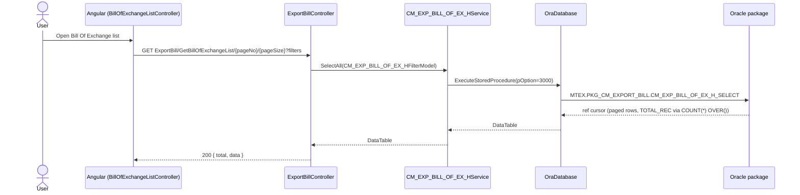
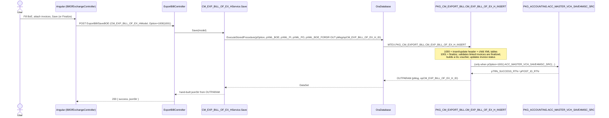

# Feature: Bill Of Exchange

```yaml
---
id: feat:cm-bill-of-exchange
module: commercial
http: GET /api/cmr/ExportBill/GetBillOfExchangeList/{pageNo}/{pageSize}
mvc: CmrController.BillOfExchangeList
api: [GET api/cmr/ExportBill/GetBillOfExchangeList/{pageNo}/{pageSize} -> ExportBillController.GetBillOfExchangeList, GET api/cmr/ExportBill/GetBillOfExchangeInfo -> ExportBillController.GetBillOfExchangeInfo, GET api/cmr/ExportBill/GetBillOfExchangeDtl -> ExportBillController.GetBillOfExchangeDtl, POST api/cmr/ExportBill/SaveBOE -> ExportBillController.SaveBOE, POST api/cmr/ExportBill/SaveAdvBOE -> ExportBillController.SaveAdvBOE, POST api/cmr/ExportBill/SaveDate -> ExportBillController.DateSave, GET api/cmr/ExportBill/GetPaymentRcvExpBillOfExchangeByFilter/{pageNo}/{pageSize} -> ExportBillController.GetPaymentRcvExpBillOfExchangeByFilter]
service: ICM_EXP_BILL_OF_EX_HService / CM_EXP_BILL_OF_EX_HService (header), ICM_EXP_BILL_OF_EX_DService / CM_EXP_BILL_OF_EX_DService (detail)
procedure: PKG_CM_EXPORT_BILL.CM_EXP_BILL_OF_EX_H_SELECT | CM_EXP_BILL_OF_EX_H_INSERT | CM_EXP_BILL_OF_EX_H_ADV_INSERT | CM_EXP_BILL_OF_EX_D_SELECT | CM_EXP_BILL_OF_EX_PI_PO_REF_SELECT | BBC_CHK_BOE_EXIST_BY_TYPE
pOption: "H_INSERT: 1000 insert/update, 1001 finalize (posts GL voucher), 1002 update bank submit/receipt dates. H_SELECT: 3000 list, 3001 single-record info, 3002/3003/3004/3005 dropdown variants (realization/collection pickers), 3006 advance-bill info, 3007 BR dropdown, 3008 payment-receive filter list."
tables: [CM_EXP_BILL_OF_EX_H, CM_EXP_BILL_OF_EX_D, CM_EXP_BILL_OF_EX_PI_PO_REF, CM_EXP_BILL_OF_EX_FORWARD, CM_EXP_BOE_ADV_BILL_COLL, CM_EXP_COM_ADV_H]
models: [CM_EXP_BILL_OF_EX_HModel, CM_EXP_BILL_OF_EX_HSlimModel, CM_EXP_BILL_OF_EX_HFilterModel, CM_EXP_BILL_OF_EX_DModel, CM_EXP_BILL_OF_EX_H_DATE_Model]
session: [multiScUserId]
upstream: [commercial-exp-lc-contract, Export Commercial Invoice (CM_EXP_COM_INV_H)]
downstream: [Bank Bill Collection (CM_EXP_BNK_BILL_COLL_H), Bank Realization (CM_EXP_BNK_BILL_REAL_H), Advance Bill Collection (CM_EXP_COM_ADV_H)]
status: inferred
---
```

Every fact below is **source-inferred** from the C# controller/service/model code and the
`PKG_CM_EXPORT_BILL` package body — there is no live database connection for this task, so
nothing here is "DB-verified."

## Purpose

A Bill Of Exchange (BoE) is the negotiable payment instrument a bank uses to collect payment
from the buyer's bank against one or more finalized Export Invoices tied to an Export LC. The
Commercial ▸ Export ▸ Transactions ▸ Bill Of Exchange screen lets the export-documentation user
create/edit a BoE, attach the Export Invoice(s) it covers, and "finalize" it (which posts an
accounting journal voucher and marks the linked invoices as negotiated). The same header table
also stores **Advance Bills** (an advance drawn against/without an export, `IS_ADV_AGNST_EXPORT`),
saved through a sibling action (`SaveAdvBOE`) with its own package procedure.

## Entry

| Kind | Value |
|---|---|
| Menu / sidebar id | `bill-of-exchange` (Commercial ▸ Export ▸ Transactions ▸ Bill Of Exchange) |
| Angular state (list) | `BillOfExchangeList` → `url: '/BillOfExchangeList'`, `BillOfExchangeListController`, view `/Commercial/Cmr/_BillOfExchangeList` |
| Angular state (form) | `BillOfExchange` → `url: '/BillOfExchange?pCM_EXP_BILL_OF_EX_H_ID=&pIS_ADV_AGNST_EXPORT='`, `BillOfExchangeController`, view `/Commercial/Cmr/_BillOfExchange` |
| Angular files | `src/ERPSolution/Areas/Commercial/Client/app/controllers/BillOfExchangeListController.js`, `BillOfExchangeController.js` |
| Route config | `src/ERPSolution/Areas/Commercial/Client/app/config.cmrRoute.js` (states `BillOfExchangeList`/`BillOfExchange`) |
| API | `GET api/cmr/ExportBill/GetBillOfExchangeList/{pageNo}/{pageSize}` |
| API (info) | `GET api/cmr/ExportBill/GetBillOfExchangeInfo?pCM_EXP_BILL_OF_EX_H_ID=&pOption=` |
| API (save) | `POST api/cmr/ExportBill/SaveBOE`, `POST api/cmr/ExportBill/SaveAdvBOE` |

## Execution

### List



### Save / Finalize



## C# map

| Layer | Type | Path |
|---|---|---|
| API | `ExportBillController` (shared with Commercial Invoice & Bank Bill Collection) | `src/ERPSolution/Areas/Commercial/Api/ExportBillController.cs` |
| Service (header) | `CM_EXP_BILL_OF_EX_HService` | `src/ERP.BLL/Commercials/CM_EXP_BILL_OF_EX_HService.cs` |
| Service (detail) | `CM_EXP_BILL_OF_EX_DService` | `src/ERP.BLL/Commercials/CM_EXP_BILL_OF_EX_DService.cs` |
| Model | `CM_EXP_BILL_OF_EX_HModel`, `CM_EXP_BILL_OF_EX_HSlimModel`, `CM_EXP_BILL_OF_EX_HFilterModel`, `CM_EXP_BILL_OF_EX_H_DATE_Model` | `src/ERP.Model/Commercial/CM_EXP_BILL_OF_EX_HModel.cs` |
| Package | `PKG_CM_EXPORT_BILL` | `src/ERPSolution/oracle/packages/PKG_CM_EXPORT_BILL.sql` |

### Controller actions in scope (this doc only)

| Action | Route | Calls |
|---|---|---|
| `GetBillOfExchangeList` | `GET ExportBill/GetBillOfExchangeList/{pageNo}/{pageSize}` | `CM_EXP_BILL_OF_EX_HService.SelectAll` (pOption 3000) |
| `GetPaymentRcvExpBillOfExchangeByFilter` | `GET ExportBill/GetPaymentRcvExpBillOfExchangeByFilter/{pageNo}/{pageSize}` | `GetPaymentRcvExpBillOfExchangeByFilter` (pOption 3008; feeds `CmrPaymentReceiveList`) |
| `GetBillOfExchangeInfo` | `GET ExportBill/GetBillOfExchangeInfo` | `Select` (default pOption 3001) |
| `GetBillOfExchangeForBankRealization` | `GET ExportBill/GetBillOfExchangeForBankRealization` | `GetBillOfExchangeForBankRealization` (default pOption 3002) — feeds the **Bank Realization** BoE picker |
| `GetAdvanceBillFromBuyerByFilter` | `GET ExportBill/GetAdvanceBillFromBuyerByFilter` | `ICM_EXP_COM_ADV_HService.SelectAllByFilter` (a *different* service, `CM_EXP_COM_ADV_H` table) |
| `GetBoEWithBillCollection` | `GET ExportBill/GetBoEWithBillCollection` | `GetBoEWithBillCollection` (pOption passed through, e.g. 3003/3005) |
| `CheckBillCollectionExist` | `GET ExportBill/CheckBillCollectionExist` | `CheckBillCollectionExist` → `PKG_CM_EXPORT_BILL.BBC_CHK_BOE_EXIST_BY_TYPE` (checks `CM_EXP_BNK_BILL_COLL_H` for an existing collection of a given type for this BoE) |
| `GetBoEDropDownData` | `GET ExportBill/GetBoEDropDownData` | `GetBoEDropDownData` (pOption 3004 typical — finalized BoEs only) |
| `GetBillOfExchangeDtl` | `GET ExportBill/GetBillOfExchangeDtl` | `CM_EXP_BILL_OF_EX_DService.SelectByID` (pOption 3001) |
| `SaveBOE` | `POST ExportBill/SaveBOE` | `CM_EXP_BILL_OF_EX_HService.Save` → `CM_EXP_BILL_OF_EX_H_INSERT` |
| `SaveAdvBOE` | `POST ExportBill/SaveAdvBOE` | `CM_EXP_BILL_OF_EX_HService.SaveAdvBoE` → `CM_EXP_BILL_OF_EX_H_ADV_INSERT` |

## Oracle

| Item | Value |
|---|---|
| Package | `PKG_CM_EXPORT_BILL` |
| Insert/Update/Finalize | `CM_EXP_BILL_OF_EX_H_INSERT` — `pOption=1000` insert/update header + `CM_EXP_BILL_OF_EX_D` / `CM_EXP_BILL_OF_EX_PI_PO_REF` / `CM_EXP_BILL_OF_EX_FORWARD` (via XML params `pXML_BOE`, `pXML_PI`, `pXML_PO`, `pXML_BOE_FORDR`); `pOption=1001` finalize (posts GL voucher through `PKG_ACCOUNTING.ACC_MASTER_VCH_SAVE4MISC_SRC`, sets `IS_FINALIZED='Y'`, marks linked `CM_EXP_COM_INV_H.IS_NEGOTIATED='Y'`, calls `FN_UPDATE_ACTION_STATUS_OF_BR_OR_REALIZATION(...,'BRI')`); `pOption=1002` updates `BILL_SUBMIT_DT_AT_BANK`/`PMT_RCV_DT_AT_BANK` |
| Advance-bill insert | `CM_EXP_BILL_OF_EX_H_ADV_INSERT` — same header table, additionally inserts/updates a `CM_EXP_COM_ADV_H` row (`CM_LC_APPLICANT_ID`, `ADV_VAL`), and `CM_EXP_BOE_ADV_BILL_COLL` distribution lines (`pXML_ADV_BIL_COL`) when finalized |
| Select | `CM_EXP_BILL_OF_EX_H_SELECT` — `pOption` 3000 (paged list), 3001 (single record incl. joined `CM_EXP_LC_H`/`RF_CURRENCY`), 3002/3003/3004/3005 (dropdown variants used by Bank Realization / Bank Bill Collection screens), 3006 (advance-bill info), 3007 (BR dropdown text `"{BILL_OF_EX_NO} ( BOE: {BNK_BILL_REF_NO} )"`), 3008 (payment-receive filtered list, excludes advance bills via `IS_ADV_AGNST_EXPORT='N'`) |
| Detail select | `CM_EXP_BILL_OF_EX_D_SELECT` — `pOption=3001` joins detail row back to `CM_EXP_COM_INV_H`, `CM_EXP_LC_H`, `HR_COMPANY`, `RF_CURRENCY`, `MC_BUYER`, `RF_MOU`, `RF_FRT_FORWRDR`, `RF_SHIP_MODE` |
| PI/PO ref select | `CM_EXP_BILL_OF_EX_PI_PO_REF_SELECT` — `pOption=3000` reads `CM_EXP_BILL_OF_EX_PI_PO_REF` joined to `MC_COLOR`/`MC_ORDER_H` |
| Collection-exists check | `BBC_CHK_BOE_EXIST_BY_TYPE` — `SELECT COUNT(*) FROM CM_EXP_BNK_BILL_COLL_H WHERE CM_EXP_BILL_OF_EX_H_ID=... AND BNK_BILL_COLL_TYPE=pCollectionType` |
| Main table | `CM_EXP_BILL_OF_EX_H` |
| Child tables | `CM_EXP_BILL_OF_EX_D` (links BoE ↔ `CM_EXP_COM_INV_H`), `CM_EXP_BILL_OF_EX_PI_PO_REF` (PI/PO line references), `CM_EXP_BILL_OF_EX_FORWARD` (forwarding distribution), `CM_EXP_BOE_ADV_BILL_COLL` (advance-bill distribution), `CM_EXP_COM_ADV_H` (advance-bill header, 1:1 with an advance BoE) |

## Request / response

**In (list):** `pageNo`, `pageSize`, plus filter fields on `CM_EXP_BILL_OF_EX_HFilterModel`/`BaseSearchFilter` — `pCM_EXP_LC_H_ID`, `pEXP_LCSC_NO`, `pBILL_OF_EX_NO`, `pBILL_OF_EX_DT`, `pMC_BUYER_ID`, `pFROM_DT`/`pTO_DT`, `pIS_ADV_AGNST_EXPORT`, `pCM_LC_APPLICANT_ID`, `pIS_FINALIZED`, `pBNK_BILL_REF_NO`, `pEXP_INV_NO`, `pLK_BNK_BILL_TYPE_ID`, `pRF_BANK_ID`, `pHR_COMPANY_ID`.
**Out (list):** `{ total, data }` — `data` is the raw `DataTable` (list of rows) serialized to JSON; `total` is `TOTAL_REC` from the `COUNT(*) OVER()` window column.
**In (save):** `CM_EXP_BILL_OF_EX_HModel` body — header fields plus `XML_BOE` (detail rows: linked invoice + note), `XML_PI`/`XML_PO` (PI/PO qty references), `XML_BOE_FORDR` (forwarding distribution), and `Option` (1000/1001/1002).
**Out (save):** `{ success, jsonStr }` — `jsonStr` is hand-assembled from the procedure's `OUTPARAM` table (`pMsg`, `opCM_EXP_BILL_OF_EX_H_ID`), not a typed model.

## Tables / columns touched

Main: `CM_EXP_BILL_OF_EX_H` — `CM_EXP_BILL_OF_EX_H_ID` (PK), `CM_EXP_LC_H_ID`, `BILL_OF_EX_NO`, `BILL_OF_EX_DT`, `BILL_OF_EX_AMT`, `BILL_CURRENCY_ID`, `EXCHNG_RATE`, `LOC_CURRENCY_ID`, `LK_BNK_BILL_TYPE_ID`, `BNK_BILL_REF_NO`, `BILL_REF_DT`, `DUE_DATE`, `ALOC_MARGIN_AMT`, `IS_FINALIZED`, `IS_FINALIZED_PMT`, `RF_ACTN_STATUS_ID`, `DOC_BKBR_ID`, `SND_BKBR_ID`, `RCV_BKBR_ID`, `LIN_BKBR_ID`, `REMITTANCE_REF`, `MC_BUYER_ID`, `HR_COMPANY_ID`, `IS_ADV_AGNST_EXPORT`, `PI_PO_REF`, `BILL_SUBMIT_DT_AT_BANK`, `PMT_RCV_DT_AT_BANK`, `TRACK_FINALIZATION`, `REMARKS`, `CREATION_DATE`, `CREATED_BY`, `LAST_UPDATE_DATE`, `LAST_UPDATED_BY`.

Child: `CM_EXP_BILL_OF_EX_D` — `CM_EXP_BILL_OF_EX_D_ID` (PK), `CM_EXP_BILL_OF_EX_H_ID` (FK), `CM_EXP_LC_H_ID`, `CM_EXP_COM_INV_H_ID` (FK to Export Commercial Invoice), `INV_NOTE`.

FKs (source-inferred from JOIN/INSERT evidence, not a live catalog):
- `CM_EXP_BILL_OF_EX_H.CM_EXP_LC_H_ID → CM_EXP_LC_H.CM_EXP_LC_H_ID` (Export LC — see `commercial-exp-lc-contract.md`).
- `CM_EXP_BILL_OF_EX_D.CM_EXP_COM_INV_H_ID → CM_EXP_COM_INV_H.CM_EXP_COM_INV_H_ID` (Export Commercial Invoice) — finalizing a BoE (`pOption=1001`) requires every linked invoice to already be `IS_FINALIZED='Y'`, then flips those invoices to `IS_NEGOTIATED='Y'`.
- `CM_EXP_COM_ADV_H.CM_EXP_BILL_OF_EX_H_ID → CM_EXP_BILL_OF_EX_H.CM_EXP_BILL_OF_EX_H_ID` (1 advance-bill header per advance BoE, created only via `SaveAdvBOE`/`CM_EXP_BILL_OF_EX_H_ADV_INSERT`).
- `CM_EXP_BNK_BILL_COLL_H.CM_EXP_BILL_OF_EX_H_ID → CM_EXP_BILL_OF_EX_H.CM_EXP_BILL_OF_EX_H_ID` (Bank Bill Collection references a finalized BoE; not owned by this doc).
- `CM_EXP_BNK_BILL_REAL_H.CM_EXP_BILL_OF_EX_H_ID → CM_EXP_BILL_OF_EX_H.CM_EXP_BILL_OF_EX_H_ID` (Bank Realization also references the BoE header directly — see Gaps for the distinction from Bank Bill Collection).

## Permissions / session

- `CREATED_BY`/`LAST_UPDATED_BY` on every write come from `HttpContext.Current.Session["multiScUserId"]` inside the service (not from the posted model) — same `multiScUserId` session key used app-wide.
- No `[Authorize]` attribute is active on the controller (it's commented out: `//[Authorize]`), same as its Commercial Invoice / Bank Bill Collection siblings — session gating, if any, happens elsewhere (menu-level, not visible in this file).
- Finalizing a BoE (`pOption=1001`) requires a Chart-of-Account link configured for the current menu (`ACC_GL_LINK_COA_H` keyed by `SC_MENU_ID=pCURRENT_MENU_ID`) — the Angular client passes `pCURRENT_MENU_ID`, which ties the GL posting to whichever menu (this BoE screen, presumably) the save came from.

## Dependencies (other features)

- **Upstream:** `commercial-exp-lc-contract` (Export LC, `CM_EXP_LC_H`) supplies the LC a BoE is drawn against; Export Commercial Invoice (`CM_EXP_COM_INV_H`, documented by the sibling agent on this same controller) supplies the invoices a BoE finalizes/negotiates.
- **Downstream:** Bank Bill Collection (`CM_EXP_BNK_BILL_COLL_H`) and Bank Realization (`CM_EXP_BNK_BILL_REAL_H`) both key off a finalized BoE; Advance Bill Collection (`CM_EXP_COM_ADV_H`) is the advance-bill variant of this same header table, saved through `SaveAdvBOE` instead of `SaveBOE`.
- **Shared controller:** `ExportBillController` also hosts the **Commercial Invoice** (`GetExpComInvoiceList`/`Save`/`BLDetailsUpdate`, using `ICM_EXP_COM_INV_HService`) and **Bank Bill Collection** (`GetBankBillCollectionList`/`SaveBankBillCollection`, using `ICM_EXP_BNK_BILL_COLL_HService`) actions — those are documented in their own feature files by different agents; only the BoE-prefixed actions are covered here.

## Gaps

- **Bank Realization vs. Bank Bill Collection — confirmed distinct, both reference the BoE header.** `CM_EXP_BNK_BILL_REAL_H` (Bank Realization, injected here as `ICM_EXP_BNK_BILL_REAL_HService`/`ICM_EXP_BNK_BILL_REAL_DService` but with **no controller actions** in the BoE slice of this controller) stores realization amounts/dates (`TOT_IBFTA1_COLL_AMT`, `EXP_BILL_REAL_DT`, `EXCHNG_RATE_B`) and is queried in `PKG_CM_EXPORT_BILL.FN_LC_WISE_REALIZATION_INFO` specifically for BoEs of `LK_BNK_BILL_TYPE_ID=835` ("FDBP"). `CM_EXP_BNK_BILL_COLL_H` (Bank Bill Collection) is a separate table keyed by `CM_EXP_BILL_OF_EX_H_ID` + `BNK_BILL_COLL_TYPE`, checked by `BBC_CHK_BOE_EXIST_BY_TYPE`. Both are downstream consumers of a finalized BoE, but they are not the same workflow — Realization tracks bank-side proceeds credited against a (typically FDBP-type) bill, while Bank Bill Collection tracks the collection-submission lifecycle by a collection type code. This doc only traces as far as the BoE side of that boundary; the Bank Realization and Bank Bill Collection screens are out of scope here (documented by sibling agents).
- `GetBillOfExchangeForBankRealization` and `GetBoEWithBillCollection`/`GetBoEDropDownData` are BoE-side dropdown/lookup endpoints consumed by the Bank Realization and Bank Bill Collection screens respectively — included here because they live under the BoE-prefixed action set, but their calling screens are not traced past that boundary.
- `CM_EXP_BILL_OF_EX_HFilterModel` inherits from `BaseSearchFilter` (`src/ERP.DAL/Filters/BaseSearchFilter.cs`), a single shared filter class with ~70 unrelated fields spanning every module (HR, SCM, Knitting, Commercial, ...). This is a pre-existing app-wide pattern, not unique to BoE — noted here because several filter fields used by this screen's actions (`HR_COMPANY_ID`, `EXP_LCSC_NO`, `MC_BUYER_ID`, `FROM_DT`/`TO_DT`, `IS_FINALIZED`, `CM_EXP_LC_H_ID`, `BILL_OF_EX_NO`) actually live on the base class, not on `CM_EXP_BILL_OF_EX_HFilterModel` itself.
- No stored-procedure body reads exactly correspond to a live schema check (`ALL_TAB_COLUMNS`) — every column name above is reconstructed from the fullest matching `INSERT`/`SELECT`/`UPDATE` seen in `PKG_CM_EXPORT_BILL.sql`; no DDL exists in the repo to cross-check against.
- `Update`/`Delete` methods exist on `CM_EXP_BILL_OF_EX_HService` (calling the same `CM_EXP_BILL_OF_EX_H_INSERT` procedure with `pOption=2000` and a `CM_EXP_BILL_OF_EX_H_DELETE` procedure with `pOption=4000` respectively) but are **not wired to any controller action** in `ExportBillController` — dead/unreachable from the API surface as far as this controller is concerned; left unexplored here.
- `GetBillOfExchngLstByFilter` (`BillOfExchngFilter`) is another `CM_EXP_BILL_OF_EX_HService` method not called from any action in this controller — likely used by a report or another controller not covered by this trace.
