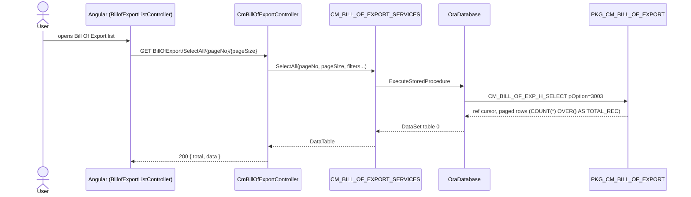
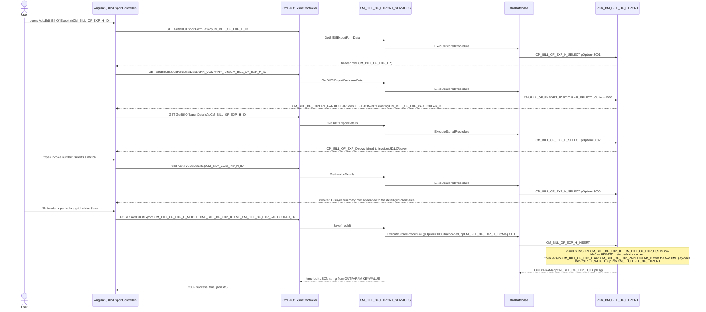

# Feature: Bill Of Export

```yaml
---
id: feat:commercial-bill-of-export
module: commercial
http: GET /api/cmr/BillOfExport/SelectAll/{pageNo}/{pageSize}
mvc: CmrController.BillofExportList
api: [GET api/cmr/BillOfExport/SelectAll/{pageNo}/{pageSize} -> CmBillOfExportController.SelectAll, GET api/cmr/BillOfExport/GetInvoiceDetails -> CmBillOfExportController.GetInvoiceDetails, GET api/cmr/BillOfExport/GetBillOfExportFormData -> CmBillOfExportController.GetBillOfExportFormData, GET api/cmr/BillOfExport/GetBillOfExportParticularData -> CmBillOfExportController.GetBillOfExportParticularData, GET api/cmr/BillOfExport/GetBillOfExportDetails -> CmBillOfExportController.GetBillOfExportDetails, POST api/cmr/BillOfExport/SaveBillOfExport -> CmBillOfExportController.Save]
service: ICM_BILL_OF_EXPORT_SERVICES / CM_BILL_OF_EXPORT_SERVICES
procedure: PKG_CM_BILL_OF_EXPORT.CM_BILL_OF_EXP_H_SELECT | CM_BILL_OF_EXP_H_INSERT | CM_BILL_OF_EXPORT_PARTICULAR_SELECT | CM_BILL_OF_EXP_H_DELETE_ATTACHMENT
pOption: 3000/3001/3002/3003 (CM_BILL_OF_EXP_H_SELECT variants), 1000 insert-or-update (CM_BILL_OF_EXP_H_INSERT), 3000 (CM_BILL_OF_EXPORT_PARTICULAR_SELECT, no pOption on the delete-attachment procedure)
tables: [CM_BILL_OF_EXP_H, CM_BILL_OF_EXP_H_STS, CM_BILL_OF_EXP_D, CM_BILL_OF_EXP_PARTICULAR_D]
models: [CM_BILL_OF_EXP_H_MODEL, BILL_OF_EXPORT_DOC_MODEL]
session: [multiScUserId]
upstream: [CM_EXP_COM_INV_H (Export Commercial Invoice), CM_UD_H (Utilization Declaration), CM_BILL_OF_EXPORT_PARTICULAR (Bill Of Export Particulars master data)]
downstream: [PKG_CM_REPORT RPT-7040 (Bill of Export print), PKG_CM_UD / CM_UD_H.BILL_OF_EXPORT rollup column]
status: inferred
---
```

## Purpose

Export ▸ Transactions ▸ Bill Of Export (sidebar/Angular states `BillofExportList` /
`BillofExport`) is the actual export-side customs declaration screen: a user picks one or more
already-issued Export Commercial Invoices (each tied to a UD — Utilization Declaration — via
`CM_UD_H`), bundles them under one Bill of Export header (number, date, company, forwarder
agent, bank pass-book page no., an optional attached document), distributes the export/forwarding
charge across a set of company-scoped "particulars" pulled from the existing `CM_BILL_OF_EXPORT_PARTICULAR`
master-data table, and carries the header through an `RF_ACTN_STATUS` workflow (`RF_ACTN_TYPE_ID`
`128`) until it is finalized. This is distinct from a Bill Of Exchange (a payment instrument) and,
per the actual code traced below, also distinct from the `CM_EXP_BILL_OF_EX_H` /
`PKG_CM_EXPORT_BILL` header used by the "Exp. BoE Forwading Dist" master-data screen's confirmed
downstream consumer — see Dependencies/Gaps.

## Entry

| Kind | Value |
|---|---|
| Menu / sidebar | Commercial ▸ Export ▸ Transactions ▸ Bill Of Export (sidebar id `bill-of-export`, inferred from screen path — not independently grepped) |
| MVC shell | `CmrController.BillofExportList()` (`IsMenuPermission()` gated), `src/ERPSolution/Areas/Commercial/Controllers/CmrController.cs:455` |
| Angular states | `BillofExportList` (`/BillofExportList`), `BillofExport` (`/BillofExport?pCM_BILL_OF_EXP_H_ID`) — `src/ERPSolution/Areas/Commercial/Client/app/config.cmrRoute.js:936-968` |
| Razor views | `_BillofExportList.cshtml`, `_BillofExport.cshtml`, `_BillofExportForwardingPartial.cshtml` (`src/ERPSolution/Areas/Commercial/Views/Cmr/`) |
| Angular controllers | `BillofExportListController.js`, `BillofExportController.js` (`src/ERPSolution/Areas/Commercial/Client/app/controllers/`) |
| API — list | `GET /api/cmr/BillOfExport/SelectAll/{pageNo}/{pageSize}?pBILL_OF_EXPORT_NO=&pEXP_INV_NO=&pHR_COMPANY_ID=&pEXP_BILL_NO=&pFROM_DATE=&pTO_DATE=` |
| API — invoice picker | `GET /api/cmr/BillOfExport/GetInvoiceDetails?pCM_EXP_COM_INV_H_ID=` |
| API — form load | `GET /api/cmr/BillOfExport/GetBillOfExportFormData?pCM_BILL_OF_EXP_H_ID=` |
| API — particular/expense grid | `GET /api/cmr/BillOfExport/GetBillOfExportParticularData?pHR_COMPANY_ID=&pCM_BILL_OF_EXP_H_ID=` |
| API — detail grid | `GET /api/cmr/BillOfExport/GetBillOfExportDetails?pCM_BILL_OF_EXP_H_ID=` |
| API — save | `POST /api/cmr/BillOfExport/SaveBillOfExport` |
| MVC (shell-hosted, not Web API) — attachment upload | `POST /Commercial/Cmr/UploadBillOfExportDocument` |
| MVC — attachment delete | `POST /Commercial/Cmr/DeleteBillOfExportDocument` |

## Execution (list)



## Execution (open form / add invoice / save)



## C# map

| Layer | Type | Path |
|---|---|---|
| API | `CmBillOfExportController` | `src/ERPSolution/Areas/Commercial/Api/CmBillOfExportController.cs` |
| MVC shell + attachment endpoints | `CmrController` (`BillofExportList`, `_BillofExportList`, `_BillofExport`, `UploadBillOfExportDocument`, `DeleteBillOfExportDocument`) | `src/ERPSolution/Areas/Commercial/Controllers/CmrController.cs:455-560` |
| Service | `CM_BILL_OF_EXPORT_SERVICES` / `ICM_BILL_OF_EXPORT_SERVICES` | `src/ERP.BLL/Commercials/CM_BILL_OF_EXPORT_SERVICES.cs`, `ICM_BILL_OF_EXPORT_SERVICES.cs` |
| Model | `CM_BILL_OF_EXP_H_MODEL`, `BILL_OF_EXPORT_DOC_MODEL` | `src/ERP.Model/Commercial/CM_BILL_OF_EXP_H_MODEL.cs` |
| Package | `PKG_CM_BILL_OF_EXPORT` | `src/ERPSolution/oracle/packages/PKG_CM_BILL_OF_EXPORT.sql` |

## Oracle

| Item | Value |
|---|---|
| Package | `PKG_CM_BILL_OF_EXPORT` (revision note: "1.0 23/10/2025 Rafat — Created this package", so this is a recently added package) |
| Select (multiplexed) | `CM_BILL_OF_EXP_H_SELECT`: `pOption=3000` invoice/LC/buyer summary by `pCM_EXP_COM_INV_H_ID` (used by the invoice auto-complete); `pOption=3001` single header row by `pCM_BILL_OF_EXP_H_ID` (form load); `pOption=3002` detail rows (`CM_BILL_OF_EXP_D` joined to `CM_UD_H`/`CM_EXP_COM_INV_H`/`CM_EXP_LC_H`/`MC_BUYER`/`HR_COMPANY`) by `pCM_BILL_OF_EXP_H_ID`; `pOption=3003` paged list with `COUNT(*) OVER() AS TOTAL_REC`, filterable by company/bill-of-export-no/export-bill-no/invoice-or-UD-no/date range |
| Select (particulars/expense grid) | `CM_BILL_OF_EXPORT_PARTICULAR_SELECT`, `pOption=3000` — reads the master `CM_BILL_OF_EXPORT_PARTICULAR` table (company-scoped) LEFT JOINed to any existing `CM_BILL_OF_EXP_PARTICULAR_D` row for this header, so unfilled particulars still show with their `DEFAULT_AMOUNT`/`REMARKS` as fallback |
| Insert/Update | `CM_BILL_OF_EXP_H_INSERT`, `pOption=1000` (id `<=0` inserts header + a `CM_BILL_OF_EXP_H_STS` row; id `>0` updates header and either repeats or inserts a status-history row when `pRF_ACTN_STATUS_ID>0`); also re-syncs `CM_BILL_OF_EXP_D` and `CM_BILL_OF_EXP_PARTICULAR_D` from `pXML_BILL_OF_EXP_D` / `pXML_CM_BILL_OF_EXP_PARTICULAR_D` (delete-then-upsert against the XML row set), then rolls the summed `NET_WEIGHT` into `CM_UD_H.BILL_OF_EXPORT` |
| Delete attachment | `CM_BILL_OF_EXP_H_DELETE_ATTACHMENT` (no `pOption`; unconditionally nulls `ATTACHED_DOCUMENT_PATH`) |
| Main table | `CM_BILL_OF_EXP_H` |
| Child tables | `CM_BILL_OF_EXP_H_STS` (status history), `CM_BILL_OF_EXP_D` (invoice/UD line items), `CM_BILL_OF_EXP_PARTICULAR_D` (per-particular expense distribution) |

## Request / response

**In (Save):** `CM_BILL_OF_EXP_H_ID, BILL_OF_EXPORT_NO, BILL_OF_EXPORT_DATE, EXP_BILL_DATE, EXPORT_BILL_CHARGE, HR_COMPANY_ID, RF_ACTN_STATUS_ID, EXP_BILL_NO, FORWARDER_AGENT, FORWARDER_AGENT_NAME, REMARKS, ATTACHED_DOCUMENT_PATH, XML_BILL_OF_EXP_D, XML_CM_BILL_OF_EXP_PARTICULAR_D, IS_FINALIZED, PASS_BOOK_PAGE_NO`.
`XML_BILL_OF_EXP_D` rows: `CM_BILL_OF_EXP_D_ID, CM_EXP_COM_INV_H_ID, CM_UD_H_ID, NET_WEIGHT`.
`XML_CM_BILL_OF_EXP_PARTICULAR_D` rows (client-filtered to `FORWARDING_AMT > 0` before sending): `CM_BILL_OF_EXP_PARTICULAR_D_ID, CM_BILL_OF_EXPORT_PARTICULAR_ID, FORWARDING_AMT, REMARKS`.
**Out (list):** `{ total, data }`, `data` = raw `DataTable` (`CM_BILL_OF_EXP_H_ID, BILL_OF_EXPORT_NO, BILL_OF_EXPORT_DATE, EXPORT_BILL_CHARGE, REMARKS, IS_FINALIZED, ATTACHED_DOCUMENT_PATH, EXP_INVOICES` (aggregated `LISTAGG`), `COMP_SNAME, EXP_BILL_NO, EVENT_NAME, NXT_ACTION_NAME, ACTN_ROLE_FLAG`).
**Out (save):** `{ success: true, jsonStr }`, `jsonStr` built from `OUTPARAM` (`PMSG`, `OPCM_BILL_OF_EXP_H_ID`), or `{ success: false, errors }` on `ModelState` failure.

## Tables / columns touched

No DDL exists in the repo for any of these tables; every column below is reconstructed from the
fullest INSERT/SELECT in `PKG_CM_BILL_OF_EXPORT` — source-inferred, not DB-verified.

`CM_BILL_OF_EXP_H` (header):
- `CM_BILL_OF_EXP_H_ID` (PK, `CM_BILL_OF_EXP_H_SEQ`)
- `BILL_OF_EXPORT_NO`, `BILL_OF_EXPORT_DATE`
- `EXPORT_BILL_CHARGE`
- `REMARKS`
- `HR_COMPANY_ID` (FK `HR_COMPANY`)
- `EXP_BILL_NO`, `EXP_BILL_DATE`
- `RF_ACTN_STATUS_ID` (FK `RF_ACTN_STATUS`)
- `FORWARDER_AGENT`, `FORWARDER_AGENT_NAME` (free-text pair, not a FK to `RF_FRT_FORWRDR`)
- `PASS_BOOK_PAGE_NO`
- `ATTACHED_DOCUMENT_PATH`
- `IS_FINALIZED`
- `CREATION_DATE`, `CREATED_BY`, `LAST_UPDATE_DATE`, `LAST_UPDATED_BY`

`CM_BILL_OF_EXP_H_STS` (status history): `CM_BILL_OF_EXP_H_STS_ID` (PK), `CM_BILL_OF_EXP_H_ID` (FK), `RF_ACTN_STATUS_ID`, `ACTION_DATE`, `ACTION_BY`, `IS_VISIBLE`, `REMARKS`, `CREATION_DATE`, `CREATED_BY`, `LAST_UPDATE_DATE`, `LAST_UPDATED_BY`.

`CM_BILL_OF_EXP_D` (invoice/UD line items): `CM_BILL_OF_EXP_D_ID` (PK, `CM_BILL_OF_EXP_D_SEQ`), `CM_BILL_OF_EXP_H_ID` (FK), `CM_EXP_COM_INV_H_ID` (FK `CM_EXP_COM_INV_H`), `CM_UD_H_ID` (FK `CM_UD_H`), `NET_WEIGHT`.

`CM_BILL_OF_EXP_PARTICULAR_D` (expense distribution): `CM_BILL_OF_EXP_PARTICULAR_D_ID` (PK), `CM_BILL_OF_EXP_H_ID` (FK), `CM_BILL_OF_EXPORT_PARTICULAR_ID` (FK `CM_BILL_OF_EXPORT_PARTICULAR`), `FORWARDING_AMT`, `REMARKS`, `CREATED_BY`, `CREATED_DATE`.

FKs confirmed by real JOIN/WHERE evidence: `HR_COMPANY_ID`→`HR_COMPANY`; `RF_ACTN_STATUS_ID`→`RF_ACTN_STATUS`; `CM_EXP_COM_INV_H_ID`→`CM_EXP_COM_INV_H` (itself joined to `CM_EXP_LC_H`→`MC_BUYER`); `CM_UD_H_ID`→`CM_UD_H`; `CM_BILL_OF_EXPORT_PARTICULAR_ID`→`CM_BILL_OF_EXPORT_PARTICULAR` (the already-documented "Bill Of Export Particulars" master table, `docs/features/commercial-cm-bo-exp-particular.md`).

## Permissions / session

- `CmrController.BillofExportList()` gates the MVC shell view with `IsMenuPermission()`.
- `CREATED_BY` / `LAST_UPDATED_BY` are stamped from `HttpContext.Current.Session["multiScUserId"]` in the service's `Save`/`DeleteAttachment` calls.
- The Web API controller (`CmBillOfExportController`) and the MVC attachment endpoints (`UploadBillOfExportDocument`, `DeleteBillOfExportDocument`, only `[MyValidateAntiForgeryToken]`) have no explicit menu-permission check of their own.

## Dependencies (other features)

- **Upstream:** `CM_EXP_COM_INV_H` (Export Commercial Invoice) and `CM_UD_H` (Utilization
  Declaration) — a Bill of Export is built by picking already-issued invoices/UDs via the
  `GetInvoiceDetails` auto-complete; documenting those screens is out of scope here.
- **Upstream master data — confirmed by code, not by naming convention:** `CM_BILL_OF_EXPORT_PARTICULAR`
  (`docs/features/commercial-cm-bo-exp-particular.md`) is read directly by
  `PKG_CM_BILL_OF_EXPORT.CM_BILL_OF_EXPORT_PARTICULAR_SELECT` (a *second*, separate procedure of
  the same name living in this package, distinct from `PKG_CM_BILL_OF_EXPORT_PARTICULAR`'s own
  CRUD procedure of the same name) and written to via `CM_BILL_OF_EXP_PARTICULAR_D` when a
  Bill of Export is saved. This is the real feed-in relationship the task description expected.
- **Not consumed here:** `CM_EXP_BILL_FORD_DIST` ("Exp. BoE Forwading Dist" master data,
  `docs/features/commercial-exp-boe-forwading-dist.md`) is **not** referenced anywhere in
  `CmBillOfExportController`, `CM_BILL_OF_EXPORT_SERVICES`, or `PKG_CM_BILL_OF_EXPORT`. Its
  confirmed downstream consumer is `PKG_CM_EXPORT_BILL.CM_EXP_BILL_OF_EX_FORWARDING_DIST_SELECT`,
  which joins to `CM_EXP_BILL_OF_EX_H` / `CM_EXP_BILL_OF_EX_FORWARD` — a **different** header
  table from this feature's `CM_BILL_OF_EXP_H`. The two "Bill of Export" header tables
  (`CM_BILL_OF_EXP_H` here vs. `CM_EXP_BILL_OF_EX_H` elsewhere in `PKG_CM_EXPORT_BILL`) appear to
  be separate, similarly-named screens/tables in this codebase; only `CM_BILL_OF_EXP_H` (this
  feature) was traced here.
- **Downstream:** `PKG_CM_REPORT` option `RPT-7040` (`vm.printBoE` in `BillofExportController.js`
  posts `REPORT_CODE=RPT-7040` to `/api/Cmr/CmrReport/PreviewReportRDLC`) renders the Bill of
  Export header joined to its particulars distribution — see `PKG_CM_REPORT.sql` around lines
  5580-5646 (unlabeled `pOption`, inferred as 7040 from the report code and from the following
  `ELSIF pOption=7041 THEN -- Export Bill of Exchange Forwading` marker at line 5647).
  `CM_UD_H.BILL_OF_EXPORT` is also updated (net-weight rollup) as a side effect of every save.
- **Workflow:** `RF_ACTN_STATUS_ID` transitions are scoped by `RF_ACTN_TYPE_ID = 128` (hardcoded in
  `BillofExportController.js`'s `actnStatusDataSource`), via
  `GET /api/common/RfActionStatusByID/128/{parentId}/{userId}` — not traced further here.

## Gaps

- No DDL exists in the repo for any of `CM_BILL_OF_EXP_H`, `CM_BILL_OF_EXP_H_STS`,
  `CM_BILL_OF_EXP_D`, or `CM_BILL_OF_EXP_PARTICULAR_D`; all columns are reconstructed from the
  package body's INSERT/SELECT statements, not DB-verified.
- `PKG_CM_BILL_OF_EXPORT.CM_BILL_OF_EXP_H_INSERT` (lines 385-393 of the `.sql` file) does
  `SELECT d.CM_UD_H_ID INTO V_UD_H_ID FROM CM_BILL_OF_EXP_D d WHERE d.CM_BILL_OF_EXP_H_ID =
  V_CM_BILL_OF_EXP_H_ID` as a bare `SELECT ... INTO` (singleton), immediately after the procedure
  has just upserted the `XML_BILL_OF_EXP_D` rows for that same header. The Angular save flow
  (`BillofExportController.js:266-268`) requires at least one detail row but does not cap it at
  one, and `vm.cominvautoonselect` explicitly supports appending multiple invoices to
  `vm.BillOfExpDetails` — so a Bill of Export covering more than one invoice/UD would leave more
  than one `CM_BILL_OF_EXP_D` row for the header, and this `SELECT INTO` would raise
  `TOO_MANY_ROWS`, caught by the procedure's own `WHEN OTHERS` handler, which sets `pMsg` and
  **rolls back the entire save** (header insert/update included). This is flagged as a likely bug
  in the JS draft's Known Issues, inferred from reading the procedure body, not from a live
  reproduction against the database.
- The sidebar id for this menu (`bill-of-export`) was assumed from the screen path given in the
  task, not independently confirmed by grepping a menu/sidebar config file in this pass.
- `PKG_CM_REPORT`'s `RPT-7040` block's own `pOption` value was not printed directly next to the
  `SELECT`; it is inferred from context (the report code used by the caller and the following
  `pOption=7041` comment marker), not confirmed against the procedure's `IF`/`ELSIF` chain header.
- Whether any other screen also writes to `CM_BILL_OF_EXP_D`/`CM_BILL_OF_EXP_PARTICULAR_D`, or
  whether Oracle triggers exist on these tables, was not checked — out of scope, no DB access.
