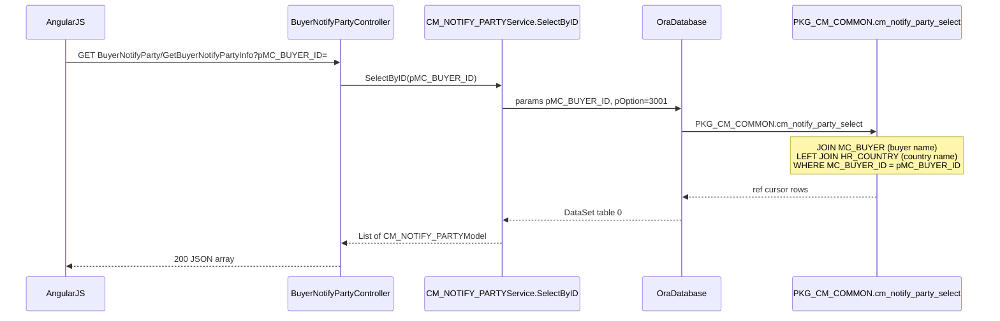
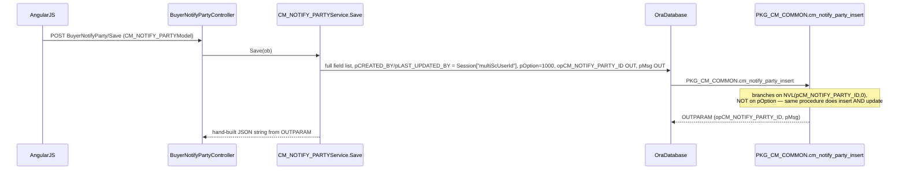

# Feature: Commercial buyer notify party

```yaml
---
id: feat:commercial-buyer-notify-party
module: commercial
http: GET /api/cmr/BuyerNotifyParty/GetBuyerNotifyPartyInfo | POST /api/cmr/BuyerNotifyParty/Save
mvc: CmrController.BuyerNotifyParty
api: [GET api/cmr/BuyerNotifyParty/GetBuyerNotifyPartyInfo -> BuyerNotifyPartyController.GetBuyerNotifyPartyInfo, POST api/cmr/BuyerNotifyParty/Save -> BuyerNotifyPartyController.Save]
service: ICM_NOTIFY_PARTYService / CM_NOTIFY_PARTYService
procedure: PKG_CM_COMMON.cm_notify_party_insert | cm_notify_party_select | cm_notify_party_delete
pOption: 1000 insert/update, 3001 select-by-buyer, 3000 select-all (unused), 4000 delete (unused)
tables: [CM_NOTIFY_PARTY]
models: [CM_NOTIFY_PARTYModel]
session: [multiScUserId]
upstream: [feat:mrc-buyer]
downstream: [commercial export-lc-contract, commercial export-lc-pi, commercial import-lc, commercial du, commercial reports]
status: inferred
---
```

## Purpose

Maintain the notify-party list for a buyer (who gets notified of shipment on an export LC). One buyer
can have several notify parties; every Export/Import LC and Proforma Invoice screen lets the user pick
from this list (or add a new one inline) via a Kendo multi-select.

## Entry

| Kind | Value |
|---|---|
| API prefix | `[RoutePrefix("api/cmr")]` |
| Controller | `src/ERPSolution/Areas/Commercial/Api/BuyerNotifyPartyController.cs` |
| GET | `/api/cmr/BuyerNotifyParty/GetBuyerNotifyPartyInfo?pMC_BUYER_ID=` |
| POST | `/api/cmr/BuyerNotifyParty/Save` |
| AngularJS state | `BuyerNotifyParty`, url `/BuyerNotifyParty` (`config.cmrRoute.js:16-24`) |
| View | `BuyerNotifyParty.cshtml` → `_BuyerNotifyParty.cshtml` (form/grid) + `_BuyerNotifyPartyModal.cshtml` (reusable "Add New" modal used from other screens) |

Only two controller actions exist. The service (`CM_NOTIFY_PARTYService`) implements `Save`, `Update`,
`Delete`, `SelectAll`, `SelectByID`, `Select` — but only `Save` and `SelectByID` are ever reachable from
a route (see Gaps).

## Execution (load by buyer)



## Execution (save)



## C# map

| Layer | Type | Path |
|---|---|---|
| API | `BuyerNotifyPartyController` | `src/ERPSolution/Areas/Commercial/Api/BuyerNotifyPartyController.cs` |
| Service | `CM_NOTIFY_PARTYService` | `src/ERP.BLL/Commercials/CM_NOTIFY_PARTYService.cs` |
| Model | `CM_NOTIFY_PARTYModel` (namespace `ERP.Model`) | `src/ERP.Model/Commercial/CM_NOTIFY_PARTYModel.cs` |
| Package | `PKG_CM_COMMON` | `src/ERPSolution/oracle/packages/PKG_CM_COMMON.sql` |

## Oracle

| Item | Value |
|---|---|
| Package | `PKG_CM_COMMON` |
| Insert/Update (same proc) | `cm_notify_party_insert`, `pOption=1000` for both — real branch is `NVL(pCM_NOTIFY_PARTY_ID,0) <= 0` vs `> 0`; `pOption` is accepted but never read in the body |
| Select by buyer | `cm_notify_party_select`, `pOption=3001` — joins `MC_BUYER` and left-joins `HR_COUNTRY` |
| Select all | `cm_notify_party_select`, `pOption=3000` — unused (no route calls `SelectAll`) |
| Delete | `cm_notify_party_delete`, `pOption=4000` — unused (no route calls `Delete`) |
| Code auto-gen | `function cm_notify_party_code_auto_gen` — `'BPC-' \|\| next number`, scanned via `max(to_number(substr(NTF_PARTY_CODE,5,6)))`; no DB sequence/uniqueness guard, so concurrent saves could race to the same code |
| Table | `CM_NOTIFY_PARTY` |
| Sequence | `CM_NOTIFY_PARTY_SEQ` |
| Referenced tables | `MC_BUYER` (join), `HR_COUNTRY` (left join) |

## Request / response

**In (Save):** full `CM_NOTIFY_PARTYModel` — `CM_NOTIFY_PARTY_ID, MC_BUYER_ID, NTF_PARTY_CODE, NTF_PARTY_NAME_EN, NTF_PARTY_NAME_BN, ADDRESS_EN, ADDRESS_BN, HR_COUNTRY_ID, POST_CODE, PO_BOX_NO, WORK_PHONE, MOB_PHONE, FAX_NO, EMAIL_ID, WEB_URL, IS_ACTIVE`.
**Out (GetBuyerNotifyPartyInfo):** JSON array of `CM_NOTIFY_PARTYModel`, plus join-only fields `BUYER_NAME_EN`, `COUNTRY_NAME_EN`.
**Out (Save):** `{ success, jsonStr }` built from the procedure's `OUTPARAM` (`opCM_NOTIFY_PARTY_ID`, `pMsg`).

## Tables / columns touched

Main table: `CM_NOTIFY_PARTY` (no `docs/schema/CM_NOTIFY_PARTY.md` yet — add one if a future feature needs the full column reference).

FKs: `MC_BUYER_ID → MC_BUYER` (corroborated: real JOIN in `cm_notify_party_select`), `HR_COUNTRY_ID → HR_COUNTRY` (corroborated: real LEFT JOIN). `CM_NOTIFY_PARTY_ID` is itself an FK target from `CM_EXP_LC_D_NTFP.CM_NOTIFY_PARTY_ID` (Export LC's notify-party detail table) — see Dependencies.

## Permissions / session

`HttpContext.Current.Session["multiScUserId"]` used directly inside `Save()` for both `pCREATED_BY` and `pLAST_UPDATED_BY`. No company/session scoping filter found on the select query.

## Dependencies (other features)

- **Upstream:** `feat:mrc-buyer` (`MC_BUYER`) — a notify party always belongs to one buyer; the screen is opened/filtered by `pMC_BUYER_ID`.
- **Downstream (real consumers of the endpoint, confirmed by grep):** Export LC/Sales Contract (`ExpLcContractController.js`), Export LC PI (`ExpLcPIController.js`), Import LC (`ImpLcListController.js`, `ImpLcPIController.js`, `ImpLcPOPIReviseController.js`), DU (`DUModalController.js`), and the Reference Type / GenRpt screens which embed the same grid for inline lookup/edit. All bind a Kendo multi-select (`k-data-text-field="NTF_PARTY_NAME_EN"`, `k-data-value-field="CM_NOTIFY_PARTY_ID"`) and can open `_BuyerNotifyPartyModal` to add a new party inline.
- **Real persisted linkage:** `CM_EXP_LC_D_NTFP` (Export LC ↔ notify party detail table). The link is NOT written through `CM_EXP_LC_D_NTFPService` (that service is orphaned — registered in `IocConfig.cs:518` but no controller injects it, and its own `SP_CM_EXP_LC_D_NTFP` / `Select_CM_EXP_LC_D_NTFP` procedure names don't exist anywhere). Instead `PKG_CM_EXPORT_LC.sql`'s own Export LC insert/update procedures take a CSV `pCM_NOTIFY_PARTY_LST` param, parse it with `regexp_substr`, delete+re-insert `CM_EXP_LC_D_NTFP` rows directly (~lines 612-630, 753-770, 1465-1483), and a history table `CM_EXP_LC_D_NTFP_HST` mirrors it (~1404-1406).
- `PKG_CM_REPORT.sql` joins `CM_NOTIFY_PARTY` directly (line 4776) to build a `NOTIFY_PARTY` report column (`LISTAGG(NTF_PARTY_NAME_EN || address, ...)`).

## Gaps

- **Dead/unreachable code:** `Update()` and `Select(long ID)` call stored procedures (`SP_CM_NOTIFY_PARTY`, `Select_CM_NOTIFY_PARTY`) that do not exist anywhere under `src/ERPSolution/oracle/` — confirmed by repo-wide grep. They would throw at runtime if ever called, but no controller route calls them today. `Select(long ID)` additionally has its own bug: it hardcodes `pCM_NOTIFY_PARTY_ID=0` instead of binding the `ID` parameter passed in.
- `Delete()` and `SelectAll()` are implemented against real, existing procedures but have no controller route — **the UI's delete icon only removes the grid row client-side and never calls a delete endpoint**, so a user cannot actually delete a notify party from this screen today.
- `ADDRESS_BN` is inserted/updated by the package but the create/edit form has the field commented out (`_BuyerNotifyParty.cshtml` line ~130) — effectively permanently stale/null going forward.
- `CM_EXP_LC_D_NTFPService` (a whole separate BLL service) is orphaned: DI-registered, never injected by any controller, and its own procedure names don't exist either. The real Export-LC-to-notify-party persistence bypasses it entirely (see Dependencies).
- Column usage: `NTF_PARTY_CODE`, `NTF_PARTY_NAME_BN`, `POST_CODE`, `PO_BOX_NO`, `WORK_PHONE`, `MOB_PHONE`, `FAX_NO`, `EMAIL_ID`, `WEB_URL`, `IS_ACTIVE` are own-screen-only (no usage found elsewhere in the repo). `NTF_PARTY_NAME_EN` and `ADDRESS_EN` are also consumed by `PKG_CM_REPORT.sql`'s notify-party report column. `CREATION_DATE`/`CREATED_BY`/`LAST_UPDATE_DATE`/`LAST_UPDATED_BY` are write-only audit columns.
- Everything above comes from static source analysis — there is no live database connection available, so nothing here is "DB-verified"; FK claims are corroborated by real JOIN/WHERE usage in the package body, which is stronger than a naming-convention guess but still `status: inferred`.
