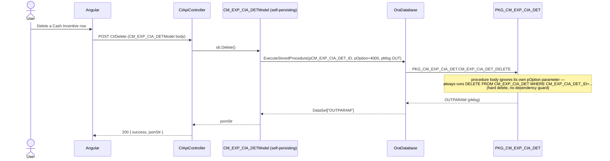
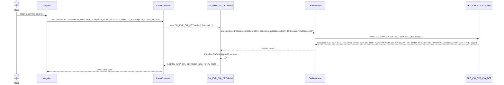
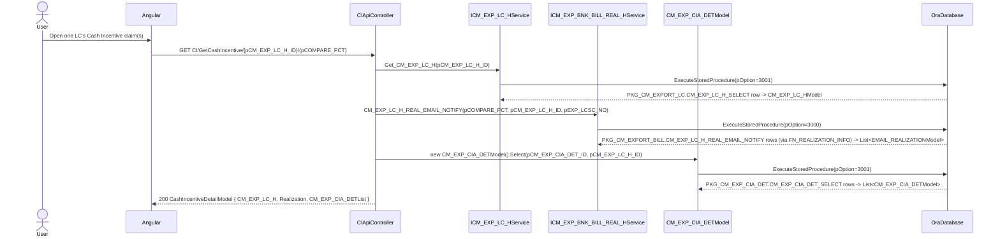

# Feature: Cash Incentive (export subsidy claim)

```yaml
---
id: feat:commercial-cash-incentive
module: commercial
http: GET /api/Commercial/CI/SelectAll/{pageNo}/{pageSize} | GET /api/Commercial/CI/GetCashIncentive/{pCM_EXP_LC_H_ID}/{pCOMPARE_PCT} | POST /api/Commercial/CI/Save | POST /api/Commercial/CI/Delete | POST /api/Commercial/CI/PreviewReportRDLC
mvc: CmrController.CashIncentive
api: [GET api/Commercial/CI/SelectAll/{pageNo}/{pageSize} -> CIApiController.SelectAll, GET api/Commercial/CI/GetCashIncentive/{pCM_EXP_LC_H_ID}/{pCOMPARE_PCT} -> CIApiController.GetCashIncentive, POST api/Commercial/CI/Save -> CIApiController.Save, POST api/Commercial/CI/Delete -> CIApiController.Delete]
service: NONE (no ERP.BLL service for CM_EXP_CIA_DET) — CM_EXP_CIA_DETModel persists itself; see Overview
procedure: PKG_CM_EXP_CIA_DET.CM_EXP_CIA_DET_INSERT | CM_EXP_CIA_DET_DELETE | CM_EXP_CIA_DET_SELECT
pOption: 1000 insert/update, 1001 finalize + post accounting voucher (both via CM_EXP_CIA_DET_INSERT, client-selected); CM_EXP_CIA_DET_SELECT 3000 unpaged list (unused), 3001 paged list (used by SelectAll and by Select), 3002 LC-wise dossier (unused — see Known Issues); CM_EXP_CIA_DET_DELETE ignores its own pOption argument
tables: [CM_EXP_CIA_DET]
models: [CM_EXP_CIA_DETModel, CashIncentiveDetailModel]
session: [multiScUserId]
upstream: [feat:commercial-exp-lc-contract]
downstream: []
status: inferred
---
```

## Purpose

Lets Commercial track a Cash Incentive claim — Bangladesh's government export-subsidy/rebate
program — filed against one Export LC/Sales Contract (`CM_EXP_LC_H`). The user records when the
claim was submitted to the bank (`CIA_CLAIM_SUBM_DT`/`CIA_CLAIM_SL_NO`), the claimed and
bank-audited amounts, and can later mark it finalized/collected, which posts a bill voucher into
Accounting. The entry screen also shows how much of the underlying LC's invoice value has actually
been realized (paid by the buyer's bank) side by side with the claim, so the user can judge whether
the claim is properly supported.

## Entry

| Kind | Value |
|---|---|
| API prefix | `[RoutePrefix("api/Commercial")]` |
| List | `GET CI/SelectAll/{pageNo}/{pageSize}?pFROM_DT=&pTO_DT=&pEXP_LCSC_NO=&pCM_EXP_LC_H_ID=&pCIA_CLAIM_SL_NO=` |
| Combined detail | `GET CI/GetCashIncentive/{pCM_EXP_LC_H_ID}/{pCOMPARE_PCT}?pCM_EXP_CIA_DET_ID=&pEXP_LCSC_NO=` |
| Save (insert/update/finalize) | `POST CI/Save` |
| Delete | `POST CI/Delete` |
| Report preview | `POST CI/PreviewReportRDLC` (RDLC report `RPT-3000`, "LC Wise Cash Incentive") |
| Controller | `src/ERPSolution/Areas/Commercial/Api/CIApiController.cs` |

DI: `ICM_EXP_BNK_BILL_REAL_HService`, `ICM_EXP_LC_HService`, `ICmrReportModelService` — none of
these is used for the Cash Incentive row itself; they only supply the LC header and the
realization side-panel for `GetCashIncentive`.

## Execution

### Save / Delete — the architectural deviation

```mermaid
sequenceDiagram
  actor User
  participant UI as Angular
  participant API as CIApiController
  participant Model as CM_EXP_CIA_DETModel (self-persisting)
  participant DB as OraDatabase
  participant PKG as PKG_CM_EXP_CIA_DET

  User->>UI: Fill claim form, submit
  UI->>API: POST CI/Save (CM_EXP_CIA_DETModel body, incl. Option field)
  API->>Model: ob.Save()
  Note over API,Model: No ERP.BLL service in between — the controller<br/>calls a method on the deserialized model object itself
  Model->>DB: new OraDatabase().ExecuteStoredProcedure(20 params incl. pOption=ob.Option, pMsg OUT)
  DB->>PKG: PKG_CM_EXP_CIA_DET.CM_EXP_CIA_DET_INSERT
  Note over PKG: pOption=1000 branches on NVL(pCM_EXP_CIA_DET_ID,0) for insert vs update;<br/>pOption=1001 instead re-marks IS_FINALIZED/CIA_COL_AMT and posts a<br/>bill voucher via PKG_ACCOUNTING.ACC_MASTER_VCH_SAVE4MISC_SRC
  PKG-->>DB: OUTPARAM (pMsg)
  DB-->>Model: DataSet["OUTPARAM"]
  Model-->>API: hand-built jsonStr
  API-->>UI: 200 { success, jsonStr }
```



<div class="callout"> — see `docs/04-design-patterns.md`: the documented Commercial pattern is
Controller → `I{X}Service`/`{X}Service` (Autofac-injected) → `OraDatabase.ExecuteStoredProcedure`.
Here the controller instead does `new CM_EXP_CIA_DETModel().Save()` /
`new CM_EXP_CIA_DETModel().Delete()` directly — the model class is active-record-style and owns
its own `OraDatabase` calls (confirmed by reading the full file: `Save()`, `Delete()`, `SelectAll()`
and `Select()` in `CM_EXP_CIA_DETModel.cs` all construct `new OraDatabase()` and call
`ExecuteStoredProcedure` themselves — there is no delegation to any other class). No
`ICM_EXP_CIA_DETService` exists anywhere in `ERP.BLL`. This is the only Commercial menu documented
so far that skips the service layer entirely.</div>

### List (SelectAll)



### Combined detail (GetCashIncentive) — three separate calls fan-in



`ICM_EXP_BNK_BILL_REAL_HService.CM_EXP_LC_H_REAL_EMAIL_NOTIFY` is a pre-existing method on the
*Bank Bill Realization* service (`src/ERP.BLL/Commercials/CM_EXP_BNK_BILL_REAL_HService.cs:362`),
reused here for the Cash Incentive comparison — it does not call anything named
`CM_EXP_BNK_BILL_REAL_*` in Oracle; it calls `PKG_CM_EXPORT_BILL.CM_EXP_LC_H_REAL_EMAIL_NOTIFY`
(`pOption=3000`), the same procedure this service exposes for its own "realization email notify"
feature. No independent evidence this method's name/table was designed for Cash Incentive; it is
just being borrowed as-is.

## C# map

| Layer | Type | Path |
|---|---|---|
| API | `CIApiController` | `src/ERPSolution/Areas/Commercial/Api/CIApiController.cs` |
| Model (self-persisting) | `CM_EXP_CIA_DETModel` | `src/ERP.Model/CashIncentive/CM_EXP_CIA_DETModel.cs` — declares `namespace ERP.Model` (not `ERP.Model.CashIncentive`, despite living in that folder — inconsistent with the sibling file, see Known Issues) |
| Model (combined DTO) | `CashIncentiveDetailModel` | `src/ERP.Model/CashIncentive/CashIncentiveDetailModel.cs` — declares `namespace ERP.Model.CashIncentive`. **Actively used**: it is the return shape of `GetCashIncentive`, wrapping `CM_EXP_LC_H` (`CM_EXP_LC_HModel`), `Realization` (`List<EMAIL_REALIZATIONModel>`) and `CM_EXP_CIA_DETList` (`List<CM_EXP_CIA_DETModel>`) — not dead/legacy. |
| Service (borrowed, LC header) | `ICM_EXP_LC_HService` / `CM_EXP_LC_HService.Get_CM_EXP_LC_H` | `src/ERP.BLL/Commercials/CM_EXP_LC_HService.cs:846` |
| Service (borrowed, realization %) | `ICM_EXP_BNK_BILL_REAL_HService` / `CM_EXP_BNK_BILL_REAL_HService.CM_EXP_LC_H_REAL_EMAIL_NOTIFY` | `src/ERP.BLL/Commercials/CM_EXP_BNK_BILL_REAL_HService.cs:362` |
| Package | `PKG_CM_EXP_CIA_DET` | `src/ERPSolution/oracle/packages/PKG_CM_EXP_CIA_DET.sql` |

## Oracle

| Item | Value |
|---|---|
| Package | `PKG_CM_EXP_CIA_DET` |
| Insert/Update/Finalize | `CM_EXP_CIA_DET_INSERT` — `pOption=1000` inserts (`NVL(pCM_EXP_CIA_DET_ID,0)<=0`) or updates (`>0`) the full row; `pOption=1001` is a distinct "finalize" mode: sets `IS_FINALIZED`/`CIA_COL_AMT`, looks up `ACC_GL_LINK_COA_H`/`ACC_GL_LINK_COA_D` by hardcoded `SC_MENU_ID=595`, builds a draft-voucher XML, and calls `PKG_ACCOUNTING.ACC_MASTER_VCH_SAVE4MISC_SRC` (`V_VOUCHER_TYPE_ID=10` "Bill Voucher", `V_GL_SOURCE_LINK` tagged via `PKG_MYVAR.V_COM_CASH_INCENTIVE`, `V_LK_TRX_SRC_ID=PKG_MYVAR.LK_COM_CASH_INCENTIVE`) to post a real accounting voucher |
| Delete | `CM_EXP_CIA_DET_DELETE` — takes a `pOption` parameter but the procedure body never branches on it; always hard-deletes the `CM_EXP_CIA_DET` row by ID, no dependency check |
| Select | `CM_EXP_CIA_DET_SELECT` — `pOption=3000` unfiltered/unpaged dump (no controller caller found); `pOption=3001` paged list used by both `SelectAll` (grid) and `Select` (detail lookup, with `pageSize=99999`) — joins `CM_EXP_LC_H`/`HR_COMPANY`/`HR_COUNTRY`/`CM_LC_APPLICANT`/`RF_BANK_BRANCH`+`RF_BANK`/`RF_CURRENCY` (x3 aliases)/`RF_CIA_TYPE`; `pOption=3002` opens three cursors (CIA rows + an LC-wise realization-% dossier with `HAVING >= 90` + full LC header) that duplicates what the controller instead assembles by calling three separate C#/service methods — not called by any controller action found |
| Main table | `CM_EXP_CIA_DET` |
| Accounting integration | Finalize path (`pOption=1001`) posts through `PKG_ACCOUNTING.ACC_MASTER_VCH_SAVE4MISC_SRC`, same integration point used by Bank Bill Collection's finalize (`docs/features/commercial-bank-bill-coll.md`) |

## Request / response

**In (SelectAll):** `pageNo`, `pageSize`, `pFROM_DT`, `pTO_DT`, `pEXP_LCSC_NO`, `pCM_EXP_LC_H_ID`, `pCIA_CLAIM_SL_NO`.
**In (GetCashIncentive):** route params `pCM_EXP_LC_H_ID`, `pCOMPARE_PCT`; query `pCM_EXP_CIA_DET_ID`, `pEXP_LCSC_NO`.
**In (Save/Delete):** `CM_EXP_CIA_DETModel` body, including the model's own `Option` property (client sets `1000`/`1001` for Save; the model hardcodes `4000` internally for Delete regardless of any client value).
**Out (SelectAll):** `{ total, data }`.
**Out (GetCashIncentive):** `CashIncentiveDetailModel` — `{ CM_EXP_LC_H, Realization, CM_EXP_CIA_DETList }`.
**Out (Save/Delete):** `{ success, jsonStr }`, `jsonStr` hand-built from the procedure's `OUTPARAM` rows (`pMsg` only — no `op*_ID` OUT param is read back by the model, so the client cannot learn a newly-inserted `CM_EXP_CIA_DET_ID` from the response; see Known Issues).

## Tables / columns touched

Reconstructed from the fullest `INSERT`/`SELECT` in `PKG_CM_EXP_CIA_DET.sql` (no DDL in repo — source-inferred, not DB-verified).

`CM_EXP_CIA_DET`: `CM_EXP_CIA_DET_ID` (PK), `CM_EXP_LC_H_ID` (FK), `CIA_CLAIM_SUBM_DT`, `CIA_CLAIM_SL_NO`, `CIA_DOC_SUBM_DT`, `CIA_CLAIM_AMT`, `CIA_AUDT_CERT_DT`, `CIA_CLOSE_DT`, `CLAIM_PART_NO`, `CIA_AUDT_AMT`, `CIA_BANK_REF`, `CIA_COL_AMT`, `RF_CURRENCY_ID` (FK), `RF_CURRENCY_AUDT_ID` (FK), `RF_CURRENCY_CONV_ID` (FK), `LOC_CUR_CONV_RATE`, `RF_CIA_TYPE_ID` (FK), `IS_FINALIZED`, `REMARKS`, `CREATION_DATE`, `CREATED_BY`, `LAST_UPDATE_DATE`, `LAST_UPDATED_BY`. (`HR_COMPANY_ID` is accepted as an insert/update param but not present in the procedure's own `INSERT INTO CM_EXP_CIA_DET(...)` column list — it is used only inside the `pOption=1001` finalize branch to build the accounting voucher, not persisted onto the row itself.)

FK confirmed by real `JOIN`/`WHERE` evidence:
- `CM_EXP_CIA_DET.CM_EXP_LC_H_ID → CM_EXP_LC_H.CM_EXP_LC_H_ID` (`CM_EXP_CIA_DET_SELECT` pOption 3001/3002, and the `pOption=1001` finalize lookup) — **the Cash Incentive claim is a child of the Export LC/Sales Contract header** documented in `docs/features/commercial-exp-lc-contract.md`.
- `CM_EXP_CIA_DET.RF_CIA_TYPE_ID → RF_CIA_TYPE` (incentive-type lookup, code/name/percentage).
- `CM_EXP_CIA_DET.RF_CURRENCY_ID`/`RF_CURRENCY_AUDT_ID`/`RF_CURRENCY_CONV_ID → RF_CURRENCY`.
- Transitively via `CM_EXP_LC_H`: `HR_COMPANY`, `HR_COUNTRY`, `CM_LC_APPLICANT`, `RF_BANK_BRANCH`→`RF_BANK`.

**Relationship to Bank Bill Realization (`CM_EXP_BNK_BILL_REAL_H`, `docs/features/commercial-bank-bill-coll.md`'s Gaps section): not a direct FK.** `GetCashIncentive`'s "Realization" panel comes from `PKG_CM_EXPORT_BILL.CM_EXP_LC_H_REAL_EMAIL_NOTIFY`, which in turn (for the `FN_REALIZATION_INFO` pattern used elsewhere in the same package) reaches `CM_EXP_BNK_BILL_REAL_H` only transitively: `CM_EXP_LC_H → CM_EXP_BILL_OF_EX_D.CM_EXP_LC_H_ID → CM_EXP_BILL_OF_EX_H → CM_EXP_BNK_BILL_REAL_H.CM_EXP_BILL_OF_EX_H_ID`. Cash Incentive, Bank Bill Collection, and Bank Bill Realization are three siblings that all hang off the same Export LC / Bill Of Exchange chain, not a direct header→child relationship to each other.

## Permissions / session

`CREATED_BY`/`LAST_UPDATED_BY` on `Save()` come from `HttpContext.Current.Session["multiScUserId"]`, read directly inside `CM_EXP_CIA_DETModel.Save()` (not passed in from the controller). `SelectAll` also passes `Session["multiScUserId"]` as `pUSER_ID`, but the procedure's `pOption=3001` branch never filters or joins by it — the parameter appears unused inside the SQL for that pOption. No `[Authorize]` attribute seen on `CIApiController`.

## Dependencies (other features)

- **Upstream:** `feat:commercial-exp-lc-contract` (`CM_EXP_LC_H`) — every Cash Incentive claim requires an existing Export LC/Sales Contract header; the LC's currency, company, applicant, and receiving bank are all inherited by reference for display.
- **Related (not a schema dependency, borrowed at the API layer):** Bank Bill Realization's `CM_EXP_LC_H_REAL_EMAIL_NOTIFY` method (`CM_EXP_BNK_BILL_REAL_HService`) is reused to compute the realization-% comparison shown alongside the claim.
- No confirmed downstream consumer of `CM_EXP_CIA_DET` — a targeted grep of `CM_EXP_CIA_DET_ID`/`CM_EXP_CIA_DET` across `ERP.BLL`/`ERPSolution` found only the report service (`CmrReportModelService.CashIncentiveNote`, feeding `PreviewReportRDLC`) and this controller/model.

## Gaps

- No live database connection was available for this pass — every fact above is source-inferred (static analysis of the C# and `.sql` package body), never "DB-verified"; no DDL exists in the repo to cross-check column lists or constraints against.
- `CashIncentiveDetailModel` vs `CM_EXP_CIA_DETModel`: confirmed both are real, both are used; they are not duplicates of each other despite similar names — `CashIncentiveDetailModel` is a pure DTO wrapper with no methods, `CM_EXP_CIA_DETModel` is the self-persisting active-record class. Neither is dead code.
- `PreviewReportRDLC`/`RPT-3000` ("LC Wise Cash Incentive") was traced only to its data source call (`CmrReportModelService.CashIncentiveNote`) and RDLC path per the task's instruction to treat reporting as lower priority; the report service's own SQL was not traced in depth.
- `CM_EXP_CIA_DET_SELECT`'s `pOption=3000` (unpaged dump) and `pOption=3002` (LC-wise dossier) branches were not found called from any C# in this pass — flagged as unused in Known Issues below, not deleted or assumed dead with certainty (a caller elsewhere in the app, e.g. a different report, cannot be ruled out without a full-repo grep beyond this feature's scope).

## Known Issues

- **No `ERP.BLL` service layer for `CM_EXP_CIA_DET` at all** (the headline deviation — see the Overview callout and the Save/Delete sequence diagrams above). `CIApiController.Save`/`Delete` call `ob.Save()`/`ob.Delete()` directly on the deserialized `CM_EXP_CIA_DETModel`, which itself opens `new OraDatabase()` and calls `ExecuteStoredProcedure` inline. Every other Commercial feature documented so far (Export LC, Bank Bill Collection, etc.) goes through an injected `I{X}Service`. Not necessarily a bug — the procedure calls are still parameterized correctly, no SQL injection risk observed — but it bypasses whatever cross-cutting behavior the service layer is meant to provide (DI testability, consistent session/audit handling, etc.), and breaks the "Controller → BLL service → OraDatabase" chain assumed elsewhere in the docs.
- **Delete ignores its own `pOption` parameter**: `CM_EXP_CIA_DET_DELETE`'s body never reads `pOption` — it always executes the same unconditional `DELETE`, regardless of what value the C# model passes (hardcoded `4000`). Effectively dead parameter.
- **No dependency guard on delete**: deleting a `CM_EXP_CIA_DET` row that has already been finalized (and thus already posted an accounting voucher via `pOption=1001`) does not reverse or check for that voucher — the accounting entry is left orphaned.
- **`Save()` never returns the new/updated ID to the caller**: unlike the Export LC and Bank Bill Collection procedures (which expose an `op*_ID` OUT param), `CM_EXP_CIA_DET_INSERT`'s only OUT param is `pMsg`; the model's `Save()` only surfaces `OUTPARAM` rows built from `pMsg`, so the client has no direct way to learn a newly-generated `CM_EXP_CIA_DET_ID` from the Save response (it would have to re-query via `SelectAll`/`GetCashIncentive`).
- **Namespace/folder mismatch**: `CM_EXP_CIA_DETModel.cs` lives in `src/ERP.Model/CashIncentive/` but declares `namespace ERP.Model` (not `ERP.Model.CashIncentive`), while its sibling `CashIncentiveDetailModel.cs` in the same folder correctly declares `namespace ERP.Model.CashIncentive`. Both compile today because the controller's `using ERP.Model;` and `using ERP.Model.CashIncentive;` are both present, but it is an inconsistency worth normalizing.
- **`pOption=3002` in `CM_EXP_CIA_DET_SELECT` duplicates, in Oracle, almost exactly what `GetCashIncentive` instead assembles in C# from three separate calls** (`Get_CM_EXP_LC_H` + `CM_EXP_LC_H_REAL_EMAIL_NOTIFY` + `CM_EXP_CIA_DETModel.Select`) — both compute an LC-wise realization percentage and both join the same LC/company/country/applicant/bank tables. The Oracle version additionally hardcodes a `>= 90` threshold in its `HAVING` clause (vs. the C# path's client-supplied `pCOMPARE_PCT`). Neither the C# `Select` overload with `pCM_EXP_CIA_DET_ID=99999` sentinel (used inside `SelectAll`... actually inside `CM_EXP_CIA_DET_SELECT`'s own 3001 branch) nor `pOption=3002` appears to be invoked from `CIApiController` — worth reconciling if this package is revisited.
- **Reused, not purpose-built, realization procedure**: the "Realization" data in `GetCashIncentive`'s response comes from a method (`CM_EXP_LC_H_REAL_EMAIL_NOTIFY`) that lives on the Bank Bill Realization service and whose name/original purpose ("email notify") has nothing to do with Cash Incentive — it is being reused for its LC-wise realization-% computation, not written for this screen.
- **`SelectAll`'s `pUSER_ID` param appears unused** inside `CM_EXP_CIA_DET_SELECT`'s `pOption=3001` branch (no `WHERE`/join reference found) despite being passed from the session on every list call.
- **`HR_COMPANY_ID` accepted but not persisted on insert/update**: `CM_EXP_CIA_DET_INSERT` takes `pHR_COMPANY_ID` as a parameter (and the C# model carries the property) but the procedure's insert/update column list for `CM_EXP_CIA_DET` does not include it — it is only read inside the separate `pOption=1001` finalize branch, for the voucher post. The base row itself has no company column of its own; company scoping only exists via the parent `CM_EXP_LC_H.HR_COMPANY_ID`.

## Unused Columns

Not independently verified with the same rigor as a full Angular-grid-to-SELECT-projection audit (out of scope per the task, which asked to focus on the controller/model/package chain and the architecture deviation). No unused column was affirmatively found in the small `CM_EXP_CIA_DET` table's fields — all appear read and written somewhere in `CM_EXP_CIA_DETModel`/the package — but this is not a confirmed clean bill, only "nothing surfaced in this pass."
