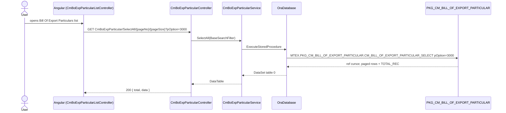
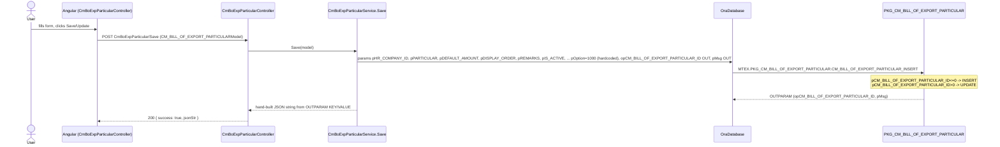

# Feature: Bill Of Export Particulars

```yaml
---
id: feat:commercial-cm-bo-exp-particular
module: commercial
http: GET /api/Commercial/CmBoExpParticular/SelectAll/{pageNo}/{pageSize}
mvc: CmrController.CmBoExpParticular
api: [GET api/Commercial/CmBoExpParticular/SelectAll/{pageNo}/{pageSize} -> CmBoExpParticularController.SelectAll, GET api/Commercial/CmBoExpParticular/GetBoExpParticularById -> CmBoExpParticularController.GetBoExpParticularById, POST api/Commercial/CmBoExpParticular/Save -> CmBoExpParticularController.Save, POST api/Commercial/CmBoExpParticular/Delete -> CmBoExpParticularController.Delete]
service: ICmBoExpParticularService / CmBoExpParticularService
procedure: PKG_CM_BILL_OF_EXPORT_PARTICULAR.CM_BILL_OF_EXPORT_PARTICULAR_SELECT | CM_BILL_OF_EXPORT_PARTICULAR_INSERT | CM_BILL_OF_EXPORT_PARTICULAR_DELETE
pOption: 3000 list (paged), 3001 get-by-id (unpaged), 1000 insert/update, 4000 delete
tables: [CM_BILL_OF_EXPORT_PARTICULAR]
models: [CM_BILL_OF_EXPORT_PARTICULARModel]
session: [multiScUserId]
upstream: []
downstream: []
status: inferred
---
```

## Purpose

Master-data setup screen (Export ▸ Master Data ▸ Bill Of Export Particulars, sidebar id
`cm-bo-exp-particular`) where a user defines the line items ("particulars") that can appear on a
Bill of Export, per company — e.g. a description, a default amount, a display order and an
active flag. It is a simple company-scoped CRUD lookup table with no child grid of its own.

## Entry

| Kind | Value |
|---|---|
| Menu / sidebar id | `cm-bo-exp-particular` |
| Angular states | `CmBoExpParticularList` (`/CmBoExpParticularList`), `AddEditCmBoExpParticular` (`/AddEditCmBoExpParticular?pCM_BILL_OF_EXPORT_PARTICULAR_ID=0`) |
| Razor views | `src/ERPSolution/Areas/Commercial/Views/Cmr/_CmBoExpParticularList.cshtml`, `_AddEditCmBoExpParticular.cshtml` |
| Angular controllers | `CmBoExpParticularListController.js`, `CmBoExpParticularController.js` |
| API — list | `GET /api/Commercial/CmBoExpParticular/SelectAll/{pageNo}/{pageSize}?pOption=3000&pHR_COMPANY_ID=&pPARTICULAR=` |
| API — get by id | `GET /api/Commercial/CmBoExpParticular/GetBoExpParticularById?pOption=3001&pCM_BILL_OF_EXPORT_PARTICULAR_ID=` |
| API — save | `POST /api/Commercial/CmBoExpParticular/Save` |
| API — delete | `POST /api/Commercial/CmBoExpParticular/Delete` |

## Execution (list)



## Execution (save / insert-update)



Delete follows the same shape, calling `CM_BILL_OF_EXPORT_PARTICULAR_DELETE` with `pOption=4000`
(hardcoded in `CmBoExpParticularService.Delete`); the procedure itself does not branch on
`pOption`, it always deletes the row for the given id.

## C# map

| Layer | Type | Path |
|---|---|---|
| API | `CmBoExpParticularController` | `src/ERPSolution/Areas/Commercial/Api/CmBoExpParticularController.cs` |
| Service | `CmBoExpParticularService` / `ICmBoExpParticularService` | `src/ERP.BLL/Commercials/CmBoExpParticularService.cs`, `ICmBoExpParticularService.cs` |
| Model | `CM_BILL_OF_EXPORT_PARTICULARModel` | `src/ERP.Model/Commercial/CM_BILL_OF_EXPORT_PARTICULARModel.cs` |
| Package | `PKG_CM_BILL_OF_EXPORT_PARTICULAR` | `src/ERPSolution/oracle/packages/PKG_CM_BILL_OF_EXPORT_PARTICULAR.sql` |

## Oracle

| Item | Value |
|---|---|
| Package | `PKG_CM_BILL_OF_EXPORT_PARTICULAR` |
| Insert/Update | `CM_BILL_OF_EXPORT_PARTICULAR_INSERT` `pOption=1000` (id `<=0` inserts, id `>0` updates) |
| Delete | `CM_BILL_OF_EXPORT_PARTICULAR_DELETE` `pOption=4000` (parameter accepted but not branched on in the procedure body) |
| Select | `CM_BILL_OF_EXPORT_PARTICULAR_SELECT` `pOption=3000` paged list (`OFFSET`/`FETCH NEXT`, ordered by `PARTICULAR`), `pOption=3001` unpaged get-by-id (ordered by id desc) |
| Main table | `CM_BILL_OF_EXPORT_PARTICULAR` |
| Joins on select | `HR_COMPANY` (`COMP_NAME_EN`), `SC_USER` (`CREATED_BY_NAME`) |
| Child tables | none found |

## Request / response

**In (Save):** `CM_BILL_OF_EXPORT_PARTICULAR_ID, HR_COMPANY_ID, PARTICULAR, DEFAULT_AMOUNT, DISPLAY_ORDER, REMARKS, IS_ACTIVE`.
**In (Delete):** `CM_BILL_OF_EXPORT_PARTICULAR_ID` only.
**Out (list):** `{ total, data }` where `data` is the raw select `DataTable` (includes `SL`, `TOTAL_REC`, all table columns, `COMP_NAME_EN`, `CREATED_BY_NAME`).
**Out (save/delete):** `{ success: true, jsonStr }` where `jsonStr` is a hand-built JSON string assembled from the procedure's `OUTPARAM` rows (`opCM_BILL_OF_EXPORT_PARTICULAR_ID`, `pMsg`), or `{ success: false, errors }` on `ModelState` validation failure.

## Tables / columns touched

`CM_BILL_OF_EXPORT_PARTICULAR` — column list reconstructed from the fullest INSERT in
`CM_BILL_OF_EXPORT_PARTICULAR_INSERT` (no DDL in repo, so this is source-inferred, not
DB-verified):

- `CM_BILL_OF_EXPORT_PARTICULAR_ID` (PK, sequence-generated, returned via `RETURNING ... INTO`)
- `HR_COMPANY_ID` (FK to `HR_COMPANY`)
- `PARTICULAR`
- `DEFAULT_AMOUNT`
- `DISPLAY_ORDER`
- `REMARKS`
- `IS_ACTIVE`
- `CREATION_DATE`
- `CREATED_BY` (FK to `SC_USER`)
- `LAST_UPDATE_DATE`
- `LAST_UPDATED_BY`

A unique constraint on (`HR_COMPANY_ID`, `PARTICULAR`) is inferred from the `DUP_VAL_ON_INDEX`
handler in the insert procedure ("This Particular already exists for the selected company.").

## Permissions / session

`CREATED_BY` / `LAST_UPDATED_BY` are stamped from `HttpContext.Current.Session["multiScUserId"]`.
No explicit menu-permission check was found in this controller/service (standard ERP-wide
auth is presumably enforced elsewhere, e.g. Web API filters — not traced here).

## Dependencies (other features)

- Same controller/service also exposes `CmExpBoEForwadingDist/*` actions
  (`ExpBoEFrdDistSelectAll`, `GetExpBoEFrdDistById`, `CmExpBoEForwadingDistSave`,
  `CmExpBoEForwadingDistDelete`) operating on a **separate table/model**
  (`CM_BILL_OF_EXPORT_ForwadingDistModel`, package `PKG_CM_EXP_BILL_FORD_DIST`, id column
  `CM_EXP_BILL_FORD_DIST_ID`, keyed additionally by `RF_BANK_ID`) — this is the "Exp. BoE
  Forwading Dist" sidebar menu (`exp-boe-forwading-dist`), documented separately by another
  pass; it shares the C# controller/service class but is not the same screen or table as Bill
  Of Export Particulars.
- No other screen was found referencing `CM_BILL_OF_EXPORT_PARTICULAR_ID` as a foreign key
  (grepped repo-wide); appears to be a standalone lookup with no confirmed downstream consumer
  yet.

## Gaps

- No DDL exists in the repo for `CM_BILL_OF_EXPORT_PARTICULAR`; the column list and inferred
  unique constraint are reconstructed from the package body's INSERT/UPDATE, not DB-verified.
- `PKG_CM_EXP_BILL_FORD_DIST` (used by the sibling ForwadingDist actions) has no `.sql` file
  under `src/ERPSolution/oracle/packages/` in this repo — its existence is inferred purely from
  the C# service call; not traced further here since it is out of scope for this feature.
- No explicit permission/menu-access check was found on the controller actions themselves.
- Downstream usage of `CM_BILL_OF_EXPORT_PARTICULAR_ID` elsewhere in Bill of Export processing
  was not found in the repo; may exist in Oracle code not covered by this repo's package files.
