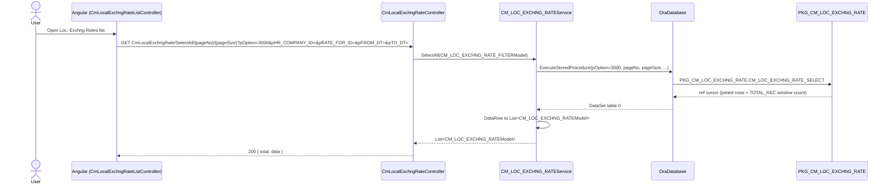
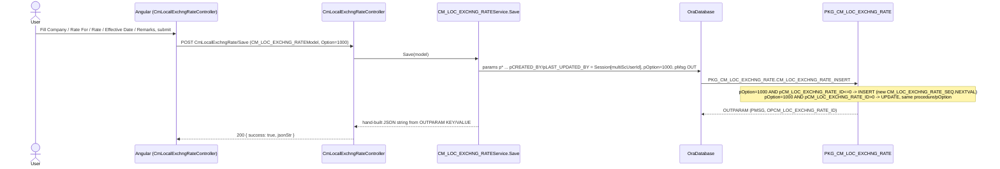

# Feature: Commercial local exchange rate

```yaml
---
id: feat:cm-loc-exchng-rate
module: commercial
http: GET /api/Commercial/CmLocalExchngRate/SelectAll/{pageNo}/{pageSize}
mvc: CmrController.CmLocalExchngRateManage
api: [GET api/Commercial/CmLocalExchngRate/SelectAll/{pageNo}/{pageSize} -> CmLocalExchngRateController.SelectAll, GET api/Commercial/CmLocalExchngRate/GetCM_LOC_EXCHNG_RATEById -> CmLocalExchngRateController.GetCM_LOC_EXCHNG_RATEById, POST api/Commercial/CmLocalExchngRate/Save -> CmLocalExchngRateController.Save, POST api/Commercial/CmLocalExchngRate/Delete -> CmLocalExchngRateController.Delete]
service: ICM_LOC_EXCHNG_RATEService / CM_LOC_EXCHNG_RATEService
procedure: PKG_CM_LOC_EXCHNG_RATE.CM_LOC_EXCHNG_RATE_INSERT | CM_LOC_EXCHNG_RATE_DELETE | CM_LOC_EXCHNG_RATE_SELECT
pOption: 1000 insert-or-update (branches on pCM_LOC_EXCHNG_RATE_ID), 4000 delete (hard-coded in C#, not caller-supplied), 3000 paged list, 3001 single/unpaged select
tables: [CM_LOC_EXCHNG_RATE]
models: [CM_LOC_EXCHNG_RATEModel, CM_LOC_EXCHNG_RATE_FILTERModel]
session: [multiScUserId]
upstream: [feat:security-signin]
downstream: []
status: inferred
---
```

## Purpose

A Commercial master-data setup screen ("Loc. Exchng Rates", menu id `cm-local-exchng-rate`,
under Export ▸ Master Data) where a user records a local exchange rate for a company, effective
from a given date, tagged with a "Rate For" category. Each row is edited or created through the
same form; there is no in-place versioning UI beyond adding a new row with a new effective date.

## Entry

| Kind | Value |
|---|---|
| Menu / MVC URL | `Commercial/Cmr/CmLocalExchngRateManage` (guarded by `IsMenuPermission()`) |
| Razor view | `Areas/Commercial/Views/Cmr/_CmLocalExchngRateList.cshtml`, `_CmLocalExchngRate.cshtml` |
| Angular file | `Areas/Commercial/Client/app/controllers/CmLocalExchngRateListController.js`, `CmLocalExchngRateController.js`; states `CmLocalExchngRateList` / `CmLocalExchngRate` in `config.cmrRoute.js` |
| API | `GET api/Commercial/CmLocalExchngRate/SelectAll/{pageNo}/{pageSize}`, `GET api/Commercial/CmLocalExchngRate/GetCM_LOC_EXCHNG_RATEById`, `POST api/Commercial/CmLocalExchngRate/Save`, `POST api/Commercial/CmLocalExchngRate/Delete` |

## Execution (list)



## Execution (save)



## C# map

| Layer | Type | Path |
|---|---|---|
| API | `CmLocalExchngRateController` | `src/ERPSolution/Areas/Commercial/Api/CmLocalExchngRateController.cs` |
| MVC shell | `CmrController` (`CmLocalExchngRateManage`, `_CmLocalExchngRateList`, `_CmLocalExchngRate`) | `src/ERPSolution/Areas/Commercial/Controllers/CmrController.cs` |
| Service | `CM_LOC_EXCHNG_RATEService` | `src/ERP.BLL/Commercials/CM_LOC_EXCHNG_RATEService.cs` |
| Service interface | `ICM_LOC_EXCHNG_RATEService` | `src/ERP.BLL/Commercials/ICM_LOC_EXCHNG_RATEService.cs` |
| Model | `CM_LOC_EXCHNG_RATEModel`, `CM_LOC_EXCHNG_RATE_FILTERModel` | `src/ERP.Model/Commercial/CM_LOC_EXCHNG_RATE_CONFIGModel.cs` (file name has `_CONFIG` suffix; the classes themselves do not) |
| Package | `PKG_CM_LOC_EXCHNG_RATE` | `src/ERPSolution/oracle/packages/PKG_CM_LOC_EXCHNG_RATE.sql` |

## Oracle

| Item | Value |
|---|---|
| Package | `PKG_CM_LOC_EXCHNG_RATE` |
| Insert/Update | `CM_LOC_EXCHNG_RATE_INSERT`, `pOption=1000` (single procedure branches internally: `pCM_LOC_EXCHNG_RATE_ID<=0` → `INSERT` with `CM_LOC_EXCHNG_RATE_SEQ.NEXTVAL`; `>0` → `UPDATE`) |
| Delete | `CM_LOC_EXCHNG_RATE_DELETE` — C# passes `pOption=500`-style constant `4000` unconditionally (the model's own `Option` value from the caller is ignored for delete) |
| Select | `CM_LOC_EXCHNG_RATE_SELECT` — `pOption=3000` (paged list, windowed with `ROWNUM`/`COUNT(*) OVER()` as `TOTAL_REC`), `pOption=3001` (unpaged, same joins/filters — used by "get by id" for the edit form) |
| Main table | `CM_LOC_EXCHNG_RATE` |
| Sequence | `CM_LOC_EXCHNG_RATE_SEQ` |
| Child tables | none found |

## Request / response

**In (Save):** `CM_LOC_EXCHNG_RATE_ID` (0/null for new), `LOC_EXCHNG_RATE`, `HR_COMPANY_ID`, `RATE_FOR_ID`, `EFFECTIVE_DATE`, `REMARKS`, `Option` (Angular always sends `1000`).
**In (SelectAll):** `pageNo`, `pageSize`, `pHR_COMPANY_ID`, `pRATE_FOR_ID`, `pCOMP_NAME_EN`, `pLK_DATA_NAME_EN`, `pEFFECTIVE_DATE`, `pFROM_DT`, `pTO_DT`, `pOption`.
**Out:** List responses are a plain JSON array (`SelectAll`) or single object (`GetCM_LOC_EXCHNG_RATEById`) of `CM_LOC_EXCHNG_RATEModel`; writes (`Save`/`Delete`) return `{ success, jsonStr }` where `jsonStr` is a hand-assembled string from the procedure's `OUTPARAM` rows (`PMSG`, `OPCM_LOC_EXCHNG_RATE_ID`), not a serialized model.

## Tables / columns touched

Reconstructed from the fullest INSERT (`CM_LOC_EXCHNG_RATE_INSERT`) and the SELECT joins — no DDL exists in the repo, so this is source-inferred, not DB-verified:

| Column | Written by | Read by | Notes |
|---|---|---|---|
| `CM_LOC_EXCHNG_RATE_ID` | INSERT (`CM_LOC_EXCHNG_RATE_SEQ.NEXTVAL`), WHERE key on UPDATE/DELETE | SELECT, C# model, grid edit link | PK |
| `LOC_EXCHNG_RATE` | INSERT, UPDATE | SELECT, grid column "Exchng Rate", form field | the rate value itself |
| `RATE_FOR_ID` | INSERT, UPDATE | SELECT (joined to `LOOKUP_DATA`), form dropdown | FK-shaped, see Relationships |
| `HR_COMPANY_ID` | INSERT, UPDATE | SELECT (joined to `HR_COMPANY`), form dropdown, filter | FK-shaped, see Relationships |
| `EFFECTIVE_DATE` | INSERT, UPDATE | SELECT, grid, form, date-range filter (`pFROM_DT`/`pTO_DT`) | |
| `REMARKS` | INSERT, UPDATE | SELECT, grid, form textarea | |
| `CREATION_DATE` | INSERT (`pCREATION_DATE=DateTime.Now` from C#) | SELECT, grid column "Created On" | not set by UPDATE |
| `CREATED_BY` | INSERT (`Session["multiScUserId"]`) | SELECT into C# model, but not displayed on any screen | see Unused Columns in JS draft |
| `LAST_UPDATE_DATE` | UPDATE only (`DateTime.Now` from C#) | SELECT into C# model, but not displayed on any screen | write-only in practice |
| `LAST_UPDATED_BY` | UPDATE only (`Session["multiScUserId"]`) | SELECT into C# model, but not displayed on any screen | write-only in practice |

`TOTAL_REC` on the model is not a table column — it's the window-function `COUNT(*) OVER()` computed per page in the `pOption=3000` query.

## Permissions / session

- `Session["multiScUserId"]` is read directly in `CM_LOC_EXCHNG_RATEService` (not injected) for `pCREATED_BY`/`pLAST_UPDATED_BY` and for `pSC_USER_ID` on select.
- `CmrController.CmLocalExchngRateManage()` calls `IsMenuPermission()` before returning the view — menu-gated.
- The Web API controller itself has no visible `[Authorize]`/menu check; it relies on the MVC shell having already gated the page and on the session containing `multiScUserId`.

## Dependencies (other features)

- **Upstream:** login/session (`feat:security-signin`) for `multiScUserId`; `HR_COMPANY` (company dropdown, `/api/common/CompanyList`) and `LOOKUP_DATA` (rate-for dropdown, `/api/common/GetLookupDataByFilter?pLOOKUP_TABLE_ID=202`, hard-coded lookup-type id `202` = "COMMERCIAL_LOCAL_EXCHANGE_RATE" in both Angular controllers).
- **Downstream:** none found. A repo-wide grep for `CM_LOC_EXCHNG_RATE` outside this feature's own controller/service/model/package files and `PKG_CM_LOC_EXCHNG_RATE.sql` returned no hits — no other Oracle package or C# file reads this table or calls this package. Despite the "used to convert LC/invoice amounts" expectation in the task brief, no such consumer exists in the current source tree; it may be consumed by a report or process not present here, or the screen may be provisioned for future use.

## Gaps

- No DDL for `CM_LOC_EXCHNG_RATE` exists in the repo; the column list above is reconstructed
  entirely from the INSERT statement (the fullest write) plus the SELECT's joined columns. Types
  (`NUMBER`/`DATE`/`VARCHAR2`) are inferred from the C# model (`Decimal`, `DateTime`, `string`) and
  package parameter types, not from `ALL_TAB_COLUMNS` — never DB-verified.
- `RATE_FOR_ID → LOOKUP_DATA.LOOKUP_DATA_ID` and `HR_COMPANY_ID → HR_COMPANY.HR_COMPANY_ID` are
  cross-checked against real `INNER JOIN` usage in `PKG_CM_LOC_EXCHNG_RATE.CM_LOC_EXCHNG_RATE_SELECT`
  (both `pOption=3000` and `3001` branches), so the join is real, but no enforced FK constraint was
  verified (no live DB access) — treat as "source-inferred FK-shaped relationship," not confirmed.
- `CREATED_BY = SU.SC_USER_ID` join (to `SC_USER`) is likewise real in the package body
  (`SU.USER_NAME_EN AS MEMO_CREATED_BY_NAME`), but the resulting `MEMO_CREATED_BY_NAME` column is
  discarded — `CM_LOC_EXCHNG_RATEService.SelectAll`/`Select` never read `dr["MEMO_CREATED_BY_NAME"]`
  from the returned `DataSet`, and no Angular file references it. Confirmed via repo-wide grep.
  Queried for nothing — dead work per request, small cost given the table's likely tiny row count.
  Wasn't looking for this beyond confirming it wasn't used.
- The `Delete` action's `pOption` is a hard-coded `4000` literal in `CM_LOC_EXCHNG_RATEService.Delete`
  — whatever `Option` the Angular model actually carries when calling Delete is irrelevant to that
  call; only worth knowing if debugging a mismatch between UI intent and package option branches
  (only `pOption=3000`/`3001` exist in `CM_LOC_EXCHNG_RATE_SELECT`; delete's own procedure doesn't
  branch on `pOption` at all, so the value has no effect there today).
- No duplicate-rate check found: `CM_LOC_EXCHNG_RATE_INSERT` does not check whether a row already
  exists for the same `HR_COMPANY_ID` + `RATE_FOR_ID` + `EFFECTIVE_DATE` before inserting. Whether
  that's an actual problem depends on how (if anything) later reads this table to pick "the"
  current rate — and no such reader exists in this repo (see Downstream), so this is flagged only
  as a latent risk, not a confirmed bug.
