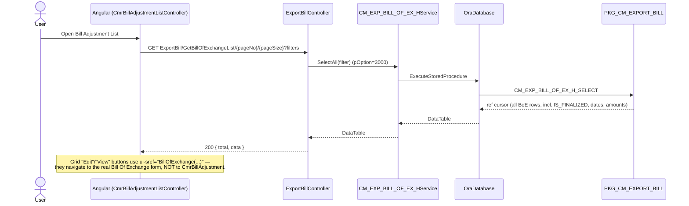
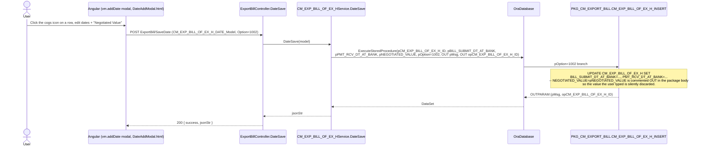
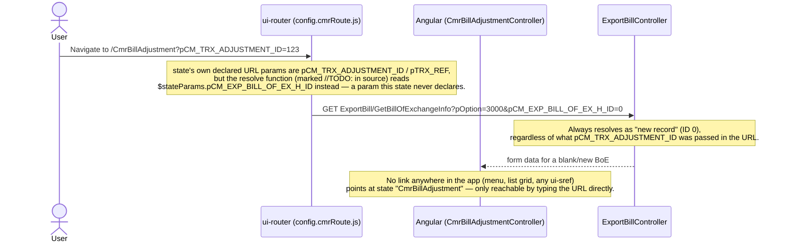

# Feature: Bill Adjustment (Not Used)

```yaml
---
id: feat:commercial-cmr-bill-adjustment
module: commercial
http: GET /api/cmr/ExportBill/GetBillOfExchangeList/{pageNo}/{pageSize} | POST /api/cmr/ExportBill/SaveDate | GET /api/cmr/ExportBill/GetBillOfExchangeInfo | POST /api/cmr/ExportBill/SaveBOE | POST /api/cmr/ExportBill/SaveAdvBOE
mvc: CmrController.CmrBillAdjustment
api: [GET api/cmr/ExportBill/GetBillOfExchangeList/{pageNo}/{pageSize} -> ExportBillController.GetBillOfExchangeList, POST api/cmr/ExportBill/SaveDate -> ExportBillController.DateSave, GET api/cmr/ExportBill/GetBillOfExchangeInfo -> ExportBillController.GetBillOfExchangeInfo, POST api/cmr/ExportBill/SaveBOE -> ExportBillController.SaveBOE, POST api/cmr/ExportBill/SaveAdvBOE -> ExportBillController.SaveAdvBOE]
service: ICM_EXP_BILL_OF_EX_HService / CM_EXP_BILL_OF_EX_HService
procedure: PKG_CM_EXPORT_BILL.CM_EXP_BILL_OF_EX_H_SELECT | CM_EXP_BILL_OF_EX_H_INSERT
pOption: "H_SELECT: 3000 list feed (same as Bill Of Exchange list), 3001 single-record info. H_INSERT: 1002 is the only path this screen's own UI reliably reaches — updates BILL_SUBMIT_DT_AT_BANK/PMT_RCV_DT_AT_BANK only; the NEGOTIATED_VALUE update statement in this branch is commented out in the package body, so that field never persists despite being editable in the UI. 1000 (draft/update) and 1001 (finalize + post GL voucher) exist in the procedure and in copied Angular code but are not reachable through this screen's actual navigation — see Gaps."
tables: [CM_EXP_BILL_OF_EX_H]
models: [CM_EXP_BILL_OF_EX_HFilterModel, CM_EXP_BILL_OF_EX_H_DATE_Model, CM_EXP_BILL_OF_EX_HModel]
session: []
upstream: [feat:cm-bill-of-exchange]
downstream: []
status: inferred
---
```

Every fact below is **source-inferred** from the C#/Angular/`.sql` package-body code — there is no
live database connection for this task, so nothing here is "DB-verified."

## Purpose

"Bill Adjustment (Not Used)" is a partial, forked duplicate of the "Bill Of Exchange" screen
(`docs/features/commercial-bill-of-exchange.md`). It is **not** a pure dead stub — the MVC layer
is empty wrapper code (matching the earlier pass's finding), but the Angular layer underneath
does call real, working API/BLL/package code. In practice, only a narrow slice of it actually
works: the list grid (identical data feed to the real Bill Of Exchange list) and a "manage bill
submit / payment-received date" popup that edits two real date columns on
`CM_EXP_BILL_OF_EX_H`. Everything else — the dedicated "Bill Adjustment" entry form, and the
"Negotiated Value" input on that same popup — is either unreachable or silently a no-op. See
Gaps for exactly why "(Not Used)" is a reasonable, if slightly imprecise, label.

## Entry

| Kind | Value |
|---|---|
| Menu / MVC URL | `CmrController.CmrBillAdjustment()` — permission-checked empty `View()` shell (`src/ERPSolution/Areas/Commercial/Controllers/CmrController.cs:484-497`) |
| Angular state (list) | `CmrBillAdjustmentList` → `url: '/CmrBillAdjustmentList'`, `CmrBillAdjustmentListController`, view `/Commercial/Cmr/_CmrBillAdjustmentList` |
| Angular state (form) | `CmrBillAdjustment` → `url: '/CmrBillAdjustment?pCM_TRX_ADJUSTMENT_ID=&pTRX_REF='`, `CmrBillAdjustmentController`, view `/Commercial/Cmr/_CmrBillAdjustment` |
| Angular files | `src/ERPSolution/Areas/Commercial/Client/app/controllers/CmrBillAdjustmentListController.js`, `CmrBillAdjustmentController.js` |
| Route config | `src/ERPSolution/Areas/Commercial/Client/app/config.cmrRoute.js` (states `CmrBillAdjustmentList` ~line 1013-1022, `CmrBillAdjustment` ~line 1023-1046) |
| API (list feed) | `GET api/cmr/ExportBill/GetBillOfExchangeList/{pageNo}/{pageSize}` — the exact same endpoint used by the real `BillOfExchangeList` screen |
| API (date/value edit) | `POST api/cmr/ExportBill/SaveDate` (C# method name `DateSave`, model `CM_EXP_BILL_OF_EX_H_DATE_Model`) |
| API (form resolve, form only) | `GET api/cmr/ExportBill/GetBillOfExchangeInfo?pOption=3000&pCM_EXP_BILL_OF_EX_H_ID=` |
| API (form save, form only) | `POST api/cmr/ExportBill/SaveBOE`, `POST api/cmr/ExportBill/SaveAdvBOE` — same actions the real Bill Of Exchange form uses |

## Execution

### List (works, reuses the Bill Of Exchange feed)



### "Manage Bill Submit Date and Payment Received" popup (partially works)



### "Bill Adjustment" entry form (orphaned / unreachable in edit mode)



## C# map

| Layer | Type | Path |
|---|---|---|
| MVC (empty shell) | `CmrController` | `src/ERPSolution/Areas/Commercial/Controllers/CmrController.cs` (`CmrBillAdjustment`, `_CmrBillAdjustmentList`, `_CmrBillAdjustment`, lines 484-497) |
| API | `ExportBillController` (shared, not dedicated to this feature) | `src/ERPSolution/Areas/Commercial/Api/ExportBillController.cs` |
| Service | `ICM_EXP_BILL_OF_EX_HService` / `CM_EXP_BILL_OF_EX_HService` | `src/ERP.BLL/Commercials/CM_EXP_BILL_OF_EX_HService.cs` |
| Model (list filter) | `CM_EXP_BILL_OF_EX_HFilterModel` | `src/ERP.Model/Commercial/CM_EXP_BILL_OF_EX_HModel.cs` |
| Model (date/value edit) | `CM_EXP_BILL_OF_EX_H_DATE_Model` (`CM_EXP_BILL_OF_EX_H_ID`, `BILL_SUBMIT_DT_AT_BANK`, `PMT_RCV_DT_AT_BANK`, `NEGOTIATED_VALUE`, `Option`) | `src/ERP.Model/Commercial/CM_EXP_BILL_OF_EX_HModel.cs:121-128` |
| Model (form save, form only) | `CM_EXP_BILL_OF_EX_HModel` | `src/ERP.Model/Commercial/CM_EXP_BILL_OF_EX_HModel.cs` |
| Package | `PKG_CM_EXPORT_BILL` | `src/ERPSolution/oracle/packages/PKG_CM_EXPORT_BILL.sql` |

### Controller actions actually exercised by this screen

| Action | Route | Calls | Reachable from this screen? |
|---|---|---|---|
| `GetBillOfExchangeList` | `GET ExportBill/GetBillOfExchangeList/{pageNo}/{pageSize}` | `CM_EXP_BILL_OF_EX_HService.SelectAll` → `CM_EXP_BILL_OF_EX_H_SELECT` (pOption 3000) | Yes — the list grid |
| `DateSave` | `POST ExportBill/SaveDate` | `CM_EXP_BILL_OF_EX_HService.DateSave` → `CM_EXP_BILL_OF_EX_H_INSERT` (pOption 1002) | Yes — the cogs-icon popup |
| `GetBillOfExchangeInfo` | `GET ExportBill/GetBillOfExchangeInfo` | `CM_EXP_BILL_OF_EX_HService.Select` → `CM_EXP_BILL_OF_EX_H_SELECT` (pOption 3001) | Only if the `CmrBillAdjustment` state is opened directly by URL (see Gaps) |
| `SaveBOE` / `SaveAdvBOE` | `POST ExportBill/SaveBOE` / `SaveAdvBOE` | Same procedures as the real Bill Of Exchange form (documented in `commercial-bill-of-exchange.md`) | Only if the `CmrBillAdjustment` form is opened directly by URL — but its own resolve bug means it always opens in "new record" mode, so these would create a new BoE rather than adjust an existing one |

`CmrBillAdjustmentController.js` (1508 lines) is confirmed, by diffing against `BillOfExchangeController.js` (1484 lines), to be an earlier fork of that file with the same structure, same `kendo.data.DataSource` wiring, and the same save calls (`/ExportBill/SaveBOE`, `/ExportBill/SaveAdvBOE`) — missing only some later additions to the real screen (BoE forwarding distributions, payment-term dropdown, an auto-generate flag). It even still carries the real Bill Of Exchange screen's menu id (`CURRENT_MENU: 478`) sent as `CURRENT_MENU_ID` on save, rather than a Bill-Adjustment-specific menu id — left over from the copy.

## Oracle

| Item | Value |
|---|---|
| Package | `PKG_CM_EXPORT_BILL` |
| Select | `CM_EXP_BILL_OF_EX_H_SELECT` — pOption 3000 (list, same shape as Bill Of Exchange list), pOption 3001 (single record, used only by the orphaned form) |
| Insert/Update (date edit) | `CM_EXP_BILL_OF_EX_H_INSERT`, pOption=1002 branch (`src/ERPSolution/oracle/packages/PKG_CM_EXPORT_BILL.sql:2778-2791`): `UPDATE CM_EXP_BILL_OF_EX_H SET BILL_SUBMIT_DT_AT_BANK=pBILL_SUBMIT_DT_AT_BANK, PMT_RCV_DT_AT_BANK=pPMT_RCV_DT_AT_BANK WHERE CM_EXP_BILL_OF_EX_H_ID=pCM_EXP_BILL_OF_EX_H_ID` — the line `--NEGOTIATED_VALUE=pNEGOTIATED_VALUE` is commented out in the procedure body, confirmed by reading the branch directly |
| Insert/Update (form, unreachable in practice) | Same procedure's pOption=1000 (draft/update) and pOption=1001 (finalize + `PKG_ACCOUNTING` GL voucher post) branches exist and are fully functional (documented in `commercial-bill-of-exchange.md`), but nothing in this screen's actual navigation reaches them with a real existing record — see Gaps |
| Main table | `CM_EXP_BILL_OF_EX_H` |
| Related tables (form only, if reached) | `CM_EXP_BILL_OF_EX_D`, `CM_EXP_BILL_OF_EX_PI_PO_REF`, `CM_EXP_BOE_ADV_BILL_COLL` — all documented already under `commercial-bill-of-exchange.md`, not re-derived here since this screen's form path is not reliably reachable |

## Request / response

**In (GetBillOfExchangeList):** paging + filter params (company, LC, buyer, date range, finalized flag, etc.) — identical shape to the Bill Of Exchange list.
**In (SaveDate):** `CM_EXP_BILL_OF_EX_H_DATE_Model` body — `CM_EXP_BILL_OF_EX_H_ID`, `BILL_SUBMIT_DT_AT_BANK`, `PMT_RCV_DT_AT_BANK`, `NEGOTIATED_VALUE` (accepted, sent to the procedure, but not persisted — see Known Issues), `Option` (always `1002` from this screen).
**Out (GetBillOfExchangeList):** `{ total, data }`.
**Out (SaveDate):** `{ success, jsonStr }` — `jsonStr` built from the procedure's `OUTPARAM` table (`pMsg`, `opCM_EXP_BILL_OF_EX_H_ID`); Angular reads `res.data.PMSG`.

## Tables / columns touched

Reconstructed from the pOption=1002 branch and the list `SELECT` in `PKG_CM_EXPORT_BILL.sql` (no
DDL in repo — source-inferred, not DB-verified). Full column reconstruction for
`CM_EXP_BILL_OF_EX_H` already lives in `docs/features/commercial-bill-of-exchange.md`; only the
columns this screen actually touches are called out again here:

`CM_EXP_BILL_OF_EX_H`: `CM_EXP_BILL_OF_EX_H_ID` (PK, filter key), `BILL_SUBMIT_DT_AT_BANK` (written by this screen), `PMT_RCV_DT_AT_BANK` (written by this screen), `NEGOTIATED_VALUE` (accepted from the UI but **not** written — see Known Issues), `IS_FINALIZED`, `BILL_OF_EX_NO`, `BILL_OF_EX_AMT`, and the other list-grid columns already documented on the sibling feature.

FKs / relationships: none beyond what `commercial-bill-of-exchange.md` already documents for
`CM_EXP_BILL_OF_EX_H` — this screen adds no new relationship, it only re-exposes a subset of the
same table.

## Permissions / session

- MVC-level `IsMenuPermission()` check on `CmrController.CmrBillAdjustment()`, matching the pattern
  used by every other Commercial menu shell.
- No dedicated session key read for this feature specifically; `ExportBillController` actions
  follow whatever session/permission rules are documented for the Bill Of Exchange feature.

## Dependencies (other features)

- **Upstream / really-the-same-table-as:** `commercial-bill-of-exchange` (`CM_EXP_BILL_OF_EX_H`) —
  this screen is not an independent feature; it is a partial, forked front end over the same
  header table and largely the same API controller (`ExportBillController`).
- **No confirmed independent downstream consumer** — nothing else in the codebase reads or writes
  through this screen's own state/controller pair; any real effect (the date-edit) lands in the
  same table the Bill Of Exchange feature already owns.

## Gaps

- No live database connection was available for this pass — every fact above is source-inferred
  (static analysis of the C#, Angular, and `.sql` package body), never "DB-verified."
- **Correcting the earlier pass's stub conclusion:** grepping only `.cs` files made the MVC layer
  look like the entire feature (permission check + empty `View()`/`PartialView()`), which is
  accurate as far as it goes, but the Angular controllers underneath (`CmrBillAdjustmentListController.js`,
  `CmrBillAdjustmentController.js`) do call real, working `ExportBillController` endpoints backed
  by real `PKG_CM_EXPORT_BILL` procedures against the real `CM_EXP_BILL_OF_EX_H` table. So
  "Not Used" is **not fully accurate** — the list and its date-edit popup work — but it is also
  **not a fully-built independent feature**: it is a thin, partly-broken duplicate of the Bill Of
  Exchange screen, not a distinct "Bill Adjustment" concept with its own data model.
- **The dedicated entry form (`CmrBillAdjustment` state) is effectively orphaned:**
  1. Nothing in the app (menu, the list grid's own Edit/View buttons, or any other screen) creates
     a `ui-sref="CmrBillAdjustment(...)"` link to it — the list's own Edit/View buttons instead
     link to `ui-sref="BillOfExchange(...)"`, the real screen. It is reachable only by typing the
     URL directly.
  2. Even then, its `resolve` function in `config.cmrRoute.js` (~line 1031-1044, marked `//TODO:`
     in the source) checks `$stateParams.pCM_TRX_ADJUSTMENT_ID` — the state's own declared URL
     param — but then fetches using `$stateParams.pCM_EXP_BILL_OF_EX_H_ID`, a parameter this state
     never declares in its `url:` string. That value is always `undefined`, so the resolve always
     falls back to `|| 0` and loads a blank "new record" form, never the record the URL was
     supposedly pointing at. Saving from this form would use `SaveBOE`/`SaveAdvBOE` (real,
     functional procedures) but would create a **new** Bill Of Exchange row rather than adjust an
     existing one — the opposite of what "Bill Adjustment" implies.
- **`CmrBillAdjustmentController.js` is a stale fork of `BillOfExchangeController.js`**, missing
  later additions to the real screen (BoE forwarding-distribution UI, payment-term dropdown, the
  `canBoEAutoGenerate` system-parameter check) — confirmed by a line-by-line diff of both files
  after normalizing identifier names.
- `PAYMENT_RECEIVE`-style reuse pattern check: unlike the sibling "Margin Closing" screen (which
  reuses `PaymentReceiveController.GetAll`), this feature does not reuse `PaymentReceiveController`
  at all — it reuses `ExportBillController` instead, effectively duplicating the Bill Of Exchange
  screen rather than the Payment Receive screen.

## Known Issues

- **"Negotiated Value" field is a confirmed silent no-op.** The `DateAddModal.html` popup (both
  copies of it, in `CmrBillAdjustmentListController.js` and again inside
  `CmrBillAdjustmentController.js`) presents an editable "Negotiated Value" input
  (`vm.oncngnegotiated`, validated against `BILL_OF_EX_AMT`), sends it to the server as
  `NEGOTIATED_VALUE` in `CM_EXP_BILL_OF_EX_H_DATE_Model`, and the C#/BLL layer faithfully passes it
  through as `pNEGOTIATED_VALUE` — but `PKG_CM_EXPORT_BILL.CM_EXP_BILL_OF_EX_H_INSERT`'s pOption=1002
  branch has the corresponding `UPDATE` column commented out
  (`--NEGOTIATED_VALUE=pNEGOTIATED_VALUE`). The user sees a success toast (`pMsg` still returns a
  success code) with no indication the value they typed was discarded.
- **Entry form is unreachable in a meaningful edit mode** — see Gaps above; this is the main reason
  "(Not Used)" is a defensible label for the menu even though real code paths exist underneath.
- **Duplicated, drifting logic**: maintaining a second, older copy of the Bill Of Exchange
  controller (`CmrBillAdjustmentController.js`) risks the two forms silently diverging further
  over time (as they already have) with no compiler/build-time link between them.
- **Menu-id leakage from the copy-paste**: the form's save payload always sends
  `CURRENT_MENU_ID: 478` (the real Bill Of Exchange screen's menu constant), not an id specific to
  Bill Adjustment — harmless while the form is unreachable, but would misattribute any audit/menu
  tracking tied to `CURRENT_MENU_ID` if the form were ever wired up correctly.

## Unused Columns

Not independently verified with a full Angular-grid-to-SELECT-projection audit; this screen
touches only a subset of `CM_EXP_BILL_OF_EX_H`, whose full column reconstruction lives in
`docs/features/commercial-bill-of-exchange.md`. The one column-level finding specific to this
screen is `NEGOTIATED_VALUE`, which is read from the client and passed all the way to the
procedure boundary but never actually written (see Known Issues) — not "unused" in the schema
sense, but effectively dead on this write path.
