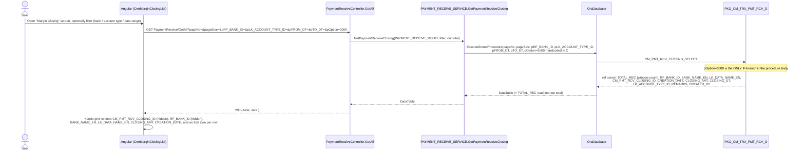

# Feature: Margin Closing (labeled "Not Used" in sidebar)

```yaml
---
id: feat:commercial-cmr-margin-closing
module: commercial
http: GET /api/cmr/PaymentReceive/GetAll
mvc: CmrController.CmrMarginClosing
api: [GET api/cmr/PaymentReceive/GetAll -> PaymentReceiveController.GetAll]
service: IPAYMENT_RECEIVE_SERVICE.GetPaymentReceiveClosing / PAYMENT_RECEIVE_SERVICE.GetPaymentReceiveClosing
procedure: PKG_CM_TRX_PMT_RCV_D.CM_PMT_RCV_CLOSING_SELECT
pOption: "CM_PMT_RCV_CLOSING_SELECT: 3000 is the only branch defined in the package body (list grid, filterable by bank/account-type/date range). The C# service always sends 3000 regardless of what the Angular client sends. No pOption exists for insert/update/delete of CM_PMT_RCV_CLOSING anywhere in the repo."
tables: [CM_PMT_RCV_CLOSING, RF_BANK, LOOKUP_DATA]
models: [PAYMENT_RECEIVE_MODEL]
session: []
upstream: []
downstream: []
status: inferred
---
```

Every fact below is **source-inferred** from the C# controller/service code, the
`PKG_CM_TRX_PMT_RCV_D` package body, and the Angular client file — there is no live database
connection for this task, so nothing here is "DB-verified."

## Purpose

A read-only grid of "margin closing" records against payment receipts — one row per
`CM_PMT_RCV_CLOSING` record, showing which bank, what account type (a lookup), the closing
amount, and when it was created. The user can filter by bank and account type and a
created-date range. An "Edit" action icon is rendered on every row, but (see Execution/Gaps)
it does not do anything — there is no working edit/save path anywhere in the traced code.

## Entry

| Kind | Value |
|---|---|
| Menu / sidebar id | "Margin Closing (Not Used)" — Commercial ▸ CM Payment Receive ▸ Margin Closing |
| MVC URL | `CmrController.CmrMarginClosing()` (permission-checked, empty `View()`) |
| Razor partial | `CmrController._CmrMarginClosingList()` (empty `PartialView()`), view `/Commercial/Cmr/_CmrMarginClosingList` |
| Angular state | `CmrMarginClosingList` → `url: '/CmrMarginClosingList'`, controller `CmrMarginClosingList`, `controllerAs: 'vm'` (`src/ERPSolution/Areas/Commercial/Client/app/config.cmrRoute.js`, ~line 1047-1056) |
| Angular file | `src/ERPSolution/Areas/Commercial/Client/app/controllers/CmrMarginClosingList.js` |
| API (list feed) | `GET /PaymentReceive/GetAll?pageNo=&pageSize=&pRF_BANK_ID=&pLK_ACCOUNT_TYPE_ID=&pFROM_DT=&pTO_DT=&pOption=3000` on `PaymentReceiveController` — the **same controller/action** used nowhere by the Payment Receives screens (see `docs/features/commercial-cmr-payment-receive.md`) |
| API (edit) | **None found** — see Execution |

## Execution

### List (works)



### Edit (broken — no-op)

```mermaid
sequenceDiagram
  actor User
  participant UI as Angular (CmrMarginClosingList)

  User->>UI: Click the row's Edit icon (ng-click="vm.openEditPaymentReceiveModal(dataItem)")
  Note over UI: vm.openEditPaymentReceiveModal is never assigned anywhere in<br/>CmrMarginClosingList.js, and no other file in the repo defines it either
  UI-->>User: Nothing happens (Angular throws "vm.openEditPaymentReceiveModal is not a function"<br/>in the browser console; no modal, no API call is ever made)
```

There is no Save/Update/Delete procedure for `CM_PMT_RCV_CLOSING` anywhere in the repo —
`CM_PMT_RCV_CLOSING_SELECT` is the only procedure referencing that table in any `.sql` package
file, and grepping the whole `src` tree for `CM_PMT_RCV_CLOSING` turns up only
`CmrMarginClosingList.js` (client) and `PAYMENT_RECEIVE_SERVICE.cs` (the read path). Even if the
modal function existed, there is nothing on the server side for it to call.

## C# map

| Layer | Type | Path |
|---|---|---|
| MVC (menu/permission shell only) | `CmrController` | `src/ERPSolution/Areas/Commercial/Controllers/CmrController.cs` (`CmrMarginClosing`, `_CmrMarginClosingList`, ~line 499-507) |
| API | `PaymentReceiveController.GetAll` | `src/ERPSolution/Areas/Commercial/Api/PaymentReceiveController.cs` (shared controller — see `commercial-cmr-payment-receive.md`) |
| Service | `IPAYMENT_RECEIVE_SERVICE` / `PAYMENT_RECEIVE_SERVICE` | `src/ERP.BLL/Commercials/IPAYMENT_RECEIVE_SERVICE.cs`, `PAYMENT_RECEIVE_SERVICE.cs` (`GetPaymentReceiveClosing`, lines 20-50) |
| Model (filter/DTO) | `PAYMENT_RECEIVE_MODEL` | `src/ERP.Model/PAYMENT_RECEIVE_MODEL.cs` |
| Package | `PKG_CM_TRX_PMT_RCV_D` | `src/ERPSolution/oracle/packages/PKG_CM_TRX_PMT_RCV_D.sql` (`CM_PMT_RCV_CLOSING_SELECT`, lines 7-11 spec / 98-132 body) |

## Oracle

| Item | Value |
|---|---|
| Package | `PKG_CM_TRX_PMT_RCV_D` |
| Procedure | `CM_PMT_RCV_CLOSING_SELECT` |
| `pOption` | `3000` only (the sole `IF` branch in the body); the C# service hardcodes `pOption=3000` in its `CommandParameter` list regardless of the `Option` value received from the client (`vm.form.Option \|\| 3000` in Angular, itself always `3000` since `vm.form.Option` is never set) |
| Main table | `CM_PMT_RCV_CLOSING` |
| Joined tables | `RF_BANK` (bank name), `LOOKUP_DATA` (account-type label via `LK_ACCOUNT_TYPE_ID`) |
| Filters | `pRF_BANK_ID` (0/null = all), `pLK_ACCOUNT_TYPE_ID` (0/null = all), `pFROM_DT`/`pTO_DT` range on `TRUNC(PRC.CREATION_DATE)` (both must be supplied or the date filter is skipped entirely) |
| Paging | `OFFSET (pageNo-1)*pageSize ROWS FETCH NEXT pageSize ROWS ONLY`, with `COUNT(*) OVER()` as `TOTAL_REC` for the grid's total |
| Write path | **None** — no INSERT/UPDATE/DELETE procedure for `CM_PMT_RCV_CLOSING` exists in this package or any other `.sql` file in the repo |

## Request / response

**In (GetAll):** `pageNo`, `pageSize`, `pRF_BANK_ID` (nullable), `pLK_ACCOUNT_TYPE_ID` (nullable),
`pFROM_DT`/`pTO_DT` (nullable), `pOption` (accepted by the C# method signature but never forwarded
to the procedure call — the service always sends `1000`... actually `3000`, hardcoded).
**Out:** `{ total, data }` where `data` is the raw `CM_PMT_RCV_CLOSING_SELECT` cursor as JSON rows.

## Tables / columns touched

Reconstructed from the fullest `SELECT` in `PKG_CM_TRX_PMT_RCV_D.CM_PMT_RCV_CLOSING_SELECT`
(no DDL in repo — source-inferred, not DB-verified).

`CM_PMT_RCV_CLOSING`: `CM_PMT_RCV_CLOSING_ID` (PK, read-only in this flow), `RF_BANK_ID` (FK),
`LK_ACCOUNT_TYPE_ID` (FK to `LOOKUP_DATA.LOOKUP_DATA_ID`), `CLOSING_AMT`, `CLOSING_DT`,
`CREATION_DATE`, `REMARKS`, `CREATED_BY`.

FKs / relationships (source-inferred from JOIN evidence, not a live catalog):
- `CM_PMT_RCV_CLOSING.RF_BANK_ID → RF_BANK.RF_BANK_ID` (bank name lookup).
- `CM_PMT_RCV_CLOSING.LK_ACCOUNT_TYPE_ID → LOOKUP_DATA.LOOKUP_DATA_ID` (account-type label;
  Angular's own account-type dropdown loads lookup category `246` via
  `commonDataService.getLookupList(246)`, which is a strong signal — not proven — that
  `LK_ACCOUNT_TYPE_ID` values are drawn from that same lookup category).
- No FK relationship to `CM_EXP_BILL_OF_EX_H`/`CM_EXP_BILL_OF_EX_RCV` (the Payment Receives
  tables) was found in this procedure's SELECT — `CM_PMT_RCV_CLOSING` is queried independently,
  with no join back to the Bill Of Exchange chain.

## Permissions / session

- MVC action `CmrMarginClosing()` calls `IsMenuPermission()` before returning the shell view
  (same permission-gate pattern as other Commercial menus); the API action itself,
  `PaymentReceiveController.GetAll`, is only protected by the controller-level `[Authorize]`
  attribute (no extra menu-permission re-check at the API layer, consistent with the rest of this
  controller).
- No `Session["multiScUserId"]`/`CREATED_BY` write was found — `CREATED_BY` is only ever *read*
  by the SELECT, never populated by any traced code path (there is no insert path at all).

## Dependencies (other features)

- **Shares its only backing endpoint with Payment Receives**: `PaymentReceiveController.GetAll`
  lives on the same controller as `commercial-cmr-payment-receive.md`'s actions
  (`GetCmExpBillOfExRcv`, `GetPmtRcvFormData`, `Save`, `DeleteBoE`), but is never called by either
  of that feature's Angular states (`CmrPaymentReceiveList`/`CmrPaymentReceive`) — it exists on
  that controller purely as a convenient home for this unrelated query. The two features do not
  share tables, joins, or any data relationship beyond living in the same C# class.
- No other screen or report was found referencing `CM_PMT_RCV_CLOSING`.

## Gaps

- No live database connection was available for this pass — every fact above is source-inferred
  (static analysis of the C#, Angular, and `.sql` package body), never "DB-verified"; no DDL
  exists in the repo to cross-check `CM_PMT_RCV_CLOSING`'s column list, PK, or FKs against.
- **Is "(Not Used)" accurate?** Partially, and in a specific way — not a blanket dead stub:
  - The **list/read is real and functional as written**: a registered Angular state, a genuine
    Kendo grid wired to a real API call, a real service method, and a real Oracle procedure
    (`CM_PMT_RCV_CLOSING_SELECT`, pOption 3000) that queries an actual table (`CM_PMT_RCV_CLOSING`)
    joined to `RF_BANK` and `LOOKUP_DATA`. This contradicts an earlier pass's assumption (made from
    grepping only the `.cs` MVC controller, which is just a permission-check + empty
    `View()`/`PartialView()` wrapper) that the screen had no backing API/service/table at all.
  - The **edit/save path is genuinely broken**: the grid's Edit button calls
    `vm.openEditPaymentReceiveModal(dataItem)`, which is referenced only once in the entire repo
    (the `ng-click` in this same file) and is never assigned to `vm` anywhere — not in this
    controller, not on `$scope`/`$rootScope`, not in any other file. Clicking Edit does nothing
    observable to the user (Angular throws a "not a function" console error; no modal opens, no
    HTTP request is made). Separately, even if a modal existed, there is no
    insert/update/delete procedure for `CM_PMT_RCV_CLOSING` in any `.sql` package in the repo, so a
    save could not be wired up to the database as things stand.
  - Net: this is a **working, filterable, read-only list screen whose only interactive action
    (Edit) is dead**, not a fully alive screen and not a fully dead stub. The "(Not Used)" sidebar
    label most plausibly refers to the edit/manage capability the screen visually promises but
    does not deliver, which is consistent with what was found here.
- The C# method parameter `pOption` on `GetAll` is accepted but effectively decorative: the
  service hardcodes `pOption=3000` in its own `CommandParameter` list rather than forwarding the
  caller's value, and the Angular client's own `pOption` is always `3000` anyway
  (`vm.form.Option` is never set by any code in `CmrMarginClosingList.js`) — so no other branch of
  `CM_PMT_RCV_CLOSING_SELECT` is reachable from this UI even in principle, and none other is
  defined in the package body regardless.
- `PAYMENT_RECEIVE_MODEL.cs` doubles as the filter DTO for this screen; it is documented as
  out-of-scope filler in `commercial-cmr-payment-receive.md` — this doc is its actual owner.

## Known Issues

- **Edit action is a dead UI reference**: `ng-click="vm.openEditPaymentReceiveModal(dataItem)"`
  (`CmrMarginClosingList.js:78`) has no corresponding function anywhere in the codebase. This is
  the central finding of this pass — the screen looks interactive (an edit icon on every row) but
  is not.
- **No write/save capability exists at any layer** for `CM_PMT_RCV_CLOSING` — no C# service
  method, no Oracle procedure. Even a correctly-wired modal would have nothing to call.
- **`pOption` plumbing is dead flexibility**: both the API signature and the stored procedure
  accept a `pOption` parameter, but only one value (`3000`) is ever sent or handled anywhere in
  the traced chain — see Gaps.
- **Shared-controller confusion carried over from Payment Receives**: this action lives on
  `PaymentReceiveController`, which invites the (wrong) assumption that it's part of the Payment
  Receives feature; it isn't — no shared table, no shared join.

## Unused Columns

Not independently verified with a full Angular-grid-to-SELECT-projection audit. From what was
read: the grid's visible/hidden columns (`CM_PMT_RCV_CLOSING_ID`, `RF_BANK_ID`, `BANK_NAME_EN`,
`LK_DATA_NAME_EN`, `CLOSING_AMT`, `CREATION_DATE`) are all present in the SELECT and consumed by
the grid. Two columns are selected by the procedure but **not present in the Angular grid's
column list at all**: `CLOSING_DT`, `REMARKS`, and `CREATED_BY` (three columns) — they are
returned in every response but never rendered, filtered, or referenced anywhere in
`CmrMarginClosingList.js`. Confidence: source-inferred from this one file only, not a
whole-app search for a hidden consumer of those fields.
