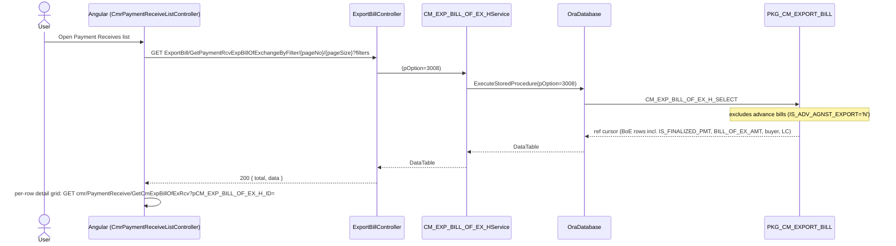
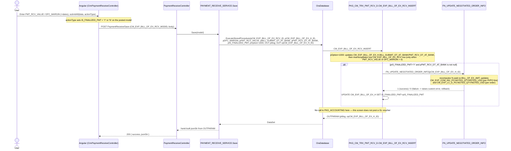
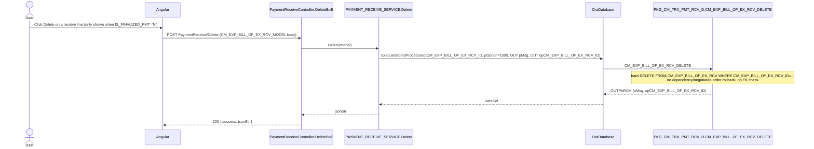

# Feature: Payment Receives (CM Payment Receive)

```yaml
---
id: feat:commercial-cmr-payment-receive
module: commercial
http: GET /api/cmr/PaymentReceive/GetAll | GET /api/cmr/PaymentReceive/GetCmExpBillOfExRcv | GET /api/cmr/PaymentReceive/GetPmtRcvFormData | POST /api/cmr/PaymentReceive/Save | POST /api/cmr/PaymentReceive/Delete | GET /api/cmr/ExportBill/GetPaymentRcvExpBillOfExchangeByFilter
mvc: CmrController.CmrPaymentReceive
api: [GET api/cmr/ExportBill/GetPaymentRcvExpBillOfExchangeByFilter/{pageNo}/{pageSize} -> ExportBillController.GetPaymentRcvExpBillOfExchangeByFilter, GET api/cmr/PaymentReceive/GetCmExpBillOfExRcv -> PaymentReceiveController.GetCmExpBillOfExRcv, GET api/cmr/PaymentReceive/GetPmtRcvFormData -> PaymentReceiveController.GetPmtRcvFormData, POST api/cmr/PaymentReceive/Save -> PaymentReceiveController.Save, POST api/cmr/PaymentReceive/Delete -> PaymentReceiveController.DeleteBoE]
service: IPAYMENT_RECEIVE_SERVICE / PAYMENT_RECEIVE_SERVICE
procedure: PKG_CM_TRX_PMT_RCV_D.CM_EXP_BILL_OF_EX_RCV_SELECT | CM_EXP_BILL_OF_EX_RCV_INSERT | CM_EXP_BILL_OF_EX_RCV_DELETE | FN_UPDATE_NEGOTIATED_ORDER_INFO | PKG_CM_EXPORT_BILL.CM_EXP_BILL_OF_EX_H_SELECT
pOption: "CM_EXP_BILL_OF_EX_RCV_SELECT: 3000 receive-lines-for-a-BoE grid, 3001 BoE header info for the entry form. CM_EXP_BILL_OF_EX_RCV_INSERT: 1000 insert/update a receive line + update BoE header dates, always also runs the finalize branch when pIS_FINALIZED_PMT='Y'. CM_EXP_BILL_OF_EX_RCV_DELETE: 1000 hard delete (parameter checked, but only 1000 is ever sent). CM_EXP_BILL_OF_EX_H_SELECT: 3008 list feed."
tables: [CM_EXP_BILL_OF_EX_RCV, CM_EXP_BILL_OF_EX_H, CM_EXP_COM_INV_PO, CM_EXP_LC_D_PO]
models: [CM_EXP_BILL_OF_EX_RCV_MODEL, PAYMENT_RECEIVE_MODEL]
session: []
upstream: [feat:cm-bill-of-exchange]
downstream: []
status: inferred
---
```

Every fact below is **source-inferred** from the C# controller/service/model code and the
`PKG_CM_TRX_PMT_RCV_D` package body — there is no live database connection for this task, so
nothing here is "DB-verified."

## Purpose

Records the buyer's bank actually paying money back against a finalized Bill Of Exchange
(`CM_EXP_BILL_OF_EX_H`, documented in `docs/features/commercial-bill-of-exchange.md`). The user
opens the "Payment Receives" list (fed from the BoE header, filtered to bills eligible for
payment receive), picks a BoE, and records one or more receive lines — a payment-received value
and a "DFC Margin" amount, each optionally dated at the bank. Marking a line's finalize flag
`Y` (an "IS_FINALIZED_PMT" toggle passed with the save) also recomputes the negotiated
qty/USD figures on the underlying sales order rows so downstream order-negotiation tracking
stays in sync with how much of the bill has actually been collected. This is **not** a GL-posting
screen — unlike Bank Bill Collection and Cash Incentive finalize, no accounting voucher is built
or posted here (see Execution / Gaps).

## Entry

| Kind | Value |
|---|---|
| Menu / sidebar id | `cmr-payment-receive` (Commercial ▸ CM Payment Receive ▸ Payment Receives) |
| Angular state (list) | `CmrPaymentReceiveList` → `url: '/CmrPaymentReceiveList'`, `CmrPaymentReceiveListController`, view `/Commercial/Cmr/_CmrPaymentReceiveList` |
| Angular state (form) | `CmrPaymentReceive` → `url: '/CmrPaymentReceive?pCM_EXP_BILL_OF_EX_H_ID'`, `CmrPaymentReceiveController`, view `/Commercial/Cmr/_CmrPaymentReceive` |
| Angular files | `src/ERPSolution/Areas/Commercial/Client/app/controllers/CmrPaymentReceiveListController.js`, `CmrPaymentReceiveController.js` |
| Route config | `src/ERPSolution/Areas/Commercial/Client/app/config.cmrRoute.js` (states `CmrPaymentReceiveList` / `CmrPaymentReceive`, ~line 980-1010) |
| API (list feed) | `GET api/cmr/ExportBill/GetPaymentRcvExpBillOfExchangeByFilter/{pageNo}/{pageSize}` (on `ExportBillController`, not this controller — see Gaps) |
| API (receive lines for a BoE) | `GET api/cmr/PaymentReceive/GetCmExpBillOfExRcv?pCM_EXP_BILL_OF_EX_H_ID=` |
| API (form resolve) | `GET api/cmr/PaymentReceive/GetPmtRcvFormData?pCM_EXP_BILL_OF_EX_H_ID=` (Angular `resolve` on the `CmrPaymentReceive` state) |
| API (save) | `POST api/cmr/PaymentReceive/Save`, model `CM_EXP_BILL_OF_EX_RCV_MODEL` |
| API (delete) | `POST api/cmr/PaymentReceive/Delete` (method name `DeleteBoE`, route stays `Delete`) |

## Execution

### List



### Open form / load existing receive lines

```mermaid
sequenceDiagram
  actor User
  participant UI as Angular (CmrPaymentReceiveController)
  participant API as PaymentReceiveController
  participant Svc as PAYMENT_RECEIVE_SERVICE
  participant DB as OraDatabase
  participant PKG as PKG_CM_TRX_PMT_RCV_D

  User->>UI: Click "Manage Payment Receive" / "View" on a BoE row
  UI->>API: GET PaymentReceive/GetPmtRcvFormData?pCM_EXP_BILL_OF_EX_H_ID=
  API->>Svc: GetPmtRcvFormData(id)
  Svc->>DB: ExecuteStoredProcedure(pOption=3001)
  DB->>PKG: CM_EXP_BILL_OF_EX_RCV_SELECT
  PKG-->>DB: BoE header row (BILL_OF_EX_NO/AMT, EXP_LCSC_NO, buyer, dates, IS_FINALIZED_PMT, invoice numbers via LISTAGG)
  DB-->>Svc: DataTable
  Svc-->>API: DataTable
  API-->>UI: 200 [row] (Angular resolve; used as vm.form)
  UI->>API: GET PaymentReceive/GetCmExpBillOfExRcv?pCM_EXP_BILL_OF_EX_H_ID=
  API->>Svc: GetCmExpBillOfExRcv(id)
  Svc->>DB: ExecuteStoredProcedure(pOption=3000)
  DB->>PKG: CM_EXP_BILL_OF_EX_RCV_SELECT
  PKG-->>DB: existing CM_EXP_BILL_OF_EX_RCV rows for this BoE
  DB-->>Svc: DataTable
  Svc-->>API: DataTable
  API-->>UI: 200 [rows] (vm.CmExpBillOfExRcv, sums PMT_RCV_VALUE/DFC_MARGIN)
```

### Save (add/edit a receive line, optionally finalize)



### Delete a receive line



## C# map

| Layer | Type | Path |
|---|---|---|
| API | `PaymentReceiveController` | `src/ERPSolution/Areas/Commercial/Api/PaymentReceiveController.cs` |
| Service | `IPAYMENT_RECEIVE_SERVICE` / `PAYMENT_RECEIVE_SERVICE` | `src/ERP.BLL/Commercials/IPAYMENT_RECEIVE_SERVICE.cs`, `PAYMENT_RECEIVE_SERVICE.cs` |
| Model (save/delete body) | `CM_EXP_BILL_OF_EX_RCV_MODEL` | `src/ERP.Model/Commercial/CM_EXP_BILL_OF_EX_RCV_MODEL.cs` |
| Model (list filter, unrelated screen — see Gaps) | `PAYMENT_RECEIVE_MODEL` | `src/ERP.Model/PAYMENT_RECEIVE_MODEL.cs` |
| Package | `PKG_CM_TRX_PMT_RCV_D` | `src/ERPSolution/oracle/packages/PKG_CM_TRX_PMT_RCV_D.sql` |

### Controller actions in scope (this doc only)

| Action | Route | Calls |
|---|---|---|
| `GetCmExpBillOfExRcv` | `GET PaymentReceive/GetCmExpBillOfExRcv` | `PAYMENT_RECEIVE_SERVICE.GetCmExpBillOfExRcv` → `CM_EXP_BILL_OF_EX_RCV_SELECT` (pOption 3000) |
| `GetPmtRcvFormData` | `GET PaymentReceive/GetPmtRcvFormData` | `PAYMENT_RECEIVE_SERVICE.GetPmtRcvFormData` → `CM_EXP_BILL_OF_EX_RCV_SELECT` (pOption 3001) |
| `Save` | `POST PaymentReceive/Save` | `PAYMENT_RECEIVE_SERVICE.Save` → `CM_EXP_BILL_OF_EX_RCV_INSERT` |
| `DeleteBoE` | `POST PaymentReceive/Delete` | `PAYMENT_RECEIVE_SERVICE.Delete` → `CM_EXP_BILL_OF_EX_RCV_DELETE` |

`GetAll` (`GET PaymentReceive/GetAll` → `GetPaymentReceiveClosing` → `PKG_CM_TRX_PMT_RCV_D.CM_PMT_RCV_CLOSING_SELECT`
against table `CM_PMT_RCV_CLOSING`) is **out of scope for this doc** — it is a different feature on
the same controller, consumed by `CmrMarginClosingList.js` (the "Margin Closing" sibling screen),
not by either Payment Receives state. See Gaps.

## Oracle

| Item | Value |
|---|---|
| Package | `PKG_CM_TRX_PMT_RCV_D` |
| Select | `CM_EXP_BILL_OF_EX_RCV_SELECT` — `pOption=3000`: `CM_EXP_BILL_OF_EX_RCV` joined to `CM_EXP_BILL_OF_EX_H` (receive-lines grid for one BoE, or all when `pCM_EXP_BILL_OF_EX_H_ID` is null/0); `pOption=3001`: `CM_EXP_BILL_OF_EX_H` joined to `RF_CURRENCY`, `CM_EXP_LC_H`, `MC_BUYER`, plus a `LISTAGG` subquery over `CM_EXP_BILL_OF_EX_D`/`CM_EXP_COM_INV_H` for the invoice-number list (BoE header info feeding the entry form) |
| Insert/Update/Finalize | `CM_EXP_BILL_OF_EX_RCV_INSERT` — `pOption=1000` only mode implemented: always updates `CM_EXP_BILL_OF_EX_H.BILL_SUBMIT_DT_AT_BANK`/`PMT_RCV_DT_AT_BANK`; inserts a new `CM_EXP_BILL_OF_EX_RCV` row (next val of `CM_EXP_BILL_OF_EX_RCV_SEQ`) when `pCM_EXP_BILL_OF_EX_RCV_ID` is null/≤0, else updates the existing row — but only when `NVL(pPMT_RCV_VALUE,0)>0 OR NVL(pDFC_MARGIN,0)>0`; separately, whenever `pIS_FINALIZED_PMT='Y'` and `pPMT_RCV_DT_AT_BANK` is not null, calls `FN_UPDATE_NEGOTIATED_ORDER_INFO` and then sets `CM_EXP_BILL_OF_EX_H.IS_FINALIZED_PMT` |
| Negotiated-order recompute | `FN_UPDATE_NEGOTIATED_ORDER_INFO(pCM_EXP_BILL_OF_EX_H_ID)` — sums `CM_EXP_BILL_OF_EX_RCV.PMT_RCV_VALUE`/`DFC_MARGIN` for the BoE, computes `pct = payment_rcv / BILL_OF_EX_H.BILL_OF_EX_AMT`, then updates `CM_EXP_COM_INV_PO.NGTED_QTY`/`NGTED_USD` (per PI/PO line, ratio-weighted by `ORDER_QTY`) and `CM_EXP_LC_D_PO.NGTED_QTY`/`NGTED_USD` (aggregated per `MC_ORDER_H_ID`); returns 1 on success, 0 on any exception (caught internally, swallowed) |
| Delete | `CM_EXP_BILL_OF_EX_RCV_DELETE` — `pOption=1000` (only value ever sent) hard-deletes the `CM_EXP_BILL_OF_EX_RCV` row by ID; no check for whether the row's BoE is already finalized, no negotiated-order rollback |
| Main table | `CM_EXP_BILL_OF_EX_RCV` |
| Related tables touched | `CM_EXP_BILL_OF_EX_H` (parent, dates + `IS_FINALIZED_PMT` updated), `CM_EXP_COM_INV_PO`, `CM_EXP_LC_D_PO` (negotiated qty/USD recompute) |
| Accounting integration | **None found.** No call to `PKG_ACCOUNTING.ACC_MASTER_VCH_SAVE4MISC_SRC` or any other `PKG_ACCOUNTING` procedure anywhere in `PKG_CM_TRX_PMT_RCV_D.sql` — confirmed by reading the full package body, not just grepping this file's calls. Unlike Bank Bill Collection and Cash Incentive finalize, "finalizing" a payment receive line only flips `IS_FINALIZED_PMT` flags and recomputes negotiated-order figures; it does not post a GL voucher. |

## Request / response

**In (GetCmExpBillOfExRcv):** `pCM_EXP_BILL_OF_EX_H_ID` (nullable — null/0 returns receive lines for every BoE).
**In (GetPmtRcvFormData):** `pCM_EXP_BILL_OF_EX_H_ID` (required).
**In (Save):** `CM_EXP_BILL_OF_EX_RCV_MODEL` body — `CM_EXP_BILL_OF_EX_H_ID`, `CM_EXP_BILL_OF_EX_RCV_ID` (null for new), `DFC_MARGIN`, `PMT_RCV_VALUE`, `IS_FINALIZED_PMT` ('Y'/'N', set client-side from which button was clicked), `BILL_SUBMIT_DT_AT_BANK`, `PMT_RCV_DT_AT_BANK`.
**In (Delete):** `CM_EXP_BILL_OF_EX_RCV_MODEL` body, effectively only `CM_EXP_BILL_OF_EX_RCV_ID` is used.
**Out (GetCmExpBillOfExRcv / GetPmtRcvFormData):** raw `DataTable` rows serialized to JSON (no `{total,data}` envelope — these are not paged).
**Out (Save/Delete):** `{ success, jsonStr }` — `jsonStr` hand-assembled from the procedure's `OUTPARAM` table (`pMsg`, plus `opCM_EXP_BILL_OF_EX_H_ID` on Save / `opCM_EXP_BILL_OF_EX_RCV_ID` on Delete); Angular reads `res.data.PMSG` and `res.data.OPCM_EXP_BILL_OF_EX_H_ID` from the parsed JSON.

## Tables / columns touched

Reconstructed from the fullest `INSERT`/`SELECT`/`UPDATE` in `PKG_CM_TRX_PMT_RCV_D.sql` (no DDL in
repo — source-inferred, not DB-verified).

`CM_EXP_BILL_OF_EX_RCV` (main): `CM_EXP_BILL_OF_EX_RCV_ID` (PK, from `CM_EXP_BILL_OF_EX_RCV_SEQ`),
`CM_EXP_BILL_OF_EX_H_ID` (FK), `PMT_RCV_VALUE`, `DFC_MARGIN`, `PMT_RCV_DT_AT_BANK`, `IS_FINALIZED`.

FKs / relationships (source-inferred from JOIN/INSERT evidence, not a live catalog):
- `CM_EXP_BILL_OF_EX_RCV.CM_EXP_BILL_OF_EX_H_ID → CM_EXP_BILL_OF_EX_H.CM_EXP_BILL_OF_EX_H_ID` — a
  payment-receive line always belongs to one Bill Of Exchange (see
  `docs/features/commercial-bill-of-exchange.md`).
- Indirectly, via `FN_UPDATE_NEGOTIATED_ORDER_INFO`: `CM_EXP_BILL_OF_EX_H → CM_EXP_BILL_OF_EX_D →
  CM_EXP_COM_INV_H → CM_EXP_COM_INV_PO` (updates `NGTED_QTY`/`NGTED_USD`), and `CM_EXP_COM_INV_H.CM_EXP_LC_H_ID →
  CM_EXP_LC_D_PO` (updates `NGTED_QTY`/`NGTED_USD` per order).

## Permissions / session

- `[Authorize]` is active on `PaymentReceiveController` (unlike its Bill Of Exchange /
  Cash Incentive siblings, which have it commented out).
- No `CREATED_BY`/`LAST_UPDATED_BY` columns are populated anywhere in this package's INSERT/UPDATE
  statements — `CM_EXP_BILL_OF_EX_RCV` carries no audit columns in the reconstructed shape, and no
  `Session["multiScUserId"]` read was found in `PAYMENT_RECEIVE_SERVICE`.

## Dependencies (other features)

- **Upstream:** `commercial-bill-of-exchange` (`CM_EXP_BILL_OF_EX_H`) — a payment receive line
  cannot exist without a Bill Of Exchange header; the list itself is fed by
  `ExportBillController.GetPaymentRcvExpBillOfExchangeByFilter` (pOption 3008 on
  `PKG_CM_EXPORT_BILL.CM_EXP_BILL_OF_EX_H_SELECT`), documented as part of that feature.
- **No confirmed downstream consumer** of `CM_EXP_BILL_OF_EX_RCV` beyond the negotiated-order
  recompute (`CM_EXP_COM_INV_PO`/`CM_EXP_LC_D_PO`) performed in-package.
- **Shared controller, out of scope:** `PaymentReceiveController.GetAll` belongs to the "Margin
  Closing" screen (`CmrMarginClosingList.js`, table `CM_PMT_RCV_CLOSING`) — a different feature
  entirely, not traced further here.

## Gaps

- No live database connection was available for this pass — every fact above is source-inferred
  (static analysis of the C# and `.sql` package body), never "DB-verified"; no DDL exists in the
  repo to cross-check column lists or constraints against.
- **`GetAll` / `CM_PMT_RCV_CLOSING_SELECT` is unrelated to Payment Receives** despite living on
  `PaymentReceiveController`: it queries `CM_PMT_RCV_CLOSING` (joined to `RF_BANK`/`LOOKUP_DATA`),
  and is called only from `CmrMarginClosingList.js`. The task that requested this doc described
  "Margin Closing" as a confirmed empty view-stub with no backing API/service/table — that does
  not match what was found here (a registered Angular state `CmrMarginClosingList`, a controller
  file, a view `_CmrMarginClosingList.cshtml`, and a real backing procedure/table). This
  discrepancy is left unresolved and unexplored, since Margin Closing itself is out of scope for
  this feature file; flagged here only because it explains why `GetAll` exists on this controller
  without being part of the Payment Receives flow.
- **`CM_EXP_BILL_OF_EX_RCV_INSERT`'s `pBILL_SUBMIT_DT_AT_BANK` parameter is accepted but never
  written to the `CM_EXP_BILL_OF_EX_RCV` child row** — it is only used in the earlier
  `UPDATE CM_EXP_BILL_OF_EX_H` statement (header-level bill-submit date), not persisted per receive
  line. Confirmed by reading the full `INSERT INTO CM_EXP_BILL_OF_EX_RCV(...)` column list, which
  omits it.
- **Child table's own `IS_FINALIZED` column vs. header's `IS_FINALIZED_PMT`**: the INSERT/UPDATE
  into `CM_EXP_BILL_OF_EX_RCV` sets a column literally named `IS_FINALIZED` from the
  `pIS_FINALIZED_PMT` parameter — the child table's finalize flag has a different name than the
  parent's (`CM_EXP_BILL_OF_EX_H.IS_FINALIZED_PMT`), reconstructed as written, not renamed here.
- **`pOption` on `CM_EXP_BILL_OF_EX_RCV_INSERT`/`_DELETE` is effectively decorative**: the C# service
  always sends `1000` for both Save and Delete; no other option value is sent from any traced
  caller, and the package bodies gate their real logic behind `IF(pOption=1000)` with no other
  branch defined.
- `PAYMENT_RECEIVE_MODEL.cs` (`src/ERP.Model/PAYMENT_RECEIVE_MODEL.cs`) is the filter/DTO for the
  out-of-scope `GetAll`/Margin-Closing flow, not for the Payment Receives screens documented here —
  included in front-matter `models:` only for completeness of what the controller touches.

## Known Issues

- **No accounting/GL integration on this screen**, in contrast to the sibling payment-related
  Commercial screens already documented (`commercial-bank-bill-coll.md`,
  `commercial-cash-incentive.md`), both of which post a voucher via
  `PKG_ACCOUNTING.ACC_MASTER_VCH_SAVE4MISC_SRC` on finalize. Confirmed by reading the entirety of
  `PKG_CM_TRX_PMT_RCV_D.sql` — no reference to `PKG_ACCOUNTING` exists anywhere in the file. Not
  necessarily a bug — a payment-receive line may simply be intended as a collections/order-tracking
  record rather than a financial posting — but worth flagging since the task expected a GL-posting
  pattern here by analogy with its siblings and none was found.
- **`FN_UPDATE_NEGOTIATED_ORDER_INFO` swallows all exceptions and returns 0**, and the caller
  (`CM_EXP_BILL_OF_EX_RCV_INSERT`) treats a `0` return as a hard failure that rolls back the entire
  save (raises `V_CUSTOM_ERROR`) — so a finalize save can fail outright if the negotiated-order
  recompute throws for any reason, with the underlying SQL error masked by the function's own
  `WHEN OTHERS THEN RETURN 0` handler (the real error text never reaches `pMsg`).
- **Delete has no dependency guard**: `CM_EXP_BILL_OF_EX_RCV_DELETE` unconditionally hard-deletes a
  receive line with no check for whether its BoE has already been finalized (`IS_FINALIZED_PMT='Y'`)
  or whether `FN_UPDATE_NEGOTIATED_ORDER_INFO` already ran against it — deleting a line after
  finalization would leave the negotiated-order figures on `CM_EXP_COM_INV_PO`/`CM_EXP_LC_D_PO`
  stale (no recompute is triggered on delete). The Angular UI mitigates this only client-side: the
  delete button is hidden when `IS_FINALIZED_PMT !== 'N'` (`CmrPaymentReceiveListController.js`
  detail grid template, and `CmrPaymentReceiveController.js`'s own list), not enforced server-side.
- **Route/method name mismatch**: the delete action is named `DeleteBoE` in C# even though it
  deletes a payment-receive line, not a Bill Of Exchange — the route itself (`PaymentReceive/Delete`)
  is fine, only the method name is misleading (same naming looseness seen elsewhere in this
  controller family).
- **`pOption` parameters on both write procedures are unused in practice** — see Gaps; not a bug
  per se, but dead flexibility that could mask a future caller sending an unsupported value
  silently (neither procedure has an `ELSE` branch that raises an error for an unrecognized
  `pOption`).

## Unused Columns

Not independently verified with a full Angular-grid-to-SELECT-projection audit. From what was
read: every column in the reconstructed `CM_EXP_BILL_OF_EX_RCV` shape
(`CM_EXP_BILL_OF_EX_RCV_ID`, `CM_EXP_BILL_OF_EX_H_ID`, `PMT_RCV_VALUE`, `DFC_MARGIN`,
`PMT_RCV_DT_AT_BANK`, `IS_FINALIZED`) is read or written somewhere in this package/UI. No
unused column was found in this pass, but this is a small table traced from procedure bodies only,
not a confirmed clean bill against a live schema.
