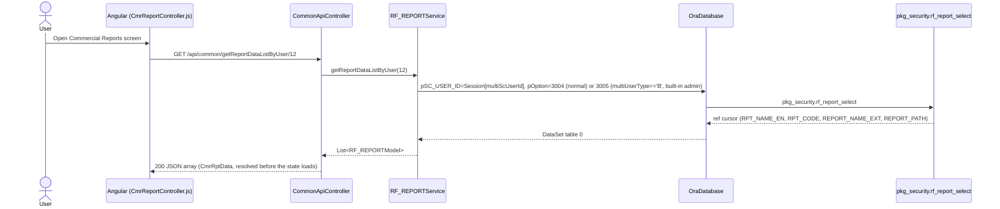

# Feature: Commercial Reports (report runner)

```yaml
---
id: feat:commercial-cmr-reports
module: commercial
http: POST /api/Cmr/CmrReport/PreviewReport | POST /api/Cmr/CmrReport/PreviewReportRDLC | GET /api/common/getReportDataListByUser/12 | GET /api/cmr/CmrReport/GetFundLoanConfigData | POST /api/cmr/CmrReport/FundLoanConfigSave
mvc: CmrController.CmrReport
api: [GET api/common/getReportDataListByUser/12 -> CommonApiController.getReportDataListByUser, POST api/Cmr/CmrReport/PreviewReport -> CmrReportController.PreviewReport, POST api/Cmr/CmrReport/PreviewReportRDLC -> CmrReportController.PreviewReportRDLC, GET api/Cmr/CmrReport/GetFundLoanConfigData -> CmrReportController.GetFundLoanConfigData, POST api/Cmr/CmrReport/FundLoanConfigSave -> CmrReportController.FundLoanConfigSave]
service: ICmrReportModelService / CmrReportModelService (report data); IRF_REPORTService / RF_REPORTService (report list, shared cross-module)
procedure: PKG_CM_REPORT.CM_REPORT_SELECT | PKG_CM_EXP_CIA_DET.CM_EXP_CIA_DET_SELECT | PKG_CM_EXPORT_BILL.CM_EXP_LC_H_REPORT_BY_FILTER | pkg_security.rf_report_select | PKG_CM_REPORT.CM_FUND_LOAN_CONFIG_SELECT | PKG_CM_REPORT.CM_FUND_LOAN_CONFIG_INSERT
pOption: CM_REPORT_SELECT 7000-7041 (one per report); CM_EXP_CIA_DET_SELECT 3002 (CashIncentiveNote); CM_EXP_LC_H_REPORT_BY_FILTER 3000 (LCWiseRealization); rf_report_select 3004/3005 (report list); CM_FUND_LOAN_CONFIG_SELECT/INSERT (Fund Loan Config sub-feature, no distinct pOption split known)
tables: []
models: [CmrReportModel]
session: [multiScUserId, multiUserType]
upstream: [feat:mrc-buyer, feat:commercial-exp-lc-contract, feat:commercial-cash-incentive, feat:commercial-buyer-notify-party]
downstream: []
status: inferred
---
```

This is the Commercial equivalent of Accounting's "Accounting Reports" screen
(`docs/features/accounting-reports.md` / `commercial.js`'s sibling `accounting-reports` entry) — a
single "report runner" screen, not a per-report CRUD menu. It is the last of the 24 Commercial
menus to be documented.

## Purpose

One screen ("Commercial Reports", sidebar id `cmr-reports`, AngularJS state `CmrReportParams`)
lets a Commercial user pick one of ~40 report definitions from a dropdown/list, fill in whichever
filter fields that report needs (dates, buyer, bank, LC, etc. — the form dynamically shows/hides
fields per report code), and preview/print the result as PDF or Excel in a new browser tab. All
report logic lives in **one** controller (`CmrReportController`) that switches on a
`REPORT_CODE` string; there is no separate screen behind each report. A small, unrelated
"Fund Loan Config" sub-screen (bank loan adjustment % / exchange rate setup, feeding the "Fund
Forecast" report) is bolted onto the same controller.

## Entry

| Kind | Value |
|---|---|
| API prefix | `[RoutePrefix("api/Cmr")]` |
| Report list (role-filtered) | `GET /api/common/getReportDataListByUser/12` (report group id `12` = Commercial; hardcoded in `config.cmrRoute.js`) |
| Preview (Crystal Reports) | `POST /api/Cmr/CmrReport/PreviewReport` |
| Preview (RDLC reports) | `POST /api/Cmr/CmrReport/PreviewReportRDLC` |
| Fund Loan Config list | `GET /api/cmr/CmrReport/GetFundLoanConfigData` |
| Fund Loan Config save | `POST /api/cmr/CmrReport/FundLoanConfigSave` |
| Controller | `src/ERPSolution/Areas/Commercial/Api/CmrReportController.cs` |
| AngularJS state | `CmrReportParams`, url `/CmrReportParams` (`config.cmrRoute.js:645-662`) |
| Angular controller | `src/ERPSolution/Areas/Commercial/Client/app/controllers/CmrReportController.js` |
| View | `_CmrReportParams.cshtml` |

`CmrReportController` (C#) injects only `ICmrReportModelService`. The report *list* (for the
radio/dropdown) comes from a different, shared service (`IRF_REPORTService`/`RF_REPORTService`,
`src/ERP.BLL/Commons/RF_REPORTService.cs`) via `CommonApiController.getReportDataListByUser`, the
exact same cross-module mechanism Accounting's own report screen uses (just with a different
`RF_REPORT_GRP_ID`, `12` here vs whatever Accounting passes) — see
`src/ERPSolution/Controllers/CommonApiController.cs:256-263`.

## Execution



```mermaid
sequenceDiagram
  actor User
  participant UI as Angular (CmrReportController.js)
  participant API as CmrReportController (C#)
  participant Svc as CmrReportModelService
  participant DB as OraDatabase
  participant PKG as PKG_CM_REPORT.CM_REPORT_SELECT

  User->>UI: Pick a report, fill filters, click Preview
  Note over UI: vm.isRDLC flag (set per REPORT_CODE in a giant<br/>if/else on $scope.$watch) decides the URL
  UI->>API: POST CmrReport/PreviewReportRDLC (synthetic HTML form, target=_blank,<br/>CmrReportModel fields as hidden inputs, no anti-forgery token)
  API->>API: switch (ob.REPORT_CODE) { case "RPT-70xx": ... }
  API->>Svc: one dedicated method per report (e.g. GetMonthlyExportSummary(ob))
  Svc->>DB: ExecuteStoredProcedure(..., pOption=70xx)
  DB->>PKG: MTEX.PKG_CM_REPORT.CM_REPORT_SELECT
  Note over PKG: pOption branches to that report's SQL;<br/>Tables[7] is always the company-info cursor (pResultCompany)
  PKG-->>DB: up to 8 ref cursors (report data + company info)
  DB-->>Svc: DataSet
  Svc-->>API: DataSet
  API->>API: bind DataSet(s) to an .rdlc ReportDataSource, set ReportParameters, rvContainer.LocalReport.Render(PDF|EXCEL)
  API-->>UI: binary response (PDF or Excel), rendered in the new tab opened by the form's target=_blank
```

## C# map

| Layer | Type | Path |
|---|---|---|
| API | `CmrReportController` | `src/ERPSolution/Areas/Commercial/Api/CmrReportController.cs` |
| Service (report data) | `CmrReportModelService` | `src/ERP.BLL/Commercials/CmrReportModelService.cs` |
| Service interface | `ICmrReportModelService` | `src/ERP.BLL/Commercials/ICmrReportModelService.cs` |
| Model | `CmrReportModel` | `src/ERP.Model/Commercial/CmrReportModel.cs` (namespace `ERP.Model.Commercial`) |
| Service (report list, shared) | `RF_REPORTService` / `IRF_REPORTService` | `src/ERP.BLL/Commons/RF_REPORTService.cs` |
| Package (report data) | `PKG_CM_REPORT` | `src/ERPSolution/oracle/packages/PKG_CM_REPORT.sql` |
| Package (report list) | `pkg_security` | not in this repo's `oracle/packages/` snapshot — referenced by name only |

## Oracle

| Item | Value |
|---|---|
| Package | `PKG_CM_REPORT` |
| Procedure | `CM_REPORT_SELECT` — one overload, ~50 optional params, 8 OUT ref cursors (`pResult`..`pResult6`, `pResultCompany`) plus `pMsg`; dispatches internally on `pOption` |
| `pOption` | One value per report, `7000`-`7041` (`7013` is skipped — no C# case, no known caller; see Known Issues) |
| Fund Loan Config | `CM_FUND_LOAN_CONFIG_SELECT` (`pOption=3000`, list) / `CM_FUND_LOAN_CONFIG_INSERT` (`pOption=3000`, save via `pXML_FLCONFIG`) — a config sub-feature unrelated to any single report except feeding "Fund Forecast" (`RPT-7038`) |
| Other packages called from this controller/service | `PKG_CM_EXP_CIA_DET.CM_EXP_CIA_DET_SELECT` (`CashIncentiveNote`, `pOption=3002` — declared on `ICmrReportModelService` but no `REPORT_CODE` case in either `PreviewReport` or `PreviewReportRDLC` calls it; likely dead or called from elsewhere against direct method invocation, not through this dispatch) |
| | `PKG_CM_EXPORT_BILL.CM_EXP_LC_H_REPORT_BY_FILTER` (`LCWiseRealization`, `pOption=3000` — also not wired to any `REPORT_CODE` case; same gap as `CashIncentiveNote`) |
| Report-list package | `pkg_security.rf_report_select` (`pOption=3004` normal user / `3005` built-in-admin user type `'B'`, both scoped by `pRF_REPORT_GRP_ID=12` for this menu) |
| Main table(s) | No new master table — each report reads whatever Export/Import LC, Bill of Exchange, Cash Incentive, BBLC/IFDBC etc. tables it needs; see the individual feature docs already written for those screens |

## Request / response

**In (PreviewReport/PreviewReportRDLC):** the full `CmrReportModel` posted as a classic HTML form
(hidden inputs built in JS from `vm.form`, not a JSON body) — `REPORT_CODE` selects the branch,
`IS_EXCEL_FORMAT` (`Y`/`N`) selects PDF vs Excel, plus whichever of the ~50 optional fields that
report needs (`FROM_DATE`/`TO_DATE`, `MC_BUYER_ID`, `RF_BANK_ID`, `CM_EXP_LC_H_ID`, etc.).
**Out:** raw binary response (`ExportToHttpResponse`/`LocalReport.Render`) written directly via
`HttpContext.Current.Response` — PDF (`ExportFormatType.PortableDocFormat` / RDLC `"PDF"`) or
Excel (`ExportFormatType.ExcelWorkbook` / RDLC `"EXCEL"`), opened in the new tab the synthetic
form's `target="_blank"` created; not a JSON API response.
**In/Out (Fund Loan Config):** `GetFundLoanConfigData` returns a `DataTable` (rows: bank, adjustment %, exchange rate, loan amount, remarks, adjust-on date) filtered by `HR_COMPANY_ID`/`RF_BANK_ID`/session user; `FundLoanConfigSave` takes an XML string (`pXML_FLCONFIG`) built client-side from the edited grid and returns `{ success, jsonStr }` from `OUTPARAM`.

## Permissions / session

- The report **list** shown to the user is genuinely filtered: `getReportDataListByUser` reads
  `Session["multiScUserId"]` and branches `pOption` on `Session["multiUserType"] == "B"` (built-in
  admin bypass, `pOption=3005`) vs a normal user (`pOption=3004`, presumably joined through a
  role-report mapping inside `pkg_security.rf_report_select` — the package body isn't in this
  repo's `oracle/packages/` snapshot, so the exact join can't be confirmed here; behavior is
  inferred from the two distinct `pOption`s and the `'B'` user-type branch, matching the pattern
  documented for Accounting Reports).
- **`PreviewReport` and `PreviewReportRDLC` themselves have no permission check at all** — no
  `[Authorize]`, no re-validation that the submitted `REPORT_CODE` is one the caller's role was
  actually granted. Session is read only incidentally (e.g. company address strings, `pSC_USER_ID`
  on a few reports) — never to gate access. Same shape as the documented Accounting Reports issue:
  the role filter only controls what's *displayed*, not what's *reachable*.
- `HR_COMPANY_ID`/`HR_COMPANY_IDS` and every other scoping field are trusted verbatim from the
  posted form; nothing cross-checks them against the session user's actual company assignment.
- No anti-forgery token on the synthetic form POST (`vm.preview()` builds and submits a plain
  `<form>`, no CSRF token field).

## Dependencies (other features)

Reports here read data belonging to screens already documented: Export LC/Sales Contract, Import
LC, Bill of Exchange (export & import), Cash Incentive, BBLC/IFDBC, UD, Bank Bill Collection, and
Buyer/Buyer Account/Buyer Notify Party masters. This screen has no schema of its own; it is a
downstream consumer of all of them. `feat:commercial-buyer-notify-party`'s docs already note
`PKG_CM_REPORT.sql` joining `CM_NOTIFY_PARTY` directly to build a `NOTIFY_PARTY` report column,
and `feat:commercial-cash-incentive`'s docs note `CmrReportModelService.CashIncentiveNote` as the
(separately-invoked) `PreviewReportRDLC`/`RPT-3000` handler for that screen's own report action —
confirming this service is shared/reused beyond just this one screen's dispatch table.

## Known Issues

- **No permission re-check on the render endpoints.** The role-based report list only decides what
  radio/dropdown option is shown; `PreviewReport`/`PreviewReportRDLC` accept any `REPORT_CODE` from
  the posted form and execute it unconditionally. A user (or anyone replaying a request with a
  valid session) can request any report — including ones never surfaced to their role — by
  submitting the right `REPORT_CODE` directly.
- **Two rendering technologies in one controller.** `PreviewReport` uses Crystal Reports
  (`CrystalDecisions.*`, `.rpt` files) and only has a single working case (`RPT-4000`, "Dyes
  Chemical Batch Program Requisition Report") — a **Dyeing** report, not a Commercial one, oddly
  living inside `CmrReportController`. `PreviewReportRDLC` uses Microsoft's RDLC/`ReportViewer`
  (`.rdlc` files) and implements everything else (~40 Commercial reports). The `IS_EXCEL_FORMAT=='Y'
  && REPORT_CODE=='RPT-4019'` special case inside `PreviewReport` is unreachable dead code — no
  `case "RPT-4019"` exists in that method's `switch`, so that branch can never actually fire.
- **`pOption=7013` has no `REPORT_CODE` of its own.** `BBLCLiabilityStatus` (behind `REPORT_CODE
  "RPT-7005"`) internally picks `pOption` `7005` or `7013` based on `IS_SHOW_OPENING`, so `7013` is
  reachable, just never exposed as a distinct report code — a one-off internal variant, not a gap.
- **`CashIncentiveNote` (`PKG_CM_EXP_CIA_DET.CM_EXP_CIA_DET_SELECT`, `pOption=3002`) and
  `LCWiseRealization` (`PKG_CM_EXPORT_BILL.CM_EXP_LC_H_REPORT_BY_FILTER`, `pOption=3000`) are
  declared on `ICmrReportModelService` and implemented in `CmrReportModelService`, but neither
  `PreviewReport` nor `PreviewReportRDLC` has a `REPORT_CODE` case that calls them.** `CashIncentiveNote`
  is confirmed (by `docs/features/commercial-cash-incentive.md`) to be reached instead via the
  Cash Incentive screen's own `CIApiController.PreviewReportRDLC` action (report code `RPT-3000`),
  a completely separate controller — so it is real, just not reachable through *this* screen.
  `LCWiseRealization` has no confirmed caller anywhere in this pass; flagged as possibly dead or
  called from a screen outside this feature's scope.
- **Six report codes exist in the server switch but have no matching UI toggle in
  `CmrReportController.js`'s `$scope.$watch('vm.form.REPORT_CODE', ...)`:** `RPT-7001` (Bill Of
  Exchange), `RPT-7014` (Import LC Application Letter), `RPT-7017` (Advance PI Report), `RPT-7019`
  (Import LC PI), `RPT-7028` (Purchase Contract Report), `RPT-7030` (Import LC Application Letter,
  a second dataset variant). None of these can be selected from this screen's own report
  list/filter form — they are presumably triggered by a "print" action embedded in their own
  originating screens (e.g. Bill Of Exchange's own controller), reusing this same shared
  `PreviewReportRDLC` endpoint with a hardcoded `REPORT_CODE`, rather than being genuinely part of
  the "Commercial Reports" menu's own report list.
- **`IsForRblReportView` hardcodes a company short-name allowlist** (`RBL`, `CBL`, `KKTEX`,
  `Robintex Group`) directly in C# to pick between two `.rdlc` templates for `RPT-7001` (Bill Of
  Exchange) — a business rule that would normally live in configuration/lookup data, not a literal
  string array in the controller.
- **No anti-forgery token** on the Preview form submission, combined with the missing permission
  check above — this endpoint is reachable via a simple cross-site form submission while a session
  is active (same pattern flagged on Accounting Reports).
- **`Fund Loan Config` is a config sub-screen bolted onto the report controller**, not a report
  itself — its own `GetFundLoanConfigData`/`FundLoanConfigSave` actions have no permission check
  beyond reading the session user id, and exist only to support one report (`RPT-7038`, Fund
  Forecast).

## Unused Columns

Not applicable in the usual per-table sense — this screen has no master table of its own. The one
place a "columns fetched but discarded" pattern could apply is the report-list row shape returned
by `getReportDataListByUser` (`RPT_NAME_EN`, `RPT_CODE`, `REPORT_NAME_EXT`, `REPORT_PATH`): the
Angular side only ever reads `RPT_NAME_EN`/`RPT_CODE` from the resolved `CmrRptData` (see
`CmrReportController.js`'s `vm.rptOnChange`/`vm.rptList`); `REPORT_NAME_EXT` and `REPORT_PATH` are
fetched by the service but no client usage was found in this Commercial screen — mirroring the
"designed for a data-driven report engine but never wired up" finding already documented for
Accounting Reports' `RPT_SQL`/`RPT_PARAM` columns (those two extra columns exist on
`RF_REPORTModel`/`ReportListData` too, but that method isn't the one this screen calls).

## Gaps

- No live database connection was available for this pass; every fact above is source-inferred
  (static analysis of `.cs`/`.sql`/`.js`), never "DB-verified". `pkg_security.rf_report_select`'s
  package body is not present in this repo's `oracle/packages/` snapshot, so the exact role-report
  join inside `pOption=3004` could not be directly confirmed — only the two-`pOption`,
  user-type-branch shape in the calling C# service.
- This is a summary-level trace matching the requested Accounting-Reports depth: the ~40 individual
  report SQL bodies inside `CM_REPORT_SELECT`'s giant `pOption` dispatch were not traced field by
  field — only the C# dispatch shape, the report list/mechanism, and issues visible from the
  controller/service/model chain.
- `RPT-4000`'s Crystal Report path (`rptDCBatchRequisition.rpt`) was read only from the controller
  switch; the `.rpt` file itself and `ExportPIOne`'s reuse for it were not opened.
