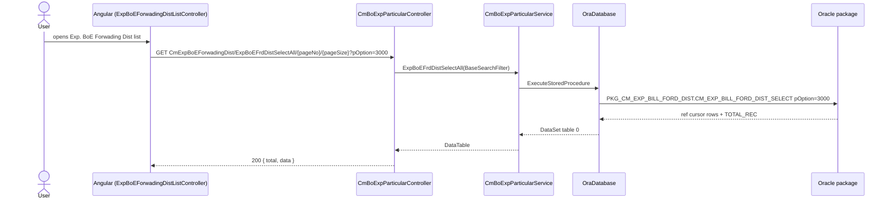
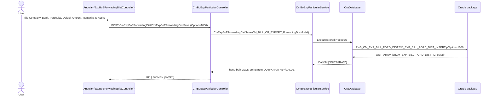

# Feature: Exp. BoE Forwading Dist

```yaml
---
id: feat:cm-exp-boe-forwading-dist
module: commercial
http: GET /api/Commercial/CmExpBoEForwadingDist/ExpBoEFrdDistSelectAll/{pageNo}/{pageSize}
mvc: CmrController.ExpBoEForwadingDist
api: [GET api/Commercial/CmExpBoEForwadingDist/ExpBoEFrdDistSelectAll/{pageNo}/{pageSize} -> CmBoExpParticularController.ExpBoEFrdDistSelectAll, GET api/Commercial/CmExpBoEForwadingDist/GetExpBoEFrdDistById -> CmBoExpParticularController.GetExpBoEFrdDistById, POST api/Commercial/CmExpBoEForwadingDist/CmExpBoEForwadingDistSave -> CmBoExpParticularController.CmExpBoEForwadingDistSave, POST api/Commercial/CmExpBoEForwadingDist/CmExpBoEForwadingDistDelete -> CmBoExpParticularController.CmExpBoEForwadingDistDelete]
service: ICmBoExpParticularService / CmBoExpParticularService
procedure: PKG_CM_EXP_BILL_FORD_DIST.CM_EXP_BILL_FORD_DIST_INSERT | CM_EXP_BILL_FORD_DIST_DELETE | CM_EXP_BILL_FORD_DIST_SELECT
pOption: 1000 insert-or-update, 3000 list all, 3001 by id, 4000 delete
tables: [CM_EXP_BILL_FORD_DIST]
models: [CM_BILL_OF_EXPORT_ForwadingDistModel]
session: [multiScUserId]
upstream: [feat:security-signin]
downstream: [CM_EXP_BILL_OF_EX_FORWARD (Bill of Export forwarding allocation), PKG_CM_EXPORT_BILL.CM_EXP_BILL_OF_EX_FORWARDING_DIST_SELECT]
status: inferred
---
```

## Purpose

Master-data screen under Commercial ▸ Export ▸ Master Data ▸ **Exp. BoE Forwading Dist**
(sidebar id `exp-boe-forwading-dist`). The user defines a company- and bank-scoped list of
"particulars" (charge/cost line items, e.g. named forwarding charge types) with an optional
default amount and remarks, to be used later when a Bill of Export is finalized and its
forwarding cost is broken down/distributed across these particulars. Despite the "Forwading
Dist(ribution)" name, the record's own FK is to **Bank** (`RF_BANK_ID`), not to a freight
forwarder (`RF_FRT_FORWRDR`, which is a separate, unrelated reference table used elsewhere on
the Bill of Export header itself, e.g. `PKG_CM_EXPORT_BILL.rf_frt_forwrdr_select` and
`CM_EXP_COM_INV_H_INSERT`'s `pRF_FRT_FORWRDR_ID`).

**This is a genuinely separate table/action from "Bill Of Export Particulars".** Both live in
the same controller/service file and share the same UI shape (company + particular + default
amount + remarks + is-active), but:
- Bill Of Export Particulars → table `CM_BILL_OF_EXPORT_PARTICULAR`, package
  `PKG_CM_BILL_OF_EXPORT_PARTICULAR`, keyed only by company.
- Exp. BoE Forwading Dist (this feature) → table `CM_EXP_BILL_FORD_DIST`, package
  `PKG_CM_EXP_BILL_FORD_DIST`, keyed by company **and bank** (`RF_BANK_ID`).

They are clearly two menu items sharing one controller class, not tabs of one screen — each has
its own route (`ExpBoEForwadingDistList` / `AddEditExpBoEForwadingDist` vs whatever routes serve
the Particulars screen), own Razor partials, own Angular controllers, and own API routes under
`CmExpBoEForwadingDist/*` vs `CmBoExpParticular/*`.

## Entry

| Kind | Value |
|---|---|
| Menu / MVC URL | `Commercial ▸ Export ▸ Master Data ▸ Exp. BoE Forwading Dist`; MVC shell action `CmrController.ExpBoEForwadingDist()` (`src/ERPSolution/Areas/Commercial/Controllers/CmrController.cs:443`) |
| Razor views | `_ExpBoEForwadingDistList.cshtml`, `_AddEditExpBoEForwadingDist.cshtml` (`src/ERPSolution/Areas/Commercial/Views/Cmr/`) |
| Angular files | `ExpBoEForwadingDistListController.js`, `ExpBoEForwadingDistController.js` (`src/ERPSolution/Areas/Commercial/Client/app/controllers/`); routes in `config.cmrRoute.js` (states `ExpBoEForwadingDistList`, `AddEditExpBoEForwadingDist`) |
| API (list) | `GET /api/Commercial/CmExpBoEForwadingDist/ExpBoEFrdDistSelectAll/{pageNo}/{pageSize}?pOption=3000&pHR_COMPANY_ID=&pRF_BANK_ID=&pPARTICULAR=` |
| API (get one) | `GET /api/Commercial/CmExpBoEForwadingDist/GetExpBoEFrdDistById?pOption=3001&pCM_EXP_BILL_FORD_DIST_ID=` |
| API (save) | `POST /api/Commercial/CmExpBoEForwadingDist/CmExpBoEForwadingDistSave` |
| API (delete) | `POST /api/Commercial/CmExpBoEForwadingDist/CmExpBoEForwadingDistDelete` |

## Execution (list)



## Execution (save)



Delete follows the same shape against `CM_EXP_BILL_FORD_DIST_DELETE` with `pOption=4000`,
passing only `pCM_EXP_BILL_FORD_DIST_ID`.

## C# map

| Layer | Type | Path |
|---|---|---|
| API | `CmBoExpParticularController` | `src/ERPSolution/Areas/Commercial/Api/CmBoExpParticularController.cs` |
| Service | `CmBoExpParticularService` / `ICmBoExpParticularService` | `src/ERP.BLL/Commercials/CmBoExpParticularService.cs`, `ICmBoExpParticularService.cs` |
| Model | `CM_BILL_OF_EXPORT_ForwadingDistModel` | `src/ERP.Model/Commercial/CM_BILL_OF_EXPORT_ForwadingDistModel.cs` |
| Filter | `BaseSearchFilter` (adds `RF_BANK_ID`, `CM_EXP_BILL_FORD_DIST_ID`) | `src/ERP.DAL/Filters/BaseSearchFilter.cs` |
| MVC shell | `CmrController.ExpBoEForwadingDist()` + `_ExpBoEForwadingDistList()` / `_AddEditExpBoEForwadingDist()` | `src/ERPSolution/Areas/Commercial/Controllers/CmrController.cs:443-454` |

## Oracle

| Item | Value |
|---|---|
| Package | `PKG_CM_EXP_BILL_FORD_DIST` — source `.sql` not present in this repo, but confirmed **`VALID`** in the dev DB (`mtexdev`); its body was read directly via `ALL_SOURCE` on 2026-09-14 to close this gap (see Gaps) |
| Insert/Update | `CM_EXP_BILL_FORD_DIST_INSERT`, `pOption=1000` (single procedure for both — **DB-confirmed**: branches on `NVL(pCM_EXP_BILL_FORD_DIST_ID,0)<=0` insert vs `>0` update, both under the one `IF(pOption=1000)` guard; the earlier by-analogy inference was correct) |
| Delete | `CM_EXP_BILL_FORD_DIST_DELETE` — **DB-confirmed the procedure body does not check `pOption` at all**; it deletes unconditionally on `pCM_EXP_BILL_FORD_DIST_ID`. The C# service passing `pOption=4000` is a caller-side convention only, not enforced by the procedure. |
| Select | `CM_EXP_BILL_FORD_DIST_SELECT`, `pOption=3000` (paged list, joins `HR_COMPANY`/`SC_USER`/`RF_BANK`) / `pOption=3001` (single row by id, same joins) — **DB-confirmed** |
| Main table | `CM_EXP_BILL_FORD_DIST` |
| Child/consumer table | `CM_EXP_BILL_OF_EX_FORWARD` (see Relationships) |

## Request / response

**In (save):** `CM_EXP_BILL_FORD_DIST_ID`, `HR_COMPANY_ID`, `RF_BANK_ID`, `PARTICULAR`,
`DEFAULT_AMOUNT`, `REMARKS`, `IS_ACTIVE` (plus server-stamped `CREATION_DATE`/`CREATED_BY` or
`LAST_UPDATE_DATE`/`LAST_UPDATED_BY` from `Session["multiScUserId"]`).
**Out (save/delete):** `{ success, jsonStr }` where `jsonStr` is a hand-built JSON string from
the procedure's `OUTPARAM` result table (`KEY`/`VALUE` rows, e.g. `PMSG`,
`OPCM_EXP_BILL_FORD_DIST_ID`).
**Out (list):** `{ total, data }` where `data` is the raw `DataTable` from the select procedure
(bound directly to the Kendo grid — columns shown: `COMP_NAME_EN`, `BANK_NAME_EN`, `PARTICULAR`,
`CREATION_DATE`, `REMARKS`, `IS_ACTIVE`; `DEFAULT_AMOUNT` is **not** a grid column, see Known
Issues).

## Tables / columns touched

`CM_EXP_BILL_FORD_DIST` — column list reconstructed from the model
(`src/ERP.Model/Commercial/CM_BILL_OF_EXPORT_ForwadingDistModel.cs`) and from the `SELECT` list in
`PKG_CM_EXPORT_BILL.CM_EXP_BILL_OF_EX_FORWARDING_DIST_SELECT` (`src/ERPSolution/oracle/packages/PKG_CM_EXPORT_BILL.sql:1043-1077`,
aliased `P`), which is the only place another package actually references this table:

| Column | Source |
|---|---|
| `CM_EXP_BILL_FORD_DIST_ID` (PK) | model + selected as `P.CM_EXP_BILL_FORD_DIST_ID` |
| `HR_COMPANY_ID` | model + filtered as `P.HR_COMPANY_ID` |
| `RF_BANK_ID` (FK → `RF_BANK`) | model + filtered as `P.RF_BANK_ID` |
| `PARTICULAR` | model + selected as `P.PARTICULAR` |
| `DEFAULT_AMOUNT` | model only (write side); not selected by the one confirmed consumer query |
| `REMARKS` | model + selected as `P.REMARKS` (with `NVL(D.REMARKS, P.REMARKS)` fallback) |
| `IS_ACTIVE` | model only |
| `CREATION_DATE`, `CREATED_BY`, `LAST_UPDATE_DATE`, `LAST_UPDATED_BY` | model only (standard audit columns) |

No `DDL` exists in the repo for this table, but the column list above was cross-checked against
`all_tab_columns` on the dev DB (`mtexdev`) on 2026-09-14 — all 11 columns match exactly, nothing
extra, nothing missing.

FKs: `HR_COMPANY_ID` → `HR_COMPANY`, `RF_BANK_ID` → `RF_BANK` — both **DB-confirmed** via
`all_constraints` (`FK_CM_EXP_BILL_FORD_DIST_COMPANY`, `FK_CM_EXP_BILL_FORD_DIST_RF_BANK_ID`), not
just inferred from naming convention. `CREATED_BY`/`LAST_UPDATED_BY` also carry FKs to `SC_USER`
(audit columns, not listed above). Primary key: `PK_CM_EXP_BILL_FORD_DIST` on
`CM_EXP_BILL_FORD_DIST_ID`. Unique constraint `UK_CM_EXP_BILL_FORD_DIST_01` on
(`HR_COMPANY_ID`, `RF_BANK_ID`, `PARTICULAR`) — matches the package's `DUP_VAL_ON_INDEX` handler
message "This Particular already exists for the selected company." The bank dropdown itself is
populated from `/api/common/BankDataList`, not a Commercial-area endpoint.

## Permissions / session

- `CmrController.ExpBoEForwadingDist()` gates the MVC shell view with `IsMenuPermission()`
  (redirects to `~/` if the user lacks the menu permission).
- `Session["multiScUserId"]` is used for `CREATED_BY` / `LAST_UPDATED_BY` on save (no explicit
  check in the Web API controller itself — same convention as the Buyer canonical trace).
- The API controller (`CmBoExpParticularController`) has no `[Authorize]`/session check of its
  own beyond what's inherited from the app's global filters.

## Dependencies (other features)

- **Downstream:** `PKG_CM_EXPORT_BILL.CM_EXP_BILL_OF_EX_FORWARDING_DIST_SELECT` joins
  `CM_EXP_BILL_FORD_DIST` (master particulars) to `CM_EXP_BILL_OF_EX_FORWARD` (per-Bill-of-Export
  allocation rows, keyed by `CM_EXP_BILL_OF_EX_H_ID`) so a specific Bill of Export can pick which
  particulars apply and record `FORWARD_PCT` / `FORWARD_AMT` per particular. This is the actual
  "Bill Of Export" screen that consumes this master data — its own feature file is out of scope
  here (owned by whoever documents the Bill of Export header screen).
- **Sibling, not related by FK:** `CM_BILL_OF_EXPORT_PARTICULAR` (Bill Of Export Particulars
  menu) — same controller/service file, unrelated table, keyed only by company (no bank).
- **Not directly related:** `RF_FRT_FORWRDR` (freight forwarder reference, used on the Bill of
  Export header via `pRF_FRT_FORWRDR_ID` in `CM_EXP_COM_INV_H_INSERT`, and documented separately
  under the Reference Type screen) — despite the "Forwading" name, this feature's FK is to Bank,
  not to a forwarder.

## Gaps

- **Resolved 2026-09-14:** `PKG_CM_EXP_BILL_FORD_DIST`'s source `.sql` is still not present in
  this repo, but it was read directly from the dev DB (`mtexdev`, schema `MTEX`) via
  `SELECT text FROM all_source WHERE owner='MTEX' AND name='PKG_CM_EXP_BILL_FORD_DIST' AND
  type='PACKAGE BODY'` — the package is `VALID` and its full body was retrieved read-only. This
  confirms: `CM_EXP_BILL_FORD_DIST_INSERT` really does share `pOption=1000` for both insert and
  update, branching on `NVL(pCM_EXP_BILL_FORD_DIST_ID,0)`, exactly as previously inferred by
  analogy; `CM_EXP_BILL_FORD_DIST_DELETE` does not check `pOption` at all (the C# service's
  `pOption=4000` is a caller convention, not enforced); `CM_EXP_BILL_FORD_DIST_SELECT` branches
  cleanly on `pOption=3000`/`3001` as documented. No `docs/schema/CM_EXP_BILL_FORD_DIST.md` exists
  yet for this table — see `## Tables / columns touched` below, which was cross-checked against
  `all_tab_columns` on the same date and found to match.
- `DEFAULT_AMOUNT` is captured on the Add/Edit form and written to the table, but is not shown in
  the list grid and is not selected by the one confirmed downstream consumer
  (`CM_EXP_BILL_OF_EX_FORWARDING_DIST_SELECT` selects `PARTICULAR` and `REMARKS` from the master
  row, but not `DEFAULT_AMOUNT`) — the actual per-Bill-of-Export amount comes from
  `CM_EXP_BILL_OF_EX_FORWARD.FORWARD_AMT`/`FORWARD_PCT` instead. See Known Issues in the JS draft.
- **Resolved 2026-09-14:** `CM_EXP_BILL_FORD_DIST` does **not** have a `DISPLAY_ORDER` column —
  confirmed via `all_tab_columns` (11 columns total: `CM_EXP_BILL_FORD_DIST_ID`, `HR_COMPANY_ID`,
  `RF_BANK_ID`, `PARTICULAR`, `DEFAULT_AMOUNT`, `REMARKS`, `IS_ACTIVE`, plus 4 audit columns).
