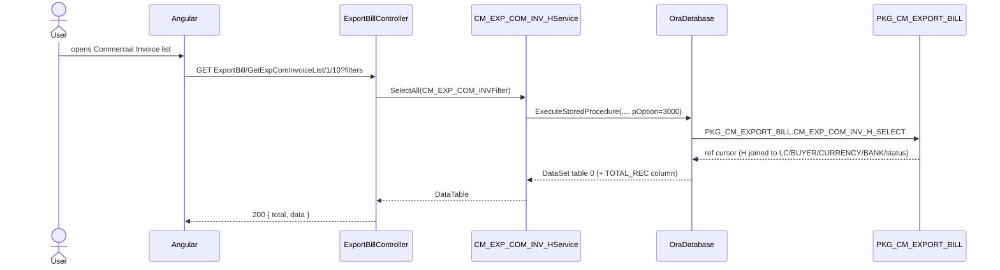
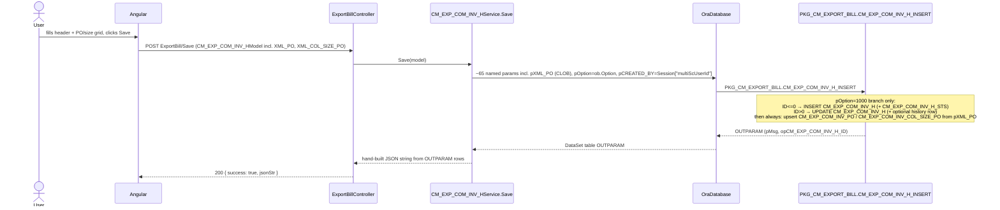
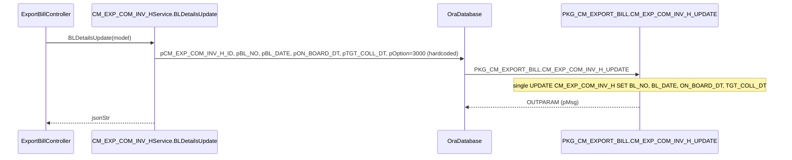

# Feature: Commercial Invoice (Export)

```yaml
---
id: feat:cmr-exp-invoice
module: commercial
http: GET /api/cmr/ExportBill/GetExpComInvoiceList/{pageNo}/{pageSize}
mvc: CmrController.ExpInvoiceList
api: [GET api/cmr/ExportBill/GetExpComInvoiceList/{pageNo}/{pageSize} -> ExportBillController.GetExpComInvoiceList, GET api/cmr/ExportBill/GetExpComInvoiceInfo -> ExportBillController.GetExpComInvoiceInfo, GET api/cmr/ExportBill/GetExpComInvoiceForBoE -> ExportBillController.GetExpComInvoiceForBoE, GET api/cmr/ExportBill/GetOrderWiseSize -> ExportBillController.GetOrderWiseSize, POST api/cmr/ExportBill/Save -> ExportBillController.Save, POST api/cmr/ExportBill/BLDetailsUpdate -> ExportBillController.BLDetailsUpdate]
service: ICM_EXP_COM_INV_HService / CM_EXP_COM_INV_HService
procedure: PKG_CM_EXPORT_BILL.CM_EXP_COM_INV_H_INSERT | CM_EXP_COM_INV_H_UPDATE | CM_EXP_COM_INV_H_SELECT
pOption: 1000 insert/update (INSERT proc), 3000 update BL/On-board/Target-collection date (UPDATE proc), 3000 list, 3001 select-by-LC (edit), 3002 for BoE picker, 3003 autocomplete, 3004/3005/3006 export-pct helpers, 3007 order-wise size, 3008 unrelated BTB payment schedule (stub data)
tables: [CM_EXP_COM_INV_H, CM_EXP_COM_INV_PO, CM_EXP_COM_INV_COL_SIZE_PO, CM_EXP_COM_INV_H_STS, CM_EXP_COM_INV_H_HIST]
models: [CM_EXP_COM_INV_HModel, CM_EXP_COM_INVFilter]
session: [multiScUserId]
upstream: [feat:commercial-exp-lc-contract]
downstream: [bill-of-exchange, bank-bill-collection]
status: inferred
---
```

## Purpose

Lets Commercial create and finalize an **Export Commercial Invoice** against an Export LC/Sales
Contract, listing which order lines (and which color/size lines within each order) are being
invoiced/shipped, along with shipping details (vessel, container, B/L, on-board date, freight,
forwarder) and invoice-value adjustments (penalty, FBC, sales discount, agency commission, advance
adjustment). Once finalized (`IS_FINALIZED='Y'`) and not yet negotiated, the invoice becomes
available to the sibling "Bill Of Exchange" screen for BoE creation.

## Entry

| Kind | Value |
|---|---|
| Menu | Export ▸ Transactions ▸ Commercial Invoice (sidebar id `exp-invoice`) |
| API prefix | `[RoutePrefix("api/cmr")]` |
| Controller | `src/ERPSolution/Areas/Commercial/Api/ExportBillController.cs` |
| List | `GET api/cmr/ExportBill/GetExpComInvoiceList/{pageNo}/{pageSize}?pCM_EXP_COM_INV_H_ID=&pCM_EXP_LC_H_ID=&pEXP_INV_NO=...` |
| Info (edit) | `GET api/cmr/ExportBill/GetExpComInvoiceInfo?pCM_EXP_COM_INV_H_ID=&pCM_EXP_LC_H_ID=&pEXP_LCSC_NO=` |
| For BoE picker | `GET api/cmr/ExportBill/GetExpComInvoiceForBoE?pCM_EXP_COM_INV_H_ID=&pCM_EXP_LC_H_ID=&pEXP_LCSC_NO=&pCM_EXP_COM_INV_LST=` |
| Order-wise size | `GET api/cmr/ExportBill/GetOrderWiseSize?pMC_ORDER_H_ID=&pCM_EXP_COM_INV_PO_ID=` |
| Save | `POST api/cmr/ExportBill/Save` body `CM_EXP_COM_INV_HModel` |
| B/L details update | `POST api/cmr/ExportBill/BLDetailsUpdate` body `CM_EXP_COM_INV_HModel` |

`ExportBillController` is a large, shared controller: it also hosts the "Bill Of Exchange" and
"Bank Bill Collection" menus (documented separately). Only the six actions above belong to
Commercial Invoice.

## Execution (list)



## Execution (save / insert or update header + PO + size lines)



## Execution (B/L details update)



## C# map

| Layer | Type | Path |
|---|---|---|
| API | `ExportBillController` | `src/ERPSolution/Areas/Commercial/Api/ExportBillController.cs` |
| Service | `CM_EXP_COM_INV_HService` | `src/ERP.BLL/Commercials/CM_EXP_COM_INV_HService.cs` |
| Service interface | `ICM_EXP_COM_INV_HService` | `src/ERP.BLL/Commercials/ICM_EXP_COM_INV_HService.cs` |
| Model | `CM_EXP_COM_INV_HModel` | `src/ERP.Model/Commercial/CM_EXP_COM_INV_HModel.cs` |
| Filter | `CM_EXP_COM_INVFilter : BaseSearchFilter` | `src/ERP.DAL/Filters/CM_EXP_COM_INVFilter.cs` |
| Package | `PKG_CM_EXPORT_BILL` | `src/ERPSolution/oracle/packages/PKG_CM_EXPORT_BILL.sql` |

## Oracle

| Item | Value |
|---|---|
| Package | `PKG_CM_EXPORT_BILL` |
| Insert/Update header | `CM_EXP_COM_INV_H_INSERT`, `pOption=1000` only (branches internally on whether `pCM_EXP_COM_INV_H_ID<=0`); also upserts `CM_EXP_COM_INV_PO`/`CM_EXP_COM_INV_COL_SIZE_PO` from `pXML_PO`/embedded `XML_COL_SIZE_PO` regardless of header branch |
| B/L-only update | `CM_EXP_COM_INV_H_UPDATE`, `pOption=3000` (only branch implemented) |
| Select | `CM_EXP_COM_INV_H_SELECT` — `pOption=3000` list, `3001` select-by-LC (edit form, includes bank/branch join), `3002` BoE-eligible list, `3003` autocomplete, `3004` export-pct-for-email, `3005` export-pct-plain, `3006` export-pct-string, `3007` order-wise size (`pCM_EXP_COM_INV_PO_ID` branch vs plain `pMC_ORDER_H_ID` branch), `3008` BTB payment schedule (hardcoded dummy `SELECT ... FROM DUAL` rows — unrelated stub, not wired to real data) |
| Header table | `CM_EXP_COM_INV_H` |
| Child tables | `CM_EXP_COM_INV_PO` (one row per order/style/color, FK `MC_ORDER_H_ID`), `CM_EXP_COM_INV_COL_SIZE_PO` (one row per size, FK `MC_ORDER_SIZE_ID`), `CM_EXP_COM_INV_H_STS` (status trail), `CM_EXP_COM_INV_H_HIST` (snapshot on revision, `IS_REVISED='Y'`) |

## Request / response

**In (Save/BLDetailsUpdate):** `CM_EXP_COM_INV_HModel` JSON body — header scalar fields plus
`XML_PO` (CLOB XML string listing `CM_EXP_COM_INV_PO` rows, each optionally embedding
`XML_COL_SIZE_PO` for its size lines).

**In (list/info):** query-string filter params (`pCM_EXP_COM_INV_H_ID`, `pCM_EXP_LC_H_ID`,
`pEXP_INV_NO`, `pEXP_LCSC_NO`, `pMC_BUYER_ID`, `pMC_ORDER_H_LST`, date ranges, `pIS_FINALIZED`,
`pHR_COMPANY_ID`).

**Out:**
- List/info/BoE endpoints: `Ok(...)` — either `{ total, data }` (paged `DataTable`) or a raw
  `List<CM_EXP_COM_INV_HModel>`/`DataTable`.
- Save/BLDetailsUpdate: `{ success: true, jsonStr }` where `jsonStr` is a hand-built JSON string
  from the procedure's `OUTPARAM` rows (`pMsg`, `opCM_EXP_COM_INV_H_ID`); on `ModelState` failure,
  `{ success: false, errors }`.

## Tables / columns touched

**Main table `CM_EXP_COM_INV_H`** (source-inferred from the fullest INSERT list, `PKG_CM_EXPORT_BILL.sql:1220-1240`):
`CM_EXP_COM_INV_H_ID` (PK), `HR_COMPANY_ID`, `CM_EXP_LC_H_ID`, `EXP_INV_NO`, `EXP_INV_NO_PFX`,
`EXP_INV_NO_AUTO`, `EXP_INV_DT`, `EXP_INV_VAL`, `RF_CURRENCY_ID`, `EXP_NO`, `EXP_DT`,
`RF_FRT_FORWRDR_ID`, `BL_NO`, `BL_DATE`, `EX_FACTORY_DT`, `HANDOVER_DT`, `ON_BOARD_DT`,
`RF_SHIP_MODE_ID`, `LK_FREIGHT_TYPE_ID`, `FREIGHT_CHRGS`, `IS_NEGOTIATED`, `MC_ORDER_H_LST`
(comma/text list, not a real FK column), `ORDER_QTY`, `QTY_MOU_ID`, `TOT_CTN_QTY`, `TOT_PCS_QTY`,
`UNIT_PRICE`, `IS_FINALIZED`, `REVISION_NO`, `REVISION_DT`, `REV_REASON`, `REMARKS`,
`BILL_CNTRY_ID`, `LOAD_PORT_ID`, `DSG_PORT_LST`, `CREATION_DATE`, `CREATED_BY`,
`CM_LC_APPLICANT_ID`, `EXP_INV_NET_VAL`, `PENALTY_AMT`, `FBC_AMT`, `EXCHNG_RATE`, `INV_ADJ_AMT`,
`IS_ADJUST_AGNST_ADV`, `SALES_DISCOUNT_AMT`, `AGENCY_COMM_AMT`, `ADV_ADJUST_STATUS` (computed
server-side, not a param), `TGT_COLL_DT`, `RF_CONTAINER_SIZE_ID`, `EXP_REG_NO`, `EXP_REG_DATE`,
`PRE_CARRIAGE_BY`, `MARKS_AND_NOS_OF_PKGS`, `EXP_INV_REX`, `VSL_NO`, `CNTR_NO`,
`RF_ACTN_STATUS_ID`, plus `LAST_UPDATE_DATE`/`LAST_UPDATED_BY` (update path).

FKs corroborated by real `JOIN`/`WHERE` evidence in `CM_EXP_COM_INV_H_SELECT`
(`PKG_CM_EXPORT_BILL.sql:2026-2039`): `CM_EXP_LC_H_ID → CM_EXP_LC_H`, `HR_COMPANY_ID → HR_COMPANY`,
`RF_CURRENCY_ID → RF_CURRENCY`, `QTY_MOU_ID → RF_MOU`, `RF_FRT_FORWRDR_ID → RF_FRT_FORWRDR`,
`RF_SHIP_MODE_ID → RF_SHIP_MODE`, `LK_FREIGHT_TYPE_ID → LOOKUP_DATA`, `RF_ACTN_STATUS_ID →
RF_ACTN_STATUS`; and transitively `CM_EXP_LC_H.MC_BUYER_ID → MC_BUYER`,
`CM_EXP_LC_H.LIN_BKBR_ID/RCV_BKBR_ID → RF_BANK_BRANCH → RF_BANK`.

**Child tables** (summary level; source-inferred from `PKG_CM_EXPORT_BILL.sql:1396-1610` upsert
block driven by `pXML_PO`):
- `CM_EXP_COM_INV_PO` — one row per order/style/color line being invoiced: FK
  `CM_EXP_COM_INV_H_ID`, FK `MC_ORDER_H_ID` (this is the confirmed link to `MC_ORDER_H` — see
  `GetOrderWiseSize`/`SelectOrderWiseSize`, `pOption=3007`, which joins
  `MC_ORDER_SIZE → MC_ORDER_COL → MC_ORDER_STYL → MC_ORDER_H`), plus `MC_STYLE_D_ITEM_ID`,
  `MC_COLOR_ID`, `MC_SIZE_LST`, `ORDER_QTY`, `CTN_QTY`, `UNIT_PRICE`, `TTL_VALUE`, `QTY_MOU_ID`,
  advance-adjustment fields (`ADJ_MC_ORDER_H_ID`, `ADJ_CM_EXP_PI_H_ID`, `ADJUST_AMT`,
  `ADJUST_WITH`), packing fields (`NET_WEIGHT`, `GROSS_WEIGHT`, `CMB`, `CTN_MEASUREMENT`,
  `IS_CLR_SIZE_BRK`, `IS_PARTIAL_SHIPMENT`, `PATRON`, `IL_OR_AR`, `HS_CODE`, `HS_CATEGORY`).
- `CM_EXP_COM_INV_COL_SIZE_PO` — one row per size within a PO line: FK
  `CM_EXP_COM_INV_PO_ID`, FK `MC_ORDER_SIZE_ID`, `SIZE_INVC_QTY`, `SIZE_INVC_RATE`.
- `CM_EXP_COM_INV_H_STS` — status/action trail: `CM_EXP_COM_INV_H_ID`, `RF_ACTN_STATUS_ID`,
  `ACTION_DATE`, `ACTION_BY`, `IS_VISIBLE`, `REMARKS`.
- `CM_EXP_COM_INV_H_HIST` — full-row snapshot of `CM_EXP_COM_INV_H` written before an update when
  `pIS_REVISED='Y'` (revision history).

Link `docs/schema/CM_EXP_COM_INV_H.md` if/when created (not created here per repo rule — no
schema file yet exists for this table).

## Permissions / session

`pCREATED_BY`/`pLAST_UPDATED_BY` on Save are taken directly from `HttpContext.Current.Session["multiScUserId"]`
in the service (`CM_EXP_COM_INV_HService.cs:103,105`), not from the posted model. No explicit
menu/permission check observed in this controller (`[Authorize]` is commented out on the class,
same as the sibling menus on this controller).

## Dependencies (other features)

- **Upstream:** Export LC / Sales Contract (`CM_EXP_LC_H`) must exist first — every select option
  joins `CM_EXP_COM_INV_H` to `CM_EXP_LC_H` and most filters (buyer, LC banks, LC total value) come
  from the LC row, not the invoice row. See `docs/features/commercial-exp-lc-contract.md` if
  present (not confirmed complete at time of writing — traced independently here via package
  evidence, not blocked on that doc).
- **Order lines:** `CM_EXP_COM_INV_PO.MC_ORDER_H_ID → MC_ORDER_H`, drilling into
  `MC_ORDER_STYL`/`MC_ORDER_COL`/`MC_ORDER_SIZE` for the size-wise invoicing screen
  (`GetOrderWiseSize`).
- **Downstream:** a finalized, non-negotiated invoice (`IS_FINALIZED='Y'`, `IS_NEGOTIATED='N'`,
  `ADV_ADJUST_STATUS='N'`) becomes selectable on the **Bill Of Exchange** screen
  (`GetExpComInvoiceForBoE`, `pOption=3002`, excludes invoices already linked via
  `CM_EXP_BILL_OF_EX_D`). `ExportBillController` also hosts **Bank Bill Collection** for the same
  bill lifecycle; both siblings are documented separately by other agents — this file covers only
  the Commercial Invoice slice of that shared controller.

## Gaps

- `ICM_EXP_COM_INV_HService.Update()` and `.Delete()` exist and build full parameter lists against
  `CM_EXP_COM_INV_H_INSERT`/`CM_EXP_COM_INV_H_DELETE`, but no action in `ExportBillController` calls
  them — status: inferred as currently dead/unrouted code from this controller's perspective; may be
  called from elsewhere not checked here.
- `CM_EXP_COM_INV_H_INSERT` only executes its insert/update body when `pOption=1000` — there is no
  `ELSE` branch. The C# `Save()` passes `ob.Option` verbatim as `pOption`, so if the Angular client
  ever sends an `Option` other than `1000`, the header row is silently not touched (though the
  `pXML_PO` detail-line upsert below it still runs, since that block sits outside the `pOption=1000`
  check). Not confirmed against the Angular source — flagged from package-body evidence only.
- `pOption=3008` (`GetBtbPaymentScheduleInfo`) returns hardcoded literal rows (`'IFIC BANK'`,
  `'MULTI FABS LTD'`, fixed 2026 dates) from `DUAL` — clearly placeholder/demo data, not a real
  query against `CM_EXP_COM_INV_H`. Not wired to any action in this controller; left here only
  because it lives in the same service/package.
- Full column list for `CM_EXP_COM_INV_PO`/`CM_EXP_COM_INV_COL_SIZE_PO` reconstructed only from the
  `pXML_PO` XMLTABLE shape and the INSERT/UPDATE statements that follow it — no DDL available to
  cross-check nullability or additional columns not touched by this code path.
- `CM_EXP_COM_INVFilter` extends `BaseSearchFilter` (not read in this pass) and has several
  commented-out properties (`CM_EXP_COM_INV_H_ID`, `CM_EXP_LC_H_ID`, `EXP_LCSC_NO`) that likely live
  on the base class instead — not verified.
- No live DB access was available for any of the above — all facts are source-inferred from
  `ExportBillController.cs`, `CM_EXP_COM_INV_HService.cs`, `CM_EXP_COM_INV_HModel.cs`,
  `CM_EXP_COM_INVFilter.cs`, and `PKG_CM_EXPORT_BILL.sql`, never DB-verified.
