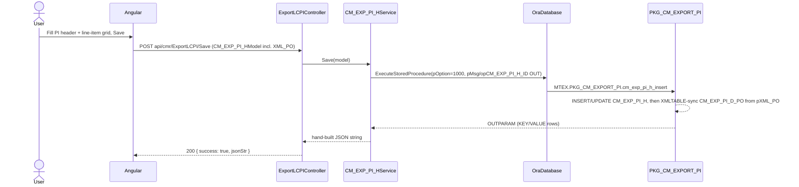
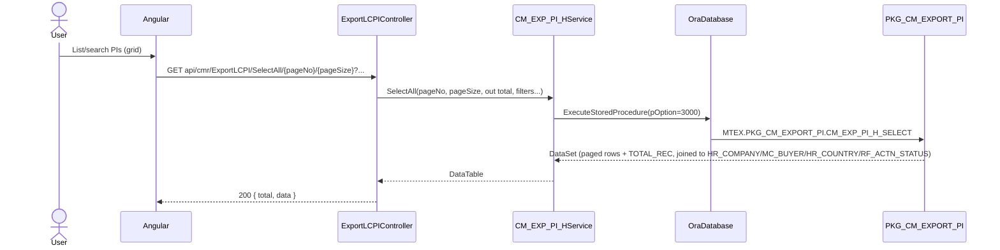

# Feature: Export LC PI (Proforma Invoice)

```yaml
---
id: feat:cmr-exp-lc-pi
module: commercial
http: GET /api/cmr/ExportLCPI/*, POST /api/cmr/ExportLCPI/Save|Update
mvc: CmrController.ExpLcPIList
api: [GET api/cmr/ExportLCPI/SelectAll/{pageNo}/{pageSize} -> ExportLCPIController.SelectAll, GET api/cmr/ExportLCPI/GetExportLcPIInfo -> ExportLCPIController.GetExportLcPIInfo, GET api/cmr/ExportLCPI/GetExportLcPIDropdown -> ExportLCPIController.GetExportLcPIDropdown, GET api/cmr/ExportLCPI/GetExportLcPIDropdownList -> ExportLCPIController.GetExportLcPIDropdownList, GET api/cmr/ExportLCPI/GetExportLcPODropdownList -> ExportLCPIController.GetExportLcPODropdownList, GET api/cmr/ExportLCPI/GetOrderDtlInfo -> ExportLCPIController.GetOrderDtlInfo, GET api/cmr/ExportLCPI/GetPOListByID -> ExportLCPIController.GetPOListByID, POST api/cmr/ExportLCPI/Save -> ExportLCPIController.Save, POST api/cmr/ExportLCPI/Update -> ExportLCPIController.Update, GET api/cmr/ExportLCPI/GetExportPIForInvoice -> ExportLCPIController.GetExportPIForInvoice, GET api/cmr/ExportLCPI/GetExportPOForInvoice -> ExportLCPIController.GetExportPOForInvoice, GET api/cmr/ExportLCPI/GetAdjustedAmount -> ExportLCPIController.GetAdjustedAmount]
service: CM_EXP_PI_HService, CM_EXP_PI_D_POService, CM_EXP_LC_D_POService
procedure: PKG_CM_EXPORT_PI.cm_exp_pi_h_insert | cm_exp_pi_h_revise | CM_EXP_PI_H_SELECT | cm_exp_pi_d_po_select, PKG_CM_EXPORT_LC.CM_EXP_MC_ORDER_H_SELECT
pOption: 1000 insert (cm_exp_pi_h_insert, self-handles update via pIS_UPDATE), 3000-3007 CM_EXP_PI_H_SELECT variants, 3000/3001 cm_exp_pi_d_po_select
tables: [CM_EXP_PI_H, CM_EXP_PI_D_PO, CM_EXP_LC_D_PO]
models: [CM_EXP_PI_HModel, CM_EXP_PI_D_POModel, CM_EXP_LC_D_POModel, ADVANCE_Pl_FOR_DROPDOWN]
session: [multiScUserId]
upstream: [commercial export LC master data (RF_PAYM_TERM, RF_INCO_TERM, RF_DELV_PLC, RF_LC_TYPE, RF_LC_COMODITY_TYPE, RF_SHIP_MODE — see commercial-reference-type.md), MC_BUYER, MC_ORDER_H]
downstream: [commercial export LC (CM_EXP_LC_D_PO.CM_EXP_PI_H_ID), Bill of Exchange (CM_EXP_BILL_OF_EX_PI_PO_REF), Commercial Invoice advance adjustment (CM_EXP_COM_INV_ADV_ADJ)]
status: inferred
---
```

## Purpose

**Export LC PI** (Commercial &gt; Export &gt; Transactions &gt; Export LC PI) is where the
commercial/export user creates a Proforma Invoice (PI) for a buyer — a preliminary invoice, with
item/quantity/price line items, that is used to open a Letter of Credit against before actual
shipment happens. A PI is created and finalized first; only a finalized PI (`IS_FINALIZED='Y'`)
that isn't already linked to an LC (`LINKED_WITH_EXP_LC='N'`) shows up in the Export LC screen's
own PI picker, where its line items get carried over into the LC's own PO/order detail rows. The
screen also supports a formal "Revise" workflow (revision number/date/reason) for amending an
already-finalized PI.

## Entry

| Kind | Value |
|---|---|
| Menu / MVC URL | Commercial &gt; Export &gt; Transactions &gt; Export LC PI (sidebar id `exp-lc-pi`) |
| API prefix | `[RoutePrefix("api/cmr")]` |
| Controller | `src/ERPSolution/Areas/Commercial/Api/ExportLCPIController.cs` |
| UI | Commercial area Angular client (not traced in this pass) |

## Execution





The `Update` action follows the same shape as `Save` but calls `cm_exp_pi_h_revise` — a distinct
procedure used for the PI **revision** workflow (`REVISION_NO`/`REVISION_DT`/`REV_REASON`), not a
generic "edit" endpoint.

## C# map

| Action | Controller method | Service / method | Procedure |
|---|---|---|---|
| List (paged, filtered) | `SelectAll` | `CM_EXP_PI_HService.SelectAll` | `PKG_CM_EXPORT_PI.CM_EXP_PI_H_SELECT` pOption=3000 |
| Get one (edit) | `GetExportLcPIInfo` | `CM_EXP_PI_HService.Select` | `CM_EXP_PI_H_SELECT` pOption=3001 |
| Dropdown (finalized, unlinked PIs) | `GetExportLcPIDropdown` | `CM_EXP_PI_HService.SelectForDropdown` | `CM_EXP_PI_H_SELECT` pOption=3002 |
| Dropdown (PI, optionally scoped to an LC) | `GetExportLcPIDropdownList` | `CM_EXP_PI_HService.GetExportLcPIDropdownList` | `CM_EXP_PI_H_SELECT` pOption=3003 |
| Dropdown (PO/order, optionally scoped to an LC) | `GetExportLcPODropdownList` | `CM_EXP_PI_HService.GetExportLcPODropdownList` | `CM_EXP_PI_H_SELECT` pOption=3004 |
| Order detail lookup (for building line items) | `GetOrderDtlInfo` | `CM_EXP_LC_D_POService.SelectExpMcOrderByFilter` | `PKG_CM_EXPORT_LC.CM_EXP_MC_ORDER_H_SELECT` pOption=3000 |
| Line items of one PI | `GetPOListByID` | `CM_EXP_PI_D_POService.GetPOListByID` | `PKG_CM_EXPORT_PI.cm_exp_pi_d_po_select` pOption=3001 |
| Create / edit | `Save` | `CM_EXP_PI_HService.Save` | `PKG_CM_EXPORT_PI.cm_exp_pi_h_insert` pOption=1000 |
| Revise | `Update` | `CM_EXP_PI_HService.Update` | `PKG_CM_EXPORT_PI.cm_exp_pi_h_revise` pOption=1000 |
| PI list for Commercial Invoice | `GetExportPIForInvoice` | `CM_EXP_PI_HService.GetExportPIForInvoice` | `CM_EXP_PI_H_SELECT` pOption=3005 |
| PO list for Commercial Invoice | `GetExportPOForInvoice` | `CM_EXP_PI_HService.GetExportPOForInvoice` | `CM_EXP_PI_H_SELECT` pOption=3007 |
| Adjusted advance amount | `GetAdjustedAmount` | `CM_EXP_PI_HService.GetAdjustedAmount` | `CM_EXP_PI_H_SELECT` pOption=3006 |

All three services (`CM_EXP_PI_HService`, `CM_EXP_PI_D_POService`, `CM_EXP_LC_D_POService`) live
in `src/ERP.BLL/Commercials/`, take a plain `OraDatabase db` constructor dependency, and read
`HttpContext.Current.Session["multiScUserId"]` for `CREATED_BY`/`LAST_UPDATED_BY` on write.

## Oracle

| Item | Value |
|---|---|
| Package | `PKG_CM_EXPORT_PI` (`src/ERPSolution/oracle/packages/PKG_CM_EXPORT_PI.sql`) |
| Insert/update | `cm_exp_pi_h_insert` — inserts `CM_EXP_PI_H` when `pCM_EXP_PI_H_ID<=0`, else updates it (branching further on `pIS_UPDATE='Y'/'N'` for which columns get touched); then bulk-syncs `CM_EXP_PI_D_PO` from the `pXML_PO` CLOB via `XMLTABLE` (delete rows missing from the XML, update/insert the rest) |
| Revise | `cm_exp_pi_h_revise` — same XML line-item sync, but updates `CM_EXP_PI_H` unconditionally (no insert branch) and additionally sets `REVISION_DT`/`REV_REASON` |
| Select | `CM_EXP_PI_H_SELECT` — one procedure, 8 `pOption` variants (3000 paged list, 3001 by ID, 3002/3003/3004 dropdowns, 3005/3007 for Commercial Invoice PI/PO pickers, 3006 adjusted-advance lookup) |
| Line items select | `cm_exp_pi_d_po_select` — pOption 3000 (all rows, no filter) / 3001 (by `CM_EXP_PI_H_ID`, joined to `INV_ITEM_CAT` x2, `MC_COLOR`, `MC_SIZE`, `RF_MOU`) |
| Main table | `CM_EXP_PI_H` |
| Child table | `CM_EXP_PI_D_PO` |
| Sequences | `CM_EXP_PI_H_SEQ`, `CM_EXP_PI_D_PO_SEQ` |

The paged list (pOption=3000) also computes `PERMISSION` per row by matching the current user
against `H.CREATED_BY`, a comma-list `ASSIGNED_TO_LST` on the linked `RF_ACTN_STATUS` workflow row,
or `ACT.ALT_ASSIGNED_TO_ID` — the same action-status/workflow pattern used across other Commercial
export transaction screens (`RF_ACTN_STATUS`, `RF_ACTN_TYPE_ID=22`).

## Request / response

**In (Save/Update):** `CM_EXP_PI_HModel` JSON body — header fields plus an `XML_PO` string field
holding the full line-item grid as `<trans><row CM_EXP_PI_D_PO_ID="..." ITEM_GROUP_ID="..." .../>
...</trans>` XML (built client-side; the C# model has no strongly-typed `items` list — the grid is
serialized to this XML string before posting).

**Out (Save/Update):** `{ success: true, jsonStr }` where `jsonStr` is hand-built from the Oracle
`OUTPARAM` table (`KEY`/`VALUE` rows, includes `opCM_EXP_PI_H_ID`), or `{ success: false, errors }`
on `ModelState` validation failure.

**Out (SelectAll):** `{ total, data }` — `data` is the raw `DataTable` (JSON array) from
`CM_EXP_PI_H_SELECT` pOption=3000, one row per PI joined to buyer/company/country/status names.

## Tables / columns touched

### `CM_EXP_PI_H` (header) — source-inferred from the fullest INSERT (`cm_exp_pi_h_insert`) /
SELECT (`Select()` in `CM_EXP_PI_HService`) in the package and model:

`CM_EXP_PI_H_ID` (PK), `HR_COMPANY_ID`, `PI_NO_EXP`, `PI_DT_EXP`, `ATTN_BUYER`, `EXP_DELV_DT`,
`MC_BUYER_ID`, `PARENT_ID` (declared as a param but never referenced in the insert/update body —
see Gaps), `REVISION_NO`, `REVISION_DT`, `REV_REASON`, `ITEM_DESC`, `DELV_DESC`, `RF_CURRENCY_ID`,
`RF_INCO_TERM_ID`, `RF_DELV_PLC_ID`, `RF_PAYM_TERM_ID`, `PAYM_TERM_DESC`, `IS_PART_SHPM`,
`IS_TRAN_SHPM`, `LOAD_PORT_ID`, `DSG_PORT_LST`, `ORG_CNTRY_ID`, `RF_LC_COMODITY_TYPE_ID`,
`PAYMENT`, `PI_VALIDITY`, `PI_VALIDITY_DESC`, `INSPECTION`, `LTST_SHPMNT_DT`, `SHIP_SCHDL`,
`RF_SHIP_MODE_ID`, `SHIP_TERM`, `PACKING`, `PCT_TOLR_LMT`, `TOLR_LMT_DESC`, `AVAIL_WITH`,
`INSURANCE`, `ADV_BKBR_ID`, `PI_TOT_VAL`, `IS_DISC_P_A`, `DISC_AMT`, `ADV_PCT`, `PI_NET_AMT`,
`ADDL_TERM`, `REMARKS`, `RF_ACTN_STATUS_ID`, `CREATION_DATE`, `CREATED_BY`, `LAST_UPDATE_DATE`,
`LAST_UPDATED_BY`, plus two flags never set by any insert/update param seen in this pass —
`IS_FINALIZED` (set only by the trailing `CASE WHEN RF_ACTN_STATUS_ID=70 THEN 'Y' ELSE 'N'`
statement in `cm_exp_pi_h_insert`) and `LINKED_WITH_EXP_LC` (read-only in every package searched —
see Unused Columns).

### `CM_EXP_PI_D_PO` (line items) — summary level. Per the real XML-sync INSERT inside
`cm_exp_pi_h_insert`/`cm_exp_pi_h_revise`, columns are: `CM_EXP_PI_D_PO_ID` (PK),
`CM_EXP_PI_H_ID` (FK to header), `ITEM_GROUP_ID`, `INV_ITEM_CAT_ID`, `MC_COLOR_ID`, `MC_SIZE_ID`,
`ORDER_QTY`, `UNIT_PRICE`, `ITEM_DESC`, `ITEM_SKU`, `TTL_VALUE`, `QTY_MOU_ID`, `CREATION_DATE`,
`CREATED_BY`, `LAST_UPDATE_DATE`, `LAST_UPDATED_BY`. This is an item/quantity-based line item (not
tied to a specific sales order/PO row) — see Gaps for the mismatch with `CM_EXP_PI_D_POModel`.

### `CM_EXP_LC_D_PO` — not owned by this feature (it's the Export LC's own PO/order detail table,
traced fully under the Export LC feature), but it carries the confirmed FK back to this screen:
`CM_EXP_LC_D_PO.CM_EXP_PI_H_ID` is a real column, populated by `PKG_CM_EXPORT_LC`'s own insert
(`src/ERPSolution/oracle/packages/PKG_CM_EXPORT_LC.sql` lines ~964-974, ~1075-1085, ~1623-1633),
and joined back to `CM_EXP_PI_H` inside this feature's own `CM_EXP_PI_H_SELECT` pOption=3003
(`INNER JOIN CM_EXP_LC_D_PO LH ON LH.CM_EXP_PI_H_ID = PH.CM_EXP_PI_H_ID`, line 604). This is the
one concrete, source-confirmed link between a PI and the Export LC it eventually gets opened
against — an LC's PO/order line remembers which PI it was carried over from.

FKs (all by exact column name seen in code, not just naming convention):
- `CM_EXP_PI_H.HR_COMPANY_ID` → `HR_COMPANY` (joined in `CM_EXP_PI_H_SELECT` 3000)
- `CM_EXP_PI_H.MC_BUYER_ID` → `MC_BUYER` (joined in `CM_EXP_PI_H_SELECT` 3000)
- `CM_EXP_PI_H.ORG_CNTRY_ID` → `HR_COUNTRY` (left-joined in `CM_EXP_PI_H_SELECT` 3000)
- `CM_EXP_PI_H.RF_ACTN_STATUS_ID` → `RF_ACTN_STATUS` (joined in `CM_EXP_PI_H_SELECT` 3000, drives workflow/permission)
- `CM_EXP_PI_H.RF_CURRENCY_ID / RF_INCO_TERM_ID / RF_DELV_PLC_ID / RF_PAYM_TERM_ID / RF_LC_COMODITY_TYPE_ID / RF_SHIP_MODE_ID` → the Commercial Export "Reference Type" lookup tables documented in `commercial-reference-type.md` (by exact ID-column match; not re-confirmed via a JOIN in this pass)
- `CM_EXP_PI_D_PO.CM_EXP_PI_H_ID` → `CM_EXP_PI_H.CM_EXP_PI_H_ID` (header/detail, real INSERT column)
- `CM_EXP_PI_D_PO.ITEM_GROUP_ID / INV_ITEM_CAT_ID` → `INV_ITEM_CAT` (joined twice, once per role, in `cm_exp_pi_d_po_select` 3001)
- `CM_EXP_PI_D_PO.MC_COLOR_ID` → `MC_COLOR`, `CM_EXP_PI_D_PO.MC_SIZE_ID` → `MC_SIZE`, `CM_EXP_PI_D_PO.QTY_MOU_ID` → `RF_MOU` (all joined in `cm_exp_pi_d_po_select` 3001)
- `CM_EXP_LC_D_PO.CM_EXP_PI_H_ID` → `CM_EXP_PI_H.CM_EXP_PI_H_ID` (see above)

Downstream confirmed by real JOIN in `src/ERPSolution/oracle/packages/PKG_CM_REPORT.sql` (PI print/report queries, ~lines 150-2032, 3253-3305) and in this package's own selects:
- `CM_EXP_BILL_OF_EX_PI_PO_REF` / `CM_EXP_BILL_OF_EX_H` (Bill of Exchange) — joined in `CM_EXP_PI_H_SELECT` pOption 3005/3007 to list PI/PO for a Bill of Exchange's buyer/LC.
- `CM_EXP_COM_INV_ADV_ADJ` (Commercial Invoice advance adjustment) — joined in `CM_EXP_PI_H_SELECT` pOption 3006 (`GetAdjustedAmount`), keyed by `CM_EXP_COM_INV_H_ID`.

## Permissions / session

`Save`/`Update` read `HttpContext.Current.Session["multiScUserId"]` for `CREATED_BY`/
`LAST_UPDATED_BY` (same convention as other Commercial services). The paged list additionally
passes the session user into `CM_EXP_PI_H_SELECT` as `pUSER_ID`, which the procedure uses to
compute a per-row `PERMISSION` flag from the linked `RF_ACTN_STATUS` workflow's assignee list — no
separate menu-permission check was seen in the controller itself.

## Dependencies (other features)

- **Upstream**: Commercial "Reference Type" master data (`commercial-reference-type.md`) for
  payment/inco terms, delivery place, LC commodity type, ship mode; `MC_BUYER` (buyer master);
  `MC_ORDER_H` (order, via `GetOrderDtlInfo` → `PKG_CM_EXPORT_LC.CM_EXP_MC_ORDER_H_SELECT`, used to
  pull order/style/color/size context when building PI line items).
- **Downstream**: Export LC (`CM_EXP_LC_D_PO.CM_EXP_PI_H_ID`, docs owned by the sibling agent
  documenting `commercial-exp-lc-contract.md` — that file did not exist in this repo as of this
  pass, so the relationship is noted here from this feature's own source, not cross-checked
  against that doc); Bill of Exchange (`CM_EXP_BILL_OF_EX_PI_PO_REF`); Commercial Invoice advance
  adjustment (`CM_EXP_COM_INV_ADV_ADJ`).

## Gaps

- **`CM_EXP_PI_D_POService` (Save/Update/Delete) targets a procedure that doesn't exist**:
  `SP_CM_EXP_PI_D_PO` is not defined anywhere under `src/ERPSolution/oracle/packages/`. No
  controller action in `ExportLCPIController` calls these methods — the real line-item write path
  is the `pXML_PO` bulk sync inside `cm_exp_pi_h_insert`/`cm_exp_pi_h_revise`. Same pattern as the
  dead `Update()` methods documented in `commercial-reference-type.md`.
- **`CM_EXP_PI_HService.Delete` targets `SP_CM_EXP_PI_H`**, also not found in any package, and no
  controller route exposes a delete action — dead code.
- **`CM_EXP_PI_D_POModel` doesn't match the real `CM_EXP_PI_D_PO` table shape.** The model (and the
  dead `Save`/`Update`/`Delete`/`SelectAll`/`SelectByID` methods built around it) uses
  `MC_ORDER_H_ID`, `MC_STYLE_D_ITEM_ID`, `MC_SIZE_LST` — the same shape as `CM_EXP_LC_D_PO`/
  `CM_EXP_LC_D_POModel`. But the actual live INSERT (via XML sync in `cm_exp_pi_h_insert`) writes
  `ITEM_GROUP_ID`, `INV_ITEM_CAT_ID`, `MC_SIZE_ID`, `ITEM_SKU`, `TTL_VALUE` instead — an
  item/quantity-based line, not an order/style-based one. Looks like the model was copied from the
  Export LC detail model and never updated for PI's own line-item shape; the working UI must be
  building/parsing the `XML_PO` string directly rather than going through this model's fields.
- **`CM_EXP_PI_HService.UpdateHHHHHH`** is an unused, oddly-named duplicate of `Update` (with a
  large commented-out block inside) — dead code, not called by the controller.
- **`cm_exp_pi_h_revise` does not write to history tables.** The insert statements into
  `CM_EXP_PI_H_HST` / `CM_EXP_PI_D_PO_HST` / `CM_EXP_LC_D_NTFP_HST` for archiving the pre-revision
  row are entirely commented out in the package body (lines ~332-353) — a PI revision today
  overwrites the header in place with no audit trail, despite the history tables and their
  sequences existing.
- **Debug leftover**: the exception handler in `cm_exp_pi_h_revise` does
  `insert into test_tab values(v_msg)` — writes to what looks like a scratch/debug table whenever
  the revise procedure hits `WHEN OTHERS`.
- **`pPARENT_ID`** is accepted as a parameter by both `cm_exp_pi_h_insert` and
  `cm_exp_pi_h_revise` but is never referenced anywhere in either procedure body — effectively a
  no-op parameter.
- **`CM_EXP_PI_D_POService.Save`/`Update`/`Delete`** build their `jsonStr` response with
  `dr["KEY"] + ":" + dr["VALUE"] + ","` unconditionally, then append another separator/`}` —
  produces malformed JSON. Moot in practice since these methods are unreachable (see above), but
  flagged in case they're ever wired up.
- No DDL exists in the repo for `CM_EXP_PI_H` or `CM_EXP_PI_D_PO`; all columns above are
  source-inferred from the fullest INSERT/SELECT/model seen, not verified against a live DB
  (`ADV_BKBR_ID`'s target lookup table, e.g. `RF_BANK`, was not confirmed by any JOIN in this
  pass — inferred from naming only).
- This screen's own Angular front-end (grid wiring, how `XML_PO` gets built from the item grid)
  was not traced — this pass covers Controller → Service → Oracle package → table only.
- The relationship to Export LC / Sales Contract Entry (`commercial-exp-lc-contract.md`) is based
  on this feature's own package evidence (`CM_EXP_LC_D_PO.CM_EXP_PI_H_ID`); that sibling feature
  file did not exist in the repo at the time of this pass, so no cross-check against its own
  documented facts was possible.
