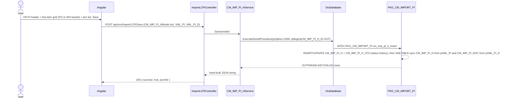
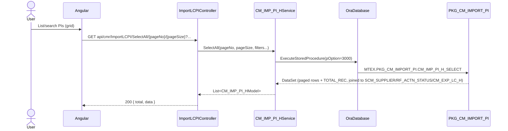

# Feature: Import LC PI (Proforma Invoice)

```yaml
---
id: feat:cmr-imp-lc-pi
module: commercial
http: GET /api/cmr/ImportLCPI/*, POST /api/cmr/ImportLCPI/Save|Update|RevisePO|Delete
mvc: CmrController.ImpLcPIList
api: [GET api/cmr/ImportLCPI/SelectAll/{pageNo}/{pageSize} -> ImportLCPIController.SelectAll, GET api/cmr/ImportLCPI/GetImportPIListByFilter -> ImportLCPIController.GetImportPIListByFilter, GET api/cmr/ImportLCPI/GetPOBySupplier -> ImportLCPIController.GetPOBySupplier, POST api/cmr/ImportLCPI/GetPOBySupplierWithFilter -> ImportLCPIController.GetPOBySupplierWithFilter, GET api/cmr/ImportLCPI/GetImportLCPIInfo -> ImportLCPIController.GetImportLCPIInfo, GET api/cmr/ImportLCPI/GetImportLCPIInfoBySupplierID -> ImportLCPIController.GetImportLCPIInfoBySupplierID, GET api/cmr/ImportLCPI/GetPIDtlInfo -> ImportLCPIController.GetPIDtlInfo, GET api/cmr/ImportLCPI/GetPIImpDetailsByPIHId -> ImportLCPIController.GetPIImpDetailsByPIHId, GET api/cmr/ImportLCPI/GetPIDocDtlInfo -> ImportLCPIController.GetPIDocDtlInfo, GET api/cmr/ImportLCPI/GetPOListByID -> ImportLCPIController.GetPOListByID, GET api/cmr/ImportLCPI/GetPaginatedLCDropdown -> ImportLCPIController.GetPaginatedLCDropdown, POST api/cmr/ImportLCPI/Save -> ImportLCPIController.Save, POST api/cmr/ImportLCPI/Update -> ImportLCPIController.Update, POST api/cmr/ImportLCPI/RevisePO -> ImportLCPIController.RevisePO, POST api/cmr/ImportLCPI/Delete -> ImportLCPIController.Delete, GET api/cmr/ImportLCPI/GetWODetailListForImpPIByWOHID -> ImportLCPIController.GetWODetailListForImpPIByWOHID]
service: CM_IMP_PI_HService, CM_IMP_PI_D_YRNService, CM_IMP_PI_DOCService, CM_IMP_PO_HService, CM_EXP_PI_D_POService
procedure: PKG_CM_IMPORT_PI.cm_imp_pi_h_insert | cm_imp_pi_h_update | cm_imp_pi_h_revise | CM_IMP_PI_H_SELECT | CM_IMP_PI_D_select | cm_imp_pi_doc_select | IMPORT_LC_PI_DELETE
pOption: 1000 insert, 2000 update (both Update and RevisePO controller actions call procedures that use pOption=2000 internally), 3000-3006 CM_IMP_PI_H_SELECT variants, 3000-3002 CM_IMP_PI_D_select, 3000-3001 cm_imp_pi_doc_select, 1000 IMPORT_LC_PI_DELETE
tables: [CM_IMP_PI_H, CM_IMP_PI_D, CM_IMP_PI_DOC, CM_IMP_PI_H_STS, CM_IMP_PI_H_HIST, CM_IMP_PI_D_HIST, CM_IMP_LC_PI]
models: [CM_IMP_PI_HModel, CM_IMP_PI_D_YRNModel, CM_IMP_PI_DOCModel, CM_IMP_PI_H_Delete_MODEL]
session: [multiScUserId]
upstream: [SCM_SUPPLIER (supplier master), CM_IMP_PO_H/CM_IMP_PO_D (Import PO, via GetPOBySupplier(WithFilter)), GMT_SERVICES_WO_H/GMT_SERVICES_WO_ORDER (Services Work Order, alternate line-item source), CM_EXP_LC_H (Export LC header, direct FK on the PI header)]
downstream: [CM_IMP_LC_PI (Import LC's own PI-linking table, keyed by CM_IMP_LC_H_ID + CM_IMP_PI_H_ID) - documented from this feature's own package evidence since docs/features/commercial-imp-lc.md did not exist in the repo as of this pass]
status: inferred
---
```

## Purpose

**Import LC PI** (Commercial &gt; Import &gt; Import LC PI, sidebar id `imp-lc-pi`) is where the
commercial/import user records a Proforma Invoice (PI) received **from a supplier** for imported
goods (yarn/fabric/accessories or an imported service work order) — the supplier-side counterpart
of the Export LC PI screen. A PI here can be created directly against an Import PO
(`CM_IMP_PO_D`) or against an imported Services Work Order (`GMT_SERVICES_WO_ORDER`), can be
formally revised (revision number/date/reason, with real history rows written this time — see
Gaps), and — once finalized — is picked up by the separate Import LC screen to open a back-to-back
Import LC against it (`CM_IMP_LC_PI` junction table, confirmed by real `JOIN`, not by naming
convention). The header also carries a direct link to an **Export LC** (`CM_EXP_LC_H_ID`), which
fits the back-to-back trade-finance pattern: an import PI for raw materials can be tied to the
export LC/order it will ultimately be shipped against.

## Entry

| Kind | Value |
|---|---|
| Menu / MVC URL | Commercial &gt; Import &gt; Import LC PI (sidebar id `imp-lc-pi`) |
| API prefix | `[RoutePrefix("api/cmr")]` |
| Controller | `src/ERPSolution/Areas/Commercial/Api/ImportLCPIController.cs` |
| UI | Commercial area Angular client (not traced in this pass) |

## Execution





`RevisePO` calls `CM_IMP_PI_HService.RevisePO` → `pkg_cm_import_pi.cm_imp_pi_h_revise`, a distinct
procedure that snapshots the current header/line rows into `CM_IMP_PI_H_HIST`/`CM_IMP_PI_D_HIST`
**before** applying the revision — unlike the Export LC PI screen's `cm_exp_pi_h_revise`, whose
equivalent history inserts are commented out (see `commercial-exp-lc-pi.md` Gaps). `Update` instead
calls `CM_IMP_PI_HService.Update` → `pkg_cm_import_pi.cm_imp_pi_h_update`, a plain in-place update
(no history snapshot) gated by a `pIS_REVISION_NO` flag that decides whether to reset
`IS_FINALIZED`/`RF_ACTN_STATUS_ID`.

## C# map

| Action | Controller method | Service / method | Procedure |
|---|---|---|---|
| List (paged, filtered) | `SelectAll` | `CM_IMP_PI_HService.SelectAll` | `CM_IMP_PI_H_SELECT` pOption=3000 |
| List (paged, filtered, incl. approval-date range) | `GetImportPIListByFilter` | `CM_IMP_PI_HService.GetImportPIListByFilter` | `CM_IMP_PI_H_SELECT` pOption=3004 |
| PO dropdown for a supplier | `GetPOBySupplier` | `CM_IMP_PO_HService.SelectByID` | (Import PO's own package — not traced here) |
| PO dropdown for a supplier, filtered | `GetPOBySupplierWithFilter` | `CM_IMP_PO_HService.GetPOBySupplierWithFilter` | (Import PO's own package — not traced here) |
| Get one (edit) | `GetImportLCPIInfo` | `CM_IMP_PI_HService.Select` | `CM_IMP_PI_H_SELECT` pOption=3001 |
| Aggregate PI totals for a supplier/commodity (dropdown) | `GetImportLCPIInfoBySupplierID` | `CM_IMP_PI_HService.SelectByID` | `CM_IMP_PI_H_SELECT` pOption=3002 |
| Line items (yarn/PO-style) of one PI | `GetPIDtlInfo` | `CM_IMP_PI_D_YRNService.SelectByID` | `pkg_cm_import_pi.cm_imp_pi_d_select` pOption=3001 |
| Line items, incl. WO source, richer shape | `GetPIImpDetailsByPIHId` | `CM_IMP_PI_D_YRNService.SelectPIImpDetailsByPIHId` | `CM_IMP_PI_D_SELECT` pOption=3002 |
| Document/report list for a PI | `GetPIDocDtlInfo` | `CM_IMP_PI_DOCService.SelectByID` | `cm_imp_pi_doc_select` pOption=3001 |
| PO line items for a PI (see Gaps — cross-wired) | `GetPOListByID` | `CM_EXP_PI_D_POService.GetPOListByID` | `PKG_CM_EXPORT_PI.CM_EXP_PI_D_PO_SELECT` pOption=3001 |
| Import LC dropdown (paginated) | `GetPaginatedLCDropdown` | `CM_IMP_PI_HService.GetPaginatedLCDropdown` | `pkg_common.CM_EXP_LC_PAGINATED` |
| Create | `Save` | `CM_IMP_PI_HService.Save` | `cm_imp_pi_h_insert` pOption=1000 |
| Update (no history) | `Update` | `CM_IMP_PI_HService.Update` | `cm_imp_pi_h_update` pOption=2000 |
| Revise (with history snapshot) | `RevisePO` | `CM_IMP_PI_HService.RevisePO` | `cm_imp_pi_h_revise` pOption=2000 |
| Delete | `Delete` | `CM_IMP_PI_HService.Delete` | `IMPORT_LC_PI_DELETE` pOption=1000 |
| Services WO detail list for building a PI line | `GetWODetailListForImpPIByWOHID` | `CM_IMP_PI_HService.GetWOForPIByWOHID` | `CM_IMP_PI_H_SELECT` pOption=3006 |

All services live in `src/ERP.BLL/Commercials/`, take a plain `OraDatabase db` constructor
dependency; `CM_IMP_PI_HService.Save/Update/RevisePO` read
`HttpContext.Current.Session["multiScUserId"]` for `CREATED_BY`/`LAST_UPDATED_BY` — the sibling
detail services (`CM_IMP_PI_D_YRNService`, `CM_IMP_PI_DOCService`) instead take those values off the
posted model directly (only relevant to their dead `Save`/`Update`/`Delete` methods — see Gaps).

## Oracle

| Item | Value |
|---|---|
| Package | `PKG_CM_IMPORT_PI` (`src/ERPSolution/oracle/packages/PKG_CM_IMPORT_PI.sql`) |
| Insert | `cm_imp_pi_h_insert` — inserts `CM_IMP_PI_H` (+ `CM_IMP_PI_H_STS` status-history row) when `pCM_IMP_PI_H_ID<=0`, else updates it; `IS_FINALIZED` is derived from `RF_ACTN_STATUS.ACTN_ROLE_FLAG='DN'` for `RF_ACTN_TYPE_ID=44` ("Import PI Workflow"); then bulk-syncs `CM_IMP_PI_D` from `pXML_PI` and `CM_IMP_PI_DOC` from `pXML_PI_D` (both via `XMLTABLE`, delete-then-upsert) |
| Update | `cm_imp_pi_h_update` — same shape, no `RF_ACTN_STATUS_ID`/`IS_FINALIZED` reset unless `pIS_REVISION_NO='Y'`; same two XML syncs |
| Revise | `cm_imp_pi_h_revise` — snapshots the current `CM_IMP_PI_H` row into `CM_IMP_PI_H_HIST` and the current `CM_IMP_PI_D` rows into `CM_IMP_PI_D_HIST` **before** bumping `REVISION_NO`/`REVISION_DT`/`REV_REASON` (hardcoded `'PO Change'`) and re-syncing `CM_IMP_PI_D` from `pXML_PI`; also mirrors qty/price/brand/color changes back onto `CM_IMP_PO_D` for any row still linked to an import PO |
| Select | `CM_IMP_PI_H_SELECT` — one procedure, 6 `pOption` branches: 3000 paged list (joins `SCM_SUPPLIER`, `RF_ACTN_STATUS`, left-joins `CM_EXP_LC_H`), 3001 by ID, 3002 aggregated totals per PI (two `UNION ALL` branches — one via Services WO, one via Import PO line), 3003 by comma-list of IDs, 3004 paged list with approval-date filter, 3005 **Import LC's own PI picker** (`CM_IMP_LC_PI` joined to `CM_IMP_PI_H`, filtered by `pCM_IMP_LC_H_ID`), 3006 Services WO detail lines available for a PI |
| Detail select | `CM_IMP_PI_D_select` — pOption 3000 (all rows), 3001 (by `CM_IMP_PI_H_ID`, PO-sourced rows only, joined through `CM_IMP_PO_D`/`SCM_PURC_REQ_D`/`SCM_PURC_REQ_H`/style/buyer chain), 3002 (by `CM_IMP_PI_H_ID`, `UNION ALL` of PO-sourced rows and Services-WO-sourced rows, tagged `SRC_TYPE='PO'`/`'WO'`) |
| Doc select | `cm_imp_pi_doc_select` — pOption 3000 (all), 3001 (by `CM_IMP_PI_H_ID`) |
| Delete | `IMPORT_LC_PI_DELETE` — hard-deletes `CM_IMP_PI_H_STS`, `CM_IMP_PI_D`, `CM_IMP_PI_DOC`, then `CM_IMP_PI_H` (history tables `CM_IMP_PI_H_HIST`/`CM_IMP_PI_D_HIST` are deliberately left alone — their own delete is commented out) |
| Main table | `CM_IMP_PI_H` |
| Child tables | `CM_IMP_PI_D` (line items), `CM_IMP_PI_DOC` (attached report/documents), `CM_IMP_PI_H_STS` (status/workflow history), `CM_IMP_PI_H_HIST`/`CM_IMP_PI_D_HIST` (revision snapshots) |
| Sequences | `CM_IMP_PI_H_SEQ`, `CM_IMP_PI_D_SEQ`, `CM_IMP_PI_DOC_SEQ`, `CM_IMP_PI_H_STS_SEQ`, `CM_IMP_PI_H_HIST_SEQ`, `CM_IMP_PI_D_HIST_SEQ` |
| Helper function | `CM_IMP_PI_H_CODE_AUTO_GEN` generates `PI_TRAC_NO` as `TRK-` + a yearly running number read off existing `PI_TRAC_NO` values; `FN_GET_IMP_PI_PO_NO` derives a display-only, comma-joined `PO_NO_IMP` string for a PI by walking `CM_IMP_PI_D` → `CM_IMP_PO_D` → `CM_IMP_PO_H` |

## Request / response

**In (Save/Update/RevisePO):** `CM_IMP_PI_HModel` JSON body — header fields plus `XML_PI` (line
items as `<trans><row CM_IMP_PI_D_ID="..." CM_IMP_PO_D_ID="..." GMT_SERVICES_WO_ORDER_ID="..."
INV_ITEM_ID="..." LK_YRN_COLR_GRP_ID="..." RF_BRAND_ID="..." HS_CODE="..." PI_QTY="..."
UNIT_PRICE="..." QTY_MOU_ID="..." .../></trans>` XML) and `XML_PI_D` (attached documents as
`<trans><row CM_IMP_PI_DOC_ID="..." RPT_PATH_URL="..." /></trans>` XML) — both built client-side;
neither the line-item nor document grids go through a strongly-typed list on the model.

**Out (Save/Update/RevisePO):** `{ success: true, jsonStr }` where `jsonStr` is hand-built from the
Oracle `OUTPARAM` table (`KEY`/`VALUE` rows, includes `opCM_IMP_PI_H_ID`), or
`{ success: false, errors }` on `ModelState` validation failure.

**Out (SelectAll):** `{ total, data }` — `data` is `List<CM_IMP_PI_HModel>` from `CM_IMP_PI_H_SELECT`
pOption=3000, one row per PI joined to supplier/status/Export-LC names.

## Tables / columns touched

### `CM_IMP_PI_H` (header) — source-inferred from the fullest INSERT (`cm_imp_pi_h_insert`) / SELECT
(`Select()` in `CM_IMP_PI_HService`, pOption=3001) in the package and model:

`CM_IMP_PI_H_ID` (PK), `SCM_SUPPLIER_ID`, `PI_TRAC_NO` (system-generated `TRK-NNNNNNNNNN`),
`PI_NO_IMP`, `PI_DT_IMP`, `PI_VAL_DT`, `REVISION_NO`, `REVISION_DT`, `REV_REASON`, `PI_NET_AMT`,
`PI_REV_AMT`, `TERMS_DESC`, `RF_ACTN_STATUS_ID`, `IS_FINALIZED` (derived, not settable directly by
the caller), `CM_EXP_LC_H_ID` (direct FK to the Export LC header — see Relationships), `CREATION_DATE`,
`CREATED_BY`, `LAST_UPDATE_DATE`, `LAST_UPDATED_BY`. Rows returned by the paged-list select
(pOption=3000/3004) additionally carry joined-in display fields that are not real columns on this
table: `SUP_TRD_NAME_EN` (from `SCM_SUPPLIER`), `PO_NO_IMP` (from the `FN_GET_IMP_PI_PO_NO`
function), `EVENT_NAME`/`ACTN_ROLE_FLAG` (from `RF_ACTN_STATUS`), `EXP_LCSC_NO`/`ISSUE_DT` (from the
left-joined `CM_EXP_LC_H`), `APPROVED_DATE` (subquery against `CM_IMP_PI_H_STS` for
`RF_ACTN_STATUS_ID=138`), `TOTAL_REC` (paging total).

### `CM_IMP_PI_D` (line items) — summary level. Per the real XML-sync INSERT inside
`cm_imp_pi_h_insert`/`cm_imp_pi_h_update`, columns are: `CM_IMP_PI_D_ID` (PK), `CM_IMP_PI_H_ID` (FK
to header), `CM_IMP_PO_D_ID` (nullable — set when the line comes from an Import PO),
`GMT_SERVICES_WO_ORDER_ID` (nullable — set instead when the line comes from a Services Work Order;
the two source columns are mutually exclusive per the `CM_IMP_PI_D_select` pOption=3002 `UNION ALL`
of PO-sourced vs. WO-sourced rows), `INV_ITEM_ID`, `LK_YRN_COLR_GRP_ID`, `RF_BRAND_ID`, `HS_CODE`,
`PI_QTY`, `QTY_MOU_ID`, `UNIT_PRICE`, `CREATION_DATE`, `CREATED_BY`, `LAST_UPDATE_DATE`,
`LAST_UPDATED_BY`. Note the C# service/model class is named `CM_IMP_PI_D_YRNService`/
`CM_IMP_PI_D_YRNModel` ("YRN" = yarn), but the real Oracle table is `CM_IMP_PI_D` — there is no
`CM_IMP_PI_D_YRN` table anywhere in the package.

### `CM_IMP_PI_DOC` (attached documents) — summary level. Real INSERT columns:
`CM_IMP_PI_DOC_ID` (PK), `CM_IMP_PI_H_ID` (FK), `PI_NO_IMP`, `REVISION_NO`, `RPT_PATH_URL`,
`CREATION_DATE`, `CREATED_BY`, `LAST_UPDATE_DATE`, `LAST_UPDATED_BY`.

### `CM_IMP_PI_H_STS` (status/workflow history) — summary level, real INSERT/UPDATE columns seen in
`cm_imp_pi_h_insert`/`cm_imp_pi_h_update`: `CM_IMP_PI_H_STS_ID` (PK), `CM_IMP_PI_H_ID` (FK),
`RF_ACTN_STATUS_ID`, `ACTION_DATE`, `ACTION_BY`, `IS_VISIBLE`, `REMARKS`, `CREATION_DATE`,
`CREATED_BY`, plus `LAST_UPDATE_DATE`/`LAST_UPDATED_BY` on the "repeat" update path. Every
`RF_ACTN_STATUS_ID=138` row here is read back as the PI's `APPROVED_DATE`.

### `CM_IMP_PI_H_HIST` / `CM_IMP_PI_D_HIST` (revision snapshots) — summary level, populated only by
`cm_imp_pi_h_revise`: a straight `SELECT ... FROM CM_IMP_PI_H`/`CM_IMP_PI_D` copy keyed by a new
`CM_IMP_PI_H_HIST_ID` per revision.

### `CM_IMP_LC_PI` — not owned by this feature (it's the Import LC screen's own PI-linking table),
but it carries the confirmed real link back to this screen: joined in this feature's own
`CM_IMP_PI_H_SELECT` pOption=3005 as
`FROM CM_IMP_LC_PI LCPI INNER JOIN CM_IMP_PI_H PIH ON PIH.CM_IMP_PI_H_ID = LCPI.CM_IMP_PI_H_ID ...
WHERE LCPI.CM_IMP_LC_H_ID=pCM_IMP_LC_H_ID` (comment: *"This option is being used in Imp Lc Screen
while loading PI for existing LC"*). Columns visible from that query: `CM_IMP_LC_PI_ID` (PK),
`CM_IMP_LC_H_ID` (FK to Import LC header), `CM_IMP_PI_H_ID` (FK to this feature's header),
`RF_MOU_ID`, `RF_CURRENCY_ID`, `TOT_PI_QTY`, `TOT_PI_VALUE` — a per-PI aggregate row scoped to one
Import LC, not a line-item table.

FKs (all by exact column name seen in code, not just naming convention):
- `CM_IMP_PI_H.SCM_SUPPLIER_ID` → `SCM_SUPPLIER` (joined in `CM_IMP_PI_H_SELECT` 3000/3001/3002)
- `CM_IMP_PI_H.RF_ACTN_STATUS_ID` → `RF_ACTN_STATUS` (joined in `CM_IMP_PI_H_SELECT` 3000/3004; workflow type `RF_ACTN_TYPE_ID=44` "Import PI Workflow")
- `CM_IMP_PI_H.CM_EXP_LC_H_ID` → `CM_EXP_LC_H` (left-joined in `CM_IMP_PI_H_SELECT` 3000/3004 for `EXP_LCSC_NO`/`ISSUE_DT`) — see Gaps for the naming oddity
- `CM_IMP_PI_D.CM_IMP_PI_H_ID` → `CM_IMP_PI_H.CM_IMP_PI_H_ID` (header/detail, real INSERT column)
- `CM_IMP_PI_D.CM_IMP_PO_D_ID` → `CM_IMP_PO_D` (Import PO detail — left-joined in `CM_IMP_PI_D_select` 3001/3002)
- `CM_IMP_PI_D.GMT_SERVICES_WO_ORDER_ID` → `GMT_SERVICES_WO_ORDER` (Services Work Order line — joined in `CM_IMP_PI_D_select` 3002's WO branch and `CM_IMP_PI_H_SELECT` 3006)
- `CM_IMP_PI_D.INV_ITEM_ID` → `INV_ITEM`, `CM_IMP_PI_D.RF_BRAND_ID` → `RF_BRAND`, `CM_IMP_PI_D.QTY_MOU_ID` → `RF_MOU`, `CM_IMP_PI_D.LK_YRN_COLR_GRP_ID` → `LOOKUP_DATA` (all joined in `CM_IMP_PI_D_select`)
- `CM_IMP_PI_DOC.CM_IMP_PI_H_ID` → `CM_IMP_PI_H.CM_IMP_PI_H_ID`
- `CM_IMP_PI_H_STS.CM_IMP_PI_H_ID` → `CM_IMP_PI_H.CM_IMP_PI_H_ID`
- `CM_IMP_LC_PI.CM_IMP_PI_H_ID` → `CM_IMP_PI_H.CM_IMP_PI_H_ID` (see above); `CM_IMP_LC_PI.CM_IMP_LC_H_ID` → Import LC header (table name inferred by convention as `CM_IMP_LC_H`, not independently confirmed in this pass — `docs/features/commercial-imp-lc.md` did not exist yet)

## Permissions / session

`Save`/`Update`/`RevisePO` read `HttpContext.Current.Session["multiScUserId"]` for
`CREATED_BY`/`LAST_UPDATED_BY` (same convention as other Commercial services). No separate
menu-permission check was seen in the controller itself; the paged list does not compute a
per-row `PERMISSION` flag the way the Export LC PI screen's `CM_EXP_PI_H_SELECT` 3000 does.

## Dependencies (other features)

- **Upstream**: `SCM_SUPPLIER` (supplier master); Import PO (`CM_IMP_PO_H`/`CM_IMP_PO_D`, via
  `GetPOBySupplier`/`GetPOBySupplierWithFilter` → `CM_IMP_PO_HService`, and via `CM_IMP_PI_D.CM_IMP_PO_D_ID`);
  Services Work Order (`GMT_SERVICES_WO_H`/`GMT_SERVICES_WO_ORDER`, via `GetWODetailListForImpPIByWOHID`
  and `CM_IMP_PI_D.GMT_SERVICES_WO_ORDER_ID`); Export LC (`CM_EXP_LC_H`, via `CM_IMP_PI_H.CM_EXP_LC_H_ID`).
- **Downstream**: Import LC (`CM_IMP_LC_PI.CM_IMP_PI_H_ID`) — a finalized PI is picked up there to
  open a back-to-back Import LC; docs/features/commercial-imp-lc.md did not exist in the repo as of
  this pass, so this is noted from this feature's own source only, not cross-checked.

## Gaps

- **`GetPOListByID` looks cross-wired to the wrong (Export) feature.** The controller action
  `ImportLCPIController.GetPOListByID` — reached from `api/cmr/ImportLCPI/GetPOListByID?pCM_IMP_PI_H_ID=`
  — calls `_cm_EXP_PI_D_POService.GetPOListByID(pCM_IMP_PI_H_ID)`, which runs
  `PKG_CM_EXPORT_PI.CM_EXP_PI_D_PO_SELECT` pOption=3001 against `CM_EXP_PI_D_PO` (the **Export** PI's
  own line-item table), filtered by a parameter the service itself names `pCM_EXP_PI_H_ID`. The
  route's Import PI ID is being handed into an Export-PI-shaped query. This looks like a
  copy/paste from the Export LC PI controller that was never rewired to the Import services
  (`CM_IMP_PI_D_YRNService.SelectByID`/`SelectPIImpDetailsByPIHId` already cover the real Import line
  items via other routes: `GetPIDtlInfo`/`GetPIImpDetailsByPIHId`). Flagged, not fixed, in this pass.
- **`CM_IMP_PI_D_YRNService.Select(Int64? pCM_IMP_PI_H_ID)` targets a procedure that doesn't exist**:
  `pkg_cm_import_pi.cm_imp_pi_d_yrn_select` is not declared anywhere in `PKG_CM_IMPORT_PI` (only
  `CM_IMP_PI_D_select` exists). No controller action calls this `Select` method — dead code.
- **`CM_IMP_PI_D_YRNService.Save`/`Update`/`Delete` target `SP_CM_IMP_PI_D_YRN`**, and
  **`CM_IMP_PI_DOCService.Save`/`Update`/`Delete` target `SP_CM_IMP_PI_DOC`** — neither procedure is
  defined anywhere under `src/ERPSolution/oracle/packages/`. No controller route exposes any of these
  six methods; the real line-item/document write path is the `pXML_PI`/`pXML_PI_D` bulk sync inside
  `cm_imp_pi_h_insert`/`cm_imp_pi_h_update`/`cm_imp_pi_h_revise`. Same dead-service pattern already
  seen on the Export LC PI screen (`commercial-exp-lc-pi.md`).
- **`pCM_IMP_LC_H_ID` on `CM_IMP_PI_H_SELECT`** is declared as a parameter but never referenced in
  any of the procedure's six `pOption` branches — a no-op parameter, same pattern as `pPARENT_ID` on
  the Export LC PI package.
- **`CM_IMP_PI_H.CM_EXP_LC_H_ID` naming is surprising for an Import-side table.** It is a real,
  actively-written/joined column (set in `cm_imp_pi_h_insert`/`cm_imp_pi_h_update`, read back as
  `EXP_LCSC_NO` in the paged list) — not naming-convention guesswork — but ties an *Import* PI
  directly to an *Export* LC header rather than to an Import LC. Read together with the separate,
  confirmed `CM_IMP_LC_PI` junction table (which links to the Import LC), this PI header appears to
  carry two independent LC-side relationships: one to the Export LC it's ultimately shipped against
  (back-to-back sourcing) and one to the Import LC opened to pay for it. Not verified against a live
  DB or against the Import LC feature's own documentation (not yet written as of this pass).
- **`CM_IMP_PI_HService.Update` and `.RevisePO`** both pass `pOption=2000` to their respective
  procedures, but the two procedures (`cm_imp_pi_h_update` vs. `cm_imp_pi_h_revise`) are distinct,
  separately-declared package procedures — `pOption` is not actually used for branching inside
  either one (each procedure body runs unconditionally); the `pOption` parameter here is vestigial.
- No DDL exists in the repo for any table in this feature; all columns above are source-inferred
  from the fullest INSERT/SELECT/model seen, not verified against a live DB.
- This screen's own Angular front-end (grid wiring, how `XML_PI`/`XML_PI_D` get built from the item
  and document grids) was not traced — this pass covers Controller → Service → Oracle package →
  table only.
- The exact real table name behind `CM_IMP_LC_H_ID` (the Import LC header) is inferred by naming
  convention only (`CM_` + `IMP_LC` + `_H`), consistent with `CM_IMP_LC_PI.CM_IMP_LC_H_ID` appearing
  in this package's own SQL, but was not independently re-confirmed via `docs/features/commercial-imp-lc.md`
  since that file did not exist in this repo as of this pass.
