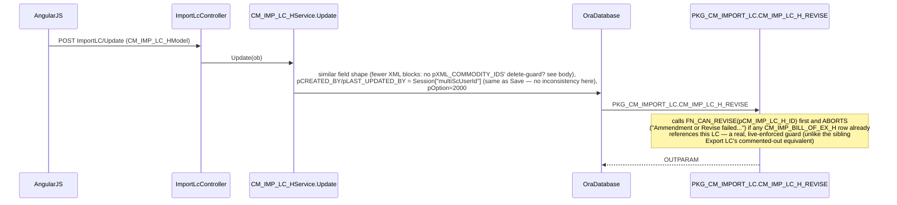

# Feature: Commercial import LC (back-to-back / factory's own import LC)

```yaml
---
id: feat:commercial-imp-lc
module: commercial
http: GET /api/cmr/ImportLC/SelectAll/{pageNo}/{pageSize} | GET /api/cmr/ImportLC/GetImportLc | GET /api/cmr/ImportLC/GetImportLcByFilter/{pageNo}/{pageSize}/{pOption} | POST /api/cmr/ImportLC/Save | POST /api/cmr/ImportLC/Update | POST /api/cmr/ImportLC/Delete
mvc: CmrController.ImpLc
api: [GET ImportLC/SelectAll/{pageNo}/{pageSize} -> ImportLcController.SelectAll, GET ImportLC/GetImportLc -> ImportLcController.GetImportLc, GET ImportLC/GetImportLcByFilter/{pageNo}/{pageSize}/{pOption} -> ImportLcController.GetImportLcByFilter, POST ImportLC/Save -> ImportLcController.Save, POST ImportLC/Update -> ImportLcController.Update, POST ImportLC/Delete -> ImportLcController.Delete]
service: ICM_IMP_LC_HService / CM_IMP_LC_HService
procedure: PKG_CM_IMPORT_LC.CM_IMP_LC_H_INSERT | CM_IMP_LC_H_REVISE | CM_IMP_LC_H_SELECT | CM_IMP_LC_H_DELETE
pOption: 1000 insert (Save), 2000 revise (Update, different pOption from insert), 1000 delete, 3000-3013 select variants (3003 default grid/list)
tables: [CM_IMP_LC_H, CM_IMP_LC_D, CM_IMP_LC_PI, CM_IMP_LC_CMD, CM_IMP_LC_H_X_COM_TYPE, CM_IMP_LC_INCO_TERM_DELV, CM_IMP_LC_SHIPMODE_PORT, CM_IMP_LC_H_STS, CM_IMP_EXP_LC_MAP]
models: [CM_IMP_LC_HModel, CM_IMP_LC_HSearchFilter, CM_IMP_LC_H_Delete_Model]
session: [multiScUserId]
upstream: [feat:commercial-exp-lc-contract, feat:cmr-imp-lc-pi, feat:mrc-buyer]
downstream: [feat:cm-acpt-of-import-bill, feat:commercial-bill-of-entry]
status: inferred
---
```

## Purpose

The factory's own Import LC (a.k.a. Back-to-Back LC, "BBLC") — the import-side counterpart opened
against (or independent of) a buyer's Export LC/Sales Contract. Entered under Commercial ▸ Import ▸
Import LC (sidebar id `imp-lc`). Once opened, an Import LC becomes the anchor for Import LC PI lines,
commodity/inco-term/ship-mode detail, and downstream Acceptance of Import Bill (PAD/IFDBC) records.

## Entry

| Kind | Value |
|---|---|
| API prefix | `[RoutePrefix("api/cmr")]` |
| Controller | `src/ERPSolution/Areas/Commercial/Api/ImportLcController.cs` |
| List (grid) | `GET ImportLC/SelectAll/{pageNo}/{pageSize}` |
| List (filtered/paginated variants) | `GET ImportLC/GetImportLcByFilter/{pageNo}/{pageSize}/{pOption}`, `GET ImportLC/GetImportLcPaginatedDD/{pageNo}/{pageSize}/{pOption}`, `GET ImportLC/GetPaginatedB2BLC` |
| Detail | `GET ImportLC/GetImportLc?pCM_IMP_LC_H_ID=` (header + commodity list + Inco Term/delivery + ship mode/port, composed server-side by the controller from 4 service calls) |
| Detail (raw select) | `GET ImportLC/GetImpLcDtlInfo?pCM_IMP_LC_H_ID=` (delegates to `ICM_IMP_LC_DService.SelectByID` — a different, undocumented-here service) |
| Dropdowns | `GET ImportLC/GetImpLCListDD`, `GET ImportLC/GetImportLcByID`, `GET ImportLC/GetCustomList` |
| PI cross-reference | `GET ImportLC/GetImportLcPiByBBLC`, `GET ImportLC/GetImportLcPIItem`, `GET ImportLC/SelectImpLcPiForImpLc` |
| Save (insert/update) | `POST ImportLC/Save` |
| Revise (amendment) | `POST ImportLC/Update` |
| Delete | `POST ImportLC/Delete` |
| UI | `Areas/Commercial/Client/app/` under the Commercial MVC area shell |

**Shared controller note:** `ImportLcController` also serves the sibling "Bill of Entry" menu
(`GetBillOfEntryInfo`, `GetBillOfEntryDetailsInfo`, `SaveBoE`, `SelectAllBillEntry`, all backed by
`ICM_BILL_OF_ENTRYService`/`CM_BILL_OF_ENTRYModel`) — documented separately; this file covers only the
`ICM_IMP_LC_HService`-backed actions.

DI: `ICM_BILL_OF_ENTRYService`, `ICM_IMP_LC_HService`, `ICM_IMP_LC_DService`, `IRF_CUSTOM_OFFService`.

## Execution (save)

```mermaid
sequenceDiagram
  participant UI as AngularJS
  participant API as ImportLcController
  participant Svc as CM_IMP_LC_HService.Save
  participant DB as OraDatabase
  participant PKG as PKG_CM_IMPORT_LC.CM_IMP_LC_H_INSERT

  UI->>API: POST ImportLC/Save (CM_IMP_LC_HModel)
  API->>Svc: Save(ob)
  Svc->>DB: ~60 params incl. pXML_LC_D/pXML_LC_PI/pXML_COMMODITY_LIST/<br/>pXML_COMMODITY_IDS/pXML_INCOTERM/pXML_SHIPMODEPORT (CLOB),<br/>pEXP_LC_NO_LST (CSV), pOption=1000,<br/>pCREATED_BY/pLAST_UPDATED_BY = Session["multiScUserId"]
  DB->>PKG: PKG_CM_IMPORT_LC.CM_IMP_LC_H_INSERT
  Note over PKG: branches on NVL(pCM_IMP_LC_H_ID,0) for insert vs update (pOption param itself unused for branching);<br/>computes B2B value ceiling from linked Export LC(s) x (PCT_BB_LMT+PCT_TOLR_AMT)/100,<br/>rejects if new total exceeds it (unless HR_COMPANY_ID=2 or IS_CASH_LC='Y');<br/>rebuilds CM_IMP_EXP_LC_MAP rows from pEXP_LC_NO_LST (delete-diff + insert, not blind delete+reinsert);<br/>parses XML CLOBs into CM_IMP_LC_D / CM_IMP_LC_PI / CM_IMP_LC_CMD / CM_IMP_LC_H_X_COM_TYPE /<br/>CM_IMP_LC_INCO_TERM_DELV / CM_IMP_LC_SHIPMODE_PORT; writes/updates CM_IMP_LC_H_STS
  PKG-->>DB: OUTPARAM (opCM_IMP_LC_H_ID, pMsg)
  Svc-->>API: hand-built JSON from OUTPARAM
```

## Execution (revise/amend)



## C# map

| Layer | Type | Path |
|---|---|---|
| API | `ImportLcController` | `src/ERPSolution/Areas/Commercial/Api/ImportLcController.cs` |
| Service (header) | `CM_IMP_LC_HService` | `src/ERP.BLL/Commercials/CM_IMP_LC_HService.cs` |
| Model | `CM_IMP_LC_HModel` / `CM_IMP_LC_HSearchFilter` / `CM_IMP_LC_H_Delete_Model` | `src/ERP.Model/Commercial/CM_IMP_LC_HModel.cs`, `CM_IMP_LC_HSearchFilter.cs` |
| Package | `PKG_CM_IMPORT_LC` | `src/ERPSolution/oracle/packages/PKG_CM_IMPORT_LC.sql` (2438 lines) |

## Oracle

| Item | Value |
|---|---|
| Package | `PKG_CM_IMPORT_LC` (constant `CN_IMP_LC_COMPLETE := 70`) |
| Insert/Update | `CM_IMP_LC_H_INSERT`, `pOption=1000` (from C#; the procedure body itself branches on `NVL(pCM_IMP_LC_H_ID,0)`, not on `pOption`) |
| Revise/Amend | `CM_IMP_LC_H_REVISE`, `pOption=2000` — separate procedure, guarded live by `FN_CAN_REVISE` (blocks if an Acceptance-of-Import-Bill row already exists for this LC) |
| Delete | `CM_IMP_LC_H_DELETE`, `pOption=1000` — deletes `CM_IMP_EXP_LC_MAP`, `CM_IMP_LC_H_STS`, `CM_IMP_LC_CMD`, `CM_IMP_LC_D`, then `CM_IMP_LC_H` (hard delete, in that FK-safe order) |
| Select | `CM_IMP_LC_H_SELECT` — 14 `pOption` branches (3000 grid w/ PERMISSION flag + IFDBC_AMT rollup from `CM_IMP_BILL_OF_EX_H`, 3001 detail, 3002 buyer/exp-lc filtered list w/ computed `LC_VALUE` from `CM_IMP_LC_D`, 3003 lightweight list — the default when no `pOption` is supplied, 3004 grid variant joining `KNT_YRN_RCV_H` (yarn-receive; not independently verified this pass), 3005 "not yet under an Acceptance of Import Bill" list, 3006 name/id dropdown, 3007-3013 assorted dropdown/paginated/B2B-for-UD variants — 3009 explicitly commented `-- used for B2B LC for UD`) |
| Other procedures | `CM_IMP_LC_CMD_SELECT`, `CM_IMP_LC_INCO_TERM_DELV_SELECT`, `CM_IMP_LC_SHIPMODE_PORT_SELECT`, `IMP_LC_PAD_LN_MAIL_NOTIFY` (mail-notify job, no C# caller found in this controller), `CM_BILL_OF_ENTRY_UPDT_DOC_PATH` (Bill of Entry side, out of scope here) |
| Main table | `CM_IMP_LC_H` |
| Child tables | `CM_IMP_LC_D` (line items — carries its own `CM_EXP_LC_H_ID` and `CM_IMP_PI_H_ID`, i.e. the back-to-back and PI split happen at line level, not just header level), `CM_IMP_LC_PI` (PI value/qty rollup per LC), `CM_IMP_LC_CMD` (commodity list, XML-merged), `CM_IMP_LC_H_X_COM_TYPE` (commodity type ids, M:M, XML-merged), `CM_IMP_LC_INCO_TERM_DELV`, `CM_IMP_LC_SHIPMODE_PORT` (both XML-merged, one-to-many per header), `CM_IMP_LC_H_STS` (status history, upsert not insert-only) |
| Cross-module link table | `CM_IMP_EXP_LC_MAP` (`CM_IMP_LC_H_ID`, `CM_EXP_LC_H_ID`) — header-level many-to-many between this Import LC and one or more Export LC/Sales Contracts |

## Request / response

**In (Save/Update):** `CM_IMP_LC_HModel` — supplier/buyer/company/currency/bank/payment-term header
fields, `pEXP_LC_NO_LST` (CSV of linked `CM_EXP_LC_H_ID`s), plus CLOB-encoded XML for LC detail lines,
Import LC PI rollups, commodity list, commodity type ids, Inco Term/delivery, and ship mode/port.
**Out:** `{ success, jsonStr }` built from the procedure's OUTPARAM (`opCM_IMP_LC_H_ID`, `pMsg`), except
on `ModelState` validation failure where it is `{ success: false, errors }`.

## Tables / columns touched

Main table: `CM_IMP_LC_H` (no `docs/schema/CM_IMP_LC_H.md` yet).

FKs (corroborated by real JOIN/WHERE/INSERT evidence in `PKG_CM_IMPORT_LC.sql`, not naming-convention guesses):
- `HR_COMPANY_ID → HR_COMPANY`, `SCM_SUPPLIER_ID → SCM_SUPPLIER`, `MC_BUYER_ID → MC_BUYER`, `RF_LC_TYPE_ID → RF_LC_TYPE`, `RF_CURRENCY_ID → RF_CURRENCY`, `RF_ACTN_STATUS_ID → RF_ACTN_STATUS`, `RF_PAYM_TERM_ID → RF_PAYM_TERM`, `RF_INSURN_COMP_ID → RF_INSURN_COMP` (3000/3001-select joins)
- `SND_BKBR_ID`/`RCV_BKBR_ID`/`LIN_BKBR_ID → RF_BANK_BRANCH → RF_BANK` (naming-convention only for this pass — no direct join to `RF_BANK_BRANCH` was seen in the branches read)
- `CM_IMP_LC_INCO_TERM_DELV.RF_INCO_TERM_ID → RF_INCO_TERM`, `.RF_DELV_PLC_ID → RF_DELV_PLC`
- `CM_IMP_LC_SHIPMODE_PORT.RF_SHIP_MODE_ID → RF_SHIP_MODE`, `.LOAD_PORT_ID → RF_TRAN_PORT`
- `CM_IMP_LC_H_X_COM_TYPE.RF_LC_COMODITY_TYPE_ID → RF_LC_COMODITY_TYPE`
- `CM_IMP_LC_D.CM_EXP_LC_H_ID → CM_EXP_LC_H` and `CM_IMP_LC_D.CM_IMP_PI_H_ID → CM_IMP_PI_H` (line-level back-to-back / PI split — real INSERT/UPDATE columns in `CM_IMP_LC_H_INSERT`, lines 708-757)
- `CM_IMP_LC_PI.CM_IMP_PI_H_ID → CM_IMP_PI_H` (header-to-PI rollup, real INSERT columns, lines 762-808)
- **Cross-module, confirmed:** `CM_IMP_EXP_LC_MAP.CM_IMP_LC_H_ID → CM_IMP_LC_H` and `.CM_EXP_LC_H_ID → CM_EXP_LC_H` (real INSERT/DELETE/JOIN evidence throughout `CM_IMP_LC_H_INSERT`/`_REVISE`/`_SELECT`) — this is the same table `docs/features/commercial-exp-lc-contract.md` already names from the Export LC side; corroborated here, not re-derived.
- **Downstream, confirmed:** `CM_IMP_BILL_OF_EX_H.CM_IMP_LC_H_ID → CM_IMP_LC_H` (Acceptance of Import Bill) — read in three places: `FN_CAN_REVISE` (blocks revise once a row exists), the 3000-select `IFDBC_AMT` rollup, and the 3005-select "not yet billed" filter.
- Seen but **not independently verified** this pass: `KNT_YRN_RCV_H.CM_IMP_LC_H_ID` (joined in the 3004-select branch — looks like a yarn/receiving module; don't cite as a confirmed consumer without reading that module directly), `CM_BILL_OF_ENTRY.CM_IMP_LC_H_ID` (the sibling Bill of Entry menu — documented separately by a different pass).

## Permissions / session

`HttpContext.Current.Session["multiScUserId"]` used for `pCREATED_BY`/`pLAST_UPDATED_BY` on **both**
Save and Update — unlike the Export LC sibling, there's no source inconsistency here. The 3000/3004-select
grids also compute a row-level `PERMISSION` flag from `RF_ACTN_STATUS.ASSIGNED_TO_LST` (CSV of user ids
per status), same pattern as Export LC's grid.

## Dependencies (other features)

- **Upstream:** `feat:commercial-exp-lc-contract` (`CM_EXP_LC_H`, linked via `CM_IMP_EXP_LC_MAP` at both header and `CM_IMP_LC_D` line level), Import LC PI (`CM_IMP_PI_H`, via `CM_IMP_LC_D.CM_IMP_PI_H_ID`, `CM_IMP_LC_PI.CM_IMP_PI_H_ID`, and the `CM_IMP_PI_LST` CSV field resolved through `_cm_IMP_PI_HService.SelectByPINoList`), `MC_BUYER`, `SCM_SUPPLIER`.
- **Downstream (real, confirmed):** Acceptance of Import Bill (`CM_IMP_BILL_OF_EX_H`) — both reads it (IFDBC rollup, "not yet billed" filter) and is gated by it (`FN_CAN_REVISE`). Bill of Entry (`CM_BILL_OF_ENTRY`) shares this same controller but is documented separately.
- Files matched a `CM_IMP_LC_H_ID`-shaped grep but **not** independently verified this pass: anything under the yarn/knitting (`KNT_`) module beyond the one join seen in the 3004-select branch.

## Gaps

- **`SelectByID(pMC_BUYER_ID, pCM_EXP_LC_H_ID)` sends its filter values under the wrong parameter names.** The C# binds them as `pHR_COMPANY_ID`/`pSCM_SUPPLIER_ID` (`CM_IMP_LC_HService.cs` lines 460-461), but `CM_IMP_LC_H_SELECT`'s `pOption=3002` branch filters on its own `pMC_BUYER_ID`/`pCM_EXP_LC_H_ID` parameters instead — since the procedure binds by name, the caller's buyer/export-LC filter is silently ignored and the branch's `pHR_COMPANY_ID`/`pSCM_SUPPLIER_ID` parameters (unused inside the 3002 branch's WHERE clause) receive the values instead. `GetImportLcByID` (the only controller action calling this) effectively returns an unfiltered list.
- **The insert/update procedure's own `pOption` parameter is not used for branching** — `CM_IMP_LC_H_INSERT` branches purely on `NVL(pCM_IMP_LC_H_ID,0)`, so the hardcoded `pOption=1000` passed by `Save()` is inert. Same shape as the note already made for Export LC's `UpdatePrc` pOption reuse, but here it's simply unused rather than misused.
- **B2B value-limit check has a company-specific bypass**: the insert branch's over-limit guard (`V_OLD_BB_VAL>V_LC_TOT_VAL`) is skipped outright when `pHR_COMPANY_ID=2` or `pIS_CASH_LC='N'`... actually skipped when company=2 **or** cash-LC — i.e. cash LCs and one specific hardcoded company id bypass the B2B ceiling check entirely; the update branch's equivalent guard has a different condition (`NVL(pMC_BUYER_ID,0)>0`, no cash/company exception) — the two branches are inconsistent with each other, mirroring the kind of asymmetry already flagged in the Export LC doc.
- **`GetImpLcDtlInfo` delegates to `ICM_IMP_LC_DService.SelectByID`**, a service not covered by this feature file (it belongs to the `CM_IMP_LC_D` detail/line-item slice) — flagged here only as an entry point, not traced further.
- **`IMP_LC_PAD_LN_MAIL_NOTIFY`** exists in the package but no caller was found in `ImportLcController` or `CM_IMP_LC_HService` — likely invoked from a scheduled job/report elsewhere, not traced this pass.
- Everything above comes from static source analysis only — no live database connection was available, so nothing here is "DB-verified"; all FK and linkage claims are corroborated by real JOIN/INSERT/WHERE usage in the package body (source-inferred).
