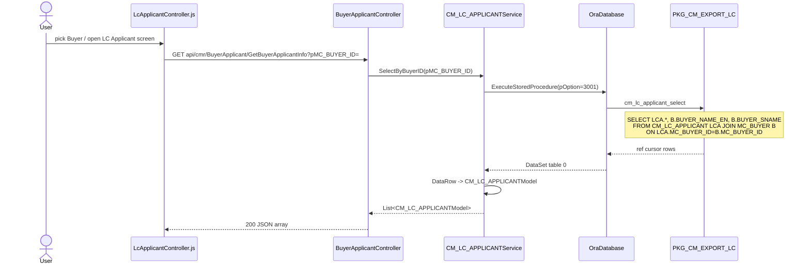
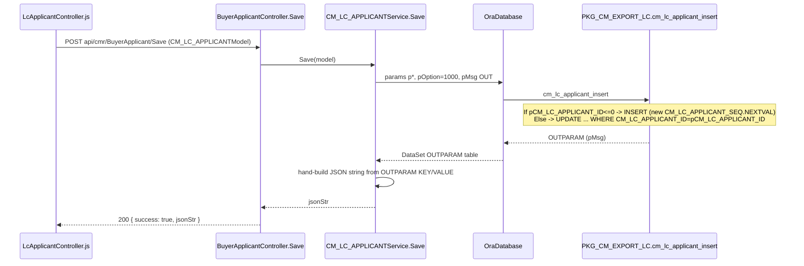

# Feature: LC Applicant

```yaml
---
id: feat:cmr-lc-applicant
module: commercial
http: GET /api/cmr/BuyerApplicant/GetBuyerApplicantInfo | POST /api/cmr/BuyerApplicant/Save
mvc: CmrController.LcApplicant
api: [GET BuyerApplicant/GetBuyerApplicantInfo -> BuyerApplicantController.GetBuyerApplicantInfo, POST BuyerApplicant/Save -> BuyerApplicantController.Save]
service: ICM_LC_APPLICANTService / CM_LC_APPLICANTService
procedure: PKG_CM_EXPORT_LC.cm_lc_applicant_insert | cm_lc_applicant_delete | cm_lc_applicant_select
pOption: 1000 insert/update (same proc, branches on pCM_LC_APPLICANT_ID), 3000 select-all, 3001 select-by-buyer (joined), 3002 id/name dropdown
tables: [CM_LC_APPLICANT]
models: [CM_LC_APPLICANTModel]
session: [multiScUserId]
upstream: [feat:mrc-buyer]
downstream: [commercial export-lc-sales-contract, commercial export-invoice, commercial export-bill-of-exchange, commercial export-com-adv, commercial bill-adjustment]
status: inferred
---
```

## Purpose

Master-data screen where the commercial team maintains "LC Applicants" (the legal entity that
applies for/opens an export Letter of Credit, tied to a buyer). Once set up here, an applicant is
picked as a dropdown on the Export LC / Sales Contract entry screen, and is also joinable from
several other export-LC-linked screens (invoice, bill of exchange, commission advice, bill
adjustment).

**Naming mismatch (confirmed in code, not a doc error):** the sidebar/menu label and the Angular
plumbing all say **"LC Applicant"**:
- Angular state `LcApplicant`, `LcApplicantController` (`Client/app/controllers/LcApplicantController.js`),
  view `_LcApplicant.cshtml`, MVC action `CmrController.LcApplicant()` — see
  `Client/app/config.cmrRoute.js:698-705` (`Title: 'L/C Applicant'`).

But the **Web API controller and the reusable "create new applicant inline" modal** are named
**"Buyer Applicant"**:
- `Areas/Commercial/Api/BuyerApplicantController.cs` (`[RoutePrefix("api/cmr")]`, routes
  `BuyerApplicant/GetBuyerApplicantInfo`, `BuyerApplicant/Save`)
- `_BuyerApplicantModal.cshtml` (heading literally says "Buyer Applicants") +
  `BuyerApplicantModalController.js`, invoked from the Export LC Sales Contract screen
  (`ExpLcContractController.js:2149-2161`) to let the user create a new applicant without
  leaving the LC entry form.

The database/service/model layer uses a third name, **`CM_LC_APPLICANT`** (table, `CM_LC_APPLICANTModel`,
`CM_LC_APPLICANTService`). All three names — "LC Applicant" (menu/table), "Buyer Applicant" (API
controller + inline-create modal), `CM_LC_APPLICANT` (DB) — refer to the exact same entity/table;
there is no separate "Buyer Applicant" table or concept.

## Entry

| Kind | Value |
|---|---|
| Menu / sidebar | Export ▸ Master Data ▸ **LC Applicant** (label confirmed as "L/C Applicant" in `config.cmrRoute.js`) |
| Angular state | `LcApplicant` → `/LcApplicant` |
| Razor view | `Areas/Commercial/Views/Cmr/_LcApplicant.cshtml` (served by `CmrController._LcApplicant()`) |
| Angular controller | `LcApplicantController.js` |
| API (list by buyer) | `GET api/cmr/BuyerApplicant/GetBuyerApplicantInfo?pMC_BUYER_ID=` |
| API (save/update) | `POST api/cmr/BuyerApplicant/Save` |
| API (downstream dropdown, list) | `GET api/cmr/ExportLCSalesContact/GetLcApplicantByBuyerID?pMC_BUYER_ID=` |
| API (downstream dropdown, id/name only) | `GET api/cmr/ExportLCSalesContact/GetLcApplicantByBuyerDD?pMC_BUYER_ID=` |

## Execution (list by buyer)



## Execution (save)



Same `PKG_CM_EXPORT_LC.cm_lc_applicant_insert` procedure handles both insert and update — it
branches internally on `NVL(pCM_LC_APPLICANT_ID,0)<=0`. The C# service still exposes a separate
`Update()` method (`ICM_LC_APPLICANTService.Update`), but it calls the exact same `sp` constant
(`PKG_CM_EXPORT_LC.CM_LC_APPLICANT_INSERT`) with the same parameter list — `Update()` appears
unused by the UI (`LcApplicantController.js` only calls `.../BuyerApplicant/Save`, never a
separate update route; there is no `[Route("BuyerApplicant/Update")]` on the controller).

There is also a `Delete()` service method wired to `PKG_CM_EXPORT_LC.cm_lc_applicant_delete`, but
`BuyerApplicantController` exposes no `Delete` route/action — the grid's delete button in
`LcApplicantController.js` (`vm.removeData`) only removes the row from the local Kendo grid
DataSource, it never calls the API. So deleting an LC Applicant is not reachable from this menu's UI.

## C# map

| Layer | Type | Path |
|---|---|---|
| API | `BuyerApplicantController` | `src/ERPSolution/Areas/Commercial/Api/BuyerApplicantController.cs` |
| Service | `CM_LC_APPLICANTService` | `src/ERP.BLL/Commercials/CM_LC_APPLICANTService.cs` |
| Interface | `ICM_LC_APPLICANTService` | `src/ERP.BLL/Commercials/ICM_LC_APPLICANTService.cs` |
| Model | `CM_LC_APPLICANTModel` | `src/ERP.Model/Commercial/CM_LC_APPLICANTModel.cs` (namespace `ERP.Model`, not `ERP.Model.Commercial`, despite the file's folder) |
| Package | `PKG_CM_EXPORT_LC` | `src/ERPSolution/oracle/packages/PKG_CM_EXPORT_LC.sql` |

## Oracle

| Item | Value |
|---|---|
| Package | `PKG_CM_EXPORT_LC` |
| Insert/Update | `cm_lc_applicant_insert`, single proc, branches on `pCM_LC_APPLICANT_ID` |
| Delete | `cm_lc_applicant_delete` (not wired to any API route — see above) |
| Select | `cm_lc_applicant_select` — `pOption=3000` all rows (`SELECT * FROM CM_LC_APPLICANT`, unused by any current C# caller), `pOption=3001` joined with `MC_BUYER` for the grid (`SelectByBuyerID`), `pOption=3002` id+name only for a lightweight dropdown (`SelectCMLCApplicantDD`) |
| Main table | `CM_LC_APPLICANT` |
| Sequence | `CM_LC_APPLICANT_SEQ` (used for `CM_LC_APPLICANT_ID` on insert) |
| Child tables | none — this is a flat lookup table, no header/detail |

## Tables / columns touched

**`CM_LC_APPLICANT`** — column list reconstructed (source-inferred, no DDL in repo) from the fullest
`INSERT`/`UPDATE` in `PKG_CM_EXPORT_LC.cm_lc_applicant_insert` (lines 407-421) plus the model's
`Convert.To*` mapping in `CM_LC_APPLICANTService.SelectByBuyerID`/`SelectAll`/`Select`:

| Column | Type (inferred) | Written by | Notes |
|---|---|---|---|
| `CM_LC_APPLICANT_ID` | NUMBER (PK) | insert only, via `CM_LC_APPLICANT_SEQ.NEXTVAL` | |
| `MC_BUYER_ID` | NUMBER (FK) | insert + update | FK to `MC_BUYER.MC_BUYER_ID` — confirmed by the join `JOIN MC_BUYER B ON LCA.MC_BUYER_ID=B.MC_BUYER_ID` in `cm_lc_applicant_select` pOption 3001/3002 |
| `APLCNT_NAME_EN` | VARCHAR2 | insert + update | applicant name (English), shown/edited in `_LcApplicant.cshtml` |
| `APLCNT_NAME_BN` | NVARCHAR2 | insert + update | applicant name (Bangla) |
| `ADDRESS_LC` | VARCHAR2 | insert + update | "L/C Address" textarea in the view |
| `IS_ACTIVE` | CHAR | insert + update | `Y`/`N` checkbox in the view, default `Y` |
| `CREATION_DATE` | DATE | insert (`sysdate`) | not rendered by the UI (audit column) |
| `CREATED_BY` | NUMBER | insert, from `Session["multiScUserId"]` | not rendered by the UI |
| `LAST_UPDATE_DATE` | DATE | update (`sysdate`) | not rendered by the UI |
| `LAST_UPDATED_BY` | NUMBER | update, from `Session["multiScUserId"]` | not rendered by the UI |

`BUYER_NAME_EN` on the C# model is a join-only field from `MC_BUYER` (pOption 3001), not a real
`CM_LC_APPLICANT` column — same pattern as `merchandising-buyer.md`'s documented join fields.

## Downstream usage (confirmed by grep)

`CM_LC_APPLICANT` / `CM_LC_APPLICANT_ID` is read from several other Commercial screens and
packages, always via a plain `LEFT/INNER JOIN` on `CM_LC_APPLICANT_ID` (no other write path found
besides this menu and the inline modal):

- **Export LC / Sales Contract entry** (`ExportLCSalesContactController.cs`,
  `ExpLcContractController.js`) — the actual consumer. `GetLcApplicantByBuyerID` /
  `GetLcApplicantByBuyerDD` populate a dropdown of applicants filtered by the selected buyer
  (calls the same `CM_LC_APPLICANTService.SelectByBuyerID` / `SelectCMLCApplicantDD`). If the
  user picks "create new" (`CM_LC_APPLICANT_ID < 0`, `ExpLcContractController.js:2149`), a modal
  (`_BuyerApplicantModal.cshtml` / `BuyerApplicantModalController.js`) opens to create a new
  applicant inline, without leaving the LC form.
- `PKG_CM_EXPORT_LC` itself: `CM_EXP_LC_H` (the Export LC header table) carries a
  `CM_LC_APPLICANT_ID` column, joined at line 1942 (`LEFT JOIN CM_LC_APPLICANT AP ON
  AP.CM_LC_APPLICANT_ID=H.CM_LC_APPLICANT_ID`) and written on LC header insert/update (params
  `pCM_LC_APPLICANT_ID`, lines ~600-712, ~1415).
- `CM_EXP_COM_ADV_HService.cs`, `CM_EXP_COM_INV_HService.cs`, `CM_EXP_BILL_OF_EX_HService.cs` also
  reference `CM_LC_APPLICANT_ID` (grep hit) — these are export commission-advice, commercial
  invoice, and bill-of-exchange header services that carry the same `CM_LC_APPLICANT_ID` inherited
  from the Export LC header they're built against (`status: inferred` — not individually traced
  line-by-line here).
- `PKG_CM_EXPORT_LC` line ~3046: `INNER JOIN CM_LC_APPLICANT CA ON CA.CM_LC_APPLICANT_ID =
  ADV.CM_LC_APPLICANT_ID ... GROUP BY ADV.CM_LC_APPLICANT_ID` — a report/aggregation query keyed
  by applicant.

## Permissions / session

- `CmrController.LcApplicant()` gates the MVC page with `IsMenuPermission()` (redirects to `~/`
  if not permitted) — standard menu-permission check.
- `CREATED_BY` / `LAST_UPDATED_BY` are populated from `HttpContext.Current.Session["multiScUserId"]`
  in `CM_LC_APPLICANTService.Save`/`Update`/`Delete`, not passed from the client.

## Dependencies (other features)

- **Upstream:** Merchandising Buyer (`feat:mrc-buyer`) — every applicant is scoped to a
  `MC_BUYER_ID`; the buyer dropdown on this screen calls `api/mrc/buyer/SelectAll`.
- **Downstream:** Export LC / Sales Contract entry (primary consumer, dropdown + inline-create
  modal); Export Commercial Invoice, Export Bill of Exchange, Export Commission Advice, and the
  Commercial Bill Adjustment screens all appear to carry `CM_LC_APPLICANT_ID` forward from the LC
  header (inferred from grep hits in their services, not individually traced).

## Gaps

- `status: inferred` for the whole file — no live DB access; column types and the FK to
  `MC_BUYER` are inferred from the package body's `INSERT`/`UPDATE`/`JOIN` text and the C# model,
  not verified against `ALL_TAB_COLUMNS`/`ALL_CONSTRAINTS`.
- `cm_lc_applicant_delete` and `ICM_LC_APPLICANTService.Delete`/`.Update` exist in code but have no
  corresponding route on `BuyerApplicantController` reachable from `LcApplicantController.js` —
  flagged above under Execution, not re-verified against every other possible caller in the repo.
- The four downstream header services (`CM_EXP_COM_ADV_H`, `CM_EXP_COM_INV_H`,
  `CM_EXP_BILL_OF_EX_H`) were confirmed only by grep hit on `CM_LC_APPLICANT_ID`, not individually
  traced — worth a deeper pass when those screens are documented.
- Whether `CM_LC_APPLICANT` is also picked directly on "Sales Contract Entry" as a separate screen
  from "Export LC" was not confirmed as a distinct route; in this codebase Export LC and Sales
  Contract appear to be the same screen/controller (`ExportLCSalesContactController`,
  `ExpLcContractController.js`), not two separate menus.
