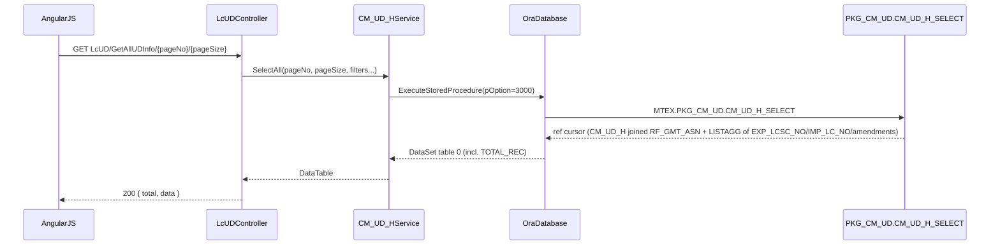
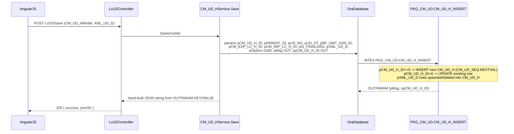

# Feature: Commercial L/C UD (Utilization Declaration)

```yaml
---
id: feat:cmr-lc-ud
module: commercial
http: GET /api/cmr/LcUD/GetAllUDInfo/{pageNo}/{pageSize}
mvc: CmrController.LcUD
api: [GET LcUD/GetAllUDInfo/{pageNo}/{pageSize} -> LcUDController.GetAllUDInfo, GET LcUD/GetUDInfo -> LcUDController.GetUDInfo, GET LcUD/GetNewUDAmentmentInfo -> LcUDController.GetNewUDAmentmentInfo, GET LcUD/GetUDDetailsInfo -> LcUDController.GetUDDetailsInfo, GET LcUD/GetUDAmendmentDataInfo -> LcUDController.GetUDAmendmentDataInfo, GET LcUD/GetExpUDInfo -> LcUDController.GetExpUDInfo, GET LcUD/GetImpUDInfo -> LcUDController.GetImpUDInfo, GET LcUD/GetUDAuto -> LcUDController.GetUDAuto, POST LcUD/Save -> LcUDController.Save, POST LcUD/SaveAmendment -> LcUDController.SaveAmendment, POST LcUD/Update -> LcUDController.Update, GET LcUD/GetPaginatedExportLC -> LcUDController.GetPaginatedExportLCDropdown, GET LcUD/GetUDParentChildDetails -> LcUDController.GetUDParentChildDetails, POST LcUD/Delete -> LcUDController.Delete]
service: ICM_UD_HService / CM_UD_HService, ICM_UD_DService / CM_UD_DService
procedure: PKG_CM_UD.CM_UD_H_INSERT | PKG_CM_UD.CM_UD_H_SELECT | PKG_CM_UD.CM_UD_H_DELETE | PKG_CM_UD.CM_UD_D_Select
pOption: 1000 insert/update (H), 3000-3007 select (H), 3001/3002 select (D), 4000 delete (H)
tables: [CM_UD_H, CM_UD_D]
models: [CM_UD_HModel, CM_UD_DModel, DeleteUDDto]
session: [multiScUserId]
upstream: [commercial-export-lc, commercial-import-lc]
downstream: [ud-transfer, bill-of-export, bill-of-entry]
status: inferred
---
```

## Purpose

Create and maintain a **Utilization Declaration (UD)** — the customs document declaring how much
duty-free imported raw material (import/back-to-back L/C) has been allocated/used against a
specific export order (export L/C). A UD header (`CM_UD_H`) can have one or more detail rows
(`CM_UD_D`), each row pairing one export L/C (`CM_EXP_LC_H`) with one import L/C (`CM_IMP_LC_H`).
A UD can later be **amended** (a child `CM_UD_H` row pointing back at its parent via `PARENT_ID`),
recording successive amendment numbers (`AMMENTMEND_NO`).

## Entry

| Kind | Value |
|---|---|
| API prefix | `[RoutePrefix("api/cmr")]` |
| Controller | `src/ERPSolution/Areas/Commercial/Api/LcUDController.cs` |
| Example GET | `/api/cmr/LcUD/GetAllUDInfo/{pageNo}/{pageSize}?pMC_BUYER_ID=` |
| Example GET | `/api/cmr/LcUD/GetUDInfo?pCM_UD_H_ID=` |
| Example POST | `/api/cmr/LcUD/Save` |
| Menu | Export &gt; Transactions &gt; L/C UD (sidebar id `lc-ud`) |

## Execution (list)



## Execution (save)



## C# map

| Layer | Type | Path |
|---|---|---|
| API | `LcUDController` | `src/ERPSolution/Areas/Commercial/Api/LcUDController.cs` |
| Service (header) | `CM_UD_HService` | `src/ERP.BLL/Commercials/CM_UD_HService.cs` |
| Service (detail) | `CM_UD_DService` | `src/ERP.BLL/Commercials/CM_UD_DService.cs` |
| Model | `CM_UD_HModel`, `DeleteUDDto` | `src/ERP.Model/Commercial/CM_UD_HModel.cs` |
| Model | `CM_UD_DModel` | `src/ERP.Model/Commercial/CM_UD_DModel.cs` |
| IoC | `RegisterType<CM_UD_HService>().As<ICM_UD_HService>()` / same for `CM_UD_DService` | `src/ERPSolution/App_Start/IocConfig.cs` (lines 532-533) |
| Package | `PKG_CM_UD` | `src/ERPSolution/oracle/packages/PKG_CM_UD.sql` |

## Oracle

| Item | Value |
|---|---|
| Package | `PKG_CM_UD` |
| Insert/Update (H) | `CM_UD_H_INSERT` `pOption=1000` — a single procedure; branches internally on `NVL(pCM_UD_H_ID,0)<=0` (insert, new `CM_UD_SEQ.NEXTVAL`) vs `>0` (update) |
| Select (H) | `CM_UD_H_SELECT` — `pOption=3000` paginated list, `3001` header by id, `3002`/`3003` LC-pair detail joins, `3004` autocomplete by `UD_NO`, `3005` parent/child (amendment) tree, `3006` amendment-update data (unreachable, see Gaps), `3007` "new amendment" seed row |
| Delete (H) | `CM_UD_H_DELETE` `pOption=4000` — cascades to `CM_UD_D`, `CM_UD_H_EXP_LC`, child (`PARENT_ID`) rows, then the row itself |
| Select (D) | `CM_UD_D_Select` — `pOption=3001` detail joined to export L/C (`CM_EXP_LC_H`), `3002` joined to import L/C (`CM_IMP_LC_H`) |
| Main table | `CM_UD_H` |
| Child table | `CM_UD_D` |

## Request / response

**In (Save/Update):** `CM_UD_HModel` body — `CM_UD_H_ID`, `PARENT_ID`, `MC_BUYER_ID`, `UD_NO`, `AMMENTMEND_NO`, `UD_DT`, `RF_GMT_ASN_ID`, `CM_EXP_LC_H_ID`, `CM_IMP_LC_H_ID`, `IS_FINALIZED`, `XML_UD_D` (CLOB, one `<row>` per detail line pairing an export/import LC), `XML_UD_H_EXP_LC` (CLOB, currently dead — see Gaps).
**Out:** list endpoints return a `DataTable`/list serialized as a JSON array (or `{ total, data }` for paginated lists); write endpoints return `{ success, jsonStr }` where `jsonStr` is hand-assembled from the procedure's `OUTPARAM` table (`pMsg`, `opCM_UD_H_ID`).

## Tables / columns touched

Columns confirmed via the fullest `INSERT`/`SELECT` in `PKG_CM_UD.CM_UD_H_INSERT`/`CM_UD_H_SELECT` (no DDL in repo — source-inferred, not DB-verified):

- `CM_UD_H`: `CM_UD_H_ID` (PK, `CM_UD_SEQ`), `PARENT_ID` (self-FK, amendment parent), `UD_NO`, `UD_DT`, `RF_GMT_ASN_ID` (FK `RF_GMT_ASN`), `IS_FINALIZED`, `AMMENTMEND_NO`, `CREATION_DATE`, `CREATED_BY`, `LAST_UPDATE_DATE`, `LAST_UPDATED_BY`. Also referenced by `PKG_CM_UD.cm_ud_select_by_comodity` (UD Transfer feature): `ALW_PLOSS_PCT`, `BILL_OF_ENTRY`, `UD_TRANSFER_RCV`, `BILL_OF_EXPORT`, `UD_TRANSFER_SENT`.
- `CM_UD_D`: `CM_UD_D_ID` (PK, `CM_UD_D_SEQ`), `CM_UD_H_ID` (FK `CM_UD_H`), `CM_EXP_LC_H_ID` (FK `CM_EXP_LC_H`), `CM_IMP_LC_H_ID` (FK `CM_IMP_LC_H`), `CREATION_DATE`, `CREATED_BY`, `LAST_UPDATE_DATE`, `LAST_UPDATED_BY`.

FKs used on save: `RF_GMT_ASN_ID` → `RF_GMT_ASN`; per detail row `CM_EXP_LC_H_ID` → `CM_EXP_LC_H`, `CM_IMP_LC_H_ID` → `CM_IMP_LC_H`.

## Permissions / session

`CREATED_BY`/`LAST_UPDATED_BY` are stamped from `HttpContext.Current.Session["multiScUserId"]` on every write (`Save`, `SaveAmendment`, `Update` in `CM_UD_HService`). No explicit menu/permission check was found in the traced controller/service methods — access control (if any) is presumably enforced by the Angular route/menu guard, not the API layer (inferred).

## Dependencies (other features)

- **Upstream:** the export L/C (`CM_EXP_LC_H`, via `PKG_CM_EXPORT_LC`) and the import/back-to-back L/C (`CM_IMP_LC_H`) must already exist — `GetPaginatedExportLCDropdown` calls `PKG_CM_EXPORT_LC.CM_EXP_LC_H_SELECT` to populate the export-L/C picker on the UD entry screen.
- **Downstream / related:** `CM_UD_HService.cs` also implements a separate **UD Transfer** feature (`UDTransferSave`, `CM_UD_TRANSFER_H`/`CM_UD_TRANSFER_D`, `PKG_CM_UD.CM_UD_TRANSFER_INSERT`) — its own sidebar menu (`ud-transfer`), documented separately; it consumes existing UDs as its "from"/"to" endpoints (`GetUDDropDownByCommodity`, `GetTransferToUDDropDown` both query `CM_UD_H`/`CM_UD_D` via `PKG_CM_UD.cm_ud_select_by_comodity`), so a UD Transfer always references two UD headers created by this feature. Bill of Entry / Bill of Export also reference `CM_UD_H_ID` (seen in `cm_ud_select_by_comodity` option `3004` joining `CM_BILL_OF_ENTRY` and `CM_BILL_OF_EXP_D`).

## Gaps

- **`Update()` and `SaveAmendment()` call procedures that do not exist in `PKG_CM_UD.sql`.** `CM_UD_HService.Update` hard-codes `sp = "PKG_CM_UD.CM_UD_H_UPDATE"` and `CM_UD_HService.SaveAmendment` hard-codes `sp = "PKG_CM_UD.CM_UD_H_AMENDMENT_INSERT"` — neither name appears anywhere in the package spec or body (only `CM_UD_H_INSERT` exists, and it already branches internally to do an update when `pCM_UD_H_ID > 0`). Source-inferred, not DB-verified: it's possible the deployed database has additional procedures not captured in this repo's `.sql` snapshot, but as traced, calling `Update`/`SaveAmendment` from the UI would raise an Oracle "identifier must be declared" error. See Known Issues.
- `RF_GMT_ASN` (joined in `CM_UD_H_SELECT` option 3000/3005/3007) is a reference/lookup table whose full business meaning wasn't traced beyond its columns used here (`GMT_ASN_NAME_EN`, `GMT_ASN_SNAME`, `ADDRESS`) — likely a garment/buyer assortment or nomination reference; not confirmed against a dedicated feature doc.
- `pOption=3006` in `CM_UD_H_SELECT` ("for showing data for UD Amendment update") is never invoked by any method in `CM_UD_HService`/`LcUDController` as traced — dead/unreachable option, possibly called from a screen not covered here, or leftover.
- `CM_UD_DService.Save`, `.Update`, `.Delete`, and `.Select(long)` reference standalone procedures `SP_CM_UD_D` and `Select_CM_UD_D`, which do not exist anywhere under `src/ERPSolution/oracle/` (not in `PKG_CM_UD.sql` or any other package file found). None of these four methods are called by `LcUDController` — the controller only uses `CM_UD_DService.SelectExpUD`/`SelectImpUD` (which correctly call `PKG_CM_UD.CM_UD_D_Select`). Treat `Save`/`Update`/`Delete`/`Select(long)` on `CM_UD_DService` as dead code.
- `pXML_UD_H_EXP_LC` / table `CM_UD_H_EXP_LC`: the C# still sends this CLOB parameter on every save, but the entire write block for it inside `PKG_CM_UD.CM_UD_H_INSERT` is commented out (`/* ... */`). `CM_UD_H_DELETE` still deletes from `CM_UD_H_EXP_LC` (harmless, since nothing is ever inserted there via the current package body), and `CM_UD_H_SELECT` option `3006` still joins it (so that option would always return zero rows for this reason too). This looks like a table/feature the app moved away from in favor of the `CM_UD_D`-per-row `CM_EXP_LC_H_ID`/`CM_IMP_LC_H_ID` pairing, but the dead parameter/plumbing was left in place.
- No live DB access was used for any of the above — all findings are "source-inferred" from `PKG_CM_UD.sql` and the C# services, not confirmed against a running Oracle catalog.
