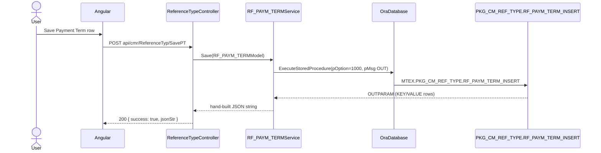

# Feature: Commercial reference type (Export master data lookups)

```yaml
---
id: feat:cmr-reference-type
module: commercial
http: GET /api/cmr/ReferenceTyp/Get*, POST /api/cmr/ReferenceTyp/Save*|Delete*
mvc: CmrController.ReferenceType
api: [GET ReferenceTyp/GetPayTerm -> ReferenceTypeController.GetPayTerm, POST ReferenceTyp/SavePT -> ReferenceTypeController.SavePT, POST ReferenceTyp/DeletePT -> ReferenceTypeController.DeletePT, GET ReferenceTyp/GetIncoTerm -> ReferenceTypeController.GetIncoTerm, POST ReferenceTyp/SaveIT -> ReferenceTypeController.SaveIT, POST ReferenceTyp/DeleteIT -> ReferenceTypeController.DeleteIT, GET ReferenceTyp/GetDeliveryPlace -> ReferenceTypeController.GetDeliveryPlace, GET ReferenceTyp/GetDeliveryPlaceDD -> ReferenceTypeController.GetDeliveryPlaceDD, POST ReferenceTyp/SaveDP -> ReferenceTypeController.SaveDP, POST ReferenceTyp/DeleteDP -> ReferenceTypeController.DeleteDP, GET ReferenceTyp/GetTransitPort -> ReferenceTypeController.GetTransitPort, GET ReferenceTyp/GetTransitPortDropdown -> ReferenceTypeController.GetTransitPortDropdown, GET ReferenceTyp/GetPaginatedTransitPortDropdown -> ReferenceTypeController.GetPaginatedTransitPortDropdown, POST ReferenceTyp/SaveTP -> ReferenceTypeController.SaveTP, POST ReferenceTyp/DeleteTP -> ReferenceTypeController.DeleteTP, GET ReferenceTyp/GetLCType -> ReferenceTypeController.GetLCType, GET ReferenceTyp/GetLC_COMODITY_TYPe -> ReferenceTypeController.GetLC_COMODITY_TYPe, POST ReferenceTyp/SaveLT -> ReferenceTypeController.SaveLT, POST ReferenceTyp/DeleteLT -> ReferenceTypeController.DeleteLT, GET ReferenceTyp/GetShipMode -> ReferenceTypeController.GetShipMode, GET ReferenceTyp/CntrSizeListDD -> ReferenceTypeController.CntrSizeListDD, POST ReferenceTyp/SaveSM -> ReferenceTypeController.SaveSM, POST ReferenceTyp/DeleteSM -> ReferenceTypeController.DeleteSM, GET ReferenceTyp/GetGmtAsn -> ReferenceTypeController.GetGmtAsn, POST ReferenceTyp/SaveGA -> ReferenceTypeController.SaveGA, POST ReferenceTyp/DeleteGA -> ReferenceTypeController.DeleteGA, POST ReferenceTyp/SaveForwarder -> ReferenceTypeController.SaveForwarder, GET ReferenceTyp/GetForwarder -> ReferenceTypeController.GetForwarder, POST ReferenceTyp/DeleteForwarder -> ReferenceTypeController.DeleteForwarder]
service: RF_PAYM_TERMService, RF_INCO_TERMService, RF_DELV_PLCService, RF_TRAN_PORTService, RF_LC_TYPEService, RF_LC_COMODITY_TYPEService, RF_SHIP_MODEService, RF_GMT_ASNService, RF_FRT_FORWRDRService, RF_CONTAINER_SIZE_Service
procedure: PKG_CM_REF_TYPE.rf_paym_term_select | rf_inco_term_select | rf_delv_plc_select | rf_tran_port_select | rf_lc_type_select | rf_ship_mode_select | rf_gmt_asn_select | rf_custom_off_select | PKG_RF_FRT_FORWRDR.rf_forwarder_select
pOption: 1000 insert/update, 3000 list (select all), 4000 delete — same pattern per lookup, each with its own `{lookup}_insert`/`{lookup}_delete`/`{lookup}_select` procedure in the same package (only the `_select` procedures are listed above, one per lookup, to represent all 9 without an exhaustive 27-entry list)
tables: [RF_PAYM_TERM, RF_INCO_TERM, RF_DELV_PLC, RF_TRAN_PORT, RF_LC_TYPE, RF_LC_COMODITY_TYPE, RF_SHIP_MODE, RF_GMT_ASN, RF_FRT_FORWRDR, RF_CONTAINER_SIZE]
models: [RF_PAYM_TERMModel, RF_INCO_TERMModel, RF_DELV_PLCModel, RF_TRAN_PORTModel, RF_LC_TYPEModel, RF_LC_COMODITY_TYPEModel, RF_SHIP_MODEModel, RF_GMT_ASNModel, RF_FRT_FORWRDRModel, RF_FRT_FORWRDR_DELETE_Model]
session: [multiScUserId]
upstream: []
downstream: [commercial export LC, shipment/booking, forwarding]
status: inferred
---
```

## Purpose

One controller, `ReferenceTypeController`, fronts nine small lookup/reference "sub-tabs" under
**Commercial &gt; Export &gt; Master Data &gt; Reference Type**: Payment Term, Inco Term, Delivery
Place, Transit Port, LC Type, LC Commodity Type, Ship Mode, GMT ASN, Forwarder, and Container Size.
Each sub-tab lets the commercial/export user maintain a small code list (name, short name, display
order, active flag) that other Commercial screens — mainly export LC and shipment booking — pick
from as a dropdown. Depth varies a lot per sub-tab: most have full list/save/delete, two (LC
Commodity Type and Container Size) are select-only with no create/edit/delete anywhere in the code.

## Entry

| Kind | Value |
|---|---|
| Menu / MVC URL | Commercial &gt; Export &gt; Master Data &gt; Reference Type |
| API prefix | `[RoutePrefix("api/cmr")]` |
| Controller | `src/ERPSolution/Areas/Commercial/Api/ReferenceTypeController.cs` |
| UI | Commercial area Angular client (not traced in this pass) |

## Execution (representative — Payment Term insert)



List (`GetPayTerm` etc.) is the same shape with `SelectAll()` → `pOption=3000` → `ds.Tables[0]` rows
mapped to the model. Delete is the same shape with `pOption=4000`.

## C# map

| Lookup | Controller action(s) | Service | Model |
|---|---|---|---|
| Payment Term | `GetPayTerm`, `SavePT`, `DeletePT` | `RF_PAYM_TERMService` / `IRF_PAYM_TERMService` (`src/ERP.BLL/Commercials/RF_PAYM_TERMService.cs`) | `RF_PAYM_TERMModel` (`src/ERP.Model/Commercial/RF_PAYM_TERMModel.cs`) |
| Inco Term | `GetIncoTerm`, `SaveIT`, `DeleteIT` | `RF_INCO_TERMService` (`src/ERP.BLL/Commercials/RF_INCO_TERMService.cs`) | `RF_INCO_TERMModel` |
| Delivery Place | `GetDeliveryPlace`, `GetDeliveryPlaceDD`, `SaveDP`, `DeleteDP` | `RF_DELV_PLCService` (`src/ERP.BLL/Commercials/RF_DELV_PLCService.cs`) | `RF_DELV_PLCModel` |
| Transit Port | `GetTransitPort`, `GetTransitPortDropdown`, `GetPaginatedTransitPortDropdown`, `SaveTP`, `DeleteTP` | `RF_TRAN_PORTService` (`src/ERP.BLL/Commercials/RF_TRAN_PORTService.cs`) | `RF_TRAN_PORTModel` / `RF_TRAN_PORTSearchFilter` |
| LC Type | `GetLCType`, `SaveLT`, `DeleteLT` | `RF_LC_TYPEService` (`src/ERP.BLL/Commercials/RF_LC_TYPEService.cs`) | `RF_LC_TYPEModel` |
| LC Commodity Type | `GetLC_COMODITY_TYPe` **only** | `RF_LC_COMODITY_TYPEService` (`src/ERP.BLL/Commercials/RF_LC_COMODITY_TYPEService.cs`) — has `SelectAll()` only, no Save/Update/Delete | `RF_LC_COMODITY_TYPEModel` |
| Ship Mode | `GetShipMode`, `SaveSM`, `DeleteSM` | `RF_SHIP_MODEService` (`src/ERP.BLL/Commercials/RF_SHIP_MODEService.cs`) | `RF_SHIP_MODEModel` |
| GMT ASN | `GetGmtAsn`, `SaveGA`, `DeleteGA` | `RF_GMT_ASNService` (`src/ERP.BLL/Commercials/RF_GMT_ASNService.cs`) | `RF_GMT_ASNModel` |
| Forwarder | `GetForwarder`, `SaveForwarder`, `DeleteForwarder` | `RF_FRT_FORWRDRService` (`src/ERP.BLL/Commercials/RF_FRT_FORWRDRService.cs`) | `RF_FRT_FORWRDRModel` (save) / `RF_FRT_FORWRDR_DELETE_Model` (delete, ID only) |
| Container Size | `CntrSizeListDD` **only** | `RF_CONTAINER_SIZE_Service` (`src/ERP.BLL/Commons/RF_CONTAINER_SIZE_Service.cs`) — has `CntrSizeListDD()` only, returns raw `DataTable`, no model class | — (raw `DataTable`) |

All ten services take a plain `OraDatabase db` constructor dependency (Autofac-registered), no
other collaborators.

## Oracle

| Lookup | Package.Procedure | pOption | Table |
|---|---|---|---|
| Payment Term | `PKG_CM_REF_TYPE.rf_paym_term_insert` / `rf_paym_term_delete` / `rf_paym_term_select` | 1000 ins/upd, 4000 del, 3000/3001 sel | `RF_PAYM_TERM` |
| Inco Term | `PKG_CM_REF_TYPE.rf_inco_term_insert` / `rf_inco_term_delete` / `rf_inco_term_select` | 1000/4000/3000 | `RF_INCO_TERM` |
| Delivery Place | `PKG_CM_REF_TYPE.rf_delv_plc_insert` / `rf_delv_plc_delete` / `rf_delv_plc_select` (opt 3002 = ID+name dropdown) | 1000/4000/3000/3002 | `RF_DELV_PLC` |
| Transit Port | `PKG_CM_REF_TYPE.rf_tran_port_insert` / `rf_tran_port_delete` / `RF_TRAN_PORT_SELECT` (opt 3002 paged dropdown, filters by `pRF_TRAN_PORT_IDS` via `PKG_COMMON.GET_SPLIT_STR2ID_REC`) | 1000/4000/3000/3002 | `RF_TRAN_PORT` |
| LC Type | `PKG_CM_REF_TYPE.rf_lc_type_insert` / `rf_lc_type_delete` / `rf_lc_type_select` | 1000/4000/3000 | `RF_LC_TYPE` |
| LC Commodity Type | `PKG_CM_REF_TYPE.rf_lc_comodity_type_select` — **select only, no insert/delete procedure exists in the package at all** | 3000 (all), 3001 (by ID) | `RF_LC_COMODITY_TYPE` |
| Ship Mode | `PKG_CM_REF_TYPE.rf_ship_mode_insert` (proc name in body is lowercase `RF_SHIP_MODE` table) / `rf_ship_mode_delete` / `rf_ship_mode_select` | 1000/4000/3000 | `RF_SHIP_MODE` |
| GMT ASN | `PKG_CM_REF_TYPE.rf_gmt_asn_insert` / `rf_gmt_asn_delete` / `rf_gmt_asn_select` | 1000/4000/3000 | `RF_GMT_ASN` |
| Forwarder | `PKG_RF_FRT_FORWRDR.rf_forwarder_insert` / `rf_forwarder_delete` / `rf_forwarder_select` (opt 3002 paged name-search dropdown) — **own package, not `PKG_CM_REF_TYPE`** | 1000(ins)/no-option(upd, same proc)/del has no pOption param/3000,3001,3002 sel | `RF_FRT_FORWRDR` |
| Container Size | `PKG_CM_REF_TYPE.rf_container_size_select` — **select only, no insert/delete procedure exists anywhere (C# or Oracle)** | 3000 (all) | `RF_CONTAINER_SIZE` |

All of `PKG_CM_REF_TYPE`'s `*_insert` procedures actually do insert-or-update in one procedure
(`If pID<=0 Then Insert … ElsIf pID>0 Then Update …`); the C# `Update()` method on each service
(calling `SP_RF_XXX`, `pOption=2000`) is separate leftover code that no controller action ever
calls — see Gaps.

## Request / response

**In:** GET actions take no filter (full `SelectAll()`) except Transit Port/Delivery
Place/Forwarder dropdown variants (`pOption`, `pageNo`, `pageSize`, name filter, and for Transit
Port a CSV `pRF_TRAN_PORT_IDS`). POST Save/Delete actions take the model as JSON body.

**Out:** GET list actions return `Ok(list)` — a plain JSON array of the model (or `DataTable` rows
for the three dropdown/DD endpoints and Container Size). POST actions return
`{ success: true, jsonStr }` where `jsonStr` is hand-built from the Oracle `OUTPARAM` table
(`KEY`/`VALUE` rows), or `{ success: false, errors }` on `ModelState` validation failure.

## Tables / columns touched

All ten tables are simple code-list tables sharing the same shape:
`{PREFIX}_ID` (PK, sequence-generated), `{PREFIX}_CODE` (auto-generated, e.g. `FFC-` + number for
Forwarder), `{PREFIX}_NAME_EN`, `{PREFIX}_NAME_BN`, `{PREFIX}_SNAME`, `DISPLAY_ORDER`, `IS_ACTIVE`,
`CREATION_DATE`, `CREATED_BY`, `LAST_UPDATE_DATE`, `LAST_UPDATED_BY`. Exceptions, source-inferred
from the fullest `SELECT`/`INSERT` in each package body:

- `RF_PAYM_TERM` also has a `DAYS` column, read by `RF_PAYM_TERMService.SelectAll()` but never set
  by the insert/update procedure — select-only in this app.
- `RF_LC_TYPE` also has `IS_CASH_LC`, read by `SelectAll()` but not written by
  `rf_lc_type_insert` — select-only.
- `RF_GMT_ASN` also has `ADDRESS`, read by `SelectAll()` but not written by `rf_gmt_asn_insert` —
  select-only.
- `RF_FRT_FORWRDR` and `RF_CONTAINER_SIZE` were not fully enumerated column-by-column beyond what
  the package `SELECT *` / model classes show; no DDL exists in the repo to check against.

No FK usage into these tables was found in the packages read for this pass (Gaps notes where to
look next). By naming convention and ERP domain, all ten are expected to be referenced from
Commercial export LC / shipment booking screens (`RF_PAYM_TERM_ID`, `RF_INCO_TERM_ID`, etc. as
FK columns there), but that was not traced.

## Permissions / session

`Save()` on most services (Payment Term, Inco Term, Delivery Place, Transit Port, LC Type, Ship
Mode, GMT ASN, Forwarder) reads `HttpContext.Current.Session["multiScUserId"]` directly for
`CREATED_BY`/`LAST_UPDATED_BY` on insert, same convention as `MC_BUYERService`. No explicit menu/
permission check was seen in the controller itself.

## Dependencies (other features)

Downstream: Commercial export LC screens and shipment/booking screens are the expected consumers
of these dropdowns (by domain and naming convention); not traced in this pass.

## Gaps

- **Two sub-tabs are read-only end-to-end**: LC Commodity Type and Container Size have no
  insert/update/delete anywhere — no controller action, no service method, no Oracle procedure.
  These are pure lookups today, likely maintained by direct DB script/manual insert.
- **`Update()` is dead code on 7 of the 8 CRUD-capable services** (all except Forwarder, whose
  insert proc self-handles update): `RF_PAYM_TERMService.Update`, `RF_INCO_TERMService.Update`,
  `RF_DELV_PLCService.Update`, `RF_TRAN_PORTService.Update`, `RF_LC_TYPEService.Update`,
  `RF_SHIP_MODEService.Update`, `RF_GMT_ASNService.Update` all call a stored procedure literally
  named `SP_RF_{TABLE}` (e.g. `SP_RF_PAYM_TERM`) with `pOption=2000` — this name doesn't match the
  `PKG_CM_REF_TYPE` naming convention used everywhere else and wasn't found under
  `oracle/packages/`. No controller action calls any of these `Update()` methods, so this is
  unreachable/likely-broken legacy code, not verified against a live DB.
- **Forwarder lives in its own package** (`PKG_RF_FRT_FORWRDR`), not `PKG_CM_REF_TYPE` like the
  other eight — inconsistent with the rest of this screen; also its delete signature takes only
  `pRF_FRT_FORWRDR_ID` (no `pOption`), unlike every other lookup's delete.
- Each sub-tab's Angular front-end (grid/form wiring, validation) was not traced — this pass only
  covers Controller → Service → Oracle package → table.
- FK relationships into these ten lookup tables from Commercial export/LC/shipment tables are
  inferred from naming convention and domain knowledge only, not confirmed by reading the
  consuming packages. Would need a follow-up pass through the Commercial export LC feature to
  verify `RF_*_ID` FK usage.
- No DDL exists in the repo for any of the ten tables; column lists above come only from the
  fullest `SELECT`/`INSERT` seen in the package bodies, so an infrequently-touched column could be
  missing from this doc.
