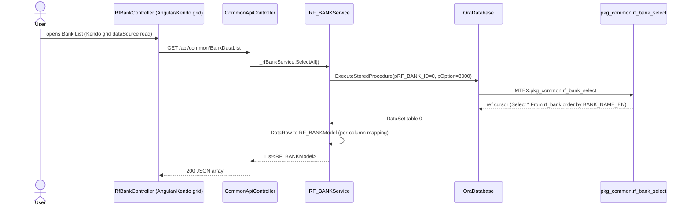

# Feature: Bank List (Commercial)

```yaml
---
id: feat:cm-rf-bank-list
module: commercial
http: GET /api/common/BankDataList
mvc: CmrController.RfBank
api: [GET BankDataList -> CommonApiController.BankDataList, GET BankDataDD -> CommonApiController.BankDataDD, GET BankAccTypeDataDD -> CommonApiController.BankAccTypeDataDD, POST BankSave -> CommonApiController.BankSave, POST BankAccountSave -> CommonApiController.BankAccountSave, GET GetBankBranchList -> CommonApiController.GetBankBranchList, GET GetBankBranchListDropdown -> CommonApiController.GetBankBranchListDropdown, GET GetPaginatedBankBranchListDropdown -> CommonApiController.GetPaginatedBankBranchListDropdown, GET GetPaginatedBankListDropdown -> CommonApiController.GetPaginatedBankListDropdown, GET BankBranchAccList -> CommonApiController.BankBranchAccList, GET BankBranchDataList/{pRF_BANK_ID} -> CommonApiController.BankBranchDataList, POST BankBranchSave -> CommonApiController.BankBranchSave, GET BankAccountAutoList -> CommonApiController.BankAccountAutoList, GET SelectBankAccNumberAutoCom -> CommonApiController.SelectBankAccNumberAutoCom]
service: IRF_BANKService / RF_BANKService (+ IRF_BANK_BRANCHService / RF_BANK_BRANCHService for branch/account child data)
procedure: pkg_common.rf_bank_select | rf_bank_insert | rf_bank_branch_select | rf_bank_branch_insert
pOption: 3000 list (bank), 1000 insert/update (bank), 3000/3002 list (branch), 1000 insert/update (branch), 1001 insert/update (bank account)
tables: [RF_BANK, RF_BANK_BRANCH, ACC_BANK_ACCOUNT, RF_BANK_AC_TYPE]
models: [RF_BANKModel, RF_BANK_BRANCHModel, RF_BANK_FILTER, RF_BANK_BRANCH_FILTER]
session: [multiScUserId]
upstream: [feat:security-signin]
downstream: [merchandising buyer (RF_BANK_ID FK), commercial export LC / bank bill collection screens]
status: inferred
---
```

> **Shared master data, not a Commercial-owned table.** `RF_BANK` lives under the `RF_` reference-data
> prefix (see `docs/09-naming-conventions.md`) and its BLL/model files live in the shared `Commons`
> layer (`ERP.BLL/Commons`, `ERP.Model/Common`), not under any Commercial namespace. The only thing
> "Commercial" about this feature is the menu entry point: Commercial's sidebar (`rf-bank-list`,
> Export ▸ Master Data ▸ Bank List) happens to be where this list/maintain screen is exposed in the
> UI. The same `RF_BANK` table is read by Merchandising (`MC_BUYER.RF_BANK_ID` FK, per
> `docs/features/merchandising-buyer.md`), by HR (`Bank_InfoModel`, salary bank statements), by
> Purchase (supplier profile bank fields), and by numerous Commercial reports (`PKG_CM_REPORT.sql`,
> `PKG_CM_EXPORT_BILL.sql`) that join to it for bank name/prefix display.
>
> A separate, standalone repo (`MultiTechERPAccounting`) documents Accounting's own menus. Its
> `docs/accounting/master-data/009_manage-bank/01-overview.md` states plainly that Accounting has
> **no** "Manage Bank" menu, controller, service, or table of its own — it explicitly says no such
> master exists anywhere in either that repo or this one. So, unlike a typical "shared master
> table" case, this is **not** two modules' menus both pointing at `RF_BANK` — Accounting simply
> never built an equivalent screen. Bank Reconciliation Vouchers and the Bank Book Report in
> Accounting are unrelated features that (per that doc) don't look values up from any bank master.

## Purpose

Maintain the ERP's shared bank reference list: bank name/code, country, SWIFT code, and per-bank
branches with the branch's own bank accounts (account type, account number, beneficiary). Reached
from the Commercial module's Export ▸ Master Data ▸ Bank List menu, but the underlying data is used
company-wide (buyer master, HR salary bank details, supplier profile, commercial export
LC/bill-collection screens).

## Entry

| Kind | Value |
|---|---|
| Menu / sidebar id | `rf-bank-list` (Commercial ▸ Export ▸ Master Data ▸ Bank List) |
| Angular state | `RfBankList`, url `/RfBankList` |
| MVC view | `src/ERPSolution/Areas/Commercial/Views/Cmr/RfBank.cshtml` (shell) + `_RfBankList.cshtml` (state template) |
| Angular controller | `src/ERPSolution/Areas/Commercial/Client/app/controllers/RfBankController.js` |
| Modal views | `src/ERPSolution/Views/GlobalUI/RFBankEntry.cshtml` (bank add/edit), `RFBankBranchEntry.cshtml` (branch + account add/edit) |
| API (list) | `GET /api/common/BankDataList` |
| API (save bank) | `POST /api/common/BankSave` |
| API (branch list) | `GET /api/common/BankBranchDataList/{pRF_BANK_ID}` |
| API (save branch) | `POST /api/common/BankBranchSave` |
| API (account list) | `GET /api/common/BankBranchAccList?pRF_BANK_BRANCH_ID=` |
| API (save account) | `POST /api/common/BankAccountSave` |
| API (delete account) | `POST /api/common/BankAccountDelete` |

Route registration confirmed in `src/ERPSolution/Areas/Commercial/Client/app/config.cmrRoute.js`
(state `RfBankList`, `Title: 'RF Bank List'`, `controller: 'RfBankController'`).

## Execution (list)



## Execution (save bank)

```mermaid
sequenceDiagram
  participant UI as RFBankEntry modal (vm.submitDataNewBank)
  participant API as CommonApiController.BankSave
  participant Svc as RF_BANKService.Save
  participant DB as OraDatabase
  participant PKG as pkg_common.rf_bank_insert

  UI->>API: POST /api/common/BankSave (RF_BANKModel)
  API->>Svc: _rfBankService.Save(ob)
  Svc->>DB: params pRF_BANK_ID, pBANK_CODE, pBANK_NAME_EN, pBANK_NAME_BN, pBANK_PREFIX,<br/>pIS_LOCAL, pHR_COUNTRY_ID, pIS_TREASURY, pSWIFT_CODE, pIBN_NO,<br/>pCALL_CENTER_NO, pWEB_URL, pIS_ACTIVE, pCREATED_BY, pLAST_UPDATED_BY,<br/>pOption=1000, opRF_BANK_ID OUT, pMsg OUT
  DB->>PKG: MTEX.pkg_common.rf_bank_insert
  Note over PKG: pRF_BANK_ID>0 -> UPDATE RF_BANK;<br/>else duplicate-name/code check then INSERT RF_BANK (RF_BANK_SEQ.nextval)
  PKG-->>DB: OUTPARAM (pMsg, opRF_BANK_ID)
  Svc-->>API: hand-built JSON string from OUTPARAM KEY/VALUE
  API-->>UI: {success, jsonStr}
```

Branch save (`BankBranchSave` -> `pkg_common.rf_bank_branch_insert`, `pOption=1000`) and bank
account save (`BankAccountSave` -> same procedure, `pOption=1001`) follow the identical
OraDatabase/OUTPARAM shape, writing `RF_BANK_BRANCH` and `ACC_BANK_ACCOUNT` respectively. Notably,
saving a branch also back-updates `RF_BANK.SWIFT_CODE` from the branch form's `pSWIFT_CODE`
(`UPDATE RF_BANK SET SWIFT_CODE = pSWIFT_CODE WHERE RF_BANK_ID = pRF_BANK_ID` inside
`rf_bank_branch_insert`, both the update and insert branches) — see Known Issues.

## C# map

| Layer | Type | Path |
|---|---|---|
| API | `CommonApiController` (`[RoutePrefix("api/common")]`) | `src/ERPSolution/Controllers/CommonApiController.cs` |
| Service | `RF_BANKService` / `IRF_BANKService` | `src/ERP.BLL/Commons/RF_BANKService.cs` / `IRF_BANKService.cs` |
| Service (branch/account) | `RF_BANK_BRANCHService` / `IRF_BANK_BRANCHService` | `src/ERP.BLL/Commons/RF_BANK_BRANCHService.cs` / `IRF_BANK_BRANCHService.cs` |
| Model | `RF_BANKModel` | `src/ERP.Model/Common/RF_BANKModel.cs` |
| Model (branch/account) | `RF_BANK_BRANCHModel` | `src/ERP.Model/Common/RF_BANK_BRANCHModel.cs` (referenced by controller; not independently re-read for this doc) |
| Package | `PKG_COMMON` | `src/ERPSolution/oracle/packages/PKG_COMMON.sql` |

## Oracle

| Item | Value |
|---|---|
| Package | `PKG_COMMON` |
| Select (bank) | `rf_bank_select`, `pOption=3000` all / `3001` by id / `3100` active-only dropdown |
| Insert/Update (bank) | `rf_bank_insert`, `pOption=1000` (branches on `pRF_BANK_ID>0`) |
| Select (branch) | `rf_bank_branch_select`, `pOption=3000` all-active joined to `RF_BANK` / `3001` by id / `3002` by `RF_BANK_ID` (used by `BankBranchDataList`) |
| Insert/Update (branch) | `rf_bank_branch_insert`, `pOption=1000` |
| Insert/Update (bank account) | `rf_bank_branch_insert`, `pOption=1001` (writes `ACC_BANK_ACCOUNT`, keyed by `ACC_BANK_ACCOUNT_ID_SEQ`) |
| Account-type dropdown | `rf_bank_acc_type_select`, `pOption=3000` from `RF_BANK_AC_TYPE` |
| Account autocomplete | `RF_BANK_ACCOUNT_SELECT`, `pOption=3000` |
| Main table | `RF_BANK` |
| Child tables | `RF_BANK_BRANCH` (FK `RF_BANK_ID`), `ACC_BANK_ACCOUNT` (FK `RF_BANK_BRANCH_ID`) |
| Lookup table | `RF_BANK_AC_TYPE` (account type dropdown) |

## Request / response

**In (list):** none (`pRF_BANK_ID=0`, `pOption=3000` fixed server-side).
**In (save bank):** `RF_BANKModel` body — `RF_BANK_ID`, `BANK_CODE`, `BANK_NAME_EN`, `BANK_NAME_BN`,
`BANK_PREFIX`, `IS_LOCAL`, `HR_COUNTRY_ID`, `IS_TREASURY`, `SWIFT_CODE`, `IBN_NO`,
`CALL_CENTER_NO`, `WEB_URL`, `IS_ACTIVE`.
**Out:** list endpoint returns a plain JSON array of `RF_BANKModel`; save endpoints return
`{success, jsonStr}` where `jsonStr` is a hand-assembled `{"KEY":"VALUE", ...}` string built from
the package's `OUTPARAM` table (matches the `mc_buyer` pattern in
`docs/features/merchandising-buyer.md`).

## Tables / columns touched

`RF_BANK` columns (reconstructed from `rf_bank_insert`'s INSERT list, the fullest statement found —
no DDL exists in the repo): `RF_BANK_ID` (PK), `BANK_CODE`, `BANK_NAME_EN`, `BANK_NAME_BN`,
`BANK_PREFIX`, `IS_LOCAL`, `HR_COUNTRY_ID` (FK), `IS_TREASURY`, `SWIFT_CODE`, `IBN_NO`,
`CALL_CENTER_NO`, `WEB_URL`, `IS_ACTIVE`, `CREATION_DATE`, `CREATED_BY`, plus
`LAST_UPDATE_DATE`/`LAST_UPDATED_BY` (seen in the `rf_bank_insert` UPDATE branch).

`RF_BANK_BRANCH` columns (from `rf_bank_branch_insert`'s INSERT list): `RF_BANK_BRANCH_ID` (PK),
`RF_BANK_ID` (FK), `BANK_BRANCH_CODE`, `BANK_BRANCH_NAME_EN`, `BANK_BRANCH_NAME_BN`,
`SWIFT_CODE_EXT`, `ROUTING_NO`, `BRANCH_ADDRESS_EN`, `BRANCH_ADDRESS_BN`, `HR_COUNTRY_ID`,
`PHONE_NO`, `PHONE_EXT`, `FAX_NO`, `EMAIL_ID`, `IS_CORPORATE_L`, `IS_CORPORATE_F`, `IS_ACTIVE`,
`CREATION_DATE`, `CREATED_BY`, `LAST_UPDATE_DATE`, `LAST_UPDATED_BY`.

`ACC_BANK_ACCOUNT` columns (from the `pOption=1001` INSERT list): `ACC_BANK_ACCOUNT_ID` (PK),
`RF_BANK_BRANCH_ID` (FK), `ACOUNT_TYPE`, `ACOUNT_NO`, `IS_ACTIVE`, `NOTE`, `ACCOUNT_NAME`,
`BENEFICIARY_NAME`.

No `docs/schema/RF_BANK.md` exists yet; per `AGENTS.md` one should only be added when a feature
file's `tables:` list needs it — flagging that as a follow-up rather than creating it speculatively
here.

## Permissions / session

`RF_BANKService.Save` reads `HttpContext.Current.Session["multiScUserId"]` for `pCREATED_BY` /
`pLAST_UPDATED_BY`. No other session-scoped filtering was found in `rf_bank_select` (it returns all
banks/branches regardless of company or user).

## Dependencies (other features)

- Upstream: requires an authenticated session (`multiScUserId`) like every screen.
- Downstream: `MC_BUYER.RF_BANK_ID` (Merchandising buyer master, see
  `docs/features/merchandising-buyer.md`), Commercial export LC / bank-bill-collection screens
  (`ExpLcContractController.js`, `ImpLcController.js`, `BankBillCollListController.js`, etc., all of
  which read `RF_BANK`/`RF_BANK_BRANCH` fields for display or lookup), HR salary/bank-statement
  reports (`PKG_HR_REPORT.sql`, `Bank_InfoModel`), Purchase supplier profile bank fields.

## Gaps

- `status: inferred` — no live DB access; column lists are reconstructed from the fullest
  INSERT/SELECT statements in `PKG_COMMON.sql`, not verified against `ALL_TAB_COLUMNS`.
- `RF_BANK_BRANCHModel` itself was not opened in full (only referenced via the controller/service
  signatures) — its exact property list is not independently confirmed here.
- Several dead/commented-out earlier versions of the add/edit modal logic remain in
  `RfBankController.js` (large commented blocks for `newBankBranchAdd`/`newBankAdd`) — left as-is,
  not treated as functional facts about the live screen.
- `docs/schema/RF_BANK.md`, `RF_BANK_BRANCH.md`, `ACC_BANK_ACCOUNT.md` do not exist yet; not created
  per the "don't create speculative schema files" rule in `AGENTS.md` — add if/when another feature
  file needs to link to them.
