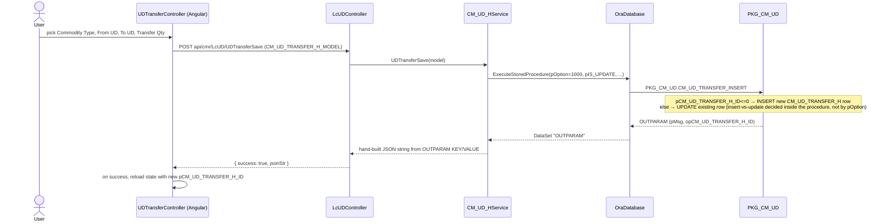
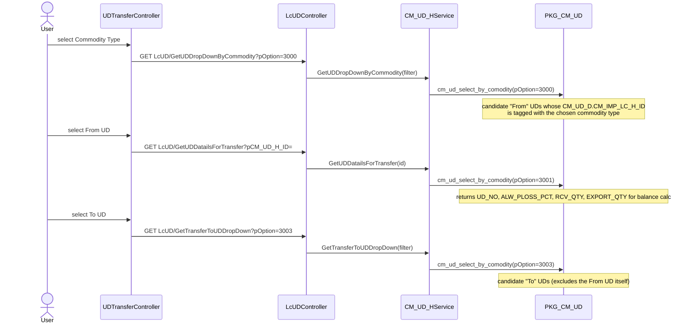

# Feature: UD Transfer

```yaml
---
id: feat:cmr-ud-transfer
module: commercial
http: POST /api/cmr/LcUD/UDTransferSave
mvc: CmrController.UDTransfer
api: [POST LcUD/UDTransferSave -> LcUDController.UDTransferSave, GET LcUD/GetUDTransferInfo -> LcUDController.GetUDTransferInfo, GET LcUD/UDTransferFromDetailsByHId -> LcUDController.UDTransferFromDetailsByHId, GET LcUD/UDTransferToDetailsByHId -> LcUDController.UDTransferToDetailsByHId, GET LcUD/GetAllUDTransfer/{pageNo}/{pageSize} -> LcUDController.GetAllUDTransfer, POST LcUD/DeleteUDTransfer -> LcUDController.DeleteUDTransfer, GET LcUD/GetTransferToUDDropDown -> LcUDController.GetTransferToUDDropDown, GET LcUD/GetUDDropDownByCommodity -> LcUDController.GetUDDropDownByCommodity, GET LcUD/GetUDDatailsForTransfer -> LcUDController.GetUDDatailsForTransfer, GET LcUD/GetUDDetailsForTransferTo -> LcUDController.GetUDDetailsForTransferTo]
service: ICM_UD_HService / CM_UD_HService
procedure: PKG_CM_UD.CM_UD_TRANSFER_INSERT | PKG_CM_UD.CM_UD_TRANSFER_H_SELECT | PKG_CM_UD.UD_TRANSFER_DELETE | PKG_CM_UD.cm_ud_select_by_comodity
pOption: 1000 insert/update (transfer insert), 3000/3001/3003 select (transfer header/list), 3000/3001/3003/3004 select (cm_ud_select_by_comodity dropdown/detail), 1000 delete
tables: [CM_UD_TRANSFER_H, CM_UD_H]
models: [CM_UD_TRANSFER_H_MODEL, CM_UD_FILTER_MODEL]
session: [multiScUserId]
upstream: [feat:cmr-lc-ud]
downstream: []
status: inferred
---
```

This documents only the **UD Transfer** slice of `LcUDController`. The controller is shared with
the sibling "L/C UD" menu (core UD entity, `CM_UD_H`/`CM_UD_H_MODEL`), documented separately in
`docs/features/commercial-lc-ud.md` (may not exist yet at time of writing — not blocked on here).

## Purpose

Lets a Commercial user move (re-allocate) UD quantity from one existing UD ("from" UD) to another
existing UD ("to" UD), recording the transfer as its own header row (`CM_UD_TRANSFER_H`) and
pushing the resulting sent/received quantities back onto both UD headers (`CM_UD_H`). It also
carries its own approval workflow (`RF_ACTN_STATUS_ID` under `RF_ACTN_TYPE_ID = 111`, "UD Transfer
Workflow").

## Entry

| Kind | Value |
|---|---|
| Menu | Export &gt; Transactions &gt; UD Transfer (sidebar id `ud-transfer`) |
| Angular states | `UDTransferList` (`/UDTransferList`), `UDTransfer` (`/UDTransfer?pCM_UD_TRANSFER_H_ID`) |
| Razor views | `Areas/Commercial/Views/Cmr/_UDTransferList.cshtml`, `Areas/Commercial/Views/Cmr/_UDTransfer.cshtml` |
| Angular controllers | `Areas/Commercial/Client/app/controllers/UDTransferListController.js`, `Areas/Commercial/Client/app/controllers/UDTransferController.js` |
| Route config | `Areas/Commercial/Client/app/config.cmrRoute.js` (states `UDTransferList`, `UDTransfer`) |
| API | `[RoutePrefix("api/cmr")]` on `LcUDController`, routes under `LcUD/...Transfer...` |

## Execution (save / insert-or-update)



## Execution (from/to UD lookup, before save)



## C# map

| Layer | Type | Path |
|---|---|---|
| API | `LcUDController` (transfer routes) | `src/ERPSolution/Areas/Commercial/Api/LcUDController.cs` |
| Service | `CM_UD_HService` (region "Public Methods For UD Transfer") | `src/ERP.BLL/Commercials/CM_UD_HService.cs` |
| Model | `CM_UD_TRANSFER_H_MODEL` | `src/ERP.Model/Commercial/CM_UD_TRANSFER_H_MODEL.cs` |
| Filter model | `CM_UD_FILTER_MODEL` | `src/ERP.Model/Commercial/CM_UD_FILTER_MODEL.cs` |
| IoC | `RegisterType<CM_UD_HService>().As<ICM_UD_HService>().InstancePerRequest()` | `src/ERPSolution/App_Start/IocConfig.cs:533` |
| Package | `PKG_CM_UD` | `src/ERPSolution/oracle/packages/PKG_CM_UD.sql` |

## Oracle

| Item | Value |
|---|---|
| Package | `PKG_CM_UD` |
| Insert/Update | `CM_UD_TRANSFER_INSERT`, `pOption=1000` (only option branch that exists — service always sends 1000; `pCM_UD_TRANSFER_H_ID<=0` inside the procedure decides insert vs update) |
| Select (transfer header) | `CM_UD_TRANSFER_H_SELECT`: `pOption=3000` header by id, `3001` From-UD detail joined to To-UD's `UD_NO`, `3003` paginated list (filters: `pFROM_UD_NO`, `pTO_UD_NO`, date range) |
| Select (dropdown/detail) | `cm_ud_select_by_comodity`: `pOption=3000` From-UD dropdown by commodity type, `3001` From-UD balance figures, `3003` To-UD dropdown (excludes current From UD), `3004` rich To-side detail (BBLC/Invoice/BOE) |
| Delete | `UD_TRANSFER_DELETE`, `pOption=1000` — hard `DELETE FROM CM_UD_TRANSFER_H` |
| Main table | `CM_UD_TRANSFER_H` |
| Child table | `CM_UD_TRANSFER_D` — **referenced only in fully commented-out code** in both the procedure body and the C# service (`pXML_UD_TRANSFER_D` is never sent); treat as unused/dead, not a real child table in the working code path |
| Sequences | `CM_UD_TRANSFER_H_ID_SEQ` (used); `CM_UD_TRANSFER_D_ID_SEQ` (referenced only in commented-out code) |
| Side-effect table | `CM_UD_H` — the From/To UD headers are updated as part of `CM_UD_TRANSFER_INSERT` (see below) |

### From/To transfer mechanics (confirmed from procedure body, `PKG_CM_UD.sql:705-895`)

`CM_UD_TRANSFER_INSERT` does three things in one call:

1. Insert or update the `CM_UD_TRANSFER_H` row itself (`FROM_UD_H_ID`, `TO_UD_H_ID`,
   `RF_LC_COMODITY_TYPE_ID`, `RF_ACTN_STATUS_ID`, `IS_FINALIZED`).
   - `IS_FINALIZED` is derived from the selected workflow status: looks up
     `RF_ACTN_STATUS.ACTN_ROLE_FLAG` for `RF_ACTN_TYPE_ID = 111` ("UD Transfer Workflow"); if the
     role flag is `'DN'`, `IS_FINALIZED = 'Y'`, else `'N'`.
   - On update (`pIS_UPDATE = 'Y'`), the existing `RF_ACTN_STATUS_ID`/`IS_FINALIZED` are
     deliberately preserved instead of recalculated (`CASE WHEN NVL(pIS_UPDATE,'N')='Y' THEN ... ELSE ...`).
2. `UPDATE CM_UD_H ... WHERE CM_UD_H_ID = pFROM_UD_H_ID` — sets `UD_TRANSFER_SENT = NVL(pTRANSFER_QTY,0)`
   and `ALW_PLOSS_PCT = pALW_PLOSS_PCT` on the **From** UD header.
3. `UPDATE CM_UD_H ... WHERE CM_UD_H_ID = pTO_UD_H_ID` — sets `UD_TRANSFER_RCV = NVL(pTRANSFER_QTY,0)`
   on the **To** UD header.

So "transfer" here is a direct write of the transfer quantity onto both linked UD headers'
tracking columns (`UD_TRANSFER_SENT` on the source, `UD_TRANSFER_RCV` on the destination), plus a
process-loss percentage carried on the source only — not a running ledger of multiple transfers
(see Known Issues: the assignment overwrites rather than accumulates).

## Request / response

**In (`UDTransferSave`):** `CM_UD_TRANSFER_H_ID` (0 for new), `RF_LC_COMODITY_TYPE_ID`,
`FROM_UD_H_ID` (mapped client-side from `CM_UD_H_ID`), `TO_UD_H_ID` (mapped client-side from
`CM_UD_TO_H_ID`), `RF_ACTN_STATUS_ID`, `PROCESS_LOSS_PERCENT`, `TRANSFER_QTY`, `IS_UPDATE` (`'Y'`/`'N'`, client-set).

**Out:** string assembled from `OUTPARAM` (`PMSG`, `OPCM_UD_TRANSFER_H_ID`), wrapped by the API as
`{ success, jsonStr }`. The Angular controller parses `jsonStr` and re-navigates to the same state
with the returned `pCM_UD_TRANSFER_H_ID` when the message doesn't contain `"MULTI-005"`.

## Tables / columns touched

- `CM_UD_TRANSFER_H`: `CM_UD_TRANSFER_H_ID` (PK), `RF_LC_COMODITY_TYPE_ID`, `FROM_UD_H_ID`,
  `TO_UD_H_ID`, `RF_ACTN_STATUS_ID`, `IS_FINALIZED`, `CREATION_DATE`, `CREATED_BY`,
  `LAST_UPDATE_DATE`, `LAST_UPDATED_BY`.
- `CM_UD_H` (side effect, shared with sibling L/C UD feature): `UD_TRANSFER_SENT`,
  `UD_TRANSFER_RCV`, `ALW_PLOSS_PCT`, `LAST_UPDATE_DATE`, `LAST_UPDATED_BY`.

FKs (source-inferred from JOINs in `CM_UD_TRANSFER_H_SELECT` pOption 3001/3003):
`CM_UD_TRANSFER_H.FROM_UD_H_ID → CM_UD_H.CM_UD_H_ID`, `CM_UD_TRANSFER_H.TO_UD_H_ID → CM_UD_H.CM_UD_H_ID`,
`CM_UD_TRANSFER_H.RF_ACTN_STATUS_ID → RF_ACTN_STATUS.RF_ACTN_STATUS_ID`.

## Permissions / session

`pCREATED_BY`/`pLAST_UPDATED_BY` on save always come from `HttpContext.Current.Session["multiScUserId"]`
(never from the posted model). No explicit menu/role check seen in the controller beyond standard
API auth; workflow gating is via `RF_ACTN_STATUS`/`RF_ACTN_TYPE_ID = 111` roles.

## Dependencies (other features)

- Upstream: the core UD entity (`feat:commercial-lc-ud`, `CM_UD_H`) — both From and To UDs must
  already exist before a transfer can be created.
- Downstream: none identified in this trace.

## Gaps

- **Broken endpoint (source-inferred, not DB-verified):** `LcUD/UDTransferToDetailsByHId` →
  `CM_UD_HService.UDTransferToDetailsByHId` calls `PKG_CM_UD.CM_UD_TRANSFER_H_SELECT` with
  `pOption=3002`, but that `ELSIF` branch is entirely commented out in the procedure body
  (`PKG_CM_UD.sql:929-988`). No `IF`/`ELSIF` matches `pOption=3002`, so `pResult` is never opened —
  this call should fail or return no rows at runtime. The one Angular controller read for this
  feature (`UDTransferController.js`) does not call this endpoint, so it may be effectively dead,
  but the C# code path is broken as written.
- **Dead detail-line feature (source-inferred):** the model carries `XML_UD_TRANSFER_D`, and both
  the procedure (`CM_UD_TRANSFER_INSERT`) and the service (`UDTransferSave`) have the code that
  would parse/write it fully commented out, along with all `CM_UD_TRANSFER_D` insert/update/delete
  logic. `UDTransferController.js` still renders a full grid (`vm.selectedUDTransferToOptions`,
  `vm.AddToTransfer`, `vm.TransferToEditData`) for adding multiple "To" detail lines with BBLC/
  Invoice/BOE columns, backed by `GetTransferToUDDropDown`/`cm_ud_select_by_comodity pOption=3004`,
  but `vm.onTransferToUDSelect` always resets `vm.transferToUDList = []` on selection instead of
  populating it — so in the current code, a user cannot actually add a new row to that grid via
  normal selection (only `TransferToEditData` on an existing item works). This whole multi-line
  "To" allocation UI appears to be a leftover of a feature that was designed (Oracle detail table +
  XML parameter + grid) then disabled without being removed.
- **Overwrite vs. accumulate:** `UD_TRANSFER_SENT`/`UD_TRANSFER_RCV` are set via
  `NVL(pTRANSFER_QTY,0)` (straight overwrite), with the additive form
  (`NVL(uh.UD_TRANSFER_SENT,0) + NVL(pTRANSFER_QTY,0)`) present but commented out right above it —
  meaning only the most recent transfer against a given UD is reflected; a UD transferred more than
  once will not accumulate a running total. Not confirmed against live data, so marked inferred.
- Exact shape of `CM_UD_TRANSFER_H`/`CM_UD_H` (column types, nullability) not confirmed against a
  live catalog — reconstructed only from the fullest INSERT/SELECT statements in the package, per
  repo convention (no DDL in the repo). Never claim "DB-verified" for this file.
- Relationship to the sibling "L/C UD" feature doc (`docs/features/commercial-lc-ud.md`) not
  cross-checked — that file may not exist yet at time of writing.
