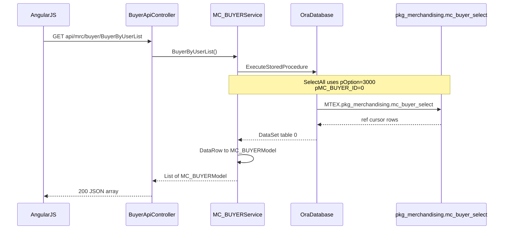
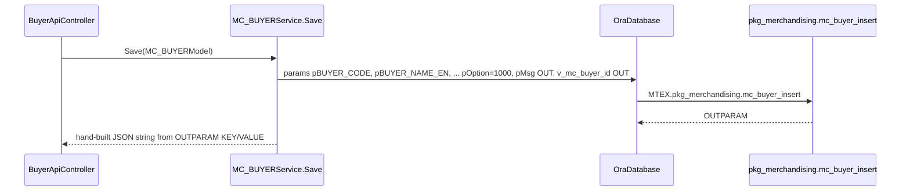

# Feature: Merchandising buyer

```yaml
---
id: feat:mrc-buyer
module: merchandising
http: GET /api/mrc/buyer/BuyerByUserList
mvc: MrcController.BuyerInfo
api: [GET buyer/BuyerByUserList -> BuyerApiController.BuyerByUserList, GET buyer/getBuyerDropdownList -> BuyerApiController.getBuyerDropdownList, GET buyer/getBuyerDropdownListByID/{MC_BYR_ACC_ID} -> BuyerApiController.getBuyerDropdownListByID, GET buyer/GetBuyerListForDropdown -> BuyerApiController.GetBuyerListForDropdown, GET buyer/SelectAll -> BuyerApiController.SelectAll, GET buyer/Select/{ID:int} -> BuyerApiController.Select, GET buyer/GetCountryList -> BuyerApiController.GetCountryList, GET buyer/GetCountryListDropdown -> BuyerApiController.GetCountryListDropdown, GET buyer/GetPaginatedCountryListDropdown -> BuyerApiController.GetPaginatedCountryListDropdown, POST buyer/Save -> BuyerApiController.Save, PUT buyer/Update -> BuyerApiController.Update, GET buyer/GetBuyerListDropdown -> BuyerApiController.GetBuyerListDropdown, GET buyer/GetPaginatedBuyerDropdown -> BuyerApiController.GetPaginatedBuyerDropdown]
service: IMC_BUYERService / MC_BUYERService
procedure: PKG_MERCHANDISING.mc_buyer_select | mc_buyer_insert | mc_buyer_update
pOption: 3000 list, 1000 insert, 2000 update
tables: [MC_BUYER]
models: [MC_BUYERModel, MC_BUYERFilter]
session: [multiScUserId]
upstream: [feat:security-signin]
downstream: [orders, styles, commercial LC]
status: verified
---
```

This is the **canonical CRUD trace** for the whole ERP. Other screens copy this shape.

## Purpose

Maintain garment buyers (customer master). Lists are often filtered by the logged-in merchandiser (`BuyerByUserList`). Save/update write `MC_BUYER` through package insert/update.

## Entry

| Kind | Value |
|---|---|
| API prefix | `[RoutePrefix("api/mrc")]` |
| Controller | `src/ERPSolution/Areas/Merchandising/Api/BuyerApiController.cs` |
| Example GET | `/api/mrc/buyer/BuyerByUserList` |
| Example GET | `/api/mrc/buyer/getBuyerDropdownList?MC_BYR_ACC_ID=` |
| Example GET | `/api/mrc/buyer/GetBuyerListForDropdown` (uses `MC_BUYERFilter`, default `pOption=3009`) |
| UI | `Areas/Merchandising/Client/app/` + MVC views under Merchandising |

Angular (after login) calls these URLs; the MVC Area only hosts the page.

## Execution (list)



## Execution (insert)



Update is the same with `mc_buyer_update` and `pOption=2000`.

## C# map

| Layer | Type | Path |
|---|---|---|
| API | `BuyerApiController` | `src/ERPSolution/Areas/Merchandising/Api/BuyerApiController.cs` |
| Service | `MC_BUYERService` | `src/ERP.BLL/Merchandising/MC_BUYERService.cs` |
| Model | `MC_BUYERModel` | `src/ERP.Model/Merchandising/MC_BUYERModel.cs` |
| IoC | `RegisterType<MC_BUYERService>().As<IMC_BUYERService>()` | `IocConfig.cs` region Merchandising |
| Package | `PKG_MERCHANDISING` | `src/ERPSolution/oracle/packages/PKG_MERCHANDISING.sql` |

## DI on the API

`BuyerApiController` also injects country, buyer office, sample type services — dropdowns on the same screen, not the core save.

## Oracle

| Item | Value |
|---|---|
| Package | `PKG_MERCHANDISING` |
| Insert | `mc_buyer_insert` `pOption=1000` |
| Update | `mc_buyer_update` `pOption=2000` |
| Select | `mc_buyer_select` `pOption=3000` (all); other options exist (e.g. 3009 dropdown) |
| Table | `MC_BUYER` |
| Child on model | `items` → `MC_BU_COL_REFModel` (color ref), not necessarily written in `Save()` |

## Tables / columns

See [schema/MC_BUYER.md](../schema/MC_BUYER.md).

FKs used on save: `HR_COUNTRY_ID`, `HR_COMPANY_ID`, `RF_BANK_ID`, `RF_PAYM_TERM_ID`.

## Response shape

Reads: JSON array of models.  
Writes: string assembled from `OUTPARAM` (`pMsg`, `v_mc_buyer_id`, …), often wrapped by the API as `{ success, jsonStr }`.

## Dependencies

- Login session (`multiScUserId`) for user-scoped lists.
- Downstream: `MC_ORDER_H.MC_BUYER_ID`, styles, commercial export LC, knitting programs filtered by buyer.

## Gaps

- `BuyerByUserList` implementation (exact `pOption` and mapping table `MC_USR_BYRACC`) is a sibling method — read it when documenting user–buyer mapping.
- Join fields on the model (`COUNTRY_NAME_EN`, `BYR_ACC_NAME_EN`) are SELECT-only.
