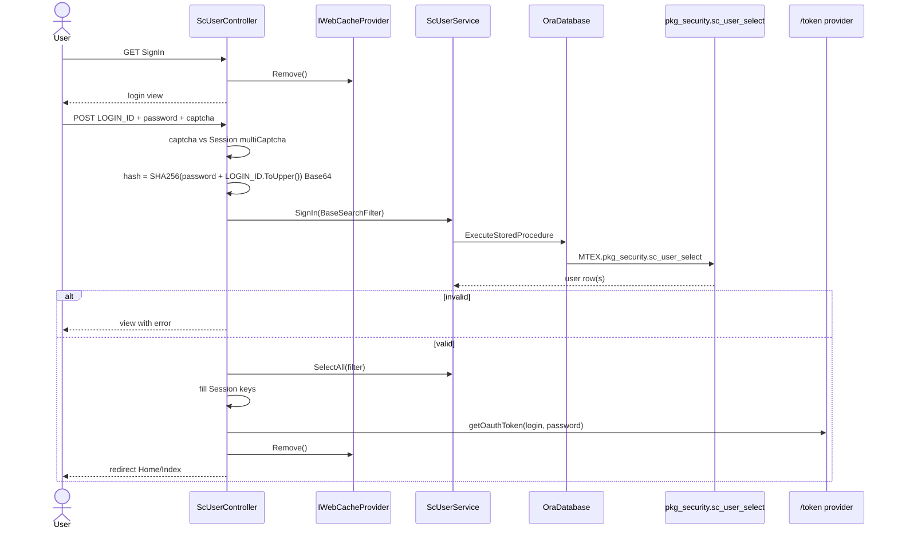

# Feature: Security sign-in

```yaml
---
id: feat:security-signin
module: security
http: GET|POST /Security/ScUser/SignIn
mvc: ScUserController.SignIn
service: IScUserService.SignIn / SelectAll
procedure: PKG_SECURITY.sc_user_select
pOption: (see ScUserService.SignIn)
tables: [SC_USER]
models: [LoginModel, ScUserModel]
session: [multiScUserId, multiLoginEmpId, access_token, scRoleId]
upstream: []
downstream: [feat:home-dashboard]
status: verified
---
```

## Purpose

Authenticate a staff user, bind HR employee/company context into session, then open the ERP shell.

## Entry

| Kind | Value |
|---|---|
| MVC URL | `/Security/ScUser/SignIn` |
| Controller | `src/ERPSolution/Areas/Security/Controllers/ScUserController.cs` |
| GET | empty `LoginModel` + CAPTCHA; clears session and `MultiTEXCache` |
| POST | `LoginModel`: `LOGIN_ID`, `PASSWORD_HASH` (plain password field name), `CAPTCHA_VALUE` |

## Execution



## Password

Same helper as OAuth (`GenerateHashWithSalt`): merge password + uppercase login id, SHA256, Base64. Stored/compared as `PASSWORD_HASH`.

## Session written (partial)

| Key | Source field |
|---|---|
| `multiScUserId` | `SC_USER_ID` |
| `multiLoginEmpId` | `HR_EMPLOYEE_ID` |
| `multiLoginEmpCompId` | `HR_COMPANY_ID` |
| `multiLoginDeptId` | `HR_DEPARTMENT_ID` |
| `multiLoginEmpCode` | `EMPLOYEE_CODE` |
| `multiLoginEmpName` | `EMP_FULL_NAME_EN` |
| `scRoleId` | `SC_ROLE_ID` |
| `access_token` | OAuth token |
| `multiLoginId` | login id |

After this, `BaseController.IsMenuPermission` can resolve menus via `SC_MENU`.

## Side path: OAuth

`POST /token` with resource-owner credentials:

- `SimpleAuthorizationServerProvider.GrantResourceOwnerCredentials`
- `ScUserPlainService().SignIn` (new’s the service; not Autofac)
- Ticket properties: `SC_USER_ID`, `USER_NAME_EN`, `USER_EMAIL`
- Expiry: 1 day

## C# map

| Layer | Type | Path |
|---|---|---|
| MVC | `ScUserController` | `src/ERPSolution/Areas/Security/Controllers/ScUserController.cs` |
| OAuth | `SimpleAuthorizationServerProvider` | `src/ERPSolution/Providers/SimpleAuthorizationServerProvider.cs` |
| Service | `ScUserService` | `src/ERP.BLL/Securities/ScUserService.cs` |
| Model | `LoginModel`, `ScUserModel` | `src/ERP.Model/Security/ScUserModel.cs` |
| Package | `PKG_SECURITY` | `src/ERPSolution/oracle/packages/PKG_SECURITY.sql` |

## Tables

Primary: `SC_USER` (inferred from model/package). Joins in SELECT likely pull HR employee, department, company, role — those columns appear on `ScUserModel` after login (`EMP_FULL_NAME_EN`, `DEPARTMENT_NAME_EN`, …) and may not live on `SC_USER`.

## Gaps

- Exact `pOption` for `SignIn` vs `SelectAll` is in `ScUserService` (multiple `sc_user_select` calls). Read that file when changing login.
- Memorable-word / forced password change (`IS_PWD_CNG_LOGON`) is a branch after session fill.
- `api:` frontmatter field omitted: the OAuth `/token` endpoint (`Startup.cs:53`, `TokenEndpointPath = new PathString("/token")`) is wired via OWIN middleware (`SimpleAuthorizationServerProvider`), not a `[Route]`-attributed Web API controller action, so it doesn't fit the `HTTP_METHOD path -> Controller.Method` shape — see "Side path: OAuth" above instead.
