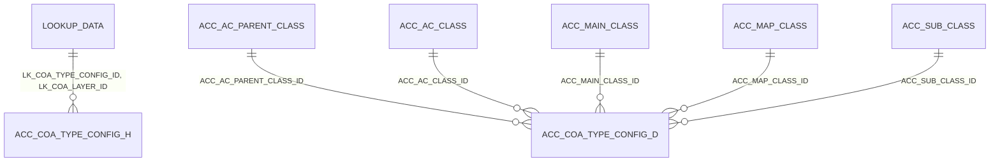

# Table: ACC_COA_TYPE_CONFIG_H

```yaml
---
id: tbl:ACC_COA_TYPE_CONFIG_H
module: accounting
status: db-verified
model: "n/a — no maintenance screen exists"
package: PKG_ACCOUNTING (report-consumption side only)
procedures: []
# columns: full FK/PK graph data for this table, DB-verified 2026-09-14 (see ## Keys & Indexes below for the raw constraint names).
columns: [LK_COA_LAYER_ID->LOOKUP_DATA.LOOKUP_DATA_ID, LK_COA_TYPE_CONFIG_ID->LOOKUP_DATA.LOOKUP_DATA_ID, ACC_COA_TYPE_CONFIG_H_ID]
---
```

Header table for "which Chart of Accounts nodes map to which COA type" (Income Tax, Direct Expenses,
Purchase Account, Profit/Loss & Retained Earnings sections). Documented together with its detail
table `ACC_COA_TYPE_CONFIG_D` since they only make sense as a pair.

**Status:** `db-verified` — pulled directly from Oracle's own catalog on the dev instance.

## Finding: both tables are empty

**`ACC_COA_TYPE_CONFIG_H` has 0 rows. `ACC_COA_TYPE_CONFIG_D` has 0 rows.** The docs site's existing
text claims "anyone whose reports rely on it must be populating rows directly against the database
today" — this dev database has no evidence of that. Could simply mean dev lacks production's seed
data; worth re-checking against production before treating this configuration as actively populated
anywhere, rather than merely designed-for.

## Columns — ACC_COA_TYPE_CONFIG_H

| Column | Type (Oracle) | Nullable | Role |
|---|---|---|---|
| `ACC_COA_TYPE_CONFIG_H_ID` | NUMBER | N | PK (system-generated constraint name `SYS_C0028862`, not explicitly named — unlike most other tables in this schema) |
| `LK_COA_TYPE_CONFIG_ID` | NUMBER | N | FK → `LOOKUP_DATA` (which COA type) |
| `LK_COA_LAYER_ID` | NUMBER | N | FK → `LOOKUP_DATA` (which hierarchy layer) |
| `IS_ACTIVE`, audit columns | CHAR/DATE/NUMBER | Y | Standard |

## Columns — ACC_COA_TYPE_CONFIG_D

| Column | Type (Oracle) | Nullable | Role |
|---|---|---|---|
| `ACC_COA_TYPE_CONFIG_D_ID` | NUMBER | N | PK (also a system-generated constraint name, `SYS_C0030459`) |
| `ACC_COA_TYPE_CONFIG_H_ID` | NUMBER | N | Parent link (no FK constraint found on this column specifically — see note) |
| `ACC_AC_PARENT_CLASS_ID`, `ACC_AC_CLASS_ID`, `ACC_MAIN_CLASS_ID`, `ACC_MAP_CLASS_ID`, `ACC_SUB_CLASS_ID` | NUMBER | Y | One FK each into the Chart of Accounts hierarchy, letting a detail row point at any of its 5 levels |

## Keys & Indexes

**Primary key:** `SYS_C0028862` on `ACC_COA_TYPE_CONFIG_H_ID`

**Foreign keys:**

| Constraint | Column | References |
|---|---|---|
| `FK_LK_COA_LAYER_ID` | `LK_COA_LAYER_ID` | `LOOKUP_DATA.LOOKUP_DATA_ID` |
| `FK_LK_COA_TYPE` | `LK_COA_TYPE_CONFIG_ID` | `LOOKUP_DATA.LOOKUP_DATA_ID` |

**Indexes:**

| Index | Unique? | Columns |
|---|---|---|
| `SYS_C0028862` | yes | `ACC_COA_TYPE_CONFIG_H_ID` |

*Verified read-only against the dev Oracle DB (`mtexdev`, host `118.67.213.142`) on 2026-09-14 via `ALL_CONSTRAINTS`/`ALL_CONS_COLUMNS`/`ALL_INDEXES`/`ALL_IND_COLUMNS` under schema `MTEX`. No DDL exists in either repo, so this is the only ground truth for keys/indexes.*

## Relationships



All 7 FKs shown (2 on the header, 5 on the detail table) are real and enforced — the design matches
what the docs site already claimed by convention.

## Indexes

Only PK indexes exist on both tables. Both are empty, so no indexing conclusion is meaningful yet —
revisit once (if) either table is actually populated in production.

## Feature

[COA Type Configuration](../../../Docs/data/accounting.js) — menu id `coa-type-configuration`.
