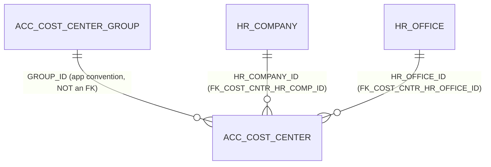

# Table: ACC_COST_CENTER

```yaml
---
id: tbl:ACC_COST_CENTER
module: accounting
status: db-verified
model: CostCenterModel
package: PKG_ACCOUNTING
procedures: [ac_cost_center_save, ac_cost_center_delete, ac_cost_center_select]
# columns: full FK/PK graph data for this table, DB-verified 2026-09-14 (see ## Keys & Indexes below for the raw constraint names).
columns: [HR_COMPANY_ID->HR_COMPANY.HR_COMPANY_ID, HR_OFFICE_ID->HR_OFFICE.HR_OFFICE_ID, COST_CENTER_ID]
---
```

The selectable cost center (department/branch/project) tagged onto voucher lines.

**Status:** `db-verified` &mdash; pulled directly from Oracle's own catalog on the dev instance.

## Columns

| Column | Type (Oracle) | Nullable | Role |
|---|---|---|---|
| `COST_CENTER_ID` | NUMBER | N | PK |
| `COST_CENTER_NAME` | VARCHAR2 | Y | Name; unique **within a group** (see Indexes) |
| `COMP_CODE` | CHAR | N | Company scope |
| `REMARKS` | VARCHAR2 | Y | Free-text |
| `COST_CENTER_CODE` | VARCHAR2 | Y | Auto-generated display code |
| `GROUP_ID` | NUMBER | Y | Parent group (app convention, not FK-enforced &mdash; see Relationships) |
| `HR_COMPANY_ID` | NUMBER | Y | FK &rarr; `HR_COMPANY`, but unused by the app (see Known Issues on the docs site) |
| `HR_OFFICE_ID` | NUMBER | Y | FK &rarr; `HR_OFFICE`, but unused by the app |
| `HR_DEPARTMENT_ID_LST` | VARCHAR2 | Y | Unused by the app |

## Keys & Indexes

**Primary key:** `PK_ACC_COST_CENTER` on `COST_CENTER_ID`

**Unique constraints:**

| Constraint | Columns |
|---|---|
| `UK_COST_CENTER_NAME` | `GROUP_ID`, `COST_CENTER_NAME` |

**Foreign keys:**

| Constraint | Column | References |
|---|---|---|
| `FK_COST_CNTR_HR_COMP_ID` | `HR_COMPANY_ID` | `HR_COMPANY.HR_COMPANY_ID` |
| `FK_COST_CNTR_HR_OFFICE_ID` | `HR_OFFICE_ID` | `HR_OFFICE.HR_OFFICE_ID` |

**Indexes:**

| Index | Unique? | Columns |
|---|---|---|
| `PK_ACC_COST_CENTER` | yes | `COST_CENTER_ID` |
| `UK_COST_CENTER_NAME` | yes | `GROUP_ID`, `COST_CENTER_NAME` |

*Verified read-only against the dev Oracle DB (`mtexdev`, host `118.67.213.142`) on 2026-09-14 via `ALL_CONSTRAINTS`/`ALL_CONS_COLUMNS`/`ALL_INDEXES`/`ALL_IND_COLUMNS` under schema `MTEX`. No DDL exists in either repo, so this is the only ground truth for keys/indexes.*

## Relationships



**Two undocumented real relationships found:** `HR_COMPANY_ID` and `HR_OFFICE_ID` both carry real,
enforced FK constraints (`FK_COST_CNTR_HR_COMP_ID`, `FK_COST_CNTR_HR_OFFICE_ID`) &mdash; the schema
protects referential integrity on them even though the docs site's existing "Unused Columns" finding
(app-level: never populated or read by C# code) still holds. Schema-enforced and app-dead are not
mutually exclusive.

Conversely, `GROUP_ID` &rarr; `ACC_COST_CENTER_GROUP`, which the app clearly relies on, is **not**
backed by any FK constraint at all.

## Indexes

| Index | Uniqueness | Column(s) | Note |
|---|---|---|---|
| `PK_ACC_COST_CENTER` | Unique | `COST_CENTER_ID` | PK |
| `UK_COST_CENTER_NAME` | Unique | `GROUP_ID`, `COST_CENTER_NAME` | Not previously documented &mdash; cost center names must be unique *within a group*, not globally. |

Table has 97 rows &mdash; no additional indexing need.

## Feature

[Cost Center](../../../Docs/data/accounting.js) &mdash; menu id `cost-center`.
