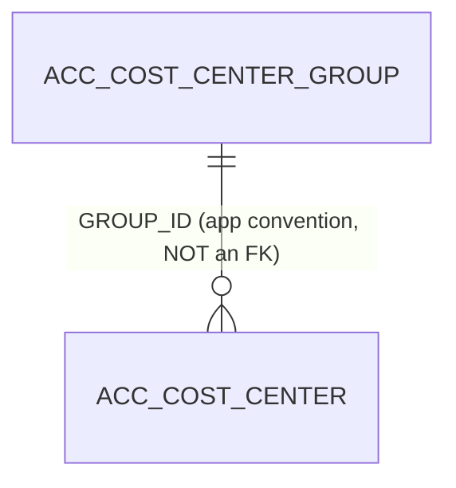

# Table: ACC_COST_CENTER_GROUP

```yaml
---
id: tbl:ACC_COST_CENTER_GROUP
module: accounting
status: db-verified
model: CostCenterGroupModel
package: PKG_ACCOUNTING
procedures: [ac_cost_center_group_save, ac_cost_center_group_delete, ac_cost_center_group_select]
# columns: full FK/PK graph data for this table, DB-verified 2026-09-14 (see ## Keys & Indexes below for the raw constraint names).
columns: [GROUP_ID]
---
```

Grouping/label for Cost Centers, used only to subtotal reports by group.

**Status:** `db-verified` &mdash; pulled directly from Oracle's own catalog on the dev instance.

## Columns

| Column | Type (Oracle) | Nullable | Role |
|---|---|---|---|
| `GROUP_ID` | NUMBER | N | PK |
| `NAME` | VARCHAR2 | Y | Group name; **globally unique** (see Indexes) |
| `COMP_CODE` | CHAR | N | Company scope |
| `REMARKS` | VARCHAR2 | Y | Free-text |
| `DISPLAY_ORDER` | NUMBER | Y | List/report ordering |

## Keys & Indexes

**Primary key:** `ACC_COST_CENTER_GROUP_PK` on `GROUP_ID`

**Unique constraints:**

| Constraint | Columns |
|---|---|
| `UK_CST_CNTR_GRP_NAME` | `NAME` |

**Foreign keys:** none defined at the DB level.

**Indexes:**

| Index | Unique? | Columns |
|---|---|---|
| `ACC_COST_CENTER_GROUP_PK` | yes | `GROUP_ID` |
| `UK_CST_CNTR_GRP_NAME` | yes | `NAME` |

*Verified read-only against the dev Oracle DB (`mtexdev`, host `118.67.213.142`) on 2026-09-14 via `ALL_CONSTRAINTS`/`ALL_CONS_COLUMNS`/`ALL_INDEXES`/`ALL_IND_COLUMNS` under schema `MTEX`. No DDL exists in either repo, so this is the only ground truth for keys/indexes.*

## Relationships



**Correction to the doc-site's prior assumption:** `ACC_COST_CENTER.GROUP_ID` referencing this table
is **not** a real FK constraint. Checked `ALL_CONSTRAINTS` for `ACC_COST_CENTER` and found no
`R`-type constraint on `GROUP_ID` at all &mdash; it's an application-level convention only, unlike
the Chart of Accounts hierarchy which *is* fully FK-enforced.

## Indexes

| Index | Uniqueness | Column(s) | Note |
|---|---|---|---|
| `ACC_COST_CENTER_GROUP_PK` | Unique | `GROUP_ID` | PK |
| `UK_CST_CNTR_GRP_NAME` | Unique | `NAME` | Not previously documented &mdash; group names must be globally unique. |

Table has 7 rows &mdash; no additional indexing need.

## Feature

[Cost Center Group](../../../Docs/data/accounting.js) &mdash; menu id `cost-center-group`.
