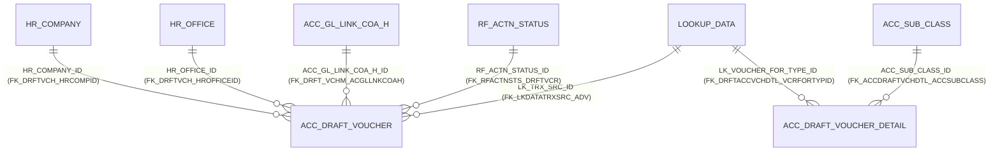

# Table: ACC_DRAFT_VOUCHER

```yaml
---
id: tbl:ACC_DRAFT_VOUCHER
module: accounting
status: db-verified
model: DraftVoucherModel
package: PKG_ACCOUNTING
procedures: [acc_draft_voucher_save, ACC_CONFIRM_INSERT, acc_draft_voucher_select]
# columns: full FK/PK graph data for this table, DB-verified 2026-09-14 (see ## Keys & Indexes below for the raw constraint names).
columns: [HR_COMPANY_ID->HR_COMPANY.HR_COMPANY_ID, HR_OFFICE_ID->HR_OFFICE.HR_OFFICE_ID, ACC_GL_LINK_COA_H_ID->ACC_GL_LINK_COA_H.ACC_GL_LINK_COA_H_ID, LK_TRX_SRC_ID->LOOKUP_DATA.LOOKUP_DATA_ID, RF_ACTN_STATUS_ID->RF_ACTN_STATUS.RF_ACTN_STATUS_ID]
---
```

Header table for draft (working-copy) vouchers. Documented together with `ACC_DRAFT_VOUCHER_DETAIL`
(lines), `ACC_TEMP_DRAFT_VOUCHER` (per-user scratch), and `ACC_TEMP_VOUCHER_DETAIL` (final-voucher
scratch) since they form one workflow.

**Status:** `db-verified` — pulled directly from Oracle's own catalog on the dev instance.

## No primary key

**Neither `ACC_DRAFT_VOUCHER` nor `ACC_DRAFT_VOUCHER_DETAIL` has a declared PK constraint** — only
unique constraints exist. `VOUCHER_MASTER_ID`/`VOUCHER_DETAIL_ID` function as surrogate keys by
convention only, unlike every other table checked so far in this module. Neither table has any
index beyond what the unique constraints imply.

## Keys & Indexes

**Primary key:** none defined at the DB level (no `all_constraints` row with `constraint_type='P'`)

**Unique constraints:**

| Constraint | Columns |
|---|---|
| `POST_ID_UQ` | `POST_ID` |
| `UK_ACC_DRFT_VCH01` | `HR_COMPANY_ID`, `VOUCHER_TYPE_ID`, `VOUCHER_NO` |

**Foreign keys:**

| Constraint | Column | References |
|---|---|---|
| `FK_DRFTVCH_HRCOMPID` | `HR_COMPANY_ID` | `HR_COMPANY.HR_COMPANY_ID` |
| `FK_DRFTVCH_HROFFICEID` | `HR_OFFICE_ID` | `HR_OFFICE.HR_OFFICE_ID` |
| `FK_DRFT_VCHM_ACGLLNKCOAH` | `ACC_GL_LINK_COA_H_ID` | `ACC_GL_LINK_COA_H.ACC_GL_LINK_COA_H_ID` |
| `FK_LKDATATRXSRC_ADV` | `LK_TRX_SRC_ID` | `LOOKUP_DATA.LOOKUP_DATA_ID` |
| `FK_RFACTNSTS_DRFTVCR` | `RF_ACTN_STATUS_ID` | `RF_ACTN_STATUS.RF_ACTN_STATUS_ID` |

**Indexes:**

| Index | Unique? | Columns |
|---|---|---|
| `POST_ID_UQ` | yes | `POST_ID` |
| `UK_ACC_DRFT_VCH01` | yes | `HR_COMPANY_ID`, `VOUCHER_TYPE_ID`, `VOUCHER_NO` |

*Verified read-only against the dev Oracle DB (`mtexdev`, host `118.67.213.142`) on 2026-09-14 via `ALL_CONSTRAINTS`/`ALL_CONS_COLUMNS`/`ALL_INDEXES`/`ALL_IND_COLUMNS` under schema `MTEX`. No DDL exists in either repo, so this is the only ground truth for keys/indexes.*

## Relationships



The workflow link the docs site already describes (`RF_ACTN_STATUS_ID`) is confirmed real and
enforced, not a naming convention. `HR_OFFICE_ID` and `LK_TRX_SRC_ID` are real FKs not previously
documented.

## Indexes

| Table | Constraint/Index | Note |
|---|---|---|
| `ACC_DRAFT_VOUCHER` | `POST_ID_UQ` (unique, `POST_ID`) | Confirms the docs site's claim that the draft's `POST_ID` is its own internal unique reference. |
| `ACC_DRAFT_VOUCHER` | `UK_ACC_DRFT_VCH01` (unique composite: `HR_COMPANY_ID`, `VOUCHER_TYPE_ID`, `VOUCHER_NO`) | Mirrors the exact same composite-unique pattern already seen on `ACC_VOUCHER_MASTER` (`UK_ACC_VCHMASTER_02`) — consistent design between draft and final voucher tables. |
| `ACC_DRAFT_VOUCHER_DETAIL`, `ACC_TEMP_DRAFT_VOUCHER`, `ACC_TEMP_VOUCHER_DETAIL` | None beyond FK-backing | All three are small (44/69/39 rows) — no performance concern at this size. |

## Feature

[Draft Voucher](../../../Docs/data/accounting.js) — menu id `draft-voucher`.
