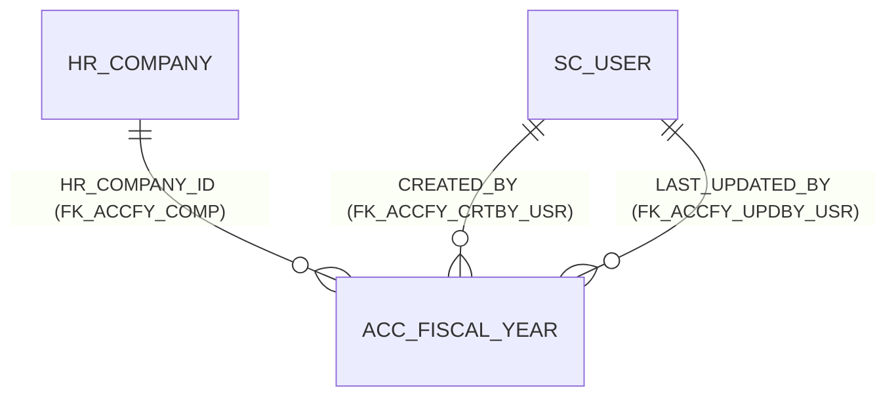

# Table: ACC_FISCAL_YEAR

```yaml
---
id: tbl:ACC_FISCAL_YEAR
module: accounting
status: db-verified
model: FiscalYearModel
package: PKG_ACCOUNTING
procedures: [ac_fiscal_year_close]
# columns: full FK/PK graph data for this table, DB-verified 2026-09-14 (see ## Keys & Indexes below for the raw constraint names).
columns: [HR_COMPANY_ID->HR_COMPANY.HR_COMPANY_ID, CREATED_BY->SC_USER.SC_USER_ID, LAST_UPDATED_BY->SC_USER.SC_USER_ID, ACC_FISCAL_YEAR_ID]
---
```

Fiscal year master. Backend-only in the docs site's status (`partial`) &mdash; no shipped Add/Edit
screen; only a read-only Period dropdown and the Closing Process exist in the UI. An
insert/update package for this table exists in the Oracle source but is never called from any C#
service &mdash; a dead code path, deliberately left out of `procedures:` above since nothing
actually calls it (only `ac_fiscal_year_close`, which is live, is listed there).

**Status:** `db-verified` &mdash; pulled directly from Oracle's own catalog on the dev instance.

## Columns

14 columns confirmed matching the docs site's "14 reconstructed columns" claim exactly:
`ACC_FISCAL_YEAR_ID`, `HR_COMPANY_ID`, `FY_NAME_EN`, `FY_NAME_BN`, `FY_START_DATE`, `FY_END_DATE`,
`CY_START_DATE`, `CY_END_DATE`, `IS_CLOSED`, `CREATION_DATE`, `CREATED_BY`, `LAST_UPDATE_DATE`,
`LAST_UPDATED_BY`, `REMARKS`.

Only 13 rows exist in the checked database.

## Keys & Indexes

**Primary key:** `PK_ACC_FISCAL_YEAR` on `ACC_FISCAL_YEAR_ID`

**Foreign keys:**

| Constraint | Column | References |
|---|---|---|
| `FK_ACCFY_COMP` | `HR_COMPANY_ID` | `HR_COMPANY.HR_COMPANY_ID` |
| `FK_ACCFY_CRTBY_USR` | `CREATED_BY` | `SC_USER.SC_USER_ID` |
| `FK_ACCFY_UPDBY_USR` | `LAST_UPDATED_BY` | `SC_USER.SC_USER_ID` |

**Indexes:**

| Index | Unique? | Columns |
|---|---|---|
| `PK_ACC_FISCAL_YEAR` | yes | `ACC_FISCAL_YEAR_ID` |

*Verified read-only against the dev Oracle DB (`mtexdev`, host `118.67.213.142`) on 2026-09-14 via `ALL_CONSTRAINTS`/`ALL_CONS_COLUMNS`/`ALL_INDEXES`/`ALL_IND_COLUMNS` under schema `MTEX`. No DDL exists in either repo, so this is the only ground truth for keys/indexes.*

## Relationships



**Undocumented relationship found:** `HR_COMPANY_ID → HR_COMPANY` is a real enforced FK
(`FK_ACCFY_COMP`) — every fiscal year belongs to a real company. Relevant to the docs site's
"no overlap/gap validation between fiscal years" known issue: any such validation would need to be
scoped per company, and this FK confirms company is always present to scope by.

`CREATED_BY`/`LAST_UPDATED_BY` also carry real FKs to `SC_USER`, despite the docs site correctly
flagging both as unused end-to-end by the application. Schema-enforced and app-dead are not
mutually exclusive (same pattern as `ACC_COST_CENTER.HR_COMPANY_ID`/`HR_OFFICE_ID`).

Confirmed accurate: there is **no** FK from any voucher table to `ACC_FISCAL_YEAR` — the docs site's
"date-range check only, not a real FK" claim holds.

## Indexes

Only the PK index (`PK_ACC_FISCAL_YEAR`). Table has 13 rows — no additional indexing need
regardless of the missing overlap-validation logic issue (that's a correctness bug, not a
performance one).

## Feature

[Fiscal Year](../../../Docs/data/accounting.js) — menu id `fiscal-year`.
