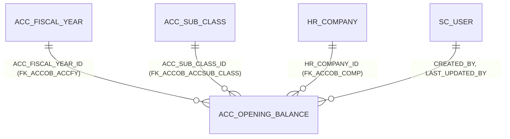

# Table: ACC_OPENING_BALANCE

```yaml
---
id: tbl:ACC_OPENING_BALANCE
module: accounting
status: db-verified
model: OpeningBalanceModel
package: PKG_ACCOUNTING
procedures: [ac_fiscal_year_close]
# columns: full FK/PK graph data for this table, DB-verified 2026-09-14 (see ## Keys & Indexes below for the raw constraint names).
columns: [ACC_FISCAL_YEAR_ID->ACC_FISCAL_YEAR.ACC_FISCAL_YEAR_ID, ACC_SUB_CLASS_ID->ACC_SUB_CLASS.ACC_SUB_CLASS_ID, HR_COMPANY_ID->HR_COMPANY.HR_COMPANY_ID, CREATED_BY->SC_USER.SC_USER_ID, LAST_UPDATED_BY->SC_USER.SC_USER_ID, ACC_OPENING_BALANCE_ID]
---
```

Next year's opening figures, snapshotted from the closing trial balance during Fiscal Year Close.

**Status:** `db-verified` — pulled directly from Oracle's own catalog on the dev instance.

## Scale

**1,085** rows.

## Columns

`ACC_OPENING_BALANCE_ID` (PK), `ACC_FISCAL_YEAR_ID`, `HR_COMPANY_ID`, `ACC_SUB_CLASS_ID`,
`CR_AMT`/`DR_AMT`, `CP_CR_AMT`/`CP_DR_AMT` (compliance-ledger amounts — see the "Compliance Ledger
Rules" not-implemented finding on the docs site), `CLOSING_DATE`, audit columns.

## Keys & Indexes

**Primary key:** `PK_ACC_OPENING_BALANCE` on `ACC_OPENING_BALANCE_ID`

**Foreign keys:**

| Constraint | Column | References |
|---|---|---|
| `FK_ACCOB_ACCFY` | `ACC_FISCAL_YEAR_ID` | `ACC_FISCAL_YEAR.ACC_FISCAL_YEAR_ID` |
| `FK_ACCOB_ACCSUB_CLASS` | `ACC_SUB_CLASS_ID` | `ACC_SUB_CLASS.ACC_SUB_CLASS_ID` |
| `FK_ACCOB_COMP` | `HR_COMPANY_ID` | `HR_COMPANY.HR_COMPANY_ID` |
| `FK_ACCOB_CRTBY_USR` | `CREATED_BY` | `SC_USER.SC_USER_ID` |
| `FK_ACCOB_UPDBY_USR` | `LAST_UPDATED_BY` | `SC_USER.SC_USER_ID` |

**Indexes:**

| Index | Unique? | Columns |
|---|---|---|
| `PK_ACC_OPENING_BALANCE` | yes | `ACC_OPENING_BALANCE_ID` |

*Verified read-only against the dev Oracle DB (`mtexdev`, host `118.67.213.142`) on 2026-09-14 via `ALL_CONSTRAINTS`/`ALL_CONS_COLUMNS`/`ALL_INDEXES`/`ALL_IND_COLUMNS` under schema `MTEX`. No DDL exists in either repo, so this is the only ground truth for keys/indexes.*

## Relationships



All confirmed real, enforced FK constraints — matches the docs site's described flow
(`ACC_FISCAL_YEAR` → Closing Process snapshots into `ACC_OPENING_BALANCE`).

## Indexes

Only the PK index. 1,085 rows — no performance concern; growth is naturally bounded (one batch per
fiscal-year-close per company/account).

## Feature

[Fiscal Year Close](../../../Docs/data/accounting.js) — menu id `fiscal-year-close`.
