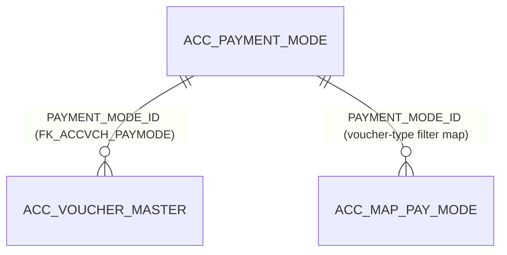

# Table: ACC_PAYMENT_MODE

```yaml
---
id: tbl:ACC_PAYMENT_MODE
module: accounting
status: db-verified
model: PaymentModeModel
package: PKG_ACCOUNTING
procedures: [ac_payment_mode_insert_update, ac_payment_mode_delete, ac_payment_mode_select, ac_payment_mode_select_by_Id]
# columns: full FK/PK graph data for this table, DB-verified 2026-09-14 (see ## Keys & Indexes below for the raw constraint names).
columns: [PAYMENT_MODE_ID]
---
```

Payment mode master (Cash, Cheque, Bank Transfer, ...) for Accounting vouchers.

**Status:** `db-verified` &mdash; columns, FK, and indexes below were pulled directly from Oracle's
own catalog (`ALL_TAB_COLUMNS`, `ALL_CONSTRAINTS`/`ALL_CONS_COLUMNS`, `ALL_INDEXES`/`ALL_IND_COLUMNS`)
on the dev instance, not inferred from C#/BLL naming.

## Columns

| Column | Type (Oracle) | Nullable | Role | Source |
|---|---|---|---|---|
| `PAYMENT_MODE_ID` | NUMBER | N | PK | db |
| `PM_NAME` | VARCHAR2(100) | Y | Name shown on screen | db |
| `COMP_CODE` | CHAR(3) | Y | Owning company | db |
| `REMARKS` | VARCHAR2(200) | Y | Free-text notes | db |
| `REF_CODE` | CHAR(3) | Y | Auto-generated display code | db |
| `SHORT_NAME` | NVARCHAR2(20) | Y | Abbreviation | db |

All 6 columns confirmed read/written somewhere in the app &mdash; no unused columns.

## Keys & Indexes

**Primary key:** `PK_PAYMODE_ID` on `PAYMENT_MODE_ID`

**Foreign keys:** none defined at the DB level.

**Indexes:**

| Index | Unique? | Columns |
|---|---|---|
| `PK_PAYMODE_ID` | yes | `PAYMENT_MODE_ID` |

*Verified read-only against the dev Oracle DB (`mtexdev`, host `118.67.213.142`) on 2026-09-14 via `ALL_CONSTRAINTS`/`ALL_CONS_COLUMNS`/`ALL_INDEXES`/`ALL_IND_COLUMNS` under schema `MTEX`. No DDL exists in either repo, so this is the only ground truth for keys/indexes.*

## Relationships



`FK_ACCVCH_PAYMODE` on `ACC_VOUCHER_MASTER.PAYMENT_MODE_ID` is a real enforced foreign key
constraint (confirmed via `ALL_CONSTRAINTS`) &mdash; this one was not just a naming-convention guess.

## Indexes

| Table | Index | Status | Why |
|---|---|---|---|
| `ACC_PAYMENT_MODE` | `PK_PAYMODE_ID` (unique, on `PAYMENT_MODE_ID`) | Only index; sufficient | Table has 9 rows &mdash; a full scan costs nothing, no other index needed. |
| `ACC_VOUCHER_MASTER.PAYMENT_MODE_ID` | none | Not recommended | 337,620 rows, but only 9 distinct values (very low selectivity) &mdash; a plain single-column index likely wouldn't be used by the optimizer for equality filters. Would only help as part of a composite index (e.g. + date range or `HR_COMPANY_ID`) if a report filtered vouchers by payment mode within a period; no such query was found. |

**Related finding (not this table, flagged for `ACC_VOUCHER_MASTER` when that table is verified):**
`ACC_VOUCHER_MASTER.CHQ_NO` has no index either, and `PKG_ACCOUNTING`'s duplicate-cheque-number
check (~line 3903) runs `WHERE CHQ_NO = pCHQ_NO` against all 337k+ voucher rows on every
cheque-payment voucher save &mdash; a real missing-index candidate.

## Feature

[Payment Mode](../../../Docs/data/accounting.js) &mdash; menu id `payment-mode` in the Accounting docs site.
