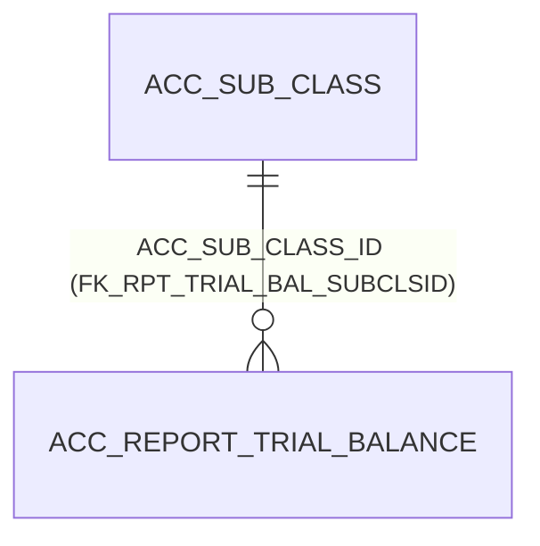

# Table: ACC_REPORT_TRIAL_BALANCE

```yaml
---
id: tbl:ACC_REPORT_TRIAL_BALANCE
module: accounting
status: db-verified
model: "n/a — shared staging table, not a real business entity"
package: PKG_ACCOUNTING
procedures: []
# columns: full FK/PK graph data for this table, DB-verified 2026-09-14 (see ## Keys & Indexes below for the raw constraint names).
columns: [ACC_SUB_CLASS_ID->ACC_SUB_CLASS.ACC_SUB_CLASS_ID]
---
```

Shared staging table for trial-balance figures, keyed only by user. Not a real business entity —
purely a scratch space one report writes into and another reads back from.

**Status:** `db-verified` — pulled directly from Oracle's own catalog on the dev instance.

## Scale

**3,283** rows.

## Finding: the schema makes the known bug worse than it looks

The docs site's Fiscal Year Close page already documents a copy/paste bug where the trial-balance
API reads this table "filtered only by user ID — no date-range or company filter of its own,"
warning of cross-contamination between browser tabs for the same user against different companies.

**Verified: this isn't a missing `WHERE` clause — it's structurally impossible to fix without a
schema change.** The full column list is:

| Column | Type (Oracle) | Nullable |
|---|---|---|
| `AC_CODE`, `MAIN_CODE` | CHAR | Y |
| `SUB_CODE` | CHAR | N |
| `SUB_NAME` | NVARCHAR2 | N |
| `OPENING` | NUMBER | Y |
| `DR_AMT`, `CR_AMT` | NUMBER | Y |
| `USER_ID` | NUMBER | Y |
| `MAP_CODE` | CHAR | Y |
| `ACC_SUB_CLASS_ID` | NUMBER | Y |

**There is no date column and no company column anywhere on this table.** The only key is a unique
constraint on (`USER_ID`, `ACC_SUB_CLASS_ID`) — `UK_ACC_RRT_TRIAL_BAL_01`. Even a corrected query
couldn't scope by date or company without first adding columns for them.

## Keys & Indexes

**Primary key:** none defined at the DB level (no `all_constraints` row with `constraint_type='P'`)

**Unique constraints:**

| Constraint | Columns |
|---|---|
| `UK_ACC_RRT_TRIAL_BAL_01` | `USER_ID`, `ACC_SUB_CLASS_ID` |

**Foreign keys:**

| Constraint | Column | References |
|---|---|---|
| `FK_RPT_TRIAL_BAL_SUBCLSID` | `ACC_SUB_CLASS_ID` | `ACC_SUB_CLASS.ACC_SUB_CLASS_ID` |

**Indexes:**

| Index | Unique? | Columns |
|---|---|---|
| `UK_ACC_RRT_TRIAL_BAL_01` | yes | `USER_ID`, `ACC_SUB_CLASS_ID` |

*Verified read-only against the dev Oracle DB (`mtexdev`, host `118.67.213.142`) on 2026-09-14 via `ALL_CONSTRAINTS`/`ALL_CONS_COLUMNS`/`ALL_INDEXES`/`ALL_IND_COLUMNS` under schema `MTEX`. No DDL exists in either repo, so this is the only ground truth for keys/indexes.*

## Relationships



## Indexes

Only `UK_ACC_RRT_TRIAL_BAL_01` (unique composite: `USER_ID`, `ACC_SUB_CLASS_ID`). 3,283 rows — no
additional indexing need at this size; the real problem here is the missing columns, not indexing.

## Feature

[Fiscal Year Close](../../../Docs/data/accounting.js) — menu id `fiscal-year-close`.
