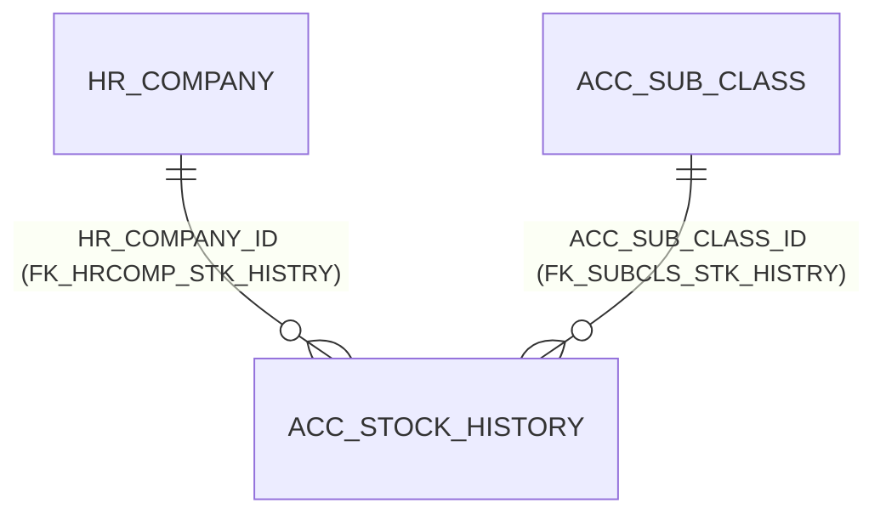

# Table: ACC_STOCK_HISTORY

```yaml
---
id: tbl:ACC_STOCK_HISTORY
module: accounting
status: db-verified
model: "ACC_STOCK_CLOSING (naming mismatch — see docs site)"
package: PKG_ACCOUNTING
procedures: []
# columns: full FK/PK graph data for this table, DB-verified 2026-09-14 (see ## Keys & Indexes below for the raw constraint names).
columns: [HR_COMPANY_ID->HR_COMPANY.HR_COMPANY_ID, ACC_SUB_CLASS_ID->ACC_SUB_CLASS.ACC_SUB_CLASS_ID, STOCK_HISTORY_ID]
---
```

Month-end closing stock value per GL account, per company. **Naming mismatch** (confirmed on the
docs site): the C# model and even a database sequence are named `ACC_STOCK_CLOSING`, but there is
no `ACC_STOCK_CLOSING` table — the real table is `ACC_STOCK_HISTORY`.

**Status:** `db-verified` — pulled directly from Oracle's own catalog on the dev instance.

## Scale

**1,957** rows.

## Columns

| Column | Type (Oracle) | Nullable | Role |
|---|---|---|---|
| `STOCK_HISTORY_ID` | NUMBER | N | PK |
| `AC_CODE`, `MAIN_CODE`, `SUB_CODE` | CHAR | Y | GL account code parts |
| `CLOSING` | NUMBER | Y | The month-end value entered |
| `YEAR_CODE`, `MONTH_CODE` | NUMBER | Y | Period |
| `COMP_CODE` | CHAR | Y | Company scope (legacy-style) |
| `ACC_SUB_CLASS_ID` | NUMBER | N | FK → `ACC_SUB_CLASS` |
| `IS_FINALIZE` | CHAR | N | The "finalized" flag the docs site notes is read but never shown in the UI |
| `HR_COMPANY_ID` | NUMBER | N | FK → `HR_COMPANY` |

## Keys & Indexes

**Primary key:** `PK_ACC_STK_HISTRY` on `STOCK_HISTORY_ID`

**Unique constraints:**

| Constraint | Columns |
|---|---|
| `UK_STK_HISTRY01` | `HR_COMPANY_ID`, `YEAR_CODE`, `MONTH_CODE`, `ACC_SUB_CLASS_ID` |

**Foreign keys:**

| Constraint | Column | References |
|---|---|---|
| `FK_HRCOMP_STK_HISTRY` | `HR_COMPANY_ID` | `HR_COMPANY.HR_COMPANY_ID` |
| `FK_SUBCLS_STK_HISTRY` | `ACC_SUB_CLASS_ID` | `ACC_SUB_CLASS.ACC_SUB_CLASS_ID` |

**Indexes:**

| Index | Unique? | Columns |
|---|---|---|
| `IDX_STOCK_HISTORY_01` | no | `YEAR_CODE`, `MONTH_CODE` |
| `IDX_STOCK_HISTORY_02` | no | `HR_COMPANY_ID`, `YEAR_CODE`, `MONTH_CODE` |
| `PK_ACC_STK_HISTRY` | yes | `STOCK_HISTORY_ID` |
| `UK_STK_HISTRY01` | yes | `HR_COMPANY_ID`, `YEAR_CODE`, `MONTH_CODE`, `ACC_SUB_CLASS_ID` |

*Verified read-only against the dev Oracle DB (`mtexdev`, host `118.67.213.142`) on 2026-09-14 via `ALL_CONSTRAINTS`/`ALL_CONS_COLUMNS`/`ALL_INDEXES`/`ALL_IND_COLUMNS` under schema `MTEX`. No DDL exists in either repo, so this is the only ground truth for keys/indexes.*

## Relationships



**Undocumented structural finding:** a composite unique constraint `UK_STK_HISTRY01`
(`HR_COMPANY_ID`, `YEAR_CODE`, `MONTH_CODE`, `ACC_SUB_CLASS_ID`) enforces exactly one row per
company/year/month/GL-account combination — this matches the docs site's described behavior
("one row per stock GL account per month") exactly, now confirmed at the schema level.

## Indexes

| Index | Uniqueness | Column(s) |
|---|---|---|
| `PK_ACC_STK_HISTRY` | Unique | `STOCK_HISTORY_ID` |
| `UK_STK_HISTRY01` | Unique composite | `HR_COMPANY_ID`, `YEAR_CODE`, `MONTH_CODE`, `ACC_SUB_CLASS_ID` |
| `IDX_STOCK_HISTORY_01` | Non-unique composite | `YEAR_CODE`, `MONTH_CODE` |
| `IDX_STOCK_HISTORY_02` | Non-unique composite | `HR_COMPANY_ID`, `YEAR_CODE`, `MONTH_CODE` |

Already well-indexed for the screen's Company/Year/Month filter pattern — no missing index found.

## Feature

[Stock Closing](../../../Docs/data/accounting.js) — menu id `stock-closing`.
