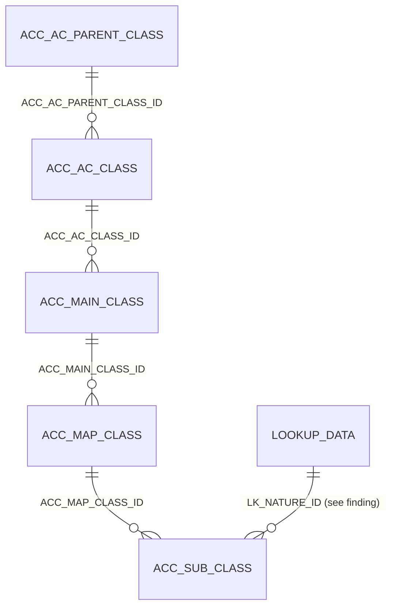

# Table: ACC_SUB_CLASS

```yaml
---
id: tbl:ACC_SUB_CLASS
module: accounting
status: db-verified
model: "n/a (Chart of Accounts hierarchy, leaf level)"
package: PKG_ACCOUNTING
procedures: [ac_subclass_insert_update, ac_subclass_delete, ac_subclass_select]
# columns: full FK/PK graph data for this table, DB-verified 2026-09-14 (see ## Keys & Indexes below for the raw constraint names).
columns: [ACC_MAP_CLASS_ID->ACC_MAP_CLASS.ACC_MAP_CLASS_ID, LK_NATURE_ID->LOOKUP_DATA.LOOKUP_DATA_ID, ACC_SUB_CLASS_ID]
---
```

Leaf level of the 5-level Chart of Accounts hierarchy &mdash; the actual GL account a voucher line
posts against. Documented together with its four ancestor tables since they only make sense as a chain.

**Status:** `db-verified` &mdash; columns, FKs, and indexes below (for all 5 tables in the hierarchy)
were pulled directly from Oracle's own catalog on the dev instance, not inferred from naming.

## The hierarchy (all 5 tables, top to bottom)

| Table | Rows | PK | FK (child &rarr; parent) |
|---|---|---|---|
| `ACC_AC_PARENT_CLASS` | 5 | `ACC_AC_PARENT_CLASS_ID` | &mdash; (top level) |
| `ACC_AC_CLASS` | 7 | `ACC_AC_CLASS_ID` | `ACC_AC_PARENT_CLASS_ID` &rarr; `ACC_AC_PARENT_CLASS` (`FK_PRENT_CLASS_AC_CLASS`) |
| `ACC_MAIN_CLASS` | 32 | `ACC_MAIN_CLASS_ID` | `ACC_AC_CLASS_ID` &rarr; `ACC_AC_CLASS` (`FK_ACC_AC_CLASS_MAINCLASS`) |
| `ACC_MAP_CLASS` | 100 | `ACC_MAP_CLASS_ID` | `ACC_MAIN_CLASS_ID` &rarr; `ACC_MAIN_CLASS` (`FK_ACCMAPCLASS_ACCMAINCLASS`) |
| `ACC_SUB_CLASS` | 3,616 | `ACC_SUB_CLASS_ID` | `ACC_MAP_CLASS_ID` &rarr; `ACC_MAP_CLASS` (`FK_ACCMAPCLASS_ACCSUBCLASS`) |

All four chain links above are **real enforced FK constraints**, confirmed via `ALL_CONSTRAINTS` /
`ALL_CONS_COLUMNS` &mdash; matching what the docs site already claimed by convention, now verified.

## ACC_SUB_CLASS columns

| Column | Type (Oracle) | Role | Source |
|---|---|---|---|
| `ACC_SUB_CLASS_ID` | NUMBER | PK | db |
| `COMP_CODE` | CHAR | Company scope (nullable in practice &mdash; data-quality issue, see Known Issues in the docs site) | db |
| `AC_CODE`, `MAIN_CODE`, `SUB_CODE` | VARCHAR2 | Composed GL account code | db |
| `SUB_NAME` | NVARCHAR2 | Account name | db |
| `MCODE`, `SL` | CHAR | Write-only / effectively unused (see docs site) | db |
| `MAP_CODE` | CHAR | Denormalized copy of parent's code | db |
| `ACC_MAP_CLASS_ID` | NUMBER | FK &rarr; `ACC_MAP_CLASS` | db |
| `IS_DUMMY` | CHAR | Placeholder-account flag; indexed (see Indexes) | db |
| `IS_CHECK_BAL`, `IS_EXCLUDE4AUDIT` | CHAR | Flags | db |
| `LK_NATURE_ID` | NUMBER | FK &rarr; `LOOKUP_DATA` &mdash; **see finding below** | db |

## Keys & Indexes

**Primary key:** `PK_ACC_SUB_CLASS` on `ACC_SUB_CLASS_ID`

**Unique constraints:**

| Constraint | Columns |
|---|---|
| `UK_COA_CODE01` | `COMP_CODE`, `AC_CODE`, `MAIN_CODE`, `SUB_CODE` |
| `UK_SUB_CODE` | `SUB_CODE` |

**Foreign keys:**

| Constraint | Column | References |
|---|---|---|
| `FK_ACCMAPCLASS_ACCSUBCLASS` | `ACC_MAP_CLASS_ID` | `ACC_MAP_CLASS.ACC_MAP_CLASS_ID` |
| `FK_LKNATUREID_ACCSUBCLS` | `LK_NATURE_ID` | `LOOKUP_DATA.LOOKUP_DATA_ID` |

**Indexes:**

| Index | Unique? | Columns |
|---|---|---|
| `IDX_IS_DUMMY_ACCSUBCLS` | no | `IS_DUMMY` |
| `PK_ACC_SUB_CLASS` | yes | `ACC_SUB_CLASS_ID` |
| `UK_SUB_CODE` | yes | `SUB_CODE` |

*Verified read-only against the dev Oracle DB (`mtexdev`, host `118.67.213.142`) on 2026-09-14 via `ALL_CONSTRAINTS`/`ALL_CONS_COLUMNS`/`ALL_INDEXES`/`ALL_IND_COLUMNS` under schema `MTEX`. No DDL exists in either repo, so this is the only ground truth for keys/indexes.*

## Relationships



**Finding:** `LK_NATURE_ID` is a real FK to `LOOKUP_DATA` (`FK_LKNATUREID_ACCSUBCLS`), presumably meant
to record the account's "nature." Live data check: `SELECT LK_NATURE_ID, COUNT(*) FROM ACC_SUB_CLASS
GROUP BY LK_NATURE_ID` returns **one single value** for all 3,616 rows (lookup id 1585, a business
segment code, not a debit/credit distinction). The column is FK'd and populated, but discriminates
nothing in the current data.

## Indexes

| Table | Index | Status | Why |
|---|---|---|---|
| `ACC_AC_PARENT_CLASS`, `ACC_AC_CLASS`, `ACC_MAIN_CLASS`, `ACC_MAP_CLASS` | PK only | Sufficient | 5-100 rows each; full scans are free at this size. |
| `ACC_SUB_CLASS` | `UK_SUB_CODE` (unique, `SUB_CODE`) | Existing, intentional | Enforces the GL code being globally unique across companies, not just per-company. Also softens the NULL-`COMP_CODE` data-quality issue &mdash; lookups by code still work even without a company scope. |
| `ACC_SUB_CLASS` | `IDX_IS_DUMMY_ACCSUBCLS` (non-unique, `IS_DUMMY`) | Existing, intentional | Targets the "exclude dummy placeholder accounts" filter every account picker in the app applies. |

No missing-index candidates found for this hierarchy.

## Feature

[Chart of Accounts](../../../Docs/data/accounting.js) &mdash; menu id `chart-of-accounts` in the Accounting docs site.
