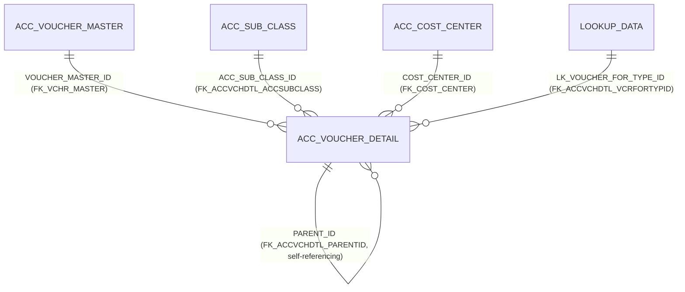

# Table: ACC_VOUCHER_DETAIL

```yaml
---
id: tbl:ACC_VOUCHER_DETAIL
module: accounting
status: db-verified
model: VoucherDetailModel
package: PKG_ACCOUNTING
procedures: []
# columns: full FK/PK graph data for this table, DB-verified 2026-09-14 (see ## Keys & Indexes below for the raw constraint names).
columns: [ACC_SUB_CLASS_ID->ACC_SUB_CLASS.ACC_SUB_CLASS_ID, PARENT_ID->ACC_VOUCHER_DETAIL.VOUCHER_DETAIL_ID, LK_VOUCHER_FOR_TYPE_ID->LOOKUP_DATA.LOOKUP_DATA_ID, COST_CENTER_ID->ACC_COST_CENTER.COST_CENTER_ID, VOUCHER_MASTER_ID->ACC_VOUCHER_MASTER.VOUCHER_MASTER_ID, VOUCHER_DETAIL_ID]
---
```

Line-item table for vouchers (one row per debit/credit line).

**Status:** `db-verified` — pulled directly from Oracle's own catalog on the dev instance. Full pass
completed while verifying the Checker Maker and Voucher menus on the docs site.

## Scale

**925,762** rows.

## Columns

26 columns, including `VOUCHER_DETAIL_ID` (PK), `VOUCHER_MASTER_ID`, `ACC_SUB_CLASS_ID`,
`COST_CENTER_ID`, `DR_AMT`/`CR_AMT`, `CURRENCY_ID`/`EXCHANGE_RATE`, `BILL_REF_ID`/`BILL_NO`/
`BILL_DETAIL_ID`/`BILL_KEY`, `PARENT_ID`, `LK_VOUCHER_FOR_TYPE_ID`/`VOUCHER_FOR_ID`.

## Keys & Indexes

**Primary key:** `ACC_VOUCHER_DETAIL_PK` on `VOUCHER_DETAIL_ID`

**Foreign keys:**

| Constraint | Column | References |
|---|---|---|
| `FK_ACCVCHDTL_ACCSUBCLASS` | `ACC_SUB_CLASS_ID` | `ACC_SUB_CLASS.ACC_SUB_CLASS_ID` |
| `FK_ACCVCHDTL_PARENTID` | `PARENT_ID` | `ACC_VOUCHER_DETAIL.VOUCHER_DETAIL_ID` |
| `FK_ACCVCHDTL_VCRFORTYPID` | `LK_VOUCHER_FOR_TYPE_ID` | `LOOKUP_DATA.LOOKUP_DATA_ID` |
| `FK_COST_CENTER` | `COST_CENTER_ID` | `ACC_COST_CENTER.COST_CENTER_ID` |
| `FK_VCHR_MASTER` | `VOUCHER_MASTER_ID` | `ACC_VOUCHER_MASTER.VOUCHER_MASTER_ID` |

**Indexes:**

| Index | Unique? | Columns |
|---|---|---|
| `ACC_VOUCHER_DETAIL_PK` | yes | `VOUCHER_DETAIL_ID` |
| `IDX_ACCSUBCLS_ACC_VCHR_DTL` | no | `ACC_SUB_CLASS_ID` |
| `IDX_BILL_NO` | no | `BILL_NO` |
| `IDX_VCHFORTYP_VCHRFOR_ACC_VCHRDTL` | no | `LK_VOUCHER_FOR_TYPE_ID`, `VOUCHER_FOR_ID` |
| `IDX_VCHRMSTR_VCHR_DTL` | no | `VOUCHER_MASTER_ID` |

*Verified read-only against the dev Oracle DB (`mtexdev`, host `118.67.213.142`) on 2026-09-14 via `ALL_CONSTRAINTS`/`ALL_CONS_COLUMNS`/`ALL_INDEXES`/`ALL_IND_COLUMNS` under schema `MTEX`. No DDL exists in either repo, so this is the only ground truth for keys/indexes.*

## Relationships



All relationships the docs site already describes (GL account, Cost Center) are confirmed real,
enforced FK constraints.

**Undocumented relationship found:** `PARENT_ID` is a real, **self-referencing** FK
(`FK_ACCVCHDTL_PARENTID`) — one voucher-detail line can point at another as its parent. Not
mentioned anywhere in the existing docs; likely related to bill knock-off/adjustment entries given
`BILL_KEY`/`BILL_REF_ID` live on the same row, but the actual feature that populates it hasn't been
traced yet.

## Indexes

| Index | Uniqueness | Column(s) |
|---|---|---|
| `ACC_VOUCHER_DETAIL_PK` | Unique | `VOUCHER_DETAIL_ID` |
| `IDX_ACCSUBCLS_ACC_VCHR_DTL` | Non-unique | `ACC_SUB_CLASS_ID` |
| `IDX_BILL_NO` | Non-unique | `BILL_NO` |
| `IDX_VCHFORTYP_VCHRFOR_ACC_VCHRDTL` | Non-unique composite | `LK_VOUCHER_FOR_TYPE_ID`, `VOUCHER_FOR_ID` |
| `IDX_VCHRMSTR_VCHR_DTL` | Non-unique | `VOUCHER_MASTER_ID` |

**Missing-index candidate:** `COST_CENTER_ID` has **no index**, despite the docs site listing
Cost-Center-wise Ledger / Summary Reports as consumers — those reports need to filter or group by
this column across nearly a million rows. Flagged, not yet acted on.

`BILL_KEY`/`BILL_DETAIL_ID` remain unindexed but also remain **0% populated** (see Checker Maker
finding) — nothing to index yet.

## Feature

[Voucher](../../../Docs/data/accounting.js) (menu id `voucher`) and
[Checker Maker](../../../Docs/data/accounting.js) (menu id `checker-maker`) in the Accounting docs site.
