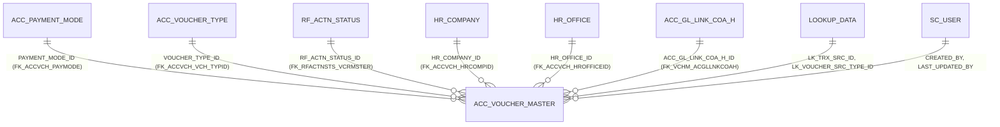

# Table: ACC_VOUCHER_MASTER

```yaml
---
id: tbl:ACC_VOUCHER_MASTER
module: accounting
status: db-verified
model: VoucherModel
package: PKG_ACCOUNTING
procedures: [acc_master_vch_save, acc_voucher_post_unpost]
# columns: full FK/PK graph data for this table, DB-verified 2026-09-14 (see ## Keys & Indexes below for the raw constraint names).
columns: [CREATED_BY->SC_USER.SC_USER_ID, HR_COMPANY_ID->HR_COMPANY.HR_COMPANY_ID, HR_OFFICE_ID->HR_OFFICE.HR_OFFICE_ID, PAYMENT_MODE_ID->ACC_PAYMENT_MODE.PAYMENT_MODE_ID, LAST_UPDATED_BY->SC_USER.SC_USER_ID, VOUCHER_TYPE_ID->ACC_VOUCHER_TYPE.VOUCHERTYPEID, LK_TRX_SRC_ID->LOOKUP_DATA.LOOKUP_DATA_ID, RF_ACTN_STATUS_ID->RF_ACTN_STATUS.RF_ACTN_STATUS_ID, ACC_GL_LINK_COA_H_ID->ACC_GL_LINK_COA_H.ACC_GL_LINK_COA_H_ID, LK_VOUCHER_SRC_TYPE_ID->LOOKUP_DATA.LOOKUP_DATA_ID, VOUCHER_MASTER_ID]
---
```

Header table for posted vouchers — a finalized journal entry.

**Status:** `db-verified` — pulled directly from Oracle's own catalog on the dev instance. Full pass
completed while verifying the Payment Mode, Checker Maker, and Voucher menus on the docs site.

## Scale

**337,620** rows.

## Columns

33 columns, including `VOUCHER_MASTER_ID` (PK), `POST_ID`/`VOUCHER_NO`/`VOUCHER_TYPE_ID`,
`PAYMENT_MODE_ID`, `CHQ_NO`/`CHQ_DATE`/`BANK_DATE`, `HR_COMPANY_ID`/`HR_OFFICE_ID`,
`ACC_GL_LINK_COA_H_ID`, `LK_TRX_SRC_ID`, `LK_VOUCHER_SRC_TYPE_ID`, `RF_ACTN_STATUS_ID`,
audit columns (`CREATED_BY`/`LAST_UPDATED_BY`/dates). Matches the docs site's field list.

## Keys & Indexes

**Primary key:** `ACC_VOUCHER_MASTER_PK` on `VOUCHER_MASTER_ID`

**Unique constraints:**

| Constraint | Columns |
|---|---|
| `UK_ACC_VCHMASTER_01` | `POST_ID` |
| `UK_ACC_VCHMASTER_02` | `HR_COMPANY_ID`, `VOUCHER_TYPE_ID`, `VOUCHER_NO` |

**Foreign keys:**

| Constraint | Column | References |
|---|---|---|
| `FK_ACCVCH_CREATBY` | `CREATED_BY` | `SC_USER.SC_USER_ID` |
| `FK_ACCVCH_HRCOMPID` | `HR_COMPANY_ID` | `HR_COMPANY.HR_COMPANY_ID` |
| `FK_ACCVCH_HROFFICEID` | `HR_OFFICE_ID` | `HR_OFFICE.HR_OFFICE_ID` |
| `FK_ACCVCH_PAYMODE` | `PAYMENT_MODE_ID` | `ACC_PAYMENT_MODE.PAYMENT_MODE_ID` |
| `FK_ACCVCH_UPDTBY` | `LAST_UPDATED_BY` | `SC_USER.SC_USER_ID` |
| `FK_ACCVCH_VCH_TYPID` | `VOUCHER_TYPE_ID` | `ACC_VOUCHER_TYPE.VOUCHERTYPEID` |
| `FK_LKDATATRXSRC_AVCRMSTR` | `LK_TRX_SRC_ID` | `LOOKUP_DATA.LOOKUP_DATA_ID` |
| `FK_RFACTNSTS_VCRMSTER` | `RF_ACTN_STATUS_ID` | `RF_ACTN_STATUS.RF_ACTN_STATUS_ID` |
| `FK_VCHM_ACGLLNKCOAH` | `ACC_GL_LINK_COA_H_ID` | `ACC_GL_LINK_COA_H.ACC_GL_LINK_COA_H_ID` |
| `FK_VCRSCRTPID_AVM` | `LK_VOUCHER_SRC_TYPE_ID` | `LOOKUP_DATA.LOOKUP_DATA_ID` |

**Indexes:**

| Index | Unique? | Columns |
|---|---|---|
| `ACC_VOUCHER_MASTER_PK` | yes | `VOUCHER_MASTER_ID` |
| `IDX_POST_DT_VCHRMSTR` | no | `POST_DATE` |
| `UK_ACC_VCHMASTER_01` | yes | `POST_ID` |
| `UK_ACC_VCHMASTER_02` | yes | `HR_COMPANY_ID`, `VOUCHER_TYPE_ID`, `VOUCHER_NO` |

*Verified read-only against the dev Oracle DB (`mtexdev`, host `118.67.213.142`) on 2026-09-14 via `ALL_CONSTRAINTS`/`ALL_CONS_COLUMNS`/`ALL_INDEXES`/`ALL_IND_COLUMNS` under schema `MTEX`. No DDL exists in either repo, so this is the only ground truth for keys/indexes.*

## Relationships



All relationships the docs site already describes (Payment Mode, Voucher Type, workflow status,
Cost Center via the detail table) are confirmed real, enforced FK constraints — not naming-convention
guesses. `HR_OFFICE_ID → HR_OFFICE` and `LK_VOUCHER_SRC_TYPE_ID → LOOKUP_DATA` are real FKs not
previously documented.

## Indexes

| Index | Uniqueness | Column(s) | Note |
|---|---|---|---|
| `ACC_VOUCHER_MASTER_PK` | Unique | `VOUCHER_MASTER_ID` | PK |
| `IDX_POST_DT_VCHRMSTR` | Non-unique | `POST_DATE` | |
| `UK_ACC_VCHMASTER_01` | Unique | `POST_ID` | Zero duplicates exist today (see Checker Maker finding). |
| `UK_ACC_VCHMASTER_02` | Unique composite | `HR_COMPANY_ID`, `VOUCHER_TYPE_ID`, `VOUCHER_NO` | Mirrored exactly by `ACC_DRAFT_VOUCHER`'s own composite unique constraint. |

**Missing-index candidate:** `CHQ_NO` has **no index**. `PKG_ACCOUNTING`'s duplicate-cheque-number
check (~line 3903) runs `WHERE CHQ_NO = pCHQ_NO` against the full 337,620-row table on every
cheque-payment voucher save. Flagged, not yet acted on.

**Missing-index candidate, worth adding:** `IS_POSTED` has no index either. Data distribution:
**333,672 `Y` vs. only 3,948 `N`** — heavily skewed. The Voucher Post/Unpost screen's entire job is
finding the rare `N` rows to list for review. Unlike the low-cardinality `PAYMENT_MODE_ID` case
above (not recommended), this one is a genuine candidate — a plain or function-based index
targeting `IS_POSTED='N'` would let that lookup skip scanning ~98.8% of the table.

## Feature

[Voucher](../../../Docs/data/accounting.js) (menu id `voucher`),
[Payment Mode](../../../Docs/data/accounting.js) (menu id `payment-mode`), and
[Checker Maker](../../../Docs/data/accounting.js) (menu id `checker-maker`) in the Accounting docs site.
