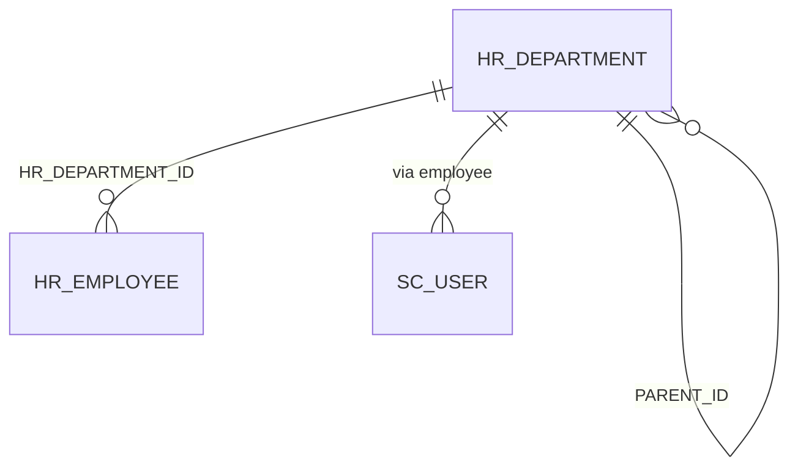

# Table: HR_DEPARTMENT

```yaml
---
id: tbl:HR_DEPARTMENT
module: admin
status: inferred
model: HrDepartmentModel
package: PKG_ADMIN
procedures: [hr_department_select]
# columns: full FK/PK graph data for this table, DB-verified 2026-09-14 (see ## Keys & Indexes below for the raw constraint names).
columns: [CREATED_BY->SC_USER.SC_USER_ID, LK_DEPT_TYPE_GRP_ID->LOOKUP_DATA.LOOKUP_DATA_ID, PARENT_ID->HR_DEPARTMENT.HR_DEPARTMENT_ID, LAST_UPDATED_BY->SC_USER.SC_USER_ID, HR_DEPARTMENT_ID]
---
```

Organization tree (departments / sections). Used at login (`multiLoginDeptId`) and throughout HR.

**Status:** inferred from `src/ERP.Model/Admin/HrDepartmentModel.cs`. Confirm with `PKG_ADMIN` and live Oracle.
Insert/update procedure names in `PKG_ADMIN` are not yet confirmed — only the (likely) select
procedure is listed in the front-matter above; don't treat its absence there as "no insert/update
exists."

## Identity and hierarchy

| Column | Type (C#) | Role | Source |
|---|---|---|---|
| `HR_DEPARTMENT_ID` | Int64 | PK | model |
| `PARENT_ID` | Int64 | parent department (tree) | model |
| `DEPARTMENT_LEVEL` | int | depth | model |
| `IS_LEAF` | string | leaf flag | model |
| `IS_CORE_DEPT` | string | core vs section | model |
| `IS_ORGANO_LEVEL` | string | organogram | model |

## Business columns

| Column | Type (C#) | Role | Source |
|---|---|---|---|
| `DEPARTMENT_CODE` | string | | model |
| `DEPARTMENT_NAME_EN` | string | required | model |
| `DEPARTMENT_NAME_BN` | string | | model |
| `DEPARTMENT_DESC` | string | | model |
| `DEPT_ORDER` | Int64 | sort | model |
| `DEPARTMENT_PREFIX` | string | | model |
| `IS_ACTIVE` | string | | model |
| `LK_DEPT_TYPE_GRP_ID` | Int64 | lookup type group | model |

## Audit

| Column | Type (C#) | Source |
|---|---|---|
| `CREATION_DATE` | DateTime? | model |
| `CREATED_BY` | int | model |
| `LAST_UPDATE_DATE` | DateTime? | model |
| `LAST_UPDATED_BY` | int | model |
| `LAST_UPDATE_LOGIN` | int | model |
| `VERSION_NO` | int | model |

## Not columns (UI)

| Property | Why |
|---|---|
| `CORE_DEPT_ID` | convenience |
| `PARENT_NAME` | join |
| `text`, `spriteCssClass`, `expanded`, `selected` | Kendo/tree UI |
| `items` (`List<DeptLevel1Model>`) | nested tree |
| `TranMode` | client insert/update flag |
| `DEPARTMENT_NAME` | alias |

## Keys & Indexes

**Primary key:** `PK_HR_DEPARTMENT` on `HR_DEPARTMENT_ID`

**Unique constraints:**

| Constraint | Columns |
|---|---|
| `UK_DEPARTMENT_CODE` | `DEPARTMENT_CODE` |

**Foreign keys:**

| Constraint | Column | References |
|---|---|---|
| `FK_CRTUSER_DEPT` | `CREATED_BY` | `SC_USER.SC_USER_ID` |
| `FK_LKDEPT_TYPE_GRP` | `LK_DEPT_TYPE_GRP_ID` | `LOOKUP_DATA.LOOKUP_DATA_ID` |
| `FK_PARENT_DEPT` | `PARENT_ID` | `HR_DEPARTMENT.HR_DEPARTMENT_ID` |
| `FK_UPDUSER_DEPT` | `LAST_UPDATED_BY` | `SC_USER.SC_USER_ID` |

**Indexes:**

| Index | Unique? | Columns |
|---|---|---|
| `IDX_ISACTV_HRDEPT` | no | `IS_ACTIVE` |
| `IDX_PARENTID_HR_DEPT` | no | `PARENT_ID` |
| `INDX_DEPARTMENT_NAME_EN` | no | `DEPARTMENT_NAME_EN` |
| `PK_HR_DEPARTMENT` | yes | `HR_DEPARTMENT_ID` |
| `UK_DEPARTMENT_CODE` | yes | `DEPARTMENT_CODE` |

*Verified read-only against the dev Oracle DB (`mtexdev`, host `118.67.213.142`) on 2026-09-14 via `ALL_CONSTRAINTS`/`ALL_CONS_COLUMNS`/`ALL_INDEXES`/`ALL_IND_COLUMNS` under schema `MTEX`. No DDL exists in either repo, so this is the only ground truth for keys/indexes.*

## Relationships



Service: `HrDepartmentService` → `pkg_admin.hr_department_select` (typical `pOption` 3001 parent list — confirm in BLL).

Admin UI: `Areas/Admin/Controllers/HrDepartmentController.cs`, view `Areas/Admin/Views/HrDepartment/Index.cshtml`.
