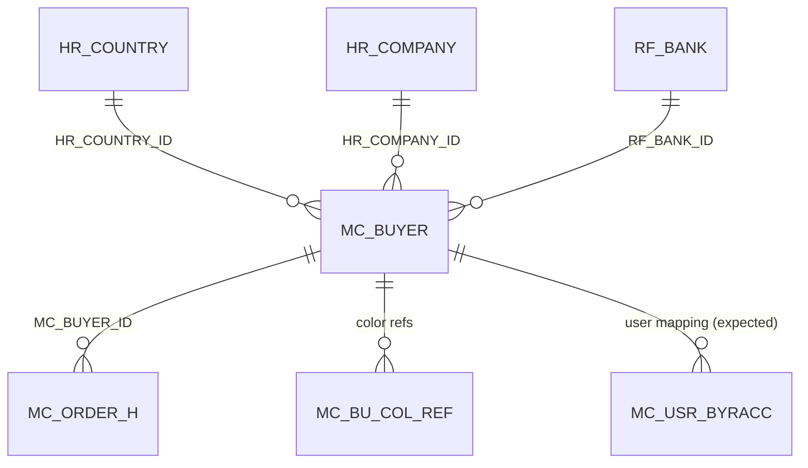

# Table: MC_BUYER

```yaml
---
id: tbl:MC_BUYER
module: merchandising
status: inferred
model: MC_BUYERModel
package: PKG_MERCHANDISING
procedures: [mc_buyer_insert, mc_buyer_update, mc_buyer_select]
# columns: full FK/PK graph data for this table, DB-verified 2026-09-14 (see ## Keys & Indexes below for the raw constraint names).
columns: [HR_COUNTRY_ID->HR_COUNTRY.HR_COUNTRY_ID, CREATED_BY->SC_USER.SC_USER_ID, RF_PAYM_TERM_ID->RF_PAYM_TERM.RF_PAYM_TERM_ID, RF_BANK_ID->RF_BANK.RF_BANK_ID, LAST_UPDATED_BY->SC_USER.SC_USER_ID, MC_BUYER_ID]
---
```

Buyer (customer) master for merchandising.

**Status:** inferred from `MC_BUYERModel` + `MC_BUYERService` parameter list. Not dumped from `ALL_TAB_COLUMNS`.

## Identity

| Column | Type (C#) | Role | Source |
|---|---|---|---|
| `MC_BUYER_ID` | Int64 | PK | model, `pMC_BUYER_ID`, `v_mc_buyer_id` OUT on insert |

## Columns written on insert/update

From `MC_BUYERService.Save` / `Update`:

| Column | Type (C#) | Notes | Source |
|---|---|---|---|
| `BUYER_CODE` | string | | p + row |
| `BUYER_NAME_EN` | string | required, max 100 | p + row |
| `BUYER_NAME_BN` | string | max 100 | p + row |
| `BUYER_SNAME` | string | short name, required, max 20 | p + row |
| `BUYER_DESC` | string | | p + row |
| `ADDRESS_PI` | string | required, max 100 | p + row |
| `BUYER_CP_REF` | string | | p + row |
| `HR_COUNTRY_ID` | Int64 | FK → `HR_COUNTRY` | p + row |
| `HR_COMPANY_ID` | Int64? | FK → `HR_COMPANY` | p |
| `REG_PERIOD` | DateTime | | p + row |
| `RF_BANK_ID` | (service param) | FK → `RF_BANK` | p (service; confirm on model) |
| `DISPLAY_ORDER` | Int64 | | p + row |
| `IS_ACTIVE` | string | | p + row |
| `CREATED_BY` | Int64 | insert | p |
| `LAST_UPDATED_BY` | Int64 | update | p |
| `RF_PAYM_TERM_ID` | | FK → payment term | p |
| `PAYMENT_DAYS` | | | p |

## Audit / extra on model

| Column | Type (C#) | Role | Source |
|---|---|---|---|
| `CREATION_DATE` | DateTime | audit | model |
| `LAST_UPDATE_DATE` | DateTime | audit | model |
| `MC_BU_COL_REF_ID` | Int64 | color-ref link | model |
| `COLOR_REF` | string | | model |
| `MC_BYR_ACC_ID` | Int64? | buyer account | model |
| `IS_ACTIVE` | string | | model |

## Not columns (UI / join)

| Property | Why |
|---|---|
| `COUNTRY_NAME_EN` | join |
| `BYR_ACC_NAME_EN` | join |
| `XML` | payload |
| `items` (`List<MC_BU_COL_REFModel>`) | child collection |

## Keys & Indexes

**Primary key:** `PK_MC_BUYER` on `MC_BUYER_ID`

**Unique constraints:**

| Constraint | Columns |
|---|---|
| `UK_BUYER_CODE` | `BUYER_CODE` |
| `UK_BUYER_SNAME` | `BUYER_SNAME` |

**Foreign keys:**

| Constraint | Column | References |
|---|---|---|
| `FK_COUNTRY_BUYER` | `HR_COUNTRY_ID` | `HR_COUNTRY.HR_COUNTRY_ID` |
| `FK_CRTUSER_BUYER` | `CREATED_BY` | `SC_USER.SC_USER_ID` |
| `FK_PAYMTERM_BUYER` | `RF_PAYM_TERM_ID` | `RF_PAYM_TERM.RF_PAYM_TERM_ID` |
| `FK_RFBANK_MCBUYER` | `RF_BANK_ID` | `RF_BANK.RF_BANK_ID` |
| `FK_UPDUSER_BUYER` | `LAST_UPDATED_BY` | `SC_USER.SC_USER_ID` |

**Indexes:**

| Index | Unique? | Columns |
|---|---|---|
| `PK_MC_BUYER` | yes | `MC_BUYER_ID` |
| `UK_BUYER_CODE` | yes | `BUYER_CODE` |
| `UK_BUYER_SNAME` | yes | `BUYER_SNAME` |

*Verified read-only against the dev Oracle DB (`mtexdev`, host `118.67.213.142`) on 2026-09-14 via `ALL_CONSTRAINTS`/`ALL_CONS_COLUMNS`/`ALL_INDEXES`/`ALL_IND_COLUMNS` under schema `MTEX`. No DDL exists in either repo, so this is the only ground truth for keys/indexes.*

## Relationships



`MC_ORDER_H` relationship is conventional (`MC_BUYER_ID` on orders), not verified here.

## Feature

[features/merchandising-buyer.md](../features/merchandising-buyer.md)
